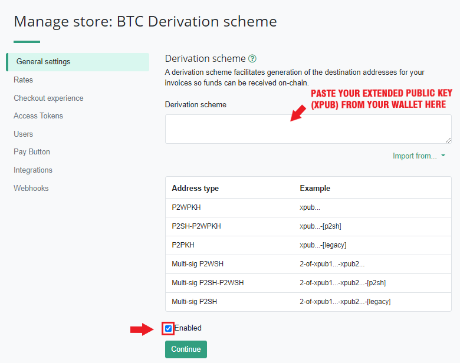

# Connecting Wasabi Wallet to BTCPay Server

This documents shows how to **connect [Wasabi Wallet](https://wasabiwallet.io/) to BTCPay Server**.

1. Create a Store in BTCPay Server
2. [Download Wasabi Wallet](https://wasabiwallet.io/#download)
3. [Install Wasabi Wallet](https://docs.wasabiwallet.io/using-wasabi/InstallPackage.html)

## Wasabi Wallet Setup

After installation, open the Wasabi Wallet by clicking on the icon on your desktop.

## Quick Setup

1. Generate Wasabi Wallet
2. In Wasabi, Advanced Settings > Wallet info - copy the **Extended Public Key**.
3. In BTCPay Server, Store > Settings > Wallet > Setup > Connect an existing wallet > Enter extended public key
4. In Receive tab in Wasabi, generate a new address.
5. Confirm that the addresses in Wasabi and BTCPay Server match.

## Step by Step

Firstly, give your wallet a name, for example, `BTCPay Server Wallet` and enter a secure password. Make sure to write down the password. Agree to Terms of Service, and click `Generate` in the right corner.

**IMPORTANT NOTE:** Write down your recovery words in the order you see them on the screen. Write them down a piece of paper and store it somewhere secure. Take your time and triple check each word. Do not store your seed in a digital format (photograph, text document). Whoever has the access to your seed and your password can access your funds. Confirm that the seed has been properly backed up.

Before proceeding, it is required to test the password, to be sure that the wallet can be accessed without any problems.

To test the password, enter it in the password field, and click `Test Password`.

The green message on the left bottom side of the screen will appear if the password is correct.  If by any chance your password is incorrect, delete the wallet and start from scratch.

Upon testing the password, click on the `Load Wallet` to access your newly created wallet.

When the wallet loads (it may take few moments), on the right hand wallet explorer, toggle the `Advanced` options and then click `Wallet Info`.

Select and **copy** the `Extended Account Public Key`. This is the **public** key from which BTCPay will derive addresses. This cannot be used to derive private keys and spend the bitcoin.

1. Return to your BTCPay Server. Click on the `Stores` in the header menu
2. Click Settings > Setup > Connect an existing wallet > `Enter extended public key`

Return to your BTCPay Server. Click on the `Stores` in the header menu and look for the `Wallet` section. Click on the `Setup` button.

Paste the `Extended Account Public Key` into derivation scheme field as it is, without adding anything else. Make sure that `Enabled` checkbox is ticked and click `Continue`.

Return to the Wasabi  Wallet. Go to `Receive tab` and `generate a new address`.

Compare the address you see in Wasabi Wallet to addresses shown in BTCPay Server. If there's a match, `continue`. If there is no match, copy the address from Wasabi and paste it into `Hint Address Form`. If you still can't get the matching, double-check that you're actually pasting `Extended Account Public Key`.

### Connecting Wasabi to BTCPay Server Full Node (If you're self-hosting BTCPay)

After wallets are connected, it is highly-recommended to **connect Wasabi Wallet to your full node in BTCPay**. The process is easy, but can only be done if you self-host BTCPay and are logged in as `Admin`. Tor has to be enabled in BTCPay (it is enabled by default). This process enhances privacy even further.

In BTCPay, go Server Settings > Services > **Full node P2P > See Information**.
On the BTCP-P2P page, click on the `Show Confidential QR Code`. Bellow the QR Code, there's a link `See QR Code information by clicking here`, so click on the link to reveal your string. Copy the string but remove `bitcoin-p2p://` part.

In `Alternative Block Source / Bitcoin P2P Endpoint`, paste the endpoint.

Restart Wasabi.

### Configuring the Gap Limit in Wasabi

In the top menu, select click on the `File > Open > Wallets Folder`. Shortly the `json` file will be shown in a sub-folder. Open that file with a text editor like notepad.
Locate `"MinGapLimit": 21,` change it to `"MinGapLimit": 100,` and save the file.

There's no good answer to how much you should set the gap limit to. Most merchants set 100-200. If you're a big merchant with high transaction volume, you can try with even higher gap limit.

For more details about the [Gap Limit, check the FAQ](./FAQ/FAQ-Wallet.md#missing-payments-in-my-software-or-hardware-wallet).

**Wasabi Wallet and BTCPay Server are now connected**. Any payments received to your BTCPay will be visible in Wasabi, where you can further spend or mix them.
