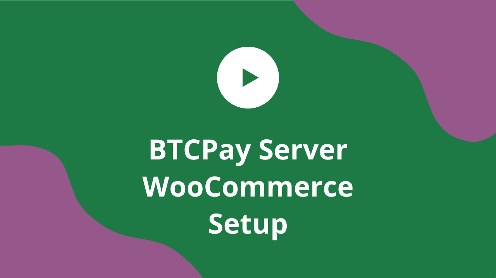
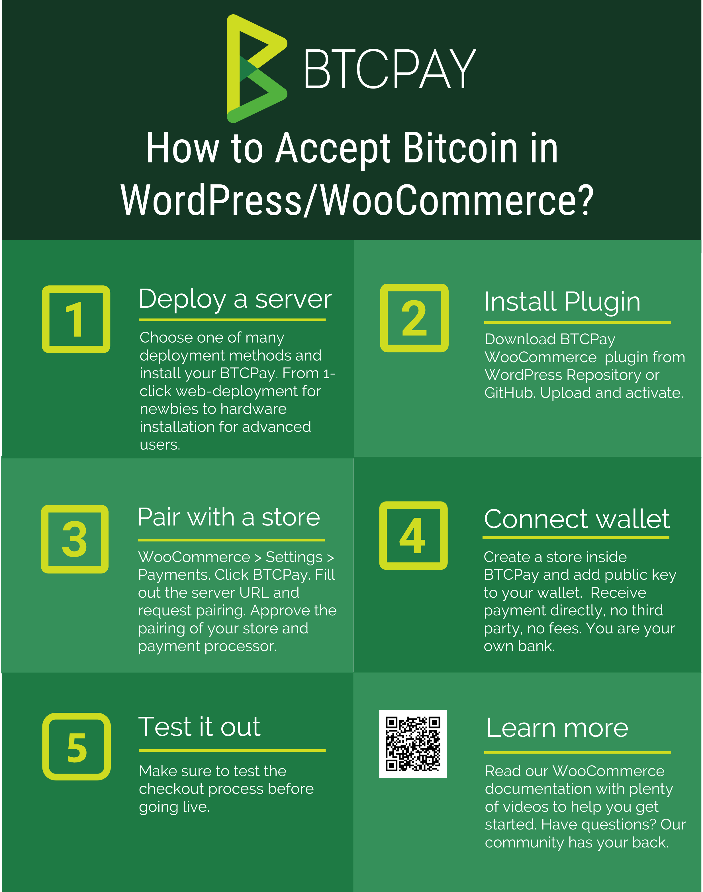
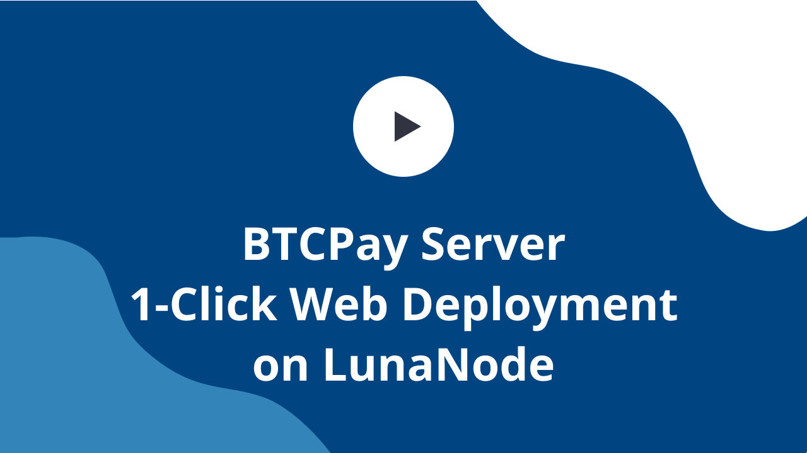

# WooCommerce integration

This document explains how to integrate BTCPay Server into your WooCommerce store. If you do not have a store yet, follow [this step by step article](https://bitcoinshirt.co/how-to-create-store-accept-bitcoin/) to create one from scratch.

You can check out the following video, or head over to [the WooCommerce plugin repository](https://github.com/btcpayserver/woocommerce-plugin).

[](https://www.youtube.com/watch?v=tTH3nLoyTcw "BTCPay - WooCommerce")



To integrate BTCPay Server into an existing WooCommerce store, follow the steps below.

## 1. Install BTCPay Plugin
There are two ways to download BTCPay plugin:
- [WordPress Repository](https://wordpress.org/plugins/btcpay-for-woocommerce/)
- [GitHub Repository](https://github.com/btcpayserver/woocommerce-plugin/releases)

### Install plugin from WordPress
1. WordPress > Plugins > Add New.
2. In Search, type "BTCPay for WooCommerce"
3. Install and activate.


### Download and install plugin from GitHub

[Download the latest BTCPay plugin](https://github.com/btcpayserver/woocommerce-plugin/releases), upload it in .zip format into your WordPress and activate it.

[](https://www.youtube.com/watch?v=6QcTWHRKZag "BTCPay - Woo Plugin")

## 2. Deploy BTCPay Server

To launch your BTCPay server, you can self-host it, or use a third party host.

### 2.1 Self-hosted BTCPay

There are various ways to [launch a self-hosted BTCPay](https://github.com/btcpayserver/btcpayserver-doc#deployment). If you do not have technical knowledge, use the [web-wizard method](https://launchbtcpay.lunanode.com) and follow the video below.

[](https://www.youtube.com/watch?v=NjslXYvp8bk "BTCPay - LunaNode")

For the self-hosted solutions, you'll have to wait for your node to sync fully before proceeding to step 3.

### 2.2 Third-party host

For those who want to test BTCPay out, or are okay with the limitations of a third-party hosting (dependency and privacy, as well as lack of some features) can use a one of many [third-party hosts](ThirdPartyHosting.md).

The video below shows you how to connect your store to such a host.

[](https://www.youtube.com/watch?v=IT2K8It3S3o "BTCPay - Third Party Host")

## 3. Pairing the store

BTCPay WooCommerce plugin is a bridge between your server (payment processor) and your e-commerce store. No matter if you're using a self-hosted or third-party solution from step 2, the pairing process is identical.

Go to your store dashboard. WooCommerce > Settings > Payments. Click BTCPay.

1. In the field, enter the full URL of your host (including the https) – https://btcpay.mydomain.com
2. Click on the generated link which will redirect you back to your BTCPay Server.
3. Click on request pairing
4. Approve the pairing
5. Copy the pairing code
6. Go back to your store and paste the pairing code
7. Click “Pair”
8. When you see the image, it means you successfully paired your server and your store.

The process of pairing a store with BTCPay is explained in a video below, starting at 1:59

[](https://youtu.be/IT2K8It3S3o?t=119 "BTCPay - Pairing your Store")

## 4. Connecting your wallet

No matter if you're using self-hosted or server hosted by a third-party, the process of configuring your wallet is the same. 

[](https://www.youtube.com/watch?v=xX6LyQej0NQ "BTCPay - Wallet")

## 5. Testing the checkout

Making a small test-purchase from your store will give you a piece of mind. Always make sure that everything is set up correctly before going live. The final video guides you through the steps of setting a gap limit in your Electrum wallet and testing the checkout process.

[](https://www.youtube.com/watch?v=Fi3pYpzGmmo "BTCPay - Wallet")

## 6. Customizing BTCPay WooCommerce Plugin

### BTCPay Order Statuses

Depending on your business model and store settings, you may want to configure your order statuses. You can set BTCPay to trigger certain order status in WooCommerce automatically.
     
* New Order - order placed, not paid yet.    
* Paid - order paid, not confirmed on the blockchain.
* Confirmed - order paid, confirmed on the blockchain, does not have a sufficient number of confirmations set in BTCPay tore settings.
* Complete - order paid, confirmed on the blockchain with a sufficient number of confirmations.
* Invalid - order paid, did not get a sufficient number of confirmations in a pre-defined time-frame set in BTCPay store settings.
* Expired - invoice expired, order not paid
* Paid after expiration - invoice expired, paid
* Expired with partial payment - invoice expired and paid partially

Take time to think about how you wish to automate these statuses. If you do not wish certain BTCPay status to trigger WooCommerce order status, you can leave it blank. 

For example, if a merchant wants to send an email notifying the customer that the payment has been received, but the order will be processed upon confirmation, the merchant would have to set "order status paid" to "on hold." Then, the merchant would have to customize and trigger email for 'on hold' status of the order in WooCommerce. It takes some time to find a perfect formula, so users should test things out before going live.

# Deploying WooCommerce from BTCPay Server
If you already have BTCPay Server, you can very easily start WooCommerce from your existing environment.

1. Point the external IP of the virtual machine where your BTCPay is hosted to your store domain, for example store.yourdomain.com.


2. Log into your BTCPay server as root.

```
sudo su -
```

3. Set up WooCommerce variables. You can add [optional variables](https://github.com/btcpayserver/btcpayserver-docker/blob/master/docker-compose-generator/docker-fragments/opt-add-woocommerce.yml) as well.

```
export BTCPAYGEN_ADDITIONAL_FRAGMENTS="$BTCPAYGEN_ADDITIONAL_FRAGMENTS;opt-add-woocommerce"
export WOOCOMMERCE_HOST="yourstoredomain.com"
```
4. Lastly, just run BTCPay Setup script which will add the set up variables.

```
. ./btcpay-setup.sh -i
```
5. Go to your store's domain name, in our example that's store.yourdomain.com and follow the WordPress installation wizard.
