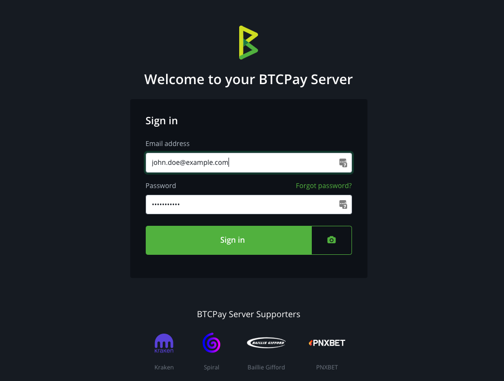
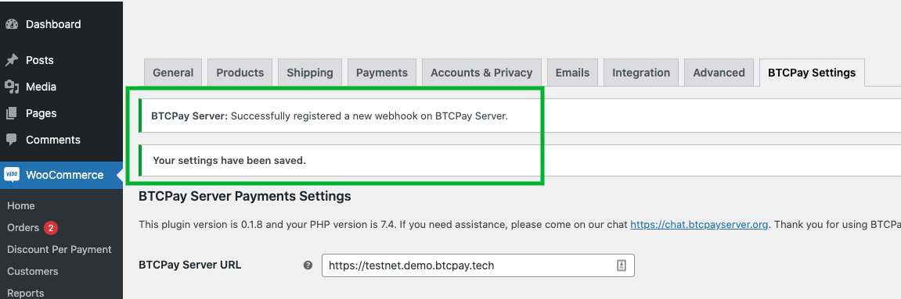
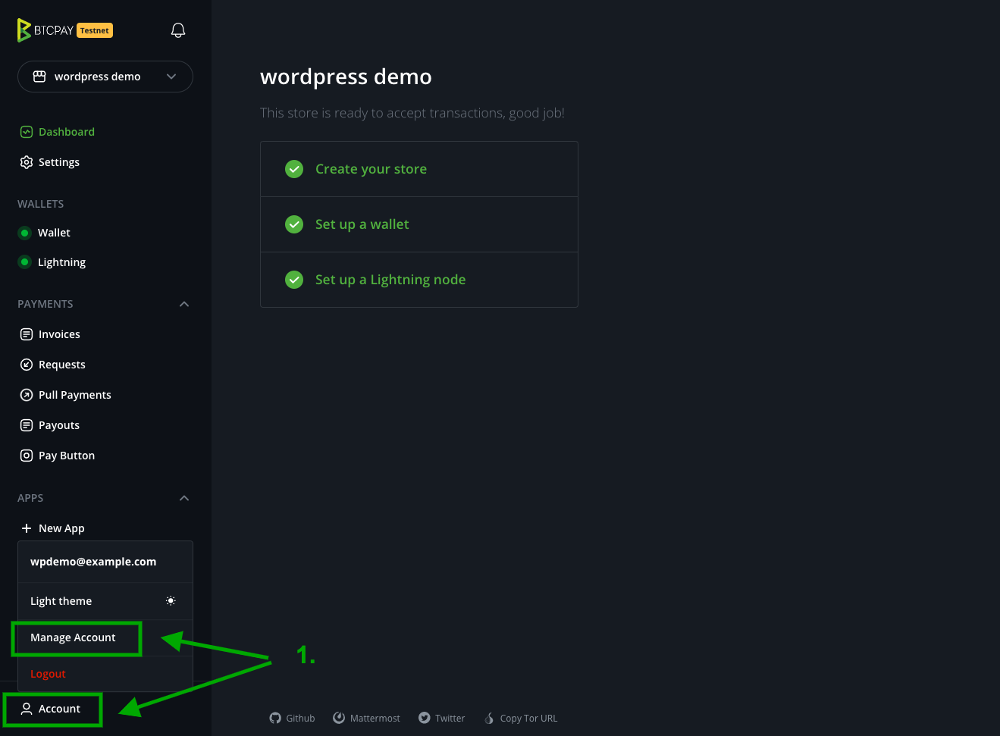
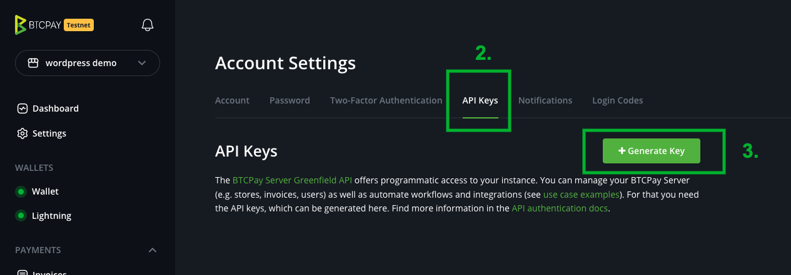
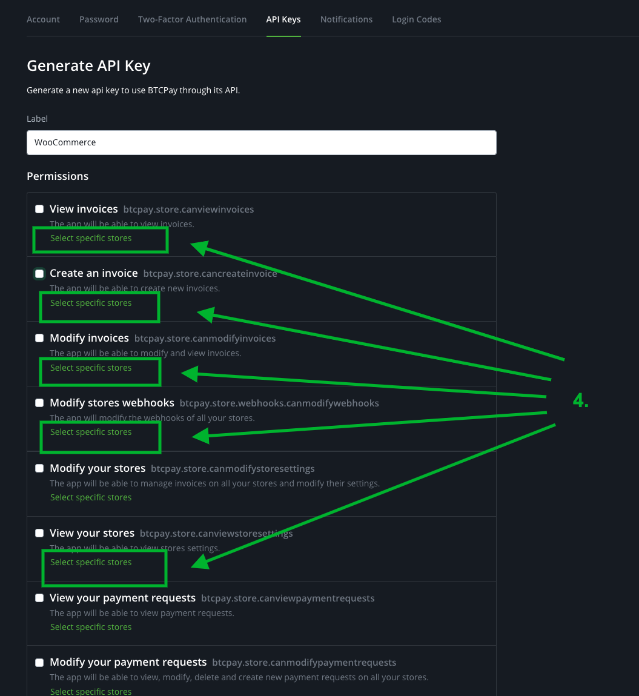
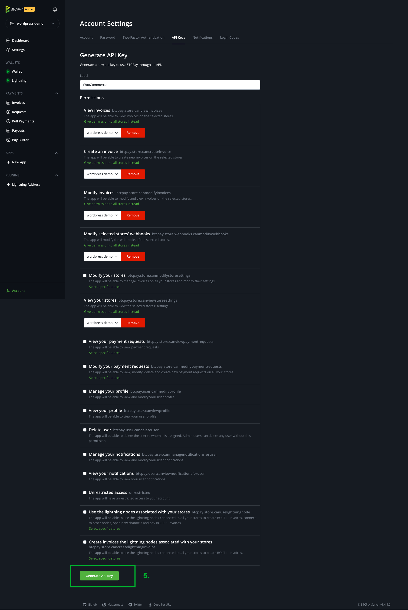
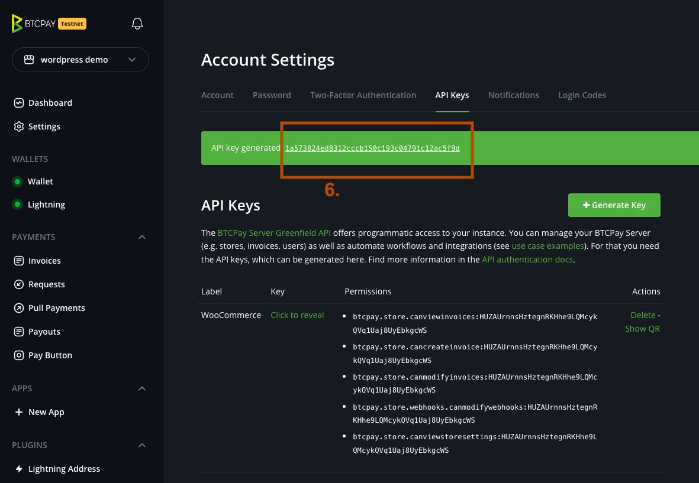
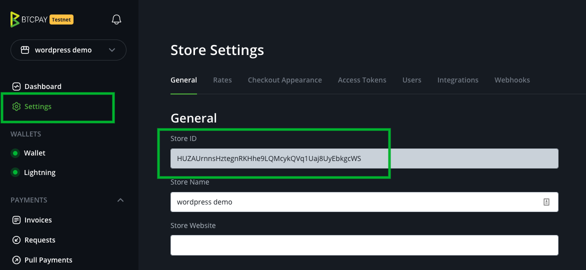

# WooCommerce integration

This document explains how to **integrate BTCPay Server into your WooCommerce store**.
If you do not have a store yet, follow [this step by step article](https://bitcoinshirt.co/how-to-create-store-accept-bitcoin/) to create one from scratch.

:::tip Note
This guide refers to the BTCPay for WooCommerce V2 plugin. You can find instructions for the now unmaintained legacy plugin (based on BitPay API) [here](https://github.com/btcpayserver/btcpayserver-doc/blob/cba96292ceea9483711ab53c479a98357383f857/docs/WooCommerce.md).
:::


To integrate BTCPay Server into an existing WooCommerce store, follow the steps below and/or watch this video:

[](https://www.youtube.com/watch?v=a-MQHgnjNXI "BTCPay for WooCommerce V2 Installation")

## Requirements

Please ensure that you meet the following requirements before installing this plugin.

- PHP version 7.4 or newer
- The curl, gd, intl, json, and mbstring PHP extensions are available
- A WooCommerce website ([Installation instructions](https://woocommerce.com/document/installing-uninstalling-woocommerce/) or [directly on BTCPay Server](#deploying-woocommerce-from-btcpay-server))
- You have a BTCPay Server version 1.3.0 or later, either [self-hosted](/Deployment/README.md) or [hosted by a third-party](/Deployment/ThirdPartyHosting.md)
- [You've a registered account on the instance](./RegisterAccount.md)
- [You've a BTCPay store on the instance](./CreateStore.md)
- [You've a wallet connected to your store](./WalletSetup.md)


## 1. Install BTCPay Plugin

There are three ways to **download BTCPay for WooCommerce V2 plugin**:

- From within WordPress via the Admin Dashboard (recommended, see below)
- [WordPress Repository](https://wordpress.org/plugins/btcpay-greenfield-for-woocommerce/)
- [GitHub Repository](https://github.com/btcpayserver/woocommerce-greenfield-plugin/releases)

### 1.1 Install plugin from WordPress Admin Dashboard (recommended)

1. WordPress > Plugins > Add New.
2. In Search, type "BTCPay V2".
3. Install and activate.


### 1.2 Download and install plugin from GitHub

[Download the latest BTCPay plugin](https://github.com/btcpayserver/woocommerce-greenfield-plugin/releases), upload it in .zip format to your WordPress site and activate it.

[](https://www.youtube.com/watch?v=6QcTWHRKZag "BTCPay Server - Woo Plugin")


## 2. Connecting WooCommerce and BTCPay Server

BTCPay for WooCommerce V2 plugin is a **bridge between your BTCPay Server (payment processor) and your e-commerce store**.
No matter if you're using a self-hosted or third-party solution, the connection process is identical.

You can either click on the notifications link saying "**please configure the plugin here**" (see screenshot below), or:

- Go to your store dashboard.
- WooCommerce > Settings.
- Click [BTCPay Settings] tab.


### 2.1 Connect using the API key wizard (recommended)

1. In the field "**BTCPay Server URL**", enter the full URL of your host (including the https) – https://btcpay.mydomain.com
2. Click on the link below the "**BTCPay Api Key**" field that says "**click here to generate API keys*" (you will be redirected to BTCPay Server "Authorization request" page.


3. If you are not logged in to your BTCPay Server instance, do so now. (optional)

4. For each listed permission click on "select specific stores..." (If you only have one store it will get autoselected).

5. Click [Authorize app]

7. You will get redirected to your WooCommerce store and the API key and Store ID will be prefilled.

8. Before doing any further configuration click on **[Save]** as it will setup the webhook for you.


Continue with "3. Testing the checkout" below.

### 2.2 Connect by manually creating the API key and permissions

If you can't use the wizard mentioned in the previous section you can also generate the API key manually.

1. Click on *[Account]* -> *Manage Account* on the bottom left   

2. Go to the tab *"API Keys"*    
3. Click *[Generate Key]* to select permissions.   

4. Click on the *"Select specific stores"* link for the following permissions: `View invoices`, `Create invoice`, `Modify invoices`, `Modify stores webhooks`, `View your stores`   
 
5. Click on *[Generate API Key]*   
 
6. Copy the generated API Key to your WordPress *BTCPay Settings* form   
 
7. Copy the store ID to your WordPress *BTCPay Settings* form   
 
8. On the BTCPay Settings form make sure *BTPCay Server URL*, *BTCPay Server API Key* and *Store ID* are set and click *[Save]*   
9. Make sure you see the notification "*BTCPay Server: Successfully registered a new webhook on BTCPay Server*"   
 

## 3. Testing the checkout

Making a small test-purchase from your store will give you a piece of mind.
Always make sure that everything is set up correctly before going live.
The final video guides you through the steps of setting a gap limit in your Electrum wallet and testing the checkout process.

[](https://www.youtube.com/watch?v=Fi3pYpzGmmo "BTCPay Server - Wallet")

## 4. Customizing BTCPay WooCommerce V2

### 4.1 Global Settings

Can be found at *WooCommerce -> Settings -> Tab [BTCPay Settings]*

**BTCPay Server URL**  

URL to your BTCPay Server instance, including protocol e.g. `https://btcpay.yourdomain.com`.

**BTCPay API Key**   

Your API Key. (Was auto-generated in the steps before).

**Store ID**   

The store ID of your BTCPay Server store. Can be found on the store settings page.

**Default Customer Message**   

Here you can customize the customer message shown after selecting BTCPay payment gateway on checkout. This can be overwritten on the payment gateway settings for each gateway if you use the "Separate payment gateways" option.

**Invoice pass to "Settled" state after**   

Set after how many confirmations a payment is considered fully paid and settled. Defaults to what is configured on BTCPay store settings.

**BTCPay Order Statuses**   

Depending on your business model and store settings, you may want to configure your order statuses.
You can set BTCPay to trigger certain order status in WooCommerce automatically.

- *New* - order placed, not paid yet.
- *Paid* - order paid, not enough confirmations on the blockchain, yet.
- *Settled* - order paid, confirmed on the blockchain.
- *Settled (paid over)* - order paid, confirmed on the blockchain but paid over.
- *Invalid* - order paid, did not get a sufficient number of confirmations in a pre-defined time-frame set in BTCPay store settings, or manually marked invalid.
- *Expired* - invoice expired, order not paid.
- *Expired with partial payment* - invoice expired and paid partially

Take time to think about how you wish to automate these statuses.
If you do not wish certain BTCPay status to trigger WooCommerce order status, you can leave it as default "- no mapping / defaults -".

Note: you should keep the "Settled" order status to "- no mapping / defaults-" if you sell digital and physical products. For digital products WooCommerce will automatically skip the "Processing" status and go directly to "Completed" for those orders only containing digital products.

Another example, if a merchant wants to send an email notifying the customer that the payment has been received, but the order will be processed upon confirmation, the merchant would have to set order status for "Paid" to "On hold". Then, the merchant would have to customize and trigger email for "On hold" status of the order in WooCommerce.

It takes some time to find a perfect formula, so users should test things out before going live.

**Separate Payment Gateways**   

If this option is enabled the plugin will generate one separate payment gateway per supported payment method on BTCPay Server. E.g. if you have BTC, LightningNetwork and maybe Liquid Assets enabled on your BTCPay Server store, then you will have a separate gateway available for each. This allows many new use cases like discount per gateway or country based restrictions. More details [here](./FAQ/Integrations/#how-to-configure-additional-token-support). 

**Send customer data to BTCPayServer**   

By default *no* customer data beside email is sent to BTCPay Server. If you want to send customer address data to BTCPay Server you can enable it here.

**Debug Log**   

This option is helpful in case you have a problem and need more information on what is going on. The logs can be then found under WooCommerce -> Status -> Log. Make sure you disable this again after debugging as it will fill up your filesystem with logs.


### 4.2 Payment Gateway specific

Depending on wheter you have above mentioned "Separate Payment Gateways" enabled you will have one or more Payment Gateways available to configure in the payment gateway settings via *WooCommerce -> Settings -> Tab [Payments]*

On all payment gateways you can set the following options:

**Title**   
The shown payment gateway text on the checkout page. Defaults to "BTCPay (Bitcoin, Lightning Network, ...)".

**Customer Message**   

Here you can customize message shown after selecting BTCPay payment gateway.

**Gateway Icon**

Upload or select a custom icon to be shown next to the payment gateway during checkout. Defaults to BTCPay logo.

#### 4.2.1 BTCPay (default)

Additional options only available for the default payment gateway:

**Enforce payment tokens**

With "Separate Payment Gateways" feature enabled in BTCPay Settings you can use this option to enforce only payment tokens. This means that the created invoice will *only* include tokens of type "payment" and *not any*  of type "promotion". See difference of token types [here](./FAQ/Integrations/#how-to-configure-additional-token-support#token-types)

#### 4.2.2 Separate Payment Gateways

Additional options only available for the separate payment gateways (if that feature is enabled):

**Token Type**

By default type "payment" is selected. But if you have Liquid Assets with your own issued asset/token (e.g. used as voucher) you can select "promotion" here. Those are processed differently than normal payment tokens. Details can be found [here](./FAQ/Integrations/#how-to-configure-additional-token-support#promotional-tokens-100-discount)

# Troubleshooting

## The order states do not update although the invoice has been paid
Please check the details of your invoice if there were any errors on sending the webhook request. Some hosting providers, firewall setups or WordPress security plugins block POST requests to your WordPress site which lead to a http status of "403 forbidden". 

You can check and verify yourself if there is something blocking requests to your site in one of these two ways:

**Check using a command line (Linux or MacOS):**   
(replace EXAMPLE.COM with your WordPress site URL)

```
curl -vX POST -H "Content-Type: application/json" \
    -d '{"data": "test"}' https://EXAMPLE.COM/?wc-api=btcpaygf_default
```

```
.... snip ....
* upload completely sent off: 16 out of 16 bytes
< HTTP/1.1 403 Forbidden
< access-control-allow-origin: *
< Content-Type: application/json; charset=UTF-8
< X-Cloud-Trace-Context: 4f07d5b2e5c2f05949d04421a8e2dd6a
< Date: Thu, 17 Feb 2022 10:06:50 GMT
< Server: Google Frontend
< Content-Length: 26
```

If you see that line "HTTP/1.1 403 Forbidden" or "HTTP/2 403" then something is blocking data sent to your WordPress site. You should ask your hosting provider or make sure no firewall or plugin is blocking the requests.

**Check using an online service (if you do not have a command line available:**   

- Go to [https://reqbin.com/post-online](https://reqbin.com/post-online) 
- Enter your domain: `https://EXAMPLE.COM/?wc-api=btcpaygf_default`
  (replace EXAMPLE.COM with your WordPress site URL)
- Make sure "POST" is selected
- Click [Send]


If you see "Status 403 (Forbidden)" then POST requests to your site are blocked for some reason. You should ask your hosting provider or make sure no firewall or plugin is blocking the requests.

## I get an error during checkout but not sure what the problem is.

In your BTCPay Settings in your admin dashboard: *WooCommerce -> Settings: Tab [BTCPay Settings]* you can enable debug mode by setting the checkbox on that option.

You can now find more detailed Logs when you click the [View Logs] button or you go to *WooCommerce -> Status: Tab [Logs]* and select the most recent btcpay logs. 

:::warning Warning
Please make sure that you disable the debugging mode again after you finished investigating, otherwise your site performance may be impacted and also write lots of logging data in your filesystem for no reason.
::: 

Additionally you can also look into your webservers error logs if you find any error that is related to BTCPay plugin.

## I have troubles with using the plugin or some other related questions

Feel free to join our support channel over at [https://chat.btcpayserver.org/](https://chat.btcpayserver.org/) if you need help or have any further questions.


# Deploying WooCommerce from BTCPay Server

If you already have BTCPay Server, you can very easily start WooCommerce from your existing environment.

1. Point the external IP of the virtual machine where your BTCPay is hosted to your store domain, for example store.yourdomain.com.

2. Log into your BTCPay server as root.

```bash
sudo su -
```

3. Set up WooCommerce variables. You can add [optional variables](https://github.com/btcpayserver/btcpayserver-docker/blob/master/docker-compose-generator/docker-fragments/opt-add-woocommerce.yml) as well.

```bash
export BTCPAYGEN_ADDITIONAL_FRAGMENTS="$BTCPAYGEN_ADDITIONAL_FRAGMENTS;opt-add-woocommerce"
export WOOCOMMERCE_HOST="yourstoredomain.com"
```

4. Lastly, just run BTCPay Setup script which will add the set up variables.

```bash
. ./btcpay-setup.sh -i
```

5. Go to your store's domain name, in our example that's store.yourdomain.com and follow the WordPress installation wizard.
