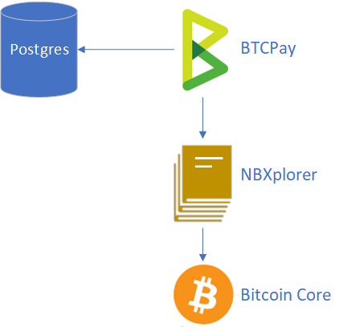

# Architecture

BTCPayServer is a project which ties together several Bitcoin-related components into a coherent user experience for installing and managing your own payment processor.

The minimal setup involves:

* [BTCPayServer](https://github.com/btcpayserver/btcpayserver)
* [NBXplorer](https://github.com/dgarage/NBXplorer) (Lightweight block explorer, responsible for tracking payments)
* Bitcoin Core
* (Optional) PostgreSQL

By default, it uses SqlLite, but all production deployments use Postgres.

Additionally, if you need Lightning Network access, NBXplorer supports connections to:

* C-Lightning (via unix sockets)
* Lightning Charge
* LND (via the REST interface)

Video below shows BTCPay Architecture in-depth.

---

We provide several ways of deploying BTCPayServer, depending on whether you favor flexibility or ease-of-use.

From the easiest way to the hardest:

* [Web-Interface LunaNode deployment](../guide/LunaNodeWebDeployment.md)
* [Azure deployment](../guide/AzureDeployment.md) (Using a one-click deploy on Microsoft Azure)
* [Docker deployment](https://github.com/btcpayserver/btcpayserver-docker/blob/master/README.md) (Using a `docker-compose.yml` file which bundle all the dependencies together, in almost any environment)
* [Manual deployment](../guide/ManualDeployment.md) (Downloading, building and running all the dependencies by yourself)

Some community members also offer [third-party hosting](../guide/ThirdPartyHosting.md) (Having someone else manage BTCPayServer for you).

Remember the **huge value** of having **direct control** of your wallet and web service; for this reason we recommend you use [Azure deployment](../guide/AzureDeployment.md) or [Web-Interface deployment](../guide/LunaNodeWebDeployment.md) and **do the setup yourself** - it is pretty easy!
