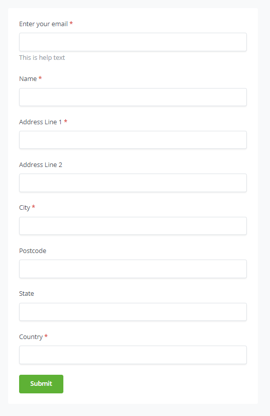

# Fomu

Kipengele cha Fomu cha BTCPay Server kinakuwezesha kumwomba mteja wako ajaze fomu kabla ya kuendelea na malipo.

Fomu hizi zinaweza kubinafsishwa kikamilifu kulingana na mahitaji yako.

Mfano wa ufafanuzi wa fomu:

```json
{
  "fields": [
    {
      "name": "buyerEmail",
      "constant": false,
      "type": "email",
      "value": null,
      "required": true,
      "label": "Enter your email",
      "helpText": "This is help text",
      "fields": []
    },
    {
      "name": "buyerName",
      "constant": false,
      "type": "text",
      "value": null,
      "required": true,
      "label": "Name",
      "helpText": null,
      "fields": []
    },
    {
      "name": "buyerAddress1",
      "constant": false,
      "type": "text",
      "value": null,
      "required": true,
      "label": "Address Line 1",
      "helpText": null,
      "validationErrors": [],
      "fields": []
    },
    {
      "name": "buyerAddress2",
      "constant": false,
      "type": "text",
      "value": null,
      "required": false,
      "label": "Address Line 2",
      "helpText": null,
      "fields": []
    },
    {
      "name": "buyerCity",
      "constant": false,
      "type": "text",
      "value": null,
      "required": true,
      "label": "City",
      "helpText": null,
      "fields": []
    },
    {
      "name": "buyerZip",
      "constant": false,
      "type": "text",
      "value": null,
      "required": false,
      "label": "Postcode",
      "helpText": null,
      "fields": []
    },
    {
      "name": "buyerState",
      "constant": false,
      "type": "text",
      "value": null,
      "required": false,
      "label": "State",
      "helpText": null,
      "fields": []
    },
    {
      "name": "buyerCountry",
      "constant": false,
      "type": "text",
      "value": null,
      "required": true,
      "label": "Country",
      "helpText": null,
      "fields": []
    }
  ]
}
```

Matokeo:



Katika ufafanuzi wa sehemu, sehemu zifuatazo pekee ndizo zinaweza kuwekwa:

| Sehemu                 | Maelezo                                                                                                                                                                                                                                                                                                                                                                                                                                                            |
| ---------------------- | ------------------------------------------------------------------------------------------------------------------------------------------------------------------------------------------------------------------------------------------------------------------------------------------------------------------------------------------------------------------------------------------------------------------------------------------------------------------ |
| `.fields.constant`     | Ikiwa ni `true`, `.value` lazima iwekwe katika ufafanuzi wa fomu, na mtumiaji hataweza kubadilisha thamani ya sehemu hiyo. (mfano: toleo la ufafanuzi wa fomu)                                                                                                                                                                                                                                                                                                      |
| `.fields.type`         | Aina ya kuingiza ya HTML `text`, `checkbox`, `password`, `hidden`, `color`, `date`, `datetime-local`, `month`, `week`, `time`, `email`, `number`, `url`, `tel`                                                                                                                                                                                                                                                          |
| `.fields.options`      | Ikiwa `.fields.type` ni `select`, orodha ya thamani zinazoweza kuchaguliwa                                                                                                                                                                                                                                                                                                                                                                                         |
| `.fields.options.text` | Maandishi yanayoonyeshwa kwa chaguo hili                                                                                                                                                                                                                                                                                                                                                                                                                           |
| `.fields.options.value`| Thamani ya sehemu ikiwa chaguo hili limechaguliwa                                                                                                                                                                                                                                                                                                                                                                                                                  |
| `.fields.type=fieldset`| Unda HTML `fieldset` kuzunguka watoto `.fields.fields` (tazama hapa chini)                                                                                                                                                                                                                                                                                                                                                                                         |
| `.fields.name`         | Jina la sifa ya JSON ya sehemu kama itakavyoonekana kwenye metadata ya ankara                                                                                                                                                                                                                                                                                                                                                                                     |
| `.fields.value`        | Thamani chaguo-msingi ya sehemu                                                                                                                                                                                                                                                                                                                                                                                                                                    |
| `.fields.required`     | ikiwa ni `true`, sehemu itakuwa ya lazima                                                                                                                                                                                                                                                                                                                                                                                                                           |
| `.fields.label`        | Lebo ya sehemu (inaweza kuwa na HTML kwa muundo na viungo)                                                                                                                                                                                                                                                                                                                                                                                                         |
| `.fields.helpText`     | Maandishi ya ziada kutoa maelezo kwa sehemu (inaweza kuwa na HTML kwa muundo na viungo)                                                                                                                                                                                                                                                                                                                                                                            |
| `.fields.fields`       | Ikiwa `.fields.type` ni `fieldset`, unaweza kupanga sehemu zako katika daraja, kuruhusu sehemu za mtoto kuwekwa ndani ya metadata ya ankara. Muundo huu unaweza kukusaidia kupanga na kusimamia vizuri taarifa zilizokusanywa, na kurahisisha kuzifikia na kuzitafsiri. Kwa mfano, ikiwa una fomu inayokusanya taarifa za mteja, unaweza kuweka sehemu katika kundi chini ya sehemu kuu inayoitwa customer. Ndani ya sehemu hii kuu, unaweza kuwa na sehemu za mtoto kama name, email, na address. |
| `.fields.valuemap`     | Ikiwa `.fields.type` ni `mirror`, unaweza kubainisha kitu, ambapo funguo ni thamani ya kulinganisha na thamani ni matokeo yaliyopangwa. `{ "hello": "world"}`, inamaanisha kwamba ikiwa thamani iliyonakiliwa ni `hello`, itahifadhiwa kama `world`.                                                                                 |

Thamani za sehemu huhifadhiwa katika [metadata ya ankara](/Development/InvoiceMetadata/).

## Majina ya sehemu yanayojulikana

Jina la sehemu linawakilisha jina la sifa ya JSON inayohifadhi thamani iliyotolewa na mtumiaji katika metadata ya ankara.

Baadhi ya majina yanayojulikana yanaweza kutafsiriwa na kubadilisha mipangilio ya ankara.

| Jina la sehemu     | Maelezo            |
| ------------------ | ---------------------- |
| `invoice_amount`   | Kiasi cha ankara   |
| `invoice_currency` | Sarafu ya ankara |
| Inayoanza na `invoice_amount_adjustment` | Mradi tu thamani yake imehesabiwa kuwa nambari, itarekebisha kiasi cha ankara ipasavyo. |
| Inayoanza na `invoice_amount_multiply_adjustment` | Inarekebisha kiasi cha ankara kilichozalishwa kwa kuzidisha na thamani hii. |

## Sehemu za kioo (Mirror)

Sehemu ya `Mirror` inafafanuliwa kwa aina `mirror`. Thamani yake imewekwa kuwa jina la sehemu nyingine, na baada ya kuwasilisha fomu, thamani ya sehemu hiyo itanakiliwa kwenye sehemu ya kioo.
Aina ya mirror pia ina uwezo wa kupanga ramani ya thamani ili thamani ya sehemu inayorejelewa iweze kubadilishwa inaponakiliwa kwenda sehemu ya kioo.

Kwa mfano, unaweza kuwa na sehemu ya kuchagua yenye orodha ya nchi, na kisha unda sehemu ya `invoice_amount_adjustment`, ambapo unarekebisha bei ya ankara kulingana na nchi iliyochaguliwa.
Au unaweza kuzalisha nambari za ofa za asilimia kulingana na sehemu ya `invoice_amount_multiply_adjustment`.

Huu ni mfano wa jinsi nambari tatu za ofa zenye punguzo tofauti zinaweza kutekelezwa:

- `huge` = punguzo la 50%
- `medium` = punguzo la 10%
- `tiny` = punguzo la 1%

```json
{
  "fields": [
    {
      "name": "promo",
      "type": "text",
      "label": "Promo Code"
    },
    {
      "name": "invoice_amount_multiply_adjustment_promo",
      "type": "mirror",
      "value": "promo",
      "label": "Promo Codes",
      "valuemap": {
        "tiny": "0.99",
        "medium": "0.90",
        "huge": "0.5"
      }
    }
  ]
}
```

## Kujaza mapema thamani za fomu

Unaweza kujaza mapema sehemu za ankara kiotomatiki kwa kuongeza nyuzi za hoja kwenye URL ya fomu, kama vile `?your_field=value`.

Hapa kuna baadhi ya matumizi ya kipengele hiki:

- `Kusaidia kuingiza kwa mtumiaji`: Jaza mapema sehemu na taarifa za mteja zinazojulikana ili kurahisisha kwao kukamilisha fomu. Kwa mfano, ikiwa tayari unajua anwani ya barua pepe ya mteja, unaweza kujaza mapema sehemu ya barua pepe ili kuwaokoa muda.
- `Ubinafsishaji`: Binafsisha fomu kulingana na mapendeleo ya mteja au mgawanyiko. Kwa mfano, ikiwa una viwango tofauti vya wateja, unaweza kujaza mapema fomu na data husika, kama vile kiwango chao cha uanachama au ofa maalum.
- `Ufuatiliaji`: Fuatilia chanzo cha matembezi ya wateja kwa kutumia sehemu zilizofichwa na thamani zilizojazwa mapema. Kwa mfano, unaweza kuunda viungo tofauti vilivyo na thamani za `utm_media` zilizojazwa mapema kwa kila njia ya uuzaji (mf., Twitter, Facebook, barua pepe). Hii inakusaidia kuchambua ufanisi wa juhudi zako za uuzaji.

- `Jaribio la A/B`: Jaza mapema sehemu na thamani tofauti ili kujaribu matoleo tofauti ya fomu, kukuwezesha kuboresha uzoefu wa mtumiaji na viwango vya uongofu.
