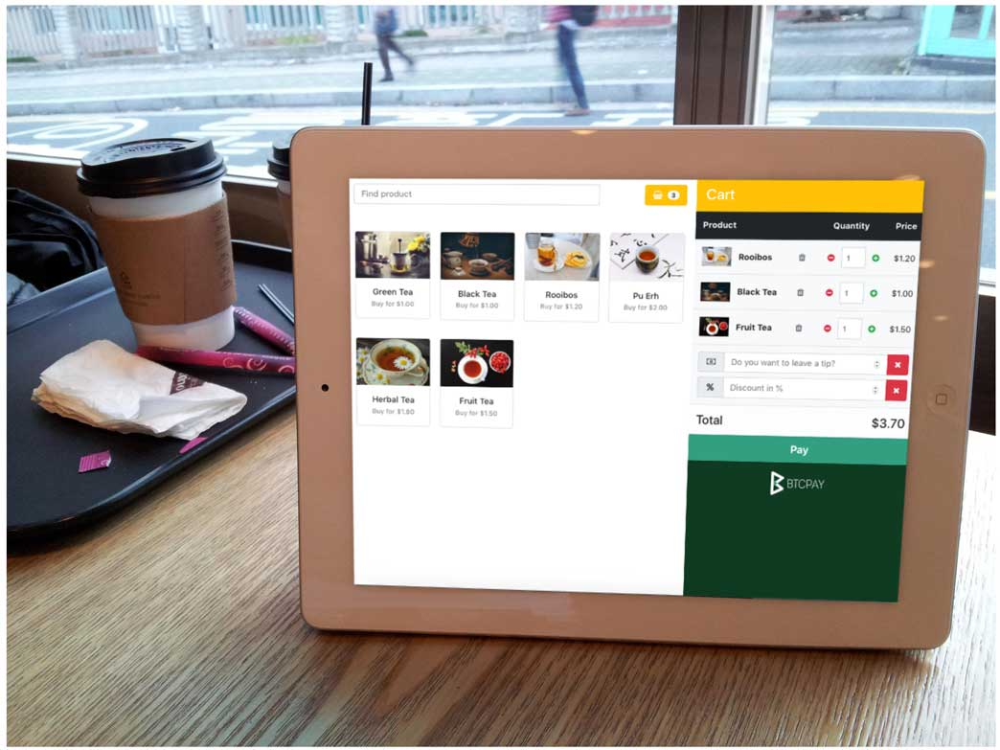

# Programu za BTCPay Server

Kusudi kuu la BTCPay Server ni kuondoa utegemezi kwa wahusika wengine wanaoaminika. Programu ni matumizi yaliyojengwa ndani ambayo yanaondoa mamlaka kuu na kuruhusu watumiaji njia rahisi ya kupanua [matumizi](./UseCase.md) ya programu. Watumiaji wanaweza kujiendeshea wenyewe aina zote za programu zinazoweza kubinafsishwa ambazo hufanya kazi moja kwa moja.

Ili kuunda programu, nenda kwa Programu > Unda programu mpya. Programu zinategemea duka, kumaanisha kuwa kila programu inahitaji kuunganishwa kwenye duka.

## Programu ya Point of Sale

**Programu ya PoS inayotumia wavuti** inawaruhusu watumiaji wenye maduka ya kudumu **kupokea sarafu za kripto kwa urahisi bila ada au mhusika mwingine**, moja kwa moja kwenye wallet yao. **PoS** inaweza kuonyeshwa kwa urahisi kwenye vidonge au vifaa vingine vyovyote vinavyounga mkono kuvinjari wavuti. Watumiaji wanaweza kuunda njia ya mkato ya skrini ya kwanza kwa urahisi kwa ufikiaji wa haraka wa programu ya wavuti.

Kuongeza bidhaa mpya ni rahisi. Programu ina **kipengele cha kikapu cha ununuzi**, **vidokezo**, **hesabu ya bidhaa**, **chaguo maalum za malipo** na zaidi.

**Programu ya Point of sale** inaweza pia kutumika kupokea michango, vidokezo au hata kama duka dogo la e-commerce, kulingana na chaguo au ubinafsishaji uliotumika.

Kwa sasa, **programu ya Point of Sale** inasaidia mionekano mitatu tofauti:

- Mwonekano wa `Static` unaowakilisha bidhaa za kuuza tu.
- Mwonekano wa `Cart` unaojumuisha bidhaa za kuuza na kikapu cha malipo.
- Mwonekano wa `Light` unaojumuisha kibodi ya nambari tu kwa malipo rahisi na ya haraka (Kuanzia [v1.0.5.6](https://blog.btcpayserver.org/btcpay-server-1-0-5-6/#simplePOS)).

Kuanzisha **programu yako ya kwanza ya Point of Sale**, fuata hatua hizi rahisi chache:

1. Nenda kwa `Apps` na `Create a new app`
2. Ongeza `jina` la programu yako
3. Chagua `app type` > Point Of Sale
4. Chagua `duka` la kuhusisha na programu.
5. Binafsisha PoS yako kwa kuchagua `mwonekano` (Static, Cart, Light), kuongeza `bidhaa` zako mwenyewe na bei, picha, na maelezo.
6. Bofya `Save Settings`.
7. Bofya `View App` kuona PoS yako (Wateja wako wanaweza kufikia PoS kupitia kiungo hicho).

Unaweza kubadilisha mwonekano wa **programu yako ya Point of Sale** kwa kufuata [mwongozo wa ubinafsishaji wa mandhari](./Development/Theme.md).

## Programu ya Ufadhili wa Umati

**Ufadhili wa Umati** ni programu ambayo unaweza kuizindua kutoka kwenye kiolesura cha BTCPay Server kinachokuwezesha kuunda **kampeni ya ufadhili inayojiendesha yenyewe**, sawa na Kickstarter au Indiegogo. Tofauti na **majukwaa ya jadi ya ufadhili wa umati**, muundaji wa kampeni ndiye mmiliki wa jukwaa. Fedha huenda moja kwa moja kwenye wallet ya muundaji **bila ada yoyote**.

1. Nenda kwa > Apps
2. Ongeza jina la programu yako
3. Chagua aina ya programu > Crowdfund
4. Chagua duka la kuhusisha na programu.
5. Binafsisha Ufadhili wako wa Umati kwa kuongeza marupurupu yako mwenyewe na bei, picha, na maelezo.
6. Tia alama kwenye kisanduku > Ruhusu ufadhili wa umati uonekane hadharani
7. Bofya "Save Settings".
8. Bofya "View App" kuona Ufadhili wako wa Umati (Wachangiaji wanaweza kufikia ufadhili wa umati kupitia kiungo hicho).

Ikiwa ungependa kutoa bidhaa za kidijitali au za kimwili kwa wafadhili wa **kampeni yako ya ufadhili wa umati**, unaweza [kuunganisha duka la WooCommerce ndani yake](./FAQ/Apps.md#how-to-integrate-woocommerce-store-into-a-btcpay-crowdfund-app). Unaweza pia kuweka mipaka kwenye marupurupu ya mchango kwa kutumia kipengele cha hesabu.

## Kitufe cha Malipo

**Vitufe vya malipo** vya HTML vinavyoweza kupachikwa kwa urahisi na vinavyobinafsishwa sana vinaruhusu watumiaji kupokea vidokezo na michango. Maduka ya mtandaoni yanaweza pia kuunganisha vitufe vya malipo. Mgeni wa tovuti anapobofya kitufe, BTCPay inaonyesha **invosi**.

1. Katika upau wako wa menyu ya kushoto, chini ya sehemu ya "PLUGINS", chagua "Pay Button".
2. Ruhusu mtu yeyote kuunda invosi.
3. Binafsisha kitufe chako.
4. Nakili fomu iliyozalishwa na uipachike kwenye tovuti yako.

