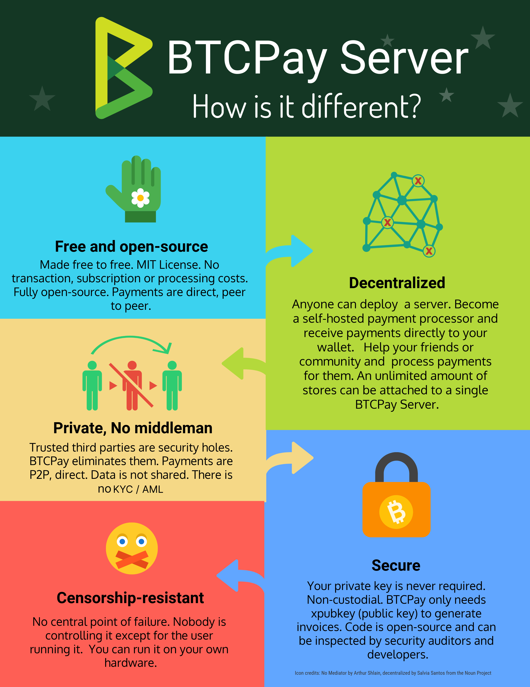

# BTCPay Server dhidi ya Wengine

Wafanyabiashara wengi wapya wanaelekea kuzingatia tu bei ya huduma. Kwa kuwa **BTCPay Server ni bure**, hilo huenda likakupeleka hapa na kama ndivyo, karibu.

**BTCPay Server ni msimbo**, si kampuni. Hakuna **mtu wa tatu kati ya mfanyabiashara na mteja**. Mfanyabiashara daima yuko katika udhibiti kamili wa fedha zake. Hakuna ada za usindikaji au usajili. BTCPay Server ni bure kutumia na ni chanzo-wazi kabisa, kwa hivyo watengenezaji au wakaguzi wa usalama wanaweza kukagua ubora wa msimbo wakati wowote.

Tunataka watumiaji waelewe sio tu BTCPay Server, bali pia jinsi malipo yanavyoweza kusindikwa kwa niaba ya mfanyabiashara. Ili kuwasaidia watumiaji kuelewa usawazisho wa faida-kwa-hasara wakati wa kutumia **njia mbalimbali za usindikaji wa malipo ya sarafu ya kidijitali**. Hatujui ni **kisindikiza malipo** kipi kinatoa huduma zipi. Hilo litakuwa sehemu ya utafiti wako mwenyewe. Orodha ifuatayo ni mahali pazuri pa kuanzia:

- [BTCPay Server dhidi ya Wengine](#btcpay-server-dhidi-ya-wengine)
  - [Vipengele](#vipengele)
  - [Gharama](#gharama)
  - [Usalama](#usalama)
  - [Faragha](#faragha)
  - [Ukinzani wa Udhibiti](#ukinzani-wa-udhibiti)
  - [Kuenea (Decentralized)](#kuenea)
  - [Fiat](#fiat)
  - [Huwezi kupata habari hii kwa visindikiza malipo vingine?](#huwezi-kupata-habari-hii-kwa-visindikiza-malipo-vingine)

---

## Vipengele

Kila kisindikiza malipo kina vipengele, hapa kuna baadhi ya vipengele vya BTCPay Server:

- **Bure & Kiwango-sawa (P2P)** - Malipo ya moja kwa moja, ya kiwango-sawa. Hakuna ada za usindikaji za mfanyabiashara. Hakuna ada za miamala (isipokuwa [ada ya mtandao](https://en.bitcoin.it/wiki/Miner_fees)).
- **Kujisimamia** - Nodi yako, sarafu zako. Hakuna wakala. Hakuna KYC/AML. Isiyo ya amana (udhibiti kamili wa funguo ya siri). Msaada wa [ushirikiano wa pochi ya maunzi](/HardwareWalletIntegration/).
- **Bitcoin & Altcoins** - Kubali Bitcoin kwa asili. Ushirikiano wa hiari wa [altcoin](/FAQ/Altcoin/).
- **Kisasa** - Msaada wa asili wa Segwit. Malipo madogo ya haraka ya Bitcoin kwa kutumia Mtandao wa Lightning (LND, Core Lightning (CLN), Eclair).
- **Ushirikiano wa CMS** - WordPress & WooCommerce, Shopify, Drupal, Magento, Prestashop, OpenCart, WHMCS, n.k. na ushirikiano maalum.
- **Programu** - Kiolesura cha Sehemu ya Mauzo kwa maduka ya kimwili. Kiolesura cha Ufadhili wa Umma kwa malengo ya michango na ukusanyaji fedha.
- **Vifungo vya Malipo** - Vifungo vya HTML vya mchango na malipo vinavyoweza kupachikwa kwa urahisi.
- **Maduka Yasiyo na Kikomo** - Wafanyabiashara wanaweza kusindika malipo kwa maduka yao wenyewe, au kwa wengine.
- **Tafsiri** - Wateja wanaweza kulipa katika lugha 20+ tofauti.
- **Maombi ya Malipo** - Unda na tuma ankara ya muda mrefu inayoomba malipo kwa bidhaa au huduma.
- **Inayozingatia Faragha & Usalama** - Msaada wa Payjoin. Msaada wa Tor.
- **Inayoendana na BitPay** - Inayoendana kikamilifu na API ya BitPay. Uhamishaji rahisi hadi BTCPay Server.

---

## Gharama

Ni muhimu kutambua kuwa malipo yanayofanywa kwa kutumia Mtandao wa Bitcoin _daima_ yanahitaji ada (ya miner) ya miamala ili ijumuishwe kwenye blockchain. Mtandao wa Bitcoin huamua kama miamala hiyo imeidhinishwa na lini inathibitishwa.

**BTCPay Server huunda ankara za malipo za moja kwa moja** kwa wafanyabiashara kutoa kwa wateja wao. Pia **hufuatilia blockchain** na kuhifadhi hali ya uthibitisho wa kila malipo au mchango. Ili kufanya hivi BTCPay Server inahitaji kuwa kwenye seva ambayo wafanyabiashara wanaweza kuisambaza kwenye maunzi yao wenyewe, kununua VPS (chini ya $10/mwezi), au kutumia kielelezo cha BTCPay Server cha mtu mwingine kufikisha akaunti yako (chaguo la bure au la kulipwa).

Ukisambaza BTCPay Server kwa kutumia VPS, aina zifuatazo za ada **hazitozwi kamwe**:

- Ada za mfanyabiashara
- Ada za usajili
- Ada za uhamishaji
- Ada za programu

---

## Usalama

Kanuni ya kwanza ya Bitcoin ni kuweka funguo zako za siri _siri_ kila wakati. Kutumia **pochi salama** kunapendekezwa kwa wafanyabiashara wapya kama mtoaji (muundaji) pekee wa funguo za siri. Ikiwa kuna nafasi kwamba mtu mwingine (kama tovuti) anajua, anahifadhi, au anakupa funguo zako za siri, inakubalika kwa ujumla kuwa haziko siri kabisa.

---

## Faragha

BTCPay Server haitamwuliza kamwe mfanyabiashara kwa utambulisho wowote wa kibinafsi.

Kwa kawaida, wakati wa kubadilisha kwenda au kutoka fiat kwa niaba ya mfanyabiashara, visindikiza malipo vinahitajika kukusanya taarifa za kibinafsi kwa mahitaji ya Know Your Customer (KYC) na Anti-money laundering (AML) ya benki. Hii inaweza kujumuisha taarifa za kibinafsi kama nambari ya pasipoti, nambari ya simu, anwani, akaunti ya benki, n.k.

Kwa bahati nzuri, Mtandao wa Bitcoin hautumii au kukusanya aina hizi za taarifa za kibinafsi, na kwa hivyo BTCPay Server pia haifanyi hivyo.
Jinsi **BTCPay Server inahakikisha faragha**:

- Hakuna wakala anayehusika.
- Taarifa zinashirikiwa kati ya mteja na muuzaji tu.
- Watumiaji wa kujisimamia [huendesha nodi kamili][1].
- Hakuna matumizi ya anwani ya mara kwa mara.
- Msaada wa Tor
- Msaada wa [Payjoin](/Payjoin/)

---

## Ukinzani wa Udhibiti

**BTCPay Server ni Kinzani-udhibiti**. Hakuna anayeudhibiti isipokuwa mtumiaji anayeendesha. Hakuna hatua ya kushindwa ya kati.
BTCPay Server inaweza kuendeshwa kwenye maunzi ya mtumiaji mwenyewe.

---

## Kuenea

Visindikiza malipo vingi vinadai kuwa havina wakala. Vinadai kwamba fedha huenda moja kwa moja kwenye pochi yako au kwamba vinatoa usuluhishi wa papo hapo.
Hata hivyo, kama kisindikiza kinatoa madai yoyote yafuatayo, kuna uwezekano mkubwa kwamba kinafanya kazi kama **wakala**:

- Muda wa kungoja wa mfanyabiashara kupokea malipo ni mrefu kuliko uthibitisho wa kutosha wa blockchain.
- Kisindikiza cha malipo kinachanganya malipo ya mteja kabla ya kutuma kwenye pochi ya mfanyabiashara.
- Ikiwa kuna aina yoyote ya vikomo vya kiasi cha miamala kwa mfanyabiashara.
- Ikiwa kisindikiza cha malipo kinaweza kukataa, kurudisha au kubadilisha malipo baada ya kutumwa kutoka kwenye pochi ya mteja.
- Ikiwa kisindikiza cha malipo kina masharti yanayosema kinaweza kushikilia au kufungia akaunti yako.
- Ada za kutumia kisindikiza cha malipo hutolewa kiotomatiki kutoka kwenye malipo ya mteja kwa mfanyabiashara.

**Visindikiza malipo** vinaweza kutenda kama wenyeji kwa kutumia **pochi za amana (custodial)**. Kisindikiza cha malipo kinaweza kutumia pochi ya amana ya ndani kubadilisha malipo ya mteja kabla ya kuyaelekeza kwa wafanyabiashara. Hivi ndivyo wanavyoweza kukusanya ada, kushikilia malipo kwa uthibitisho na usindikaji, n.k. Aina hii ya pochi ni kati ya pochi ya mfanyabiashara na pochi ya mteja. Ni pochi ya wakala.

Kisindikiza cha malipo kinaweza pia kutoa pochi ya amana kwa mfanyabiashara kutumia. Kama ilivyotajwa hapo juu, hii inashauriwa dhidi yake kwa sababu funguo zako za siri zinaweza kuathiriwa. Ikiwa wanadai kutosuluhisha funguo zako za siri baada ya kukuzipa, kuna uwezekano kwamba hutajua ukweli mpaka kuchelewa. Huduma za kati zinaweza kuonekana kama suluhisho rahisi kwa mfanyabiashara. Kwa bahati mbaya, ubadilishanaji ni kutoa faragha, usalama na kujitawala ambavyo kawaida hupatikana kwa kutumia Mtandao wa Bitcoin.

---

Ndiyo sababu BTCPay Server iliundwa. Ili **kuwasaidia wafanyabiashara kuondoa utegemezi wa wahusika wa tatu na kutumia Mtandao wa Bitcoin kwa uhuru na usalama**. Wafanyabiashara wana nakala yao wenyewe ya programu ya BTCPay Server ambayo inaendesha kwenye seva au VPS yao ya uchaguzi wao na kuthibitisha malipo yao wenyewe kwa kutumia nodi yao wenyewe. Ni kisindikiza malipo cha kiwango-sawa cha kujisimamia. Ubadilishanaji katika hali hii ni kwamba ufahamu fulani wa kiufundi unahitajika kwa usanidi wa awali.

Kadiri jamii ya BTCPay Server inavyokua, njia zaidi za usambazaji, matumizi na mafunzo huongezwa mara kwa mara ili iwe rahisi kwa watumiaji wasio kiufundi. BTCPay Server ni chanzo-wazi kabisa. Mtu yeyote anaweza kujiunga na jamii kupendekeza au kuunda maboresho, vipengele, miongozo, n.k. Maoni yanakaribishwa kila wakati.

---

## Fiat

Ubadilishaji kutoka bitcoin hadi sarafu za ndani au altcoins tofauti hadi Bitcoin unapatikana kupitia plugins mbalimbali za mtu wa tatu za BTCPay Server. [Chunguza plugins zinazopatikana](https://plugin-builder.btcpayserver.org/public/plugins) kupata suluhisho zinazokidhi mahitaji yako.

---

## Huwezi kupata habari hii kwa visindikiza malipo vingine?

- Pengine ni kipengele si bug!
- Taarifa hii yote inapaswa kupatikana kwa wafanyabiashara.
- Angalia [Orodha ya Kisindikiza Malipo cha Ajabu](https://github.com/alexk111/awesome-bitcoin-payment-processors)
- Ikiwa una maswali zaidi kuhusu BTCPay Server, soma [Nyaraka Zetu Rasmi][2].

[1]: https://en.bitcoin.it/wiki/Why_Your_Business_Should_Use_a_Full_Node_to_Accept_Bitcoin
[2]: https://docs.btcpayserver.org/