# Pokea malipo ya Bitcoin kwa uhifadhi wako wa Cal.com

Sasa unaweza kupokea malipo ya Bitcoin kwa uhifadhi na miadi yako yote ya [Cal.com](https://cal.com/). 
Iwe unatoa huduma za ushauri au mikutano ya ana kwa ana, pokea malipo ya Bitcoin moja kwa moja kwenye pochi yako - bila wasuluhishi, bila ada za jukwaa, na bila gharama zilizofichwa.

## Mahitaji ya awali:

Kabla ya kuanza mchakato wa usanidi, hakikisha una yafuatayo:

- [Akaunti ya Cal.com](https://cal.com/)
- BTCPay Server - [inayojisimamia mwenyewe](Deployment.md) au inayoendeshwa na [mwenyeji wa tatu](/Deployment/ThirdPartyHosting.md)
- [Duka la BTCPay Server limeundwa](CreateStore.md) na [pochi imesanidiwa](WalletSetup.md)

## Sanidi Cal.com na BTCPay Server

Ingia kwenye akaunti yako ya Cal.com. Nenda kwenye `Apps` > `App store` > `Payments apps`

Tafuta programu ya `BTCPayServer`, bofya `Details`, kisha bofya kitufe cha `Install App`

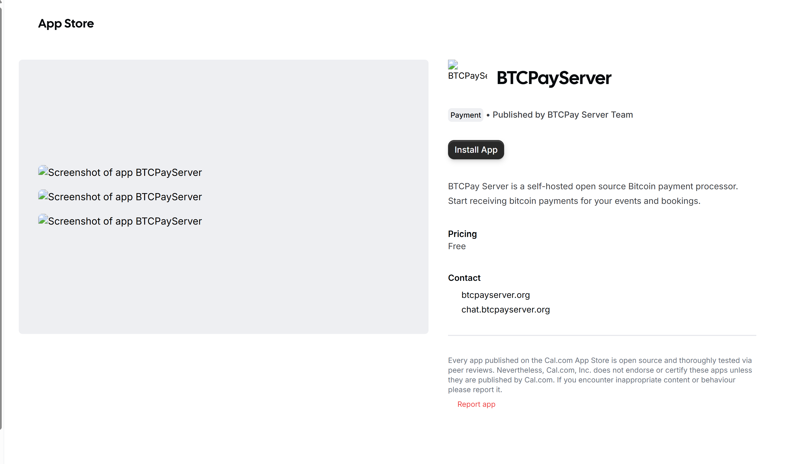

Chagua programu unayotaka kuunganisha na mfano wako wa BTCPay Server

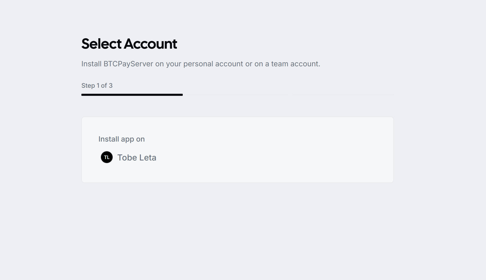

Hatua inayofuata ni kujaza vitambulisho vyako vya BTCPay. Fungua mfano wako wa BTCPay Server kwenye kichupo kipya

**URL ya BTCPay Server**: URL ya mfano wako wa BTCPay k.m. https://example.btcpay.com

**Kitambulisho cha Duka la BTCPay**: Duka unalotaka kuunganisha na Cal.com. Kwenye mfano wako wa BTCPay Server, chagua duka lililochaguliwa, bofya `Settings` kwenye usogeleaji wa kushoto, kisha utaona kitambulisho cha duka lako kikionyeshwa.

Nakili Kitambulisho cha Duka, na ujaze fomu yako ya usakinishaji wa Cal.com - BTCPay Server

**Ufunguo wa API**: Katika BTCPay yako, nenda kwa `Account` > `Manage Account` > `API Keys`

Unda ufunguo mpya wa API kwa kubofya `Generate Key`. Upe jina chini ya sehemu ya lebo k.m. BTCPay-Calcom.

Kwa ruhusa, angalia yafuatayo:
- View Invoice (btcpay.store.canviewinvoices)
- Create Invoice (btcpay.store.cancreateinvoice)
- Modify store webhook (btcpay.store.webhooks.canmodifywebhooks)

Ukimaliza, bofya `Save`. Nakili ufunguo wa API na ukamilishe fomu katika usakinishaji wa Cal.com.

Sasa kwa kuwa umejaza sehemu zote tatu, bofya kitufe cha kuunganisha ili kukamilisha usakinishaji. Mara sehemu zote zitakapothibitishwa,
funguo zako zitahifadhiwa na utaelekezwa tena kwenye ukurasa wa Cal.com.

**Tafadhali Zingatia** Mchakato huu wa usakinishaji huunda webhook katika BTCPay Server yako.

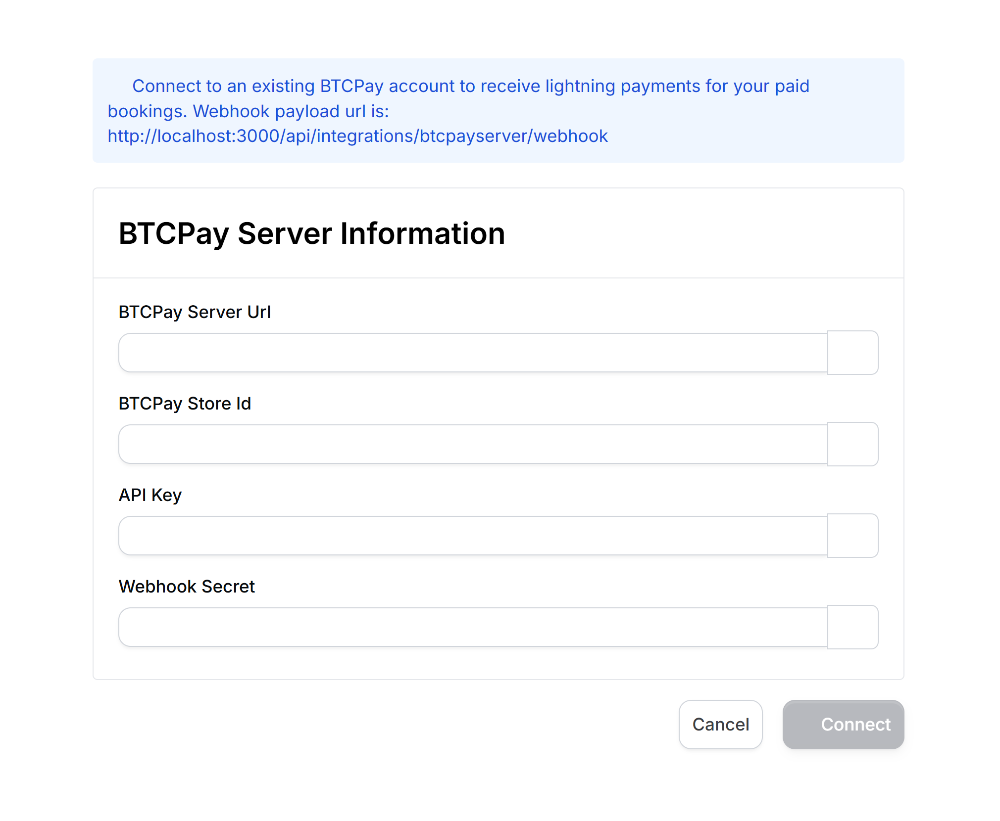

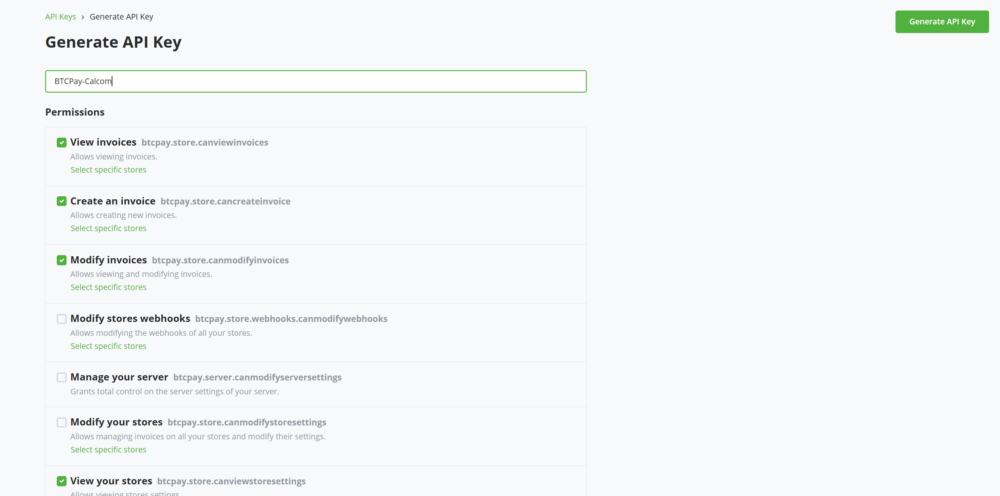

## Onyesho

Kwenye ukurasa wako wa aina ya tukio, chagua uhifadhi wowote na ubofye Edit.

Kila tukio katika Cal.com linasanidiwa kibinafsi, kwa hivyo, ikiwa unataka kupokea malipo ya Bitcoin kwa matukio yote, utahitaji kuiwezesha mikono kwa kila moja.

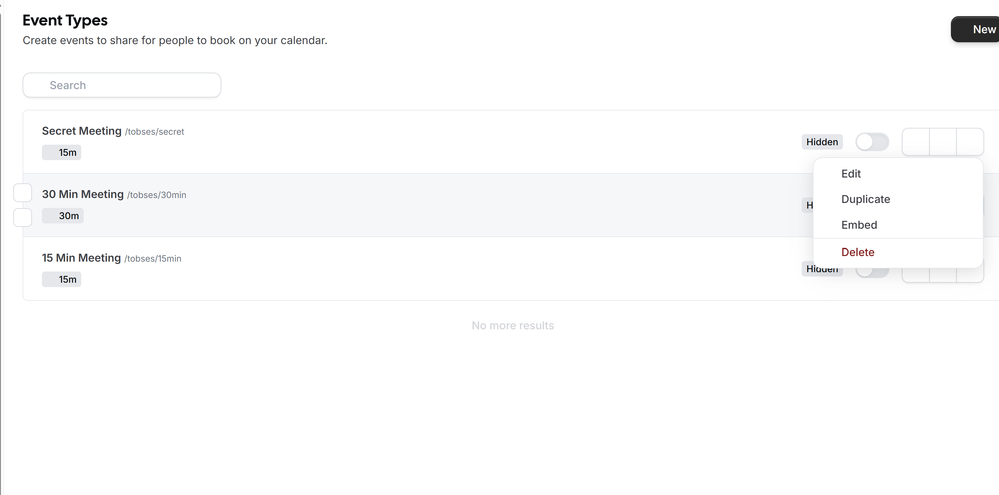

Kwenye ukurasa wa kuhariri, chagua Apps kwenye menyu, tafuta na wezesha programu ya BTCPay Server.

Chagua sarafu yako iliyochaguliwa na taja kiasi. Bofya save ukimaliza.

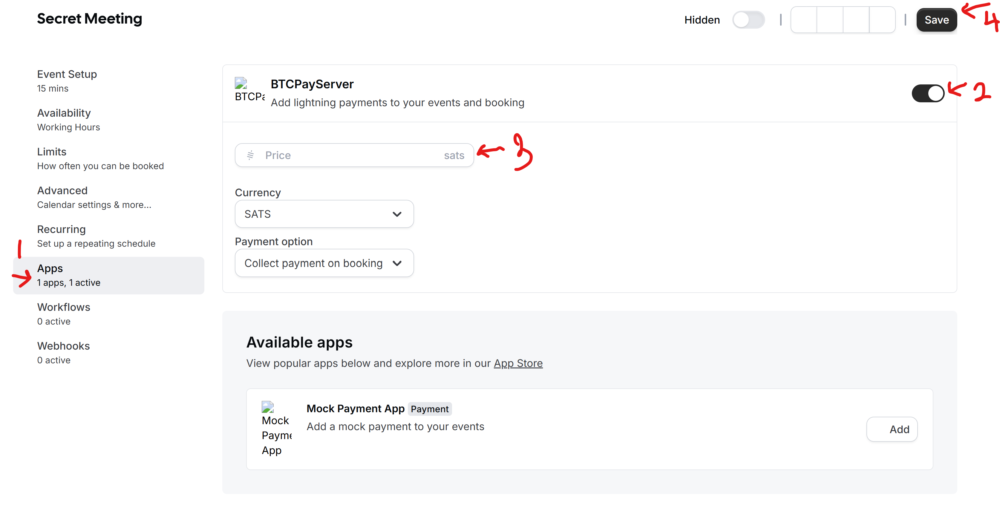

Nakili kiungo cha tukio na ufungue kwenye kichupo kipya. Chagua tarehe na wakati wako, na ubofye kitufe cha `Pay to book`.

Katika ukurasa unaofuata, utahitaji kulipa ankara ya BTCPay Server. Ankara inaonyeshwa katika iFrame, ikiwa muonekano ni mdogo sana, kuna kitufe
chini ya ukurasa wa ankara kufungua kwenye kichupo kipya, bofya juu yake na ukamilishe malipo yako.

Mara malipo yako yatakapokamilika, utaelekezwa tena kwenye ukurasa mpya ukisema kuwa mkutano wako umepangwa.

Hongera... Sasa unaweza kupokea malipo ya Bitcoin kwa uhifadhi wako.

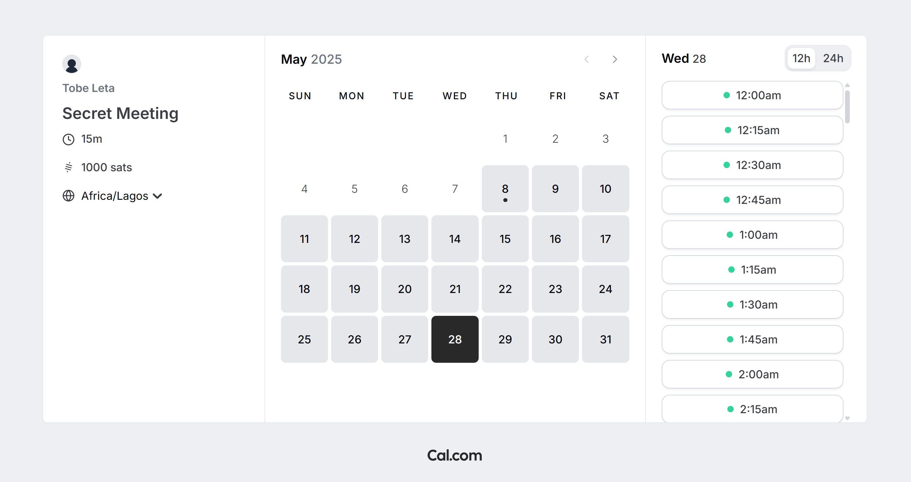

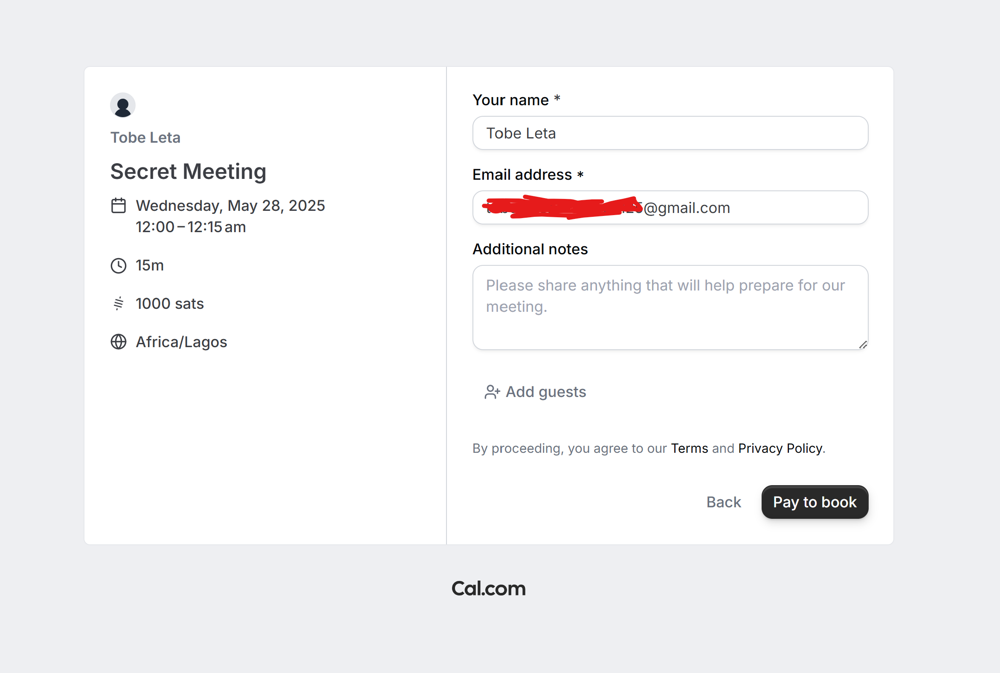

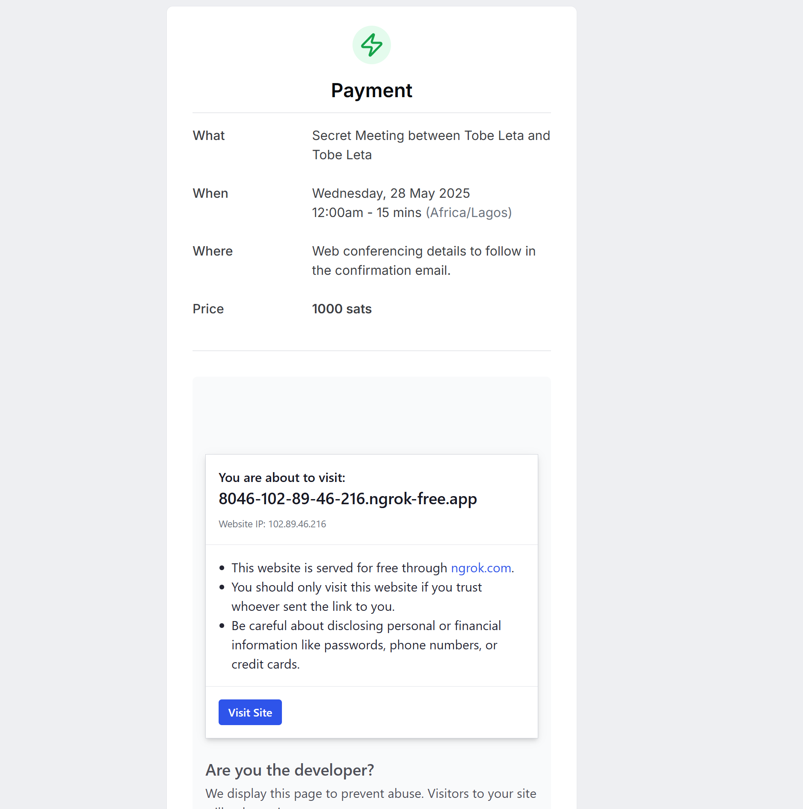

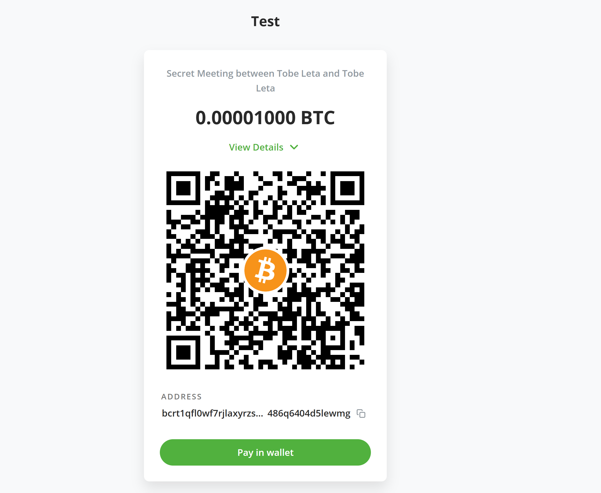

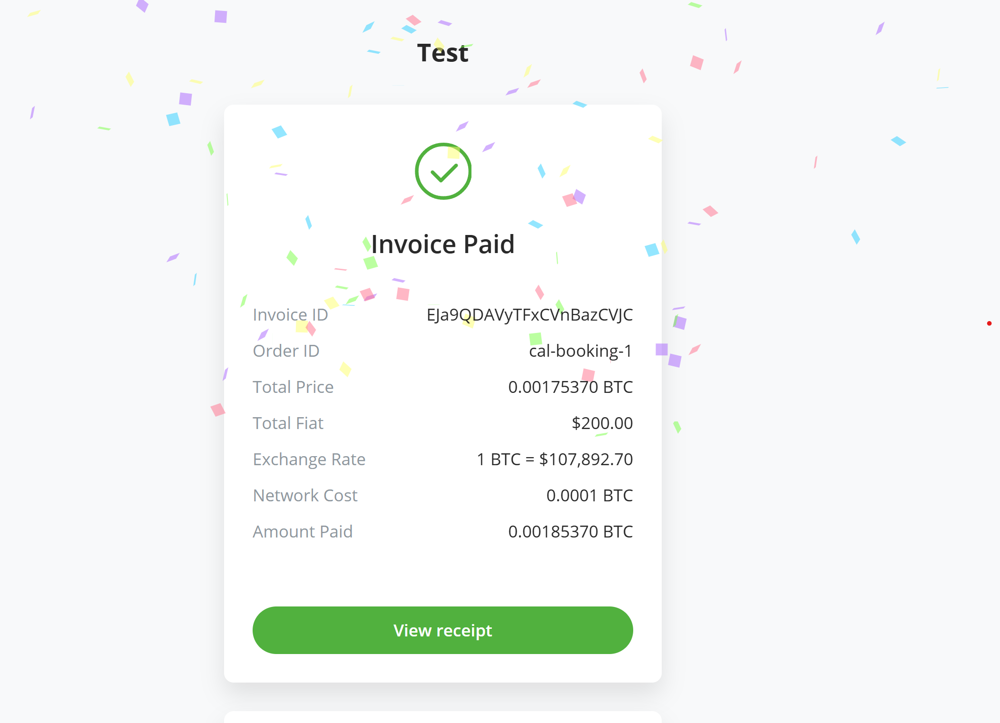

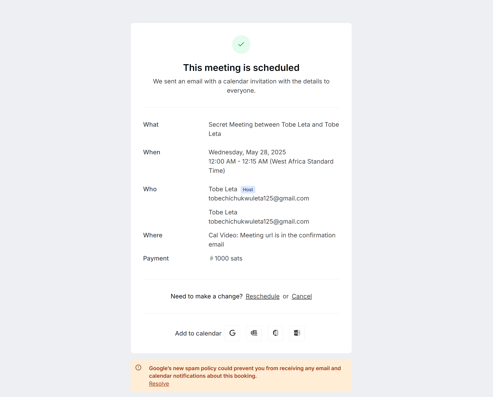

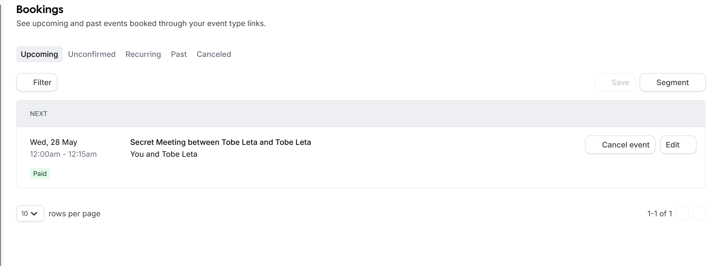

## Usaidizi na jumuiya

Jisikie huru kujiunga na kituo chetu cha usaidizi kupitia [Mattermost](https://chat.btcpayserver.org/) au [Telegram](https://t.me/btcpayserver) ikiwa unahitaji msaada au una maswali yoyote zaidi.