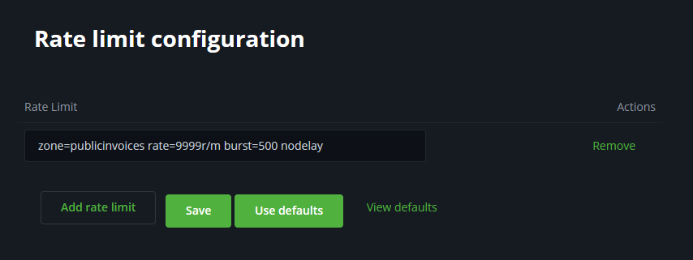

# Kuanzisha BTCPay Server kwa Mkutano / Tukio / Jumuiya ya Kienyeji

Tutapitia usanidi tulioutumia katika [Bitcoin Atlantis](https://blog.btcpayserver.org/case-study-bitcoin-atlantis/), [Bitcoin Hong Kong](https://bitcoinmagazine.com/business/case-study-enabling-bitcoin-as-a-medium-of-exchange-at-the-bitcoin-asia-conference-in-hong-kong), [Bitcoin Nashville](https://x.com/BtcpayServer/status/1856410949797683379) na mikutano mingine kwa uzoefu mzuri wa mtumiaji kwa wahudhuriaji na wafanyabiashara.

Kwa vifaa vya Point of Sale (PoS) tunatumia vifaa vya [Bitcoinize](https://bitcoinize.com/) vyenye printa ya risiti (lakini unaweza kutumia kifaa kingine chochote cha PoS chenye msingi wa Android).

Sehemu ya Mtandao wa Lightning itafanywa na [Blink.sv](https://blink.sv) kwa kutumia programu-jalizi ya Blink (lakini unaweza kuibadilisha na huduma nyingine yoyote ya LN kama Alby, Breez, tumia nodi yetu ya ndani ya LN au unganisha kwenye nodi yako mwenyewe ya LN).

Ili kuruhusu uzoefu laini zaidi kwa wahudhuriaji wasio na muunganisho wa intaneti au wasio na ujuzi wa awali wa Bitcoin tunaonyesha jinsi ya kuanzisha na kutoa Kadi za Bolt na kuruhusu watumiaji kujazia salio.

Ili kupata muhtasari wa usanidi wote na hatua unaweza kutazama warsha yetu kutoka BTCPrague 2024.

---

**Jedwali la yaliyomo**

[[toc]]

##  Usanidi wa awali
- Sanidi BTCPay Server v2.0.5 au toleo jipya zaidi kwenye VPS (yenye IP ya umma)
- Sanidi subdomain au tumia ile iliyotolewa na mwenyeji wa VPS (mf. Lunanode)
- Sajili akaunti ya msimamizi na unda duka la kwanza la majaribio
- Fanya [FastSync](https://docs.btcpayserver.org/Docker/fastsync/) (si lazima)

**Mara seva inapowashwa, sakinisha programu-jalizi hizi:**
- Programu-jalizi ya Blink
- Programu-jalizi ya Bolt Cards

Kisha anzisha upya BTCPay Server (kupitia UI au `docker restart generated_btcpayserver_1` kupitia SSH)

## Sanidi maduka ya wafanyabiashara na anzisha vifaa vya Bitcoinize

### Maandalizi ya vifaa vya Bitcoinize
- Hakikisha kiwango cha betri cha vifaa vya Bitcoinize ni 90%+ (ikiwa ni chini, chaji)
- Kamba za kuongezea umeme / vitovu vya USB vya nguvu ya juu ni muhimu wakati wa kusanidi vifaa 10+
- Weka roll ya karatasi kwenye printa ya kifaa

## Sanidi maduka ya wafanyabiashara

Ingia kwenye mfano wako wa BTCPay Server kwa akaunti yako ya msimamizi.

***Rudia hatua zifuatazo kwa kila mfanyabiashara:***

### 1. Unda duka
- Menyu kunjuzi ya juu kushoto -> kitufe cha "**Create store**"
  - **Jina**: mf. Pizza ya Nanasi ya Nakamoto
  - **Sarafu Chaguomsingi**: USD, HKD, ... kulingana na eneo
  - **Chanzo cha Bei Kinachopendelewa**: Kwa USD, EUR Kraken inapendekezwa, HKD Coingecko, kwa sarafu za kigeni zaidi unaweza kujaribu Coingecko au angalia ikiwa kuna soko la hisa la ndani lililoorodheshwa kwenye menyu kunjuzi
- Bofya kitufe cha "**Create store**"
### 2. Sanidi mkoba wa Mtandao wa Lightning
Sanidi mkoba wa Lightning kuunganishwa kwenye akaunti ya Blink ya mfanyabiashara, fuata [maagizo kwenye nyaraka za Blink](https://dev.blink.sv/examples/btcpayserver-plugin#how-to-connect).
(Kama mbadala, ikiwa wafanyabiashara wako wanataka kulipwa kwa sarafu ya ndani unaweza kusanidi akaunti ya Blink ya mkutano wako na kusambaza fedha baadaye kupitia njia za fiat)

### 3. Sanidi spread na wezesha sauti
- Bofya "**Settings**" -> "**Rates**"
- **Add Exchange Rate Spread**: weka `1`, ili tuwe na nafasi ya ziada (Blink inatoza 0.2% kwa uhimilishaji katika StableSats USD)
- Bofya kitufe cha "**Save**"
- Bofya "**Settings**" -> "**Checkout Appearance**"
- Kwenye menyu kunjuzi "**Select a preset**", chagua "**In-store**"
- Bofya kitufe cha "**Save**"

### 4. Sanidi Point of Sale (PoS)
- Utepe wa kushoto chini ya "Plugins", bofya "**Point of Sale**"
- "**App Name**": weka jina la mfanyabiashara sawa na la duka
- Bofya kitufe cha "**Create**"
- Sasa kwenye mipangilio ya PoS, hakikisha "**App Name**" na "**Display Title**" vimejazwa
- "**Choose Point of Sale Style**": chagua "**Keypad**"
- "**Currency**", chagua sarafu sawa na duka lako
- Bofya kitufe cha "**Save**"
- Juu kulia bofya kitufe cha "**View**" na uhakikishe keypad inaonyeshwa

### 5. Weka kiungo cha PoS na lebo kwenye kifaa cha Bitcoinize

- Rudi kwenye mipangilio ya PoS kwenye kivinjari chako na bofya ikoni ya "**QR-code**"
- Kwenye kifaa chako cha Bitcoinize (au kingine), fungua programu ya "**Camera**"
- Tembeza kulia hadi upate kategoria ya "**more**" -> chagua "**QR-Code**"
- Sasa chambua QR-Code iliyoonyeshwa kwenye kivinjari chako (kwenye ukurasa wa mipangilio ya PoS)
- Baada ya kuchambua fungua URL katika kivinjari cha Chrome
- Hakikisha unaona keypad na jina sahihi la mfanyabiashara
- Gonga nukta 3 "**...**" juu kulia na uchague "**Add to home**"
- Weka ikoni kwenye skrini kuu ya nyumbani kwa ufikiaji rahisi
- Bandika kifaa na sanduku kwa stika zenye jina la mfanyabiashara

***Kujaribu malipo ya kifaa cha PoS na kutoa ruhusa:***
- Anzisha ukurasa wa PoS kutoka skrini ya nyumbani
- Hakikisha sauti kwenye kifaa imepandishwa juu ili kuwe na mrejesho wa sauti wakati wa malipo, hasa ikiwa Kadi za Bolt zinatumika
- Weka 0.01 USD (au sawa na sarafu nyingine) na gonga kitufe cha "**Charge**"
- Mara ya kwanza tu kivinjari kitaomba ruhusa ya NFC, gonga kitufe ili kutoa ruhusa iliyoombwa
- Lipa ankara ama kwa Kadi ya Bolt au mkoba wa Lightning
- Hakikisha unasikia sauti baada ya malipo
- Gonga kitufe cha "**View receipt**", jaribu kuchapisha risiti kwa kuchagua **POSPrinter** kutoka kwenye menyu kunjuzi, gonga kitufe cha "**Print**"

### 6. Wape wafanyabiashara ufikiaji wa historia ya malipo (si lazima, lakini inapendekezwa)

Kwa hiari unaweza pia kuunda kuingia kwa kila duka/mfanyabiashara kwenye kifaa cha PoS ili waweze kufikia historia ya malipo. Hii inasaidia kukagua mara mbili malipo ya mwisho yalikuwa nini au ikiwa malipo tayari yamefanywa. Unaweza kufanya hivyo kwa kuongeza jukumu la "Merchant" lenye ruhusa zifuatazo:
- btcpay.store.canmodifyinvoices
- btcpay.store.canviewstoresettings
- btcpay.store.canviewpaymentrequestes
- btcpay.store.canarchivepullpayments
- btcpay.store.cancreatenonapprovedpullpayments

Baada ya hapo unda mtumiaji kwa kila duka na umpange kwenye duka sahihi.

### 7. Ongeza Vikomo vya Kiwango Ikiwa Hujawasajili Wafanyabiashara kwenye Vifaa (Si Lazima)

Kwa chaguomsingi, sehemu ya mwisho ya `create invoice` inadhibitiwa na IP kwa maombi 4 kwa dakika kwa maombi ya umma. Ikiwa unashiriki IP moja kwenye vifaa vingi vya POS, unaweza kukumbwa na matatizo ambapo ankara zaidi ya 4 haziwezi kuundwa kwa wakati mmoja wakati wa majaribio ya mkazo.

Katika [PR ya Novemba 2024](https://github.com/btcpayserver/btcpayserver/pull/6415), tulihakikisha kwamba udhibiti huu hautumiki kwa watumiaji waliosajiliwa. Kwa hivyo, ikiwa ulikamilisha **Hatua ya 6**, suala hili halitakuathiri. Hata hivyo, ikiwa unapendelea kutowasajili watumiaji kwenye kila kifaa, unaweza kuongeza kikomo cha kiwango kama ifuatavyo:

1. Nenda kwenye **Manage Plugins** kwenye mfano wako wa BTCPay Server na usakinishe programu-jalizi ya **Dynamic Rate Limit** na Kukks.
2. Nenda kwenye `/plugins/dynamicrateslimiter` (**Server Settings -> Dynamic Reports -> Rate Limits**).
3. Bofya **Add Rate Limit** na weka thamani ifuatayo: `zone=publicinvoices rate=9999r/m burst=500 nodelay`

Mabadiliko haya yanaruhusu mtu yeyote kuunda hadi ankara 9999 kwa dakika kutoka IP yoyote. Kwa sababu hii, kukamilisha **Hatua ya 6** (kuwasajili watumiaji kwenye vifaa) ndiyo njia inayopendekezwa.

## Sanidi mtoaji wa Kadi za Bolt

Tutaunda duka tofauti litakalokuwa mtoaji wa Kadi za Bolt. Ili kupata kwa urahisi kwenye orodha ya maduka unaweza kuongeza jina la duka na "z", mf. "z - Bolt Cards Provider".

Kwa duka hili maalum tutaunganisha akaunti ya Blink yenye tofauti muhimu ikilinganishwa na akaunti za Blink za wafanyabiashara:
- ufunguo wa API ni lazima uwe na pia **ruhusa ya kuandika**, vinginevyo Kadi za Bolt hazitaweza kuvuta fedha
- Hakikisha unaunganisha **mkoba wa Bitcoin** (na *si* StableSats USD)

### 1. Unda duka
- Unda duka kwa jina "**z - Bolt Cards Provider**" (hatua sawa kama zilivyoonyeshwa kwa maduka ya wafanyabiashara hapo juu)

### 2. Sanidi mkoba wa Mtandao wa Lightning

Sanidi mkoba wa Lightning kuunganishwa kwenye akaunti yako ya Blink kulingana na [maagizo kwenye nyaraka za Blink](https://dev.blink.sv/examples/btcpayserver-plugin#how-to-connect) lakini hakikisha:
- ufunguo wa API una ruhusa za "Read", "Receive" na "Write", vinginevyo Kadi za Bolt hazitaweza kuvuta fedha
- hakikisha unaunganisha kwenye **mkoba wa Bitcoin** (na *si* StableSats USD)

### 3. Sanidi malipo ya kiotomatiki

Ili kuruhusu kujazia salio la Kadi za Bolt bila mwingiliano tunahitaji kuhakikisha malipo yanachakatwa kiotomatiki.

- Nenda "**Settings**" -> "**Payout Processors**"
- Chini ya "**Automated Lightning Sender**", bofya "**Configure**"
- Wezesha "**Process approved payouts instantly**"
- Bofya kitufe cha "**Save**"

### 4. Sanidi Kiwanda cha Kadi za Bolt

#### Sanidi kiwanda cha Kadi za Bolt

- Kwenye utepe wa kushoto nenda kwenye "**Boltcard Factories**"
- "**App Name**": Weka jina kama "Mkutano wako" (litaonyeshwa wakati kadi inaposomwa)
- Bofya kitufe cha "**Create**", na utaona mipangilio ifuatayo. Kwa mfano, ikiwa unataka kujazia kadi Sats 210, weka yafuatayo:
  - "**Name**": Jina la mkutano/tukio linaloonyeshwa wakati Kadi ya Bolt inaposomwa
  - "**Amount**": 210
  - "**Currency**": SATS (Sarafu ni lazima iwe **SATS**, usiweke sarafu nyingine yoyote)
  - "**Automatically approve claims**": imewekwa alama (kweli)
  - "**Payment Methods**": "BTC (Off-Chain)" imewekwa alama (kweli)
  -  Bofya kitufe cha "**Save**"

#### Panga Kadi za Bolt

Bado, kwenye ukurasa huo wa mipangilio ya Kiwanda cha Kadi za Bolt, sasa bofya kitufe cha "**View**" juu kulia, ukurasa utakaofunguka utahitaji kufunguliwa kwenye kifaa cha mkononi chenye usaidizi wa kuandika NFC (mf. kifaa cha Bitcoinize).

- Hakikisha una [Bolt Card NFC Card Creator](https://play.google.com/store/apps/details?id=com.lightningnfcapp&hl=en&gl=US) imesakinishwa kwenye kifaa cha mkononi
- Ikiwa tayari kuna programu ya Bolt Card NFC Card Creator imesakinishwa - ***hakikisha ni toleo jipya zaidi***, kwa hiari ondoa na usakinishe toleo jipya zaidi kutoka duka la programu
- Unapobofya kitufe cha "**Setup**" kwenye Kiwanda cha Kadi za Bolt inapaswa kufungua programu ya Bolt Card NFC Card Creator
- Hakikisha unashikilia Kadi ya Bolt ***hadi alama ZOTE za kijani za kuteua zimekamilika**
- Sasa unaweza kuanzisha kadi nyingi kwa pamoja. Bonyeza tu kitufe cha "**Write again**"

### 5. Kuangalia salio la kadi na kuzijazia

Katika duka lile lile linalotumika kama mtoaji wa Kadi za Bolt utakuwa na kipengee cha menyu cha "**Boltcard Balance**" kwenye utepe wa kushoto. URL itaonekana kama hii [https://btcpay.yourdomain.tld/boltcards/balance](https://btcpay.yourdomain.tld/boltcards/balance)

Unapofungua kiungo hicho kwenye kifaa cha mkononi chenye usaidizi wa NFC (kama vile Bitcoinize), unaweza kukitumia kuruhusu watumiaji kuangalia salio lao na pia kujazia kadi zao Sats, ili kufanya hivyo, gonga ikoni ya "**QR-Code**" baada ya kusoma salio la kadi.

### 6. Kuweka upya Kadi za Bolt baada ya mkutano/tukio

Kama ukurasa wa salio, unaweza kupata kiungo kwenye utepe wa kushoto. URL itaonekana kama hii [https://btcpay.yourdomain.tld/boltcards/balance?view=Reset](https://btcpay.yourdomain.tld/boltcards/balance?view=Reset)

Unapaswa kufikiria kuchapisha kiungo hiki wakati au hata kabla ya tukio na kuruhusu wahudhuriaji kufuta na kuweka upya kadi zao baada ya tukio, ili waweze kutumia tena Kadi za Bolt na kuzipanga upya. Hii inawezekana tu baada ya kuweka upya kufanyika kwa mafanikio.

Ili kuweka upya Kadi za Bolt, kama ilivyo kwa kuzisanidi, unahitaji programu ya Bolt Card NFC Card Creator.

Tazama [tweet hii ya Uncle Rockstar Dev](https://x.com/r0ckstardev/status/1767618114139639817) jinsi maagizo yanavyoweza kuonekana.

Hongera, sasa umeanzisha BTCPay Server kwa mkutano au tukio lenye uzoefu laini wa mtumiaji kwa wahudhuriaji na wafanyabiashara. Furahia tukio!
