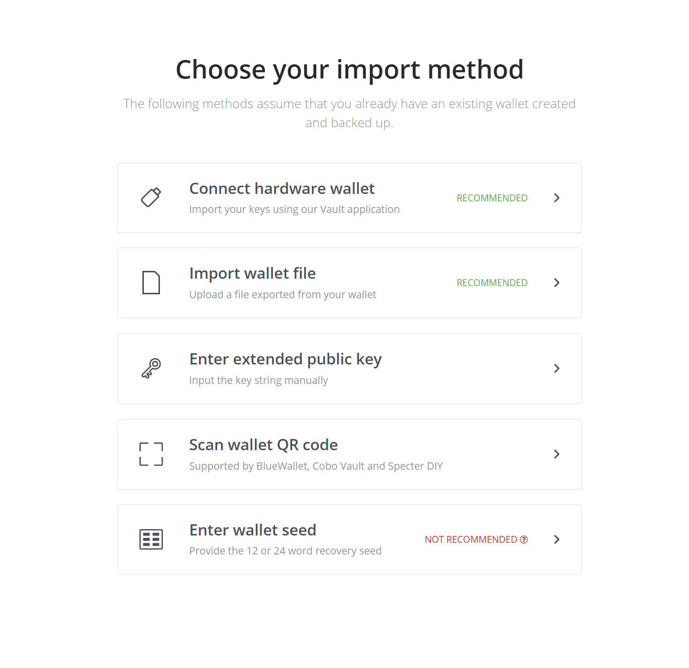

# Unganisha pochi iliyokuwepo

Kwa kutumia pochi iliyokuwepo, unaweza kupokea malipo kwenye pochi ya nje, bila BTCPay Server kujua funguo ya siri ya pochi hiyo. Kama mshambuliaji mwenye nia mbaya angeweza kuingia kwenye seva yako na kupata xpub, angeweza kuona historia ya miamala yako, lakini hawezi kufikia fedha.

- [Unganisha pochi ya maunzi (Inapendekezwa)](#unganisha-pochi-ya-maunzi)
- [Tengeneza faili ya pochi (Inapendekezwa)](#tengeneza-faili-ya-pochi)
- [Weka funguo ya umma iliyopanuliwa](#weka-funguo-ya-umma-iliyopanuliwa)
- [Skana QR code ya pochi](#skana-qr-code-ya-pochi)
- [Weka seed ya pochi (Haipendekezwi)](#weka-seed-ya-pochi)

### Unganisha pochi ya maunzi

Pochi za maunzi hutoa usawa mzuri kati ya usalama na urahisi wa matumizi. Kama tayari una pochi ya maunzi iliyosanidiwa, unaweza kuitumia kwa urahisi na BTCPay Server yako. Shukrani kwa [ushirikiano wa pochi ya maunzi](/HardwareWalletIntegration/) uliojengewa ndani, funguo ya xpub kutoka kwenye pochi ya maunzi huongezwa kiotomatiki kwenye BTCPay Server yako. Ushirikiano huo pia hukuruhusu kutumia fedha zinazopokelewa kwenye duka lako ndani ya [pochi ya ndani ya BTCPay](/Wallet/).

:::tip
Kama unamiliki pochi ya maunzi, fuata maelekezo ya jinsi ya [kutumia pochi ya maunzi iliyokuwepo na BTCPay Server yako](/HardwareWalletIntegration/)
:::

### Tengeneza faili ya pochi

Kutumia pochi ya programu iliyokuwepo kunachukulia kuwa tayari una pochi ya nje iliyoundwa na kuwekwa akiba. Kwa nadharia, pochi yoyote ya simu/desktop inayotoa funguo ya umma iliyopanuliwa inapaswa kufanya kazi, hata hivyo, pochi nyingi zina vikwazo vya kiufundi [(kikomo cha pengo)](/FAQ/Wallet/#missing-payments-in-my-software-or-hardware-wallet) vinavyoweza kusababisha matatizo makubwa ya uzoefu wa mtumiaji kwako baadaye.

Kwa sababu hiyo, tunapendekeza utumie pochi za programu zilizoorodheshwa hapa chini tu.

- [Pochi ya Electrum](/ElectrumWallet/)
- [Pochi ya Wasabi](/WasabiWallet/)

Bonyeza viungo vilivyo hapo juu na utaelekezwa kwenye mafunzo ya hatua kwa hatua ya jinsi ya kusanidi kila pochi mahususi ya programu na BTCPay Server.

Ili kutumia na kudhibiti fedha zinazopokelewa kwenye pochi yako ya programu ya nje, unaweza kutumia [Pochi ya ndani ya BTCPay](/Wallet/) na kusaini miamala na funguo yako ya siri au kudhibiti fedha hizo katika pochi hiyo ya nje yenyewe.

### Weka funguo ya umma iliyopanuliwa

Chaguo hili linaweza kuwa na manufaa kama ungependa kurekebisha [anwani za pochi za urithi](/FAQ/General/#what-if-i-have-a-problem-paying-an-invoice) au kama aina ya pochi yako haiendani na Ushirikiano wa Pochi ya Maunzi (Vault).

Njia hii inahitaji usanidi wa muunganisho wa pochi yako kwa mikono na inapaswa kutumika tu kama una ufahamu mzuri wa funguo za umma zilizopanuliwa za pochi, njia za funguo za akaunti, na alama kuu za kidole (master fingerprints).

### Skana QR code ya pochi

Pochi nyingine hukuruhusu kuunda pochi na kupeleka nje funguo ya umma iliyopanuliwa (xPub) kwa kutumia QR Code. Unaweza kuunganisha BTCPay Server yako kwa aina hizi za pochi kwa urahisi na chaguo la skana QR code. Suala la kawaida la [(kikomo cha pengo)](/FAQ/Wallet/#missing-payments-in-my-software-or-hardware-wallet) linaelekea kutokea kwa kutumia xPub yoyote, isipokuwa mtoaji wa pochi ana njia ya kurekebisha.

Ili kutumia na kudhibiti fedha katika [Pochi yako ya ndani ya BTCPay](/Wallet/) utahitaji kutoa funguo ya siri (inayotumika kutengeneza QR Code ya xpub) wakati wa kusaini miamala au kwa njia nyepesi kupokea fedha kupitia BTCPay yako na kudhibiti fedha katika pochi ya nje.

### Weka seed ya pochi

Chaguo hili ni muhimu kama huna **njia nyingine** ya kutumia fedha katika pochi fulani. Kama pochi ya altcoin ambayo hapo awali iliendana na ushirikiano wa pochi ya maunzi lakini haionani tena. Kwa ujumla, haupaswi kuweka maneno ya seed ya pochi kwenye kifaa chochote kilichounganishwa kwenye mtandao.

Njia hii inahitaji usanidi wa muunganisho wa pochi yako kwa mikono na inapaswa kutumika tu kama una ufahamu mzuri wa miundo ya pochi, funguo za umma zilizopanuliwa, njia za funguo za akaunti, na alama kuu za kidole.