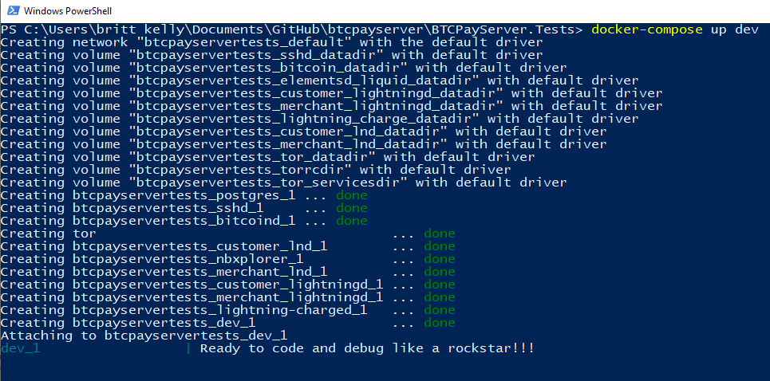
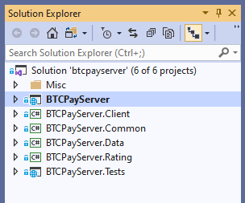
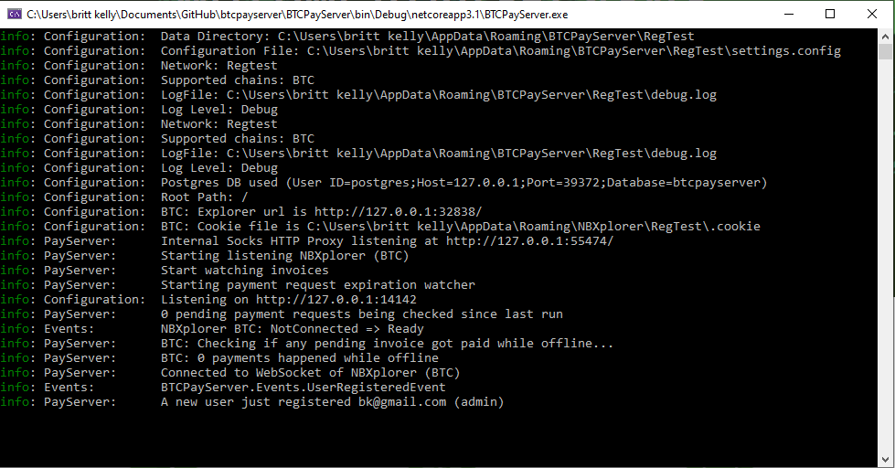
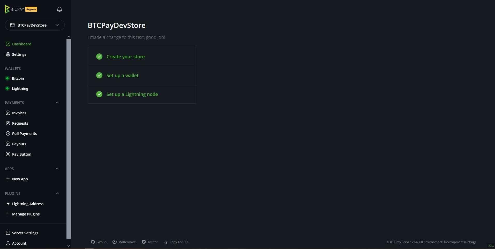
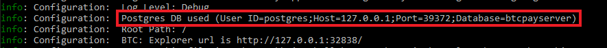
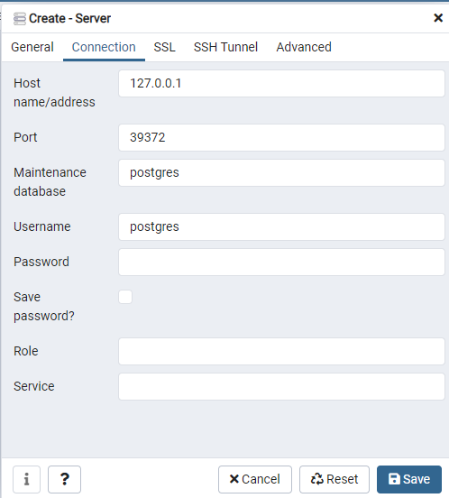
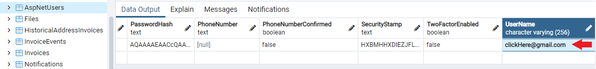

# Sanidi Mazingira ya Msanidi Programu

[[toc]]

Mwongozo huu utakusaidia kusanidi mazingira yako ya msanidi programu ili kukutayarisha kwa michango ya baadaye kwenye hifadhi za BTCPay Server. Zana mbalimbali za wanaoanza zinatumika katika mwongozo hapa chini kukusaidia kuanza na utengenezaji programu. Mara unapoelewa mchakato wa jumla wa usanidi, jisikie huru kutumia zana zozote unazopenda.

Ikiwa unatafuta jinsi ya kufanya mabadiliko rahisi ya msimbo kama vile kurekebisha typo au mabadiliko ya maandishi, angalia mafunzo rahisi ya [Andika Programu](./WriteSoftware.md) badala yake. Ikiwa wewe ni msanidi programu mwenye uzoefu na tayari una mazingira ya ndani yaliyosanidiwa kwa ajili ya utengenezaji programu, unaweza kuruka mbele hadi nyaraka za [Utengenezaji Programu wa Ndani](/Development/LocalDevelopment.md).

## Nyenzo za Msanidi Programu

- [Nyaraka za Github](https://docs.github.com/)
- [Amri na Dhana za BTCPay](/Development/LocalDevelopment.md)
- [Video za Usanidi wa Mazingira (Linux, Mac, Windows)](/Development/LocalDevelopment.md#videos)

## Programu za Usanidi wa Windows

Programu za kusakinisha ili kufuata mwongozo huu:

1.  [Visual Studio Toleo la Jamii](https://visualstudio.microsoft.com/downloads/)
1.  [.NET Core SDK 10.0+](https://dotnet.microsoft.com/en-us/download/dotnet/10.0)
1.  [Docker Desktop](https://www.docker.com/products/docker-desktop)
1.  PowerShell (imejumuishwa katika Windows OS)
1.  [GitBash](https://gitforwindows.org/)
1.  [GitHub Desktop](https://desktop.github.com/)
1.  [Akaunti ya www.Github.com](https://github.com/) (jiandikishe)

Kumbuka: _Mwongozo huu unadhani usakinishaji katika maeneo ya msingi. Zingatia ikiwa una muundo tofauti wa saraka za faili._

## Usanidi wa Git

### Gawanya Hifadhi ya BTCPay Server

- Fungua kivinjari cha wavuti na ingia kwenye akaunti yako ya www.Github.com.
- Nenda kwenye [Hifadhi ya BTCPay Server](https://github.com/btcpayserver/btcpayserver) na bonyeza kitufe cha `Fork` ili kuunda nakala yako mwenyewe ya hifadhi ya BTCPay Server kwenye Github.
- Kisha fungua Github Desktop na ingia ili Github Desktop ijue kuhusu akaunti yako ya www.Github.com na kuunganishwa nayo.

### Nakili Hifadhi ya BTCPay Server

- Katika GitHub Desktop, tumia kitufe cha `Add` na uone chaguo la kunakili hifadhi.
- Ikiwa unatumia hati za kuingia zako za www.Github.com katika GitHub Desktop, utaona hifadhi yako ya BTCPay Server uliyogawanya hivi punde kwenye www.Github.com. Ichague na uzingatie njia ya ndani iliyoonyeshwa hapa chini. (kwa msingi itakuwa kitu kama `C:\Users\SatoshisComputer\Documents\GitHub\btcpayserver` kwa uwazi, tuite: _njia yetu ya ndani ya nakala_) kisha bonyeza nakili.
- Sasa utaona hifadhi ya BTCPay Server imenakiliwa katika GitHub Desktop yako na utakuwa kwenye _tawi la master_.

### Unda Tawi la Kipengele cha Utengenezaji Programu

- Kisha tutafanya mazoezi ya kufanya kazi na hifadhi yetu ya BTCPay Server tuliyonakili hivi punde kwenye kompyuta yetu kwa kutumia Github Desktop.
- Wakati wa kutengeneza programu, unaweza kutaka kufanya kazi kwenye vipengele tofauti kwa wakati mmoja. Ili kufanya hivyo, kwa kawaida tunataka kuunda matawi mengi ya vipengele badala ya kufanya mabadiliko yote kwenye tawi la master.
- Tunatumia GitBash na baadhi ya amri za Git, kwa hivyo fungua GitBash. (Ikiwa unapendelea kutumia GitHub desktop pekee badala ya GitBash, unaweza kuunda matawi huko badala yake.)
- Mara tu unapokuwa na terminal ya GitBash iliyofunguliwa, tunahitaji kubadilisha saraka hadi kwenye nakala yetu ya hifadhi ya BTCPay Server.
- Ili kufanya hivyo, nenda kwenye _njia yetu ya ndani ya nakala_ kwa amri ya kubadilisha saraka: `$ cd Documents/Github/btcpayserver`
- Unaweza kuona nakala yako ya BTCPay Server iko kwenye tawi linaloitwa `master`
- Tengeneza nakala ya tawi lako la master ili kufanya baadhi ya utengenezaji programu juu yake, kwa amri: `$ git branch OurNewDevelopmentBranch`
- Hebu tuangalie matawi yote tuliyo nayo sasa, kwa amri: `$ git branch` unaweza kuona tuna master na OurNewDevelopmentBranch
- Katika Git, sasa tuna nakala ya hifadhi yetu ya BTCPay Server iliyogawanywa (nakala yetu). Tunapotaka kubadilisha kati ya matawi (nakala za nakala yetu), tunahitaji kuiambia Git ni tawi gani mabadiliko yetu ya msimbo wa utengenezaji programu yanapaswa kupewa. Tunafanya hivi kwa kuangalia tawi letu, kwa amri: `$ git checkout OurNewDevelopmentBranch`
- Sasa uko kwenye OurNewDevelopmentBranch katika GitBash.
- Fungua GitHub Desktop yako na unaweza kuona hauko tena kwenye master na sasa uko kwenye `OurNewDevelopmentBranch`
- Katika orodha ya juu katika Github Desktop bonyeza: `Repository > Show In Explorer` ili kuona eneo la faili.

## Usanidi wa Ndani wa BTCPay

### Usanidi wa Mtandao wa Bitcoin Regtest

- Kwa hatua inayofuata hakikisha kuwa Docker-Compose imesakinishwa (imejumuishwa na Docker Desktop). Fungua terminal ya PowerShell na uende kwenye _njia yetu ya ndani ya nakala_ na kuingia kwenye saraka ya BTCPayServer.Tests kwa amri: `$ cd Documents/Github/btcpayserver/BTCPayServer.Tests`
- Mradi wa BTCPay Server.Tests una faili za docker zinazohitajika kuendesha amri zetu za docker ambazo zitaanzisha tegemezi zote za mradi na kuunda mtandao wa ndani wa Regtest.
- Katika Powershell, anzisha huduma za docker kwa amri: `docker-compose up dev` (lazima uwe katika BTCPay Server.Tests kuendesha amri hii).
- Katika terminal yako ya PowerShell utaona kwanza picha za docker muhimu zikivutwa, kisha kontena zikijengwa. Ikiwa mjengo umefanikiwa kontena zote zitaonyeshwa zimekamilika.



### Jenga BTCPay Server ya Ndani katika Hali ya Kivinjari

Ikiwa hutaki kufanya utengenezaji wowote wa msimbo na unataka tu kuunda BTCPay Server ya ndani kwa ajili ya kupima vipengele kwenye kiolesura, unaweza kuanzisha BTCPay ya ndani kutoka kwa mstari wa amri.

Baada ya kujenga [mtandao wako wa regtest](#bitcoin-regtest-network-setup), nenda kwenye saraka yako ya `btcpayserver\BTCPayServer` na tumia amri ifuatayo:

```bash
dotnet run --launch-profile Bitcoin
```

Fungua kivinjari kipya na tembelea: [http://127.0.0.1:14142](http://127.0.0.1:14142)

### Usanidi wa Visual Studio

- Fungua kichunguzi cha faili kwenye folda ya hifadhi ya BTCPay Server. Bila kufungua folda zozote zilizoonyeshwa, tafuta kipengee cha `btcpayserver.sln` na ubonyeze kulia `Open with > Visual Studio`. Unaweza kuhitaji kuchagua Open with > Choose another app ... na kutafuta Visual Studio ikiwa hujawahi kufungua aina hii ya faili hapo awali.
- Ili kupata Visual Studio yako iliyosanidiwa chagua `View > Solution Explorer` kutoka kwenye orodha ya juu. Katika kichunguzi hiki cha suluhisho utaona faili na folda zote za BTCPay Server.
- Mradi wa juu ni BTCPay Server, hakikisha umeandikwa kwa herufi nzito. Ikiwa sio, bonyeza kulia juu yake na uchague Set as StartUp Project.
- Visual Studio yako sasa imesanidiwa na iko tayari.



### Jenga BTCPay Server ya Ndani katika Hali ya Utatuzi

- Rudi kwenye Visual Studio, bonyeza: `Build > Build Solution`
- Katika dirisha la matokeo, mjengo uliofanikiwa utaonekana kitu kama hiki: `========== Build: 6 succeeded, 0 failed, 0 up-to-date, 0 skipped ==========`
- Kisha bonyeza `Debug > Start Debugging`
- Kwanza koni ya utatuzi ya Visual Studio itafunguliwa ambayo inaonyesha taarifa kuhusu hali ya BTCPay Server yako ya ndani.
- Kisha BTCPay Server ya ndani itaundwa katika kivinjari cha wavuti, ikionyesha kwenye ukurasa wa nyumbani kuwa iko katika hali ya `REGTEST`.
- Sasa utakuwa na madirisha matatu ya kutazama: kipindi cha kivinjari cha BTCPay Server, koni yetu ya utatuzi ya Visual Studio na terminal yetu ya powershell ya BTCPay Server.Tests.
- Jiandikishe mtumiaji mpya katika BTCPay Server yako na uone tukio la usajili likionyeshwa katika koni yako ya utatuzi ya Visual Studio.





### Angalia Mabadiliko ya Msimbo ya Visual Studio Katika BTCPay Server Yako ya Ndani

- Fanya mabadiliko kwenye msimbo katika Visual Studio (Mfano: rekebisha maandishi `This store is ready to accept transactions, good job!` katika faili ya `~\BTCPayServer\Views\UIStores\Dashboard.cshtml`)
- Sasisha ukurasa ili kuona mabadiliko yako ya maandishi kwenye ukurasa wa nyumbani.
- Baadhi ya mabadiliko ya msimbo yanahitaji kuanzisha upya Utatuzi ili mabadiliko yaanze kutumika.
- Ongeza vituo vya kuchungulia katika Visual Studio na uone vituo hivyo vya kuchungulia vikiguswa unapojaribu kutumia kipengele katika mfano wako wa ndani wa BTCPay Server.

## Utunzaji wa Git

### Sawazisha Hifadhi ya BTCPay Server Iliyogawanywa

- Kwa wachangiaji wengi wakiongeza mabadiliko ya msimbo kwenye Hifadhi Kuu ya BTCPay Server, wakati mwingine nakala yako iliyogawanywa inaweza kuwa nyuma, isipokuwa uunganishe mabadiliko mapya kwenye mgawanyiko wako.
- Ukienda kwenye Mgawanyiko wako wa BTCPay Server kwenye www.Github.com utaona ujumbe ukisema kuwa tawi lako liko nyuma kwa baadhi ya ahadi. Mfano: `This branch is 32 commits behind btcpayserver:master`.
- Ili kusasisha, unaweza kutumia GitBash au tumia tu Github Desktop kwa kubonyeza kupitia vidokezo vya usawazishaji.
- Fungua terminal ya GitBash na usasishe hifadhi yako ya BTCPay Server kwa amri zifuatazo.
- Kwanza daima nenda kwenye _njia yetu ya ndani ya nakala_ kwa amri: `$ cd Documents/Github/btcpayserver` na hakikisha uko kwenye tawi la `master`.

```bash
$ git fetch upstream
$ git merge upstream/master
$ git commit -m <SomeCommitMessage>

Message prompt: ...your branch is ahead of origin master by "X" commits... use git push to publish...

$ git add .
$ git push origin master
```

Ikiwa utaona hitilafu `fatal: 'upstream' does not appear to be a git repository` wakati wa kuendesha `$ git fetch upstream`, lazima kwanza usanidi remote inayoelekeza kwenye hifadhi ya upstream katika Git. Hiyo inahitajika mara moja tu. Tumia tu amri ifuatayo ukiwa kwenye _njia yetu ya ndani ya nakala_.

```bash
$ git remote add upstream https://github.com/btcpayserver/btcpayserver.git

# check if the upstream repo is added successfully
$ git remote -v

# you should see something like this:
origin	YOUR_FORKED_GITHUB_REPO (fetch)
origin	YOUR_FORKED_GITHUB_REPO (push)
upstream	https://github.com/btcpayserver/btcpayserver.git (fetch)
upstream	https://github.com/btcpayserver/btcpayserver.git (push)
```

### Ahidi Msimbo Ili Kutengeneza Ombi la Kuvuta

- Baada ya kufanya baadhi ya mabadiliko ya msimbo kwenye tawi la kipengele (Mfano: Tawi la kipengele linaloitwa `Fix/BugBranch`) na unataka kutengeneza Ombi la Kuvuta kwenye Hifadhi ya BTCPay Server. Fungua terminal ya GitBash na uende kwenye _njia yetu ya ndani ya nakala_ kwa amri: `$ cd Documents/Github/btcpayserver` na hakikisha uko kwenye **tawi sahihi** unalotaka kuahidi na tumia git status kuangalia faili zilizobadilishwa ni zile unazotaka kuahidi.

```bash
$ git status
$ git add .
$ git commit

Text Editor appears to add your commit message...
Example Commit Message: Fix bug for update button

Accept Changes: Ctrl + x
Save Changes: Shift + y
Close Editor with: Enter

$ git push origin Fix/BugBranch
```

Angalia tawi lako jipya limeundwa kwenye Mgawanyiko wako wa BTCPay Server wa www.Github.com, kagua mabadiliko na unda Ombi la Kuvuta.

### Unda Tawi la Ombi la Kuvuta

Njia nzuri ya kuchangia bila kulazimika kuwa msanidi programu mwenye uzoefu ni kwa kupima maombi ya kuvuta ya wachangiaji wengine. Upimaji wa mwongozo ni njia nzuri ya kusaidia wengine na kuhakikisha kuwa mabadiliko ya msimbo ya BTCPay Server yanafanya kazi vizuri. Hapa kuna mfano wa jinsi ya kutengeneza tawi la ombi la kuvuta la mtu mwingine, kwa kutumia Ombi hili la awali la Kuvuta la PoS https://github.com/btcpayserver/btcpayserver/pull/454. Fungua terminal ya GitBash na uende kwenye _njia yetu ya ndani ya nakala_ kwa amri: `$ cd Documents/Github/btcpayserver` na tumia `git status` kuangalia kuwa huna ahadi nyingine zozote zilizopangwa (git status iko safi).

```bash
$ git status
$ git fetch upstream pull/454/head:pos-new-design
$ git branch (to your new testing branch called pos-new-design)
```

Kumbuka: Hakikisha unabadilisha nambari ya ombi la kuvuta /454/ hadi nambari ya lile unalotaka kulipima. Kwa kawaida unaweza kuacha /head: kama ilivyo, na ongeza jina la tawi la ombi la kuvuta baada yake.

### Futa Tawi la Ndani

Ikiwa utafuta tawi kwenye hifadhi yako ya BTCPay iliyogawanywa kwenye Github.com, nakala yako ya ndani kwenye mashine yako bado itabaki, isipokuwa uifute:

```bash
$ git checkout master
$ git branch -D <branch name>
```

Kumbuka: Huwezi kufuta tawi ikiwa umeiangalia, kwa hivyo angalia tawi lingine kama `master` kwanza, kama ilivyoonyeshwa katika mfano hapo juu.

## Kufanya Kazi na Kontena za Docker

Ikiwa unataka kutumia Amri za Docker wakati wa kutengeneza programu ndani, unaweza kuendesha amri zifuatazo katika saraka ya `BTCPayServer.Tests`.

- Onyesha kontena zinazoendesha `docker ps`
- Onyesha kumbukumbu za kontena `docker ps logs <container>`
- Anzisha kontena za Docker `docker-compose up dev`
- Simamisha kontena za Docker `docker-compose down`
- Haribu kontena za Docker `docker-compoose down --v`

## Utengenezaji wa API ya Greenfield

API ya BTCPay Greenfield [inatengenezwa kwa sasa](../../FAQ/General.md#how-can-i-use-the-btcpay-server-api). Unaweza kupata [mfano wa matumizi hapa](../../Development/GreenFieldExample.md). [Nyaraka rasmi za kumbukumbu za API ya Greenfield](https://docs.btcpayserver.org/API/Greenfield/v1/) zinapatikana kwa wasanidi programu wanaotaka kutengeneza programu kwa kutumia API ya BTCPay REST.

Wasanidi programu ambao wangependa kuchangia kwenye API ya Greenfield wanapaswa kufuata [mwongozo wa wasanidi programu](https://github.com/btcpayserver/btcpayserver/blob/master/docs/greenfield-development.md) unaotumiwa na mradi wa BTCPay kwa nyongeza au marekebisho. Ikiwa unahisi mwongozo huu hauko wazi, fikiria kujadili mawazo yako katika mazungumzo ya jamii (kituo cha utengenezaji programu) au [fungua suala la github](https://github.com/btcpayserver/btcpayserver/issues/new/choose) kujadili mawazo ya utekelezaji wa mwisho.

## Kufanya Kazi na Hifadhidata

BTCPay inatumia hifadhidata ya PostgreSQL kwa msingi. Wakati wa utengenezaji programu unaweza kuunganishwa nayo kwa urahisi. Hii inasaidia ikiwa unataka kuona jinsi data inavyohifadhiwa, kurekebisha rekodi au kuitumia kupata masuala wakati wa utengenezaji programu. Unaweza kutumia zana ya bure [PgAdmin4](https://www.pgadmin.org/download/) kufanya hivi.

Anzisha BTCPay yako katika mazingira yako ya ndani na angalia koni yako ya utatuzi ili kupata maelezo yako ya uunganisho wa hifadhidata:



Kisha, fungua PgAdmin yako na uchague: `Servers > Create > Server...` kuunganisha kwenye seva yako. Toa jina kwa seva yako na toa maelezo yako ya uunganisho wa host kutoka kwenye koni yako ya utatuzi ya Visual Studio:



Hifadhi ili kuunganisha kwenye hifadhidata yako ya utengenezaji programu ya btcpayserver. Katika hifadhidata ya btcpayserver tafuta: `Schemas > public > Tables` ili kuona majedwali yaliyo na data ya BTCPay Server.

Kama mfano, unaweza kuona watumiaji wote waliojiandikisha kwenye BTCPay yako ya utengenezaji programu kwa kuangalia safu za jedwali la `AspNetUsers`. Jaribu kubadilisha jina la mtumiaji la mtumiaji aliyejiandikisha kwenye hifadhidata, kisha `Save Changes` na `Refresh (F5)`. Sasa ingia kwenye BTCPay yako kwa kutumia jina jipya la mtumiaji na nenosiri la awali.



## Maswali

Ikiwa una maswali kuhusu usanidi wa utengenezaji programu wa ndani wa BTCPay Server, unaweza kujiunga na [mazungumzo ya jamii](https://chat.btcpayserver.org/). Ikiwa una maswali kuhusu zana au amri nyingine yoyote, n.k. kuna uwezekano unaweza kupata majibu kwa maswali yako kwa kufanya utafutaji kwenye mtandao au kwenye [StackOverflow](https://stackoverflow.com/).
