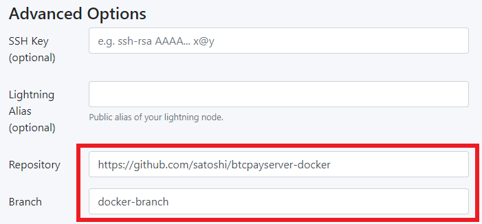
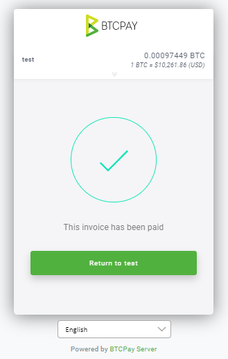

# Kupima BTCPay Server

Kupima programu ni njia nzuri ya kuchangia mradi. Kuna njia nyingi tofauti ambazo mtu anaweza _kupima_ programu. Watumiaji wanaopima kwa mwongozo (QA) programu na vipengele ili kutoa uzoefu wa mtumiaji, maoni au mende kwa wasanidi programu na wabunifu wa mradi daima wanathaminiwa.

Kwa kuwa programu ni ya chanzo wazi, mtu yeyote anaweza kupima na kukagua msimbo. Baadhi ya wafanyabiashara au watumiaji wengine wa kiufundi wanaweza kutaka kuthibitisha vipengele vipya au vilivyopo kwa kupima programu wenyewe. Wasanidi programu wanaofanya kazi kwenye msimbo wanaweza pia kufaidika kwa kuelewa jinsi ya kupima kwa mwongozo vitendo fulani katika BTCPay.

Mwongozo huu utakuonyesha jinsi ya kupima kwa mwongozo baadhi ya vipengele vya kawaida vya BTCPay na unadhani tayari una [Mazingira yako ya Utengenezaji Programu wa Ndani](./DevCode.md) yaliyosanidiwa. Mara unapoelewa vitendo vya msingi vya upimaji, vipengele vingine vingi vinaweza kupimwa kwa mwongozo kwa njia sawa.

[[toc]]

## Sanidi Mtandao wa Regtest na BTCPay Server ya Ndani

Kwanza, hakikisha umekamilisha yafuatayo:

- Chaguo 1: Pima msimbo wa hivi punde - [Vuta master](./DevCode.md#sync-forked-btcpayserver-repository)
- Chaguo 2: Pima kipengele kipya - [Ombi la kuvuta](./DevCode.md#create-a-branch-of-a-pull-request)
- Umeunda [Mtandao wa Regtest](./DevCode.md#bitcoin-regtest-network-setup) wa ndani
- Umejenga suluhisho lako na kuanzisha [hali ya Kivinjari](./DevCode.md#build-local-btcpayserver-in-browser-mode) au [hali ya Utatuzi](./DevCode.md#build-local-btcpayserver-in-debug-mode)

## Kutumia Picha za Docker za Ndani kwa Upimaji wa Moja kwa Moja

Unaweza kutumia ombi lolote la kuvuta lililo wazi au tawi la kipengele kupima kipengele kipya katika mazingira ya moja kwa moja kwa kutumia picha za docker za ndani, iwapo hutaki kutumia Docker Hub.

Hatua ya 1:

Ingia kwenye mfano wako wa BTCPay:
```bash
ssh user@your-btcpay-server.tld
```

Hatua ya 2:

Nakili tawi la BTCPay Server unalotaka kulipima. Inaweza kuwa lako mwenyewe au kutoka kwa mchangiaji mwingine. Badilisha MYREMOTE na FEATUREBRANCH ipasavyo:
```bash
# Clone the repository next to your btcpayserver-docker directory or somewhere else, does not really matter.
git clone git@github.com:MYREMOTE/btcpayserver.git btcpayserver-images
cd btcpayserver-images
# Checkout the branch you want to test
git checkout FEATUREBRANCH
```

Hatua ya 3:

Tambua tagi inayotumika kwa sasa na ujenge picha ya docker ndani kwa tagi ile ile.

:::tip
Ikiwa unatumia tagi inayotumika kwa sasa ya BTCPay Server, kama ilivyoelezwa hapa chini, unaepuka hatua ya ziada ya kubadilisha tagi katika faili ya docker-compose. Kwa sababu mijengo ya ndani daima inaandika juu ya mijengo ya mbali. Hiyo inasema, unaweza kujenga tagi maalum na kisha kubadilisha faili ya docker compose ipasavyo na kuendesha usanidi wa BTCPay tena.
:::

Kwanza, tambua tagi ya sasa ya mfano wako wa BTCPay Server:
```bash
docker ps | grep generated_btcpayserver | awk '{print $2}'
# output: btcpayserver/btcpayserver:1.13.1
```

Pili, jenga picha ya docker ikiandika juu ya tagi ya sasa, kwa upande wetu `btcpayserver/btcpayserver:1.13.1`:
```bash
docker build -t btcpayserver/btcpayserver:1.13.1 .
```

Hatua ya 4:

Badilisha hadi saraka yako ya btcpayserver-docker na uendeshe btcpay-up.sh:
```bash
cd $BTCPAY_BASE_DIRECTORY/btcpayserver-docker
./btcpay-up.sh
```

Imekamilika, sasa unaendesha picha yako maalum ya BTCPay Server.

## Kutumia Picha za Docker kwa Upimaji wa Mainnet

Baadhi ya vipengele havifai kwa upimaji kwa kutumia mazingira ya utengenezaji programu ya localhost. Vipengele vya aina ya ujumuishaji mara nyingi vinahitaji malipo ya mainnet au testnet ili kupimwa vya kutosha. Hii itakuonyesha jinsi ya kupeleka picha maalum ya docker iliyo na kipengele ambacho hakijatolewa kwa ajili ya upimaji kwenye seva ya moja kwa moja.

Hatua ya 1:

[Gawanya, nakili na unda tawi](./DevCode.md#git-setup) la [hifadhi ya BTCPay Server](https://github.com/btcpayserver/btcpayserver) na upe tawi lako jina: `btcpay-branch`. Fanya marekebisho, kama vile kubadilisha [mstari huu](https://github.com/btcpayserver/btcpayserver/blob/master/BTCPayServer/Views/UIHome/Home.cshtml#L31) kwenye tawi lako jipya.

Hatua ya 2:

[Gawanya, nakili na unda tawi](./DevCode.md#git-setup) la [hifadhi ya BTCPay Server Docker](https://github.com/btcpayserver/btcpayserver-docker) na upe tawi lako jina: `docker-branch`.

Hatua ya 3:

Unda akaunti ya Docker Hub, hifadhi ya Docker, pakua Docker Desktop na Ingia kwenye akaunti yako kwa kufuata [hatua hizi](https://docs.docker.com/docker-hub/).

Hatua ya 4:

Kwa kuwa BTCPay Server inahitaji usawazishaji wa blockchain, ni rahisi zaidi kutumia seva ambayo tayari imepelekwa na kusawazishwa. Seva hii inapaswa kupelekwa ikirejelea `docker-branch` yako mwenyewe iliyoundwa katika hatua ya 2. Angalia mfano huu kwa kutumia [kizindua cha LunaNode](https://launchbtcpay.lunanode.com/):



:::warning
Kumbuka picha hapo juu inaonyesha lazima utaje url ya hifadhi yako ya GitHub na jina la tawi la hifadhi yako ya btcpayserver-docker iliyogawanywa na kunakiliwa uliyounda katika hatua ya 2.
:::

Hatua ya 5:

Ndani ya saraka kuu ya `btcpay-branch` yako kuna faili za Dockerfile zilizo na viambishi vifuatavyo: amd64, arm32v7, arm64v8. Tunahitaji kujenga na kusukuma picha maalum kwa kutumia Dockerfile ya OS inayotumika.

Badilisha `<dockerUser>` na jina lako la mtumiaji la Dockerhub. Badilisha tagi `1.13.1` na tagi yako mwenyewe ya toleo maalum au tumia tagi ya `latest` katika amri zifuatazo:

```docker
#build image
docker build -t <dockerUser>/btcpayserver:1.13.1 --file ./amd64.Dockerfile .

#push image
docker push <dockerUser>/btcpayserver:1.13.1
```

Hatua ya 6:

Angalia kuwa picha yako inaonekana katika hifadhi yako ya Docker Hub na tagi ya toleo inalingana na ile uliyotoa katika amri ya kusukuma hapo juu.

Hatua ya 7:

Tafuta [kipande cha docker cha btcpayserver.yml](https://github.com/btcpayserver/btcpayserver-docker/tree/master/docker-compose-generator/docker-fragments) katika `docker-branch` yako ya ndani iliyoundwa katika hatua ya 2. Badilisha hifadhi iliyorejelewa ya picha ya btcpayserver kuwa picha yako ya Docker. Badilisha `<dockerUser>` na jina lako la mtumiaji la Dockerhub na toleo la tagi (mfano: 1.13.1) na lile ulilotoa katika hatua yako ya 5 hapo juu.

```yaml
image: ${BTCPAY_IMAGE:-<dockerUser>/btcpayserver:1.0.0.1$<BTCPAY_BUILD_CONFIGURATION>?}
```

Hatua ya 8:

Sukuma mabadiliko yako ya ndani ya `docker-branch` kwenye hifadhi yako ya BTCPayServer Docker kwenye GitHub.

Hatua ya 9:

[Sasisha seva yako](../../FAQ/ServerSettings.md#how-to-update-btcpay-server).

Sasa unaweza kupima kipengele chako kana kwamba kimeshatolewa!

## Unda Ankara

Kuunda ankara na kutuma malipo ni kipengele muhimu katika BTCPay na ili kupima hii kwa mwongozo, lazima kwanza:

- Unda Duka
- Sanidi Pochi

:::tip
Tumia pochi moto kwa usanidi wa pochi wa haraka zaidi wakati wa upimaji. Ingiza kutoka ... > mbegu mpya/iliyopo > angalia Is hot wallet > Zalisha
:::

- Unda ankara kwa duka lako

## Lipa Ankara

Fungua terminal mpya ya Powershell na uende kwenye saraka yako ya `BTCPayServer.Tests` ambapo amri zetu za Docker-Compose zinaendeshwa kwa mradi. Nakili kiasi na anwani ya malipo kutoka kwa ankara yako. Ziongeze katika amri ifuatayo:

`.\docker-bitcoin-cli.ps1 sendtoaddress "bcrt1qym96l8gztggldraywdumgmfw27u8p8h5w7h9kc" 0.00097449` kisha bonyeza `Enter`.

Tambua kuwa ankara yako sasa imelipwa katika BTCPay Server yako ya ndani.



Kulipa aina nyingine za malipo angalia [mwongozo huu](https://github.com/btcpayserver/btcpayserver/blob/master/BTCPayServer.Tests/README.md).

## Maswali Yanayoulizwa Mara kwa Mara ya Wapimaji

### Start Debugging inatoa Hitilafu: No connection could be made because the target machine actively refused it. 127.0.0.1:39372

Ikiwa utaona hitilafu hii, inamaanisha haukusanidi Mtandao wako wa Regtest kwa kutumia amri ya `docker-compose up dev` katika saraka ya `BTCPayServer.Tests`. Amri hii itasanidi tegemezi zote unazohitaji kwa huduma zinazotumiwa na BTCPay katika mazingira ya utengenezaji programu wa ndani. Lazima uiendeshe kabla ya kujaribu kuanza utatuzi.

### Malipo ya Regtest hayaonyeshi kuthibitishwa?

Ikiwa unafanya [malipo ya jaribio](#pay-invoice) na yamekwama kama hayajathibitishwa, unapaswa kuchimba baadhi ya bloku ili kuongeza uthibitisho kwenye muamala wako.

```powershell
.\docker-bitcoin-generate.ps1 3
```

Ikiwa unakosa vitu kama vile arifa za malipo ya jaribio au matukio mengine yanayotarajiwa, hii inaweza kuwa sababu.

### Tawi gani linapaswa kupimwa kwa matoleo makuu?

Kupima tawi la master kunakubalika kwa sababu litajumuisha mabadiliko ya toleo. Hata hivyo, ahadi zingine ambazo bado hazijatolewa zinaweza pia kuwa katika master. Daima ni vizuri kupata masuala kabla ya toleo kwa hivyo master (au PR maalum) ndilo tawi bora la kupima.

Unaweza kuangalia [toleo la hivi punde](https://github.com/btcpayserver/btcpayserver/releases) ili kuona mabadiliko yanayopatikana kwa upelekaji wa sasa pamoja na ahadi ambazo hazijatolewa.

### Je, naweza kuweka ankara kama imelipwa?

Hapana, huwezi kuweka ankara kama imelipwa. Ikiwa unahitaji hali ya malipo iliyokamilika kwa ajili ya utengenezaji programu, ama [lipa ankara](#pay-invoice) au unda ankara ya $0 ambayo italipwa kiotomatiki inapoundwa.
