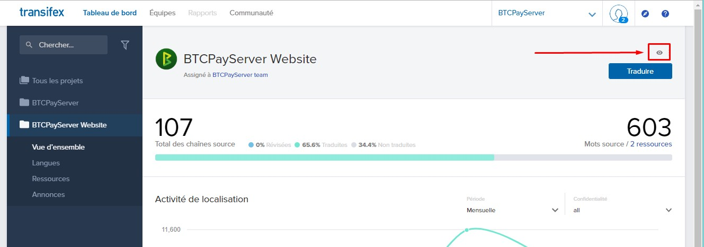

# Kufasiri BTCPay Server

[[toc]]

## Kwa nini tafsiri ni muhimu

Kufasiri BTCPay Server katika lugha nyingi huturuhusu kufikia watumiaji wengi zaidi wa programu na pia hupunguza msuguano katika malipo ya ankara kwa wateja ambao wanaweza wasielewe Kiingereza kikamilifu.

## Mahitaji

BTCPay Server inatumia jukwaa la tafsiri linaloitwa Transifex kuwaruhusu wachangiaji kuitafsiri katika lugha zaidi.

Jamii kwa sasa inafanya kazi ya kutafsiri [ukurasa wa malipo ya ankara](https://www.transifex.com/btcpayserver/btcpayserver/dashboard/) na [tovuti rasmi](https://www.transifex.com/btcpayserver/btcpayserver-website/dashboard/).

Baada ya tafsiri kufanywa kwenye Transifex, mchakato wa kuwasilisha ni wa kiotomatiki kabisa na unaunganishwa mara kwa mara kwenye hifadhi ya BTCPay. Tafsiri zinazotolewa nje ya Transifex, kama vile maombi ya kuvuta katika Github hazitakubaliwa.

---

## Hatua ya 1: Angalia Tafsiri Zilizopo

Kwanza thibitisha tafsiri ya lugha unayotaka kukamilisha haijaanzishwa tayari. Ikiwa imeshaanzishwa, unaweza kukamilisha tungo zilizobaki. Ikiwa huoni lugha unayoitafuta, wasilisha ombi la kuiongeza kwenye mradi na kuwa mfasiri wake.

## Hatua ya 2: Anzisha Tafsiri Mpya

Tafuta lugha unayotaka kutafsiri. Lugha zingine zina chaguo la kanda kadhaa. Ikiwa ombi lako la lugha lilikataliwa, sababu inaweza kuwa lugha hiyo tayari inatafsiriwa.

## Hatua ya 3: Tafsiri

Mstari wa 1: Tafsiri Msimbo wako wa Nchi.

    Mfano kwa Kireno cha Brazil
     'en' inatafsiriwa kuwa 'pt-BR'

Mstari wa 2: Jina la lugha yako, katika lugha yako.

:::tip
Hili ndilo jina la lugha litakaloonekana katika menyu kunjuzi za lugha za kiolesura cha mtumiaji.
:::
Mfano kwa Kifaransa
'English' inatafsiriwa kuwa 'Français'

---

## Vidokezo vya Tafsiri

### **Vigezo**

```
{{Words}} kama hiki kitabadilishwa na kigezo kulingana na chaguo za mtumiaji.
{{btcDue}} Mfano: 10
{{cryptoCode}} Mfano: BTC
```

Havipaswi kutafsiriwa, lakini vinahitaji kubaki katika sehemu sahihi katika tungo yako iliyotafsiriwa kwa sababu uwekaji wake utatofautiana kwa lugha.

```
Mfano wa Kifaransa:
"Return to StoreName" inatafsiriwa kuwa "Retourner sur {{storeName}}"

Mfano wa Kijapani:
"Return to StoreName" inatafsiriwa kuwa "{{storeName}} に戻る"
```

### **Arifa**

Ili kukaa sasisho na tungo mpya - wezesha arifa kwa tungo mpya zinazohitaji kutafsiriwa kwa kuwasha kipengele cha kuangalia lugha katika Transifex.

Bonyeza kwenye ikoni ya "jicho" (nyekundu katika picha ya skrini ifuatayo).



Lazima ubonyeze kwa kila mradi unaotaka kufuatilia.

---

## Pata msaada, uliza maswali

Ikiwa una maswali yoyote kuhusu kutafsiri, jiunge na [#Translations channel](https://chat.btcpayserver.org/btcpayserver/channels/translations) kwenye Mattermost.
