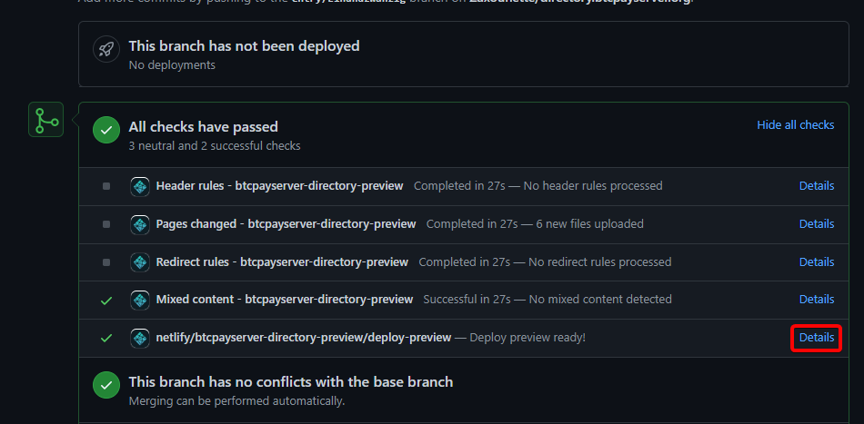

# Changia kwenye nyaraka

Kutusaidia kuweka [Nyaraka](https://github.com/btcpayserver/btcpayserver-doc) zikiwa zimesasishwa ni mchango muhimu kwa sababu BTCPay Server inabadilika katika kila toleo.

Wanaoanza wanaweza kutazama video ifuatayo kuhusu jinsi ya kuchangia nyaraka za BTCPay Server:

Hifadhi kuu ya nyaraka ya kugawanya/kunakili ni ifuatayo: [Nyaraka za BTCPay Server](https://github.com/btcpayserver/btcpayserver-doc)

Ikiwa Ombi lako la Kuvuta linabadilisha hifadhi za [Nyaraka](https://github.com/btcpayserver/btcpayserver-doc/), [Tovuti](https://github.com/btcpayserver/btcpayserver.org/) au [Orodha](https://github.com/btcpayserver/directory.btcpayserver.org/), unaweza kukagua mabadiliko moja kwa moja kwenye kivinjari chako cha wavuti mara tu Ombi lako la Kuvuta linapochapishwa.

Bonyeza tu kitufe cha `details` kama ilivyoonyeshwa kwenye picha ya skrini hapa chini. Kisha tafuta faili au sehemu uliyohariri na uthibitishe kuwa kila kitu kinaonekana kama ulivyokusudia.

:::tip
Ni wazo zuri kutumia URL za jamaa badala ya URL kamili wakati wa kuhariri viungo vinavyoelekeza kwenye kurasa ambazo tayari ni sehemu ya nyaraka.
Hii inawasaidia wachangiaji wanaosanidi nyaraka ndani.
[Taarifa zaidi](https://v1.vuepress.vuejs.org/guide/markdown.html#internal-links/).
:::
