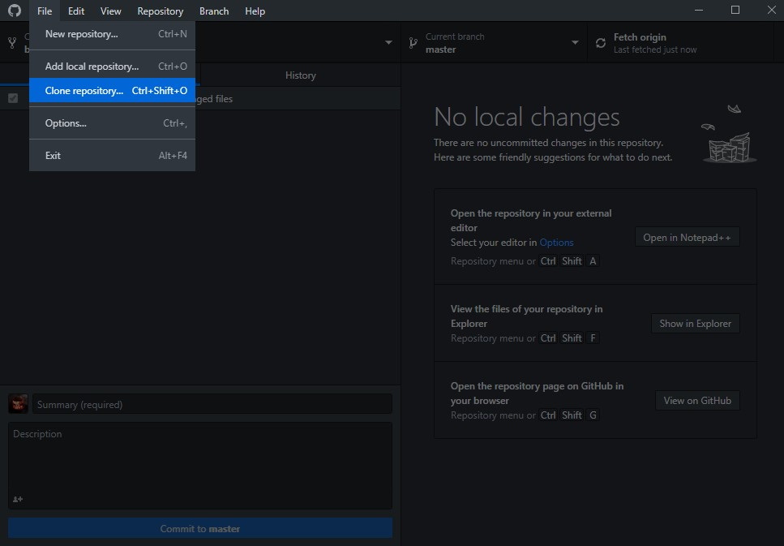
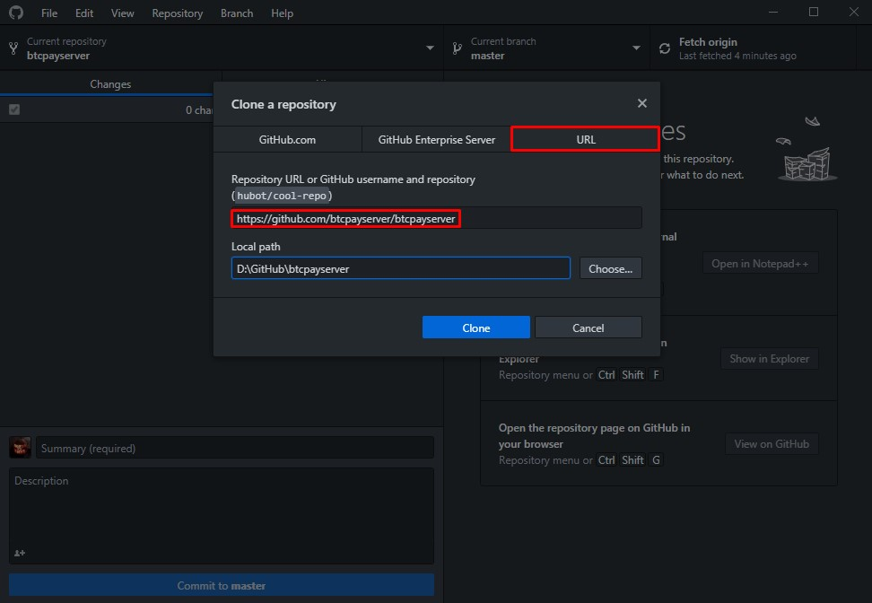
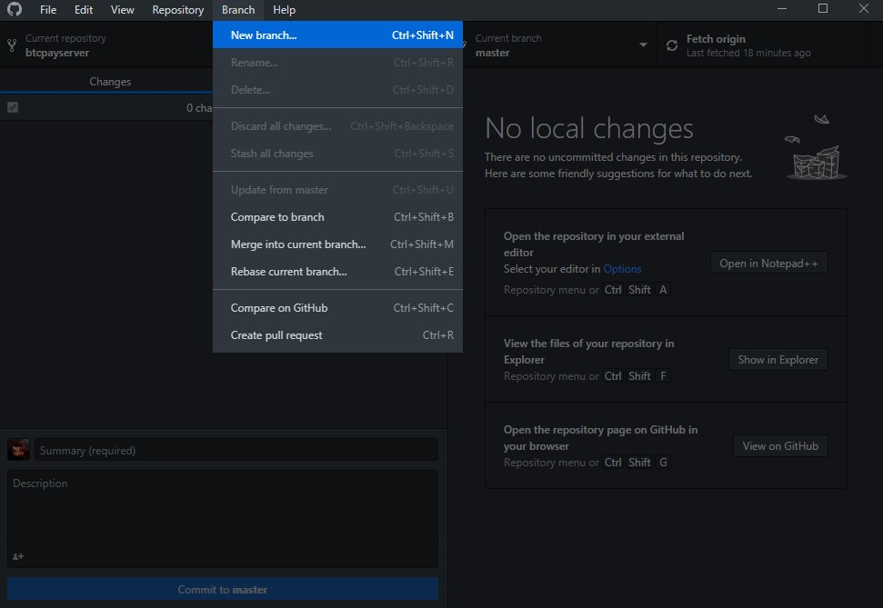
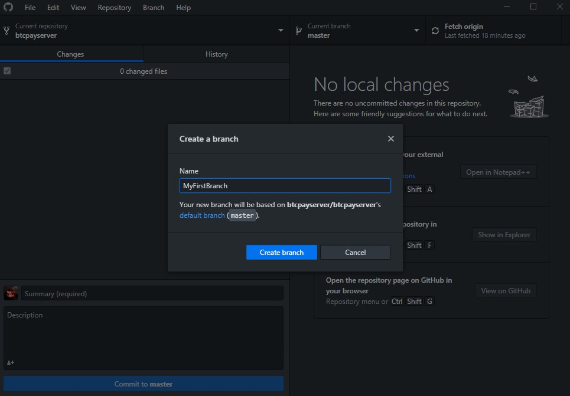
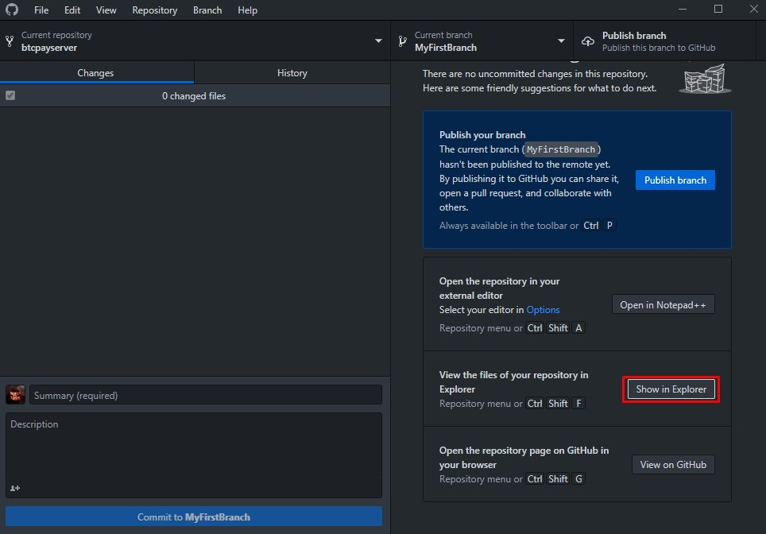
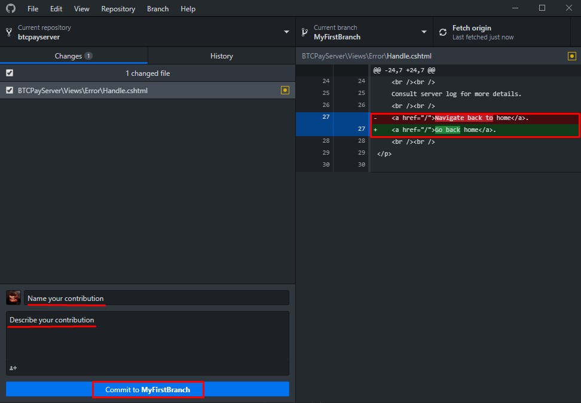
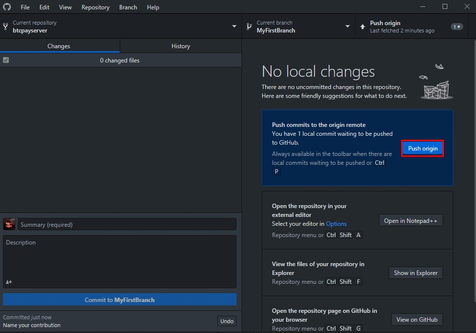
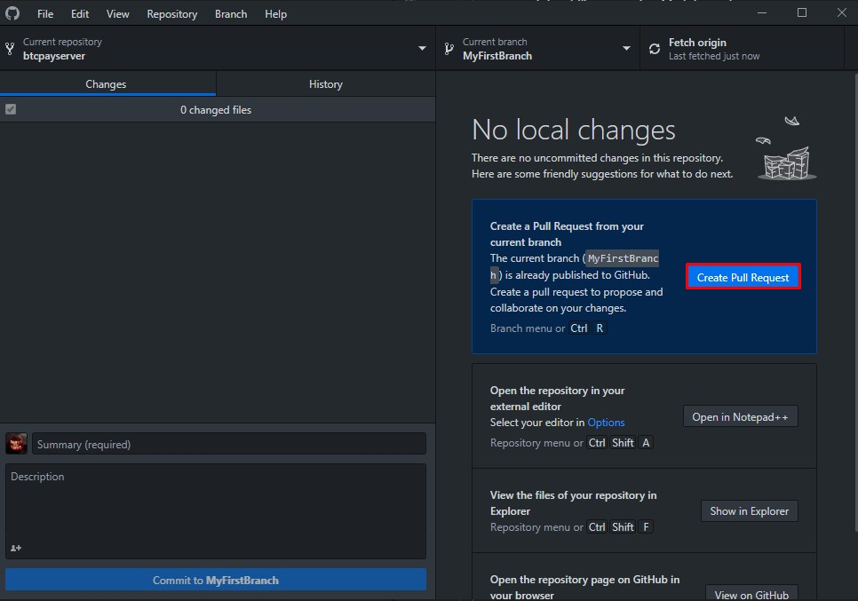
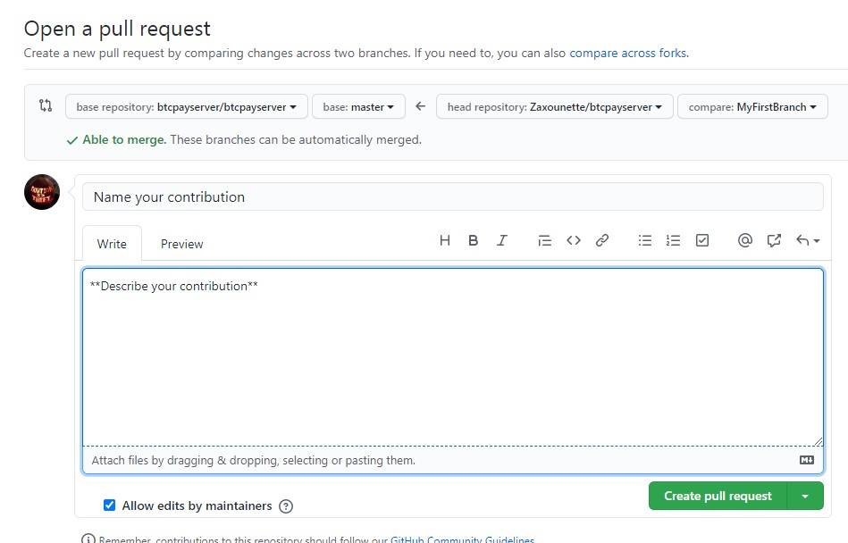

# Changia kwenye mrundiko wa programu

::: tip
Ikiwa unapata shida kutafuta tungo au kuchangia kwenye mrundiko wa programu, uliza [jamii](../Community.md)

Ikiwa mabadiliko yako ya maandishi ni makubwa [fungua suala kwenye GitHub](https://github.com/btcpayserver/btcpayserver/issues/new/choose) na ueleze kile unachotaka kubadilisha na kwa nini.
:::

## **Hatua ya 1**

Gawanya/Nakili hifadhi kuu ([BTCPay Server](https://github.com/btcpayserver/btcpayserver/)) kwa kutumia Github na uichapishe.

## **Hatua ya 2**

Unda tawi na ulipe jina (kwa mfano faili gani unafanyia kazi).

## **Hatua ya 3**

Sasa fungua tawi lako katika kichunguzi chako cha faili.

Uko tayari kabisa!
Fungua faili unayotaka kuhariri na ufanye kazi juu yake.
Mara ukimaliza, ihifadhi.

## **Hatua ya 4**

Mara mabadiliko yako yanapohifadhiwa, rudi kwenye Github Desktop.
Angalia mabadiliko yako upande wa kulia.

Taja mchango wako na uueleze.
Bonyeza kitufe cha `Commit` chini kushoto.

## **Hatua ya 5**

Kisha, unda `Pull Request` kwa kubonyeza kitufe cha `Create Pull Request` upande wa kulia ili kufungua ukurasa wa kivinjari.

Kisha eleza kile `Pull Request` yako inabadilisha, ipe kichwa, na ubonyeze `Create Pull Request`.

Mara ombi lako la kuvuta linapowasilishwa, lazima likaguliwe na watunzaji na wachangiaji. Ikiwa litakubaliwa - pongezi, umetoa mchango wako wa kwanza.
