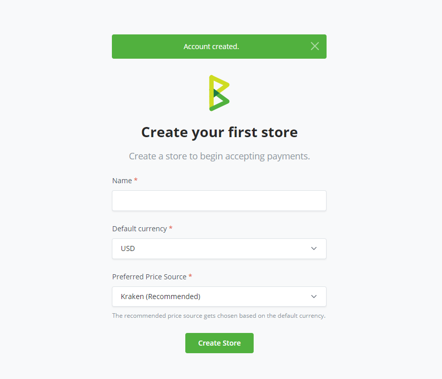
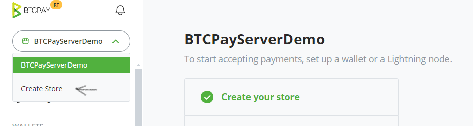

# (2) Unda duka

## Kuunda Duka kwenye BTCPay Server

Baada ya [kusajili akaunti yako](/sw/RegisterAccount/), hatua inayofuata ni kuunda duka. BTCPay Server inakuruhusu kuunda idadi isiyo na kikomo ya maduka. Kila duka linahitaji kuunganishwa na [pochi](/sw/WalletSetup/), linaweza kuwa na programu (Sehemu ya Mauzo, Vifungo vya Malipo na Ufadhili wa Umma) zilizounganishwa, au kupewa pamoja na programu ya biashara ya mtandaoni kupitia mojawapo ya ushirikiano wa aina nyingi zinazopatikana.

### Kuunda Duka Lako la Kwanza

Unaposajili akaunti kwa mara ya kwanza, utaelekezwa kiotomatiki kwenye ukurasa wa kuunda duka. Utahitaji:

1. Weka **jina la duka lako** kwenye sehemu ya maandishi
2. Chagua **sarafu yako ya msingi**
3. Chagua **mtoa bei za sarafu**
4. Bonyeza kitufe cha `Create`

Hongera! Umefaulu kuunda duka lako la kwanza.

### Kuunda Maduka ya Ziada

Ili kuunda maduka zaidi kwenye kielelezo chako:

- Nenda kwenye **Stores** kwenye menyu ya juu ya urambazaji
- Bonyeza kitufe cha **Create Store**
- Weka jina la duka lako, chagua sarafu yako ya msingi na mtoa bei wake
- Bonyeza kitufe cha `Create`

## Kubinafsisha Mipangilio ya Duka Lako la BTCPay

Store > Settings hutoa udhibiti wa msingi juu ya mipangilio ya duka binafsi. Rekebisha uthibitisho, muda wa kuisha kwa ankara na zaidi. Kwa maelezo zaidi, angalia [FAQ ya Maduka](/FAQ/Stores/).

**_Endelea kwenye hatua inayofuata - [Kuunganisha Pochi](/sw/WalletSetup/)._**