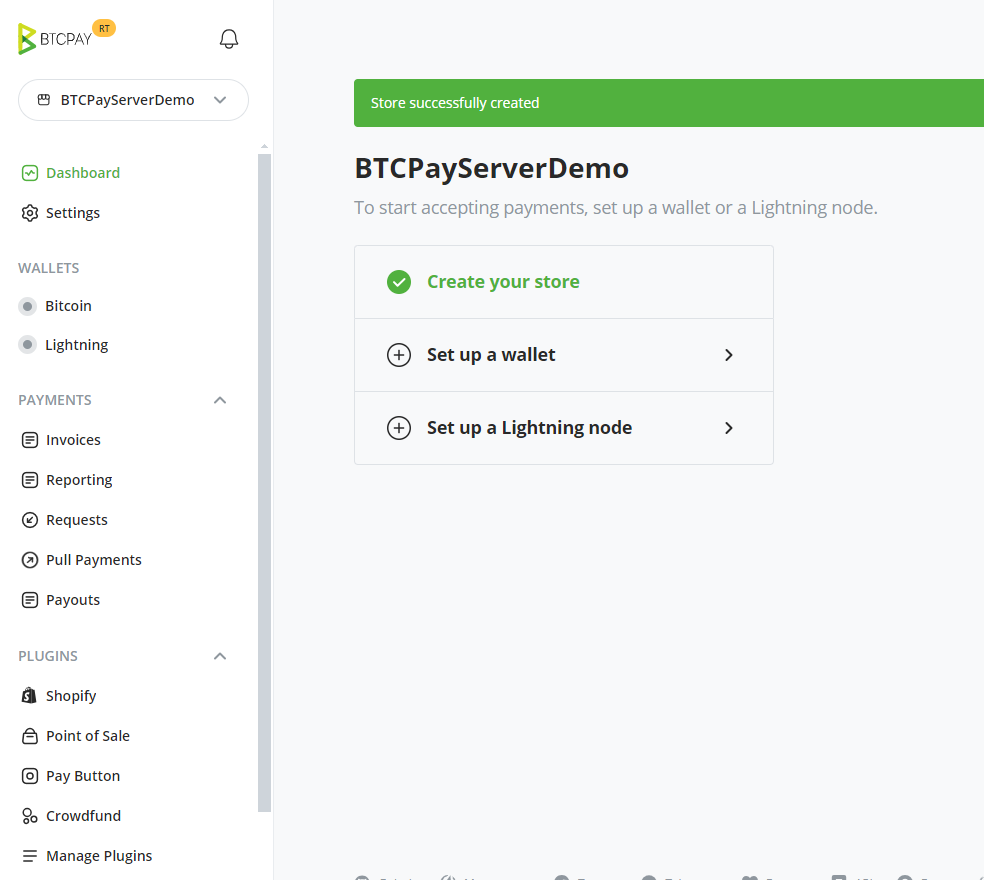
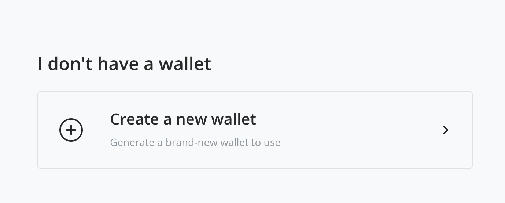
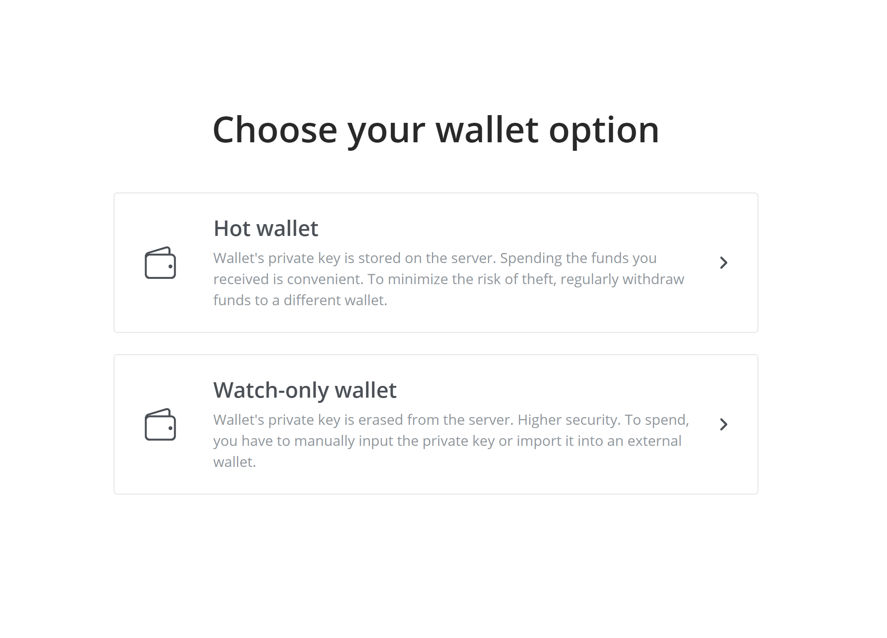
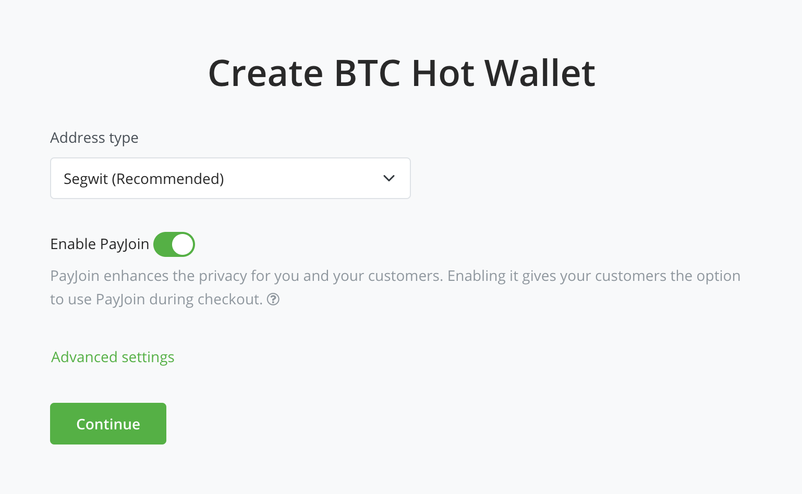
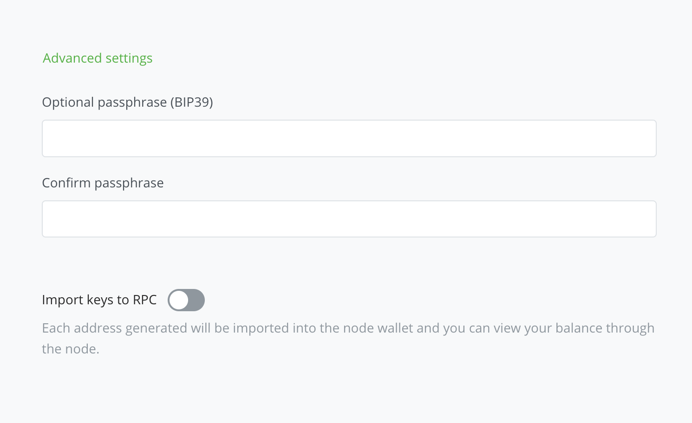
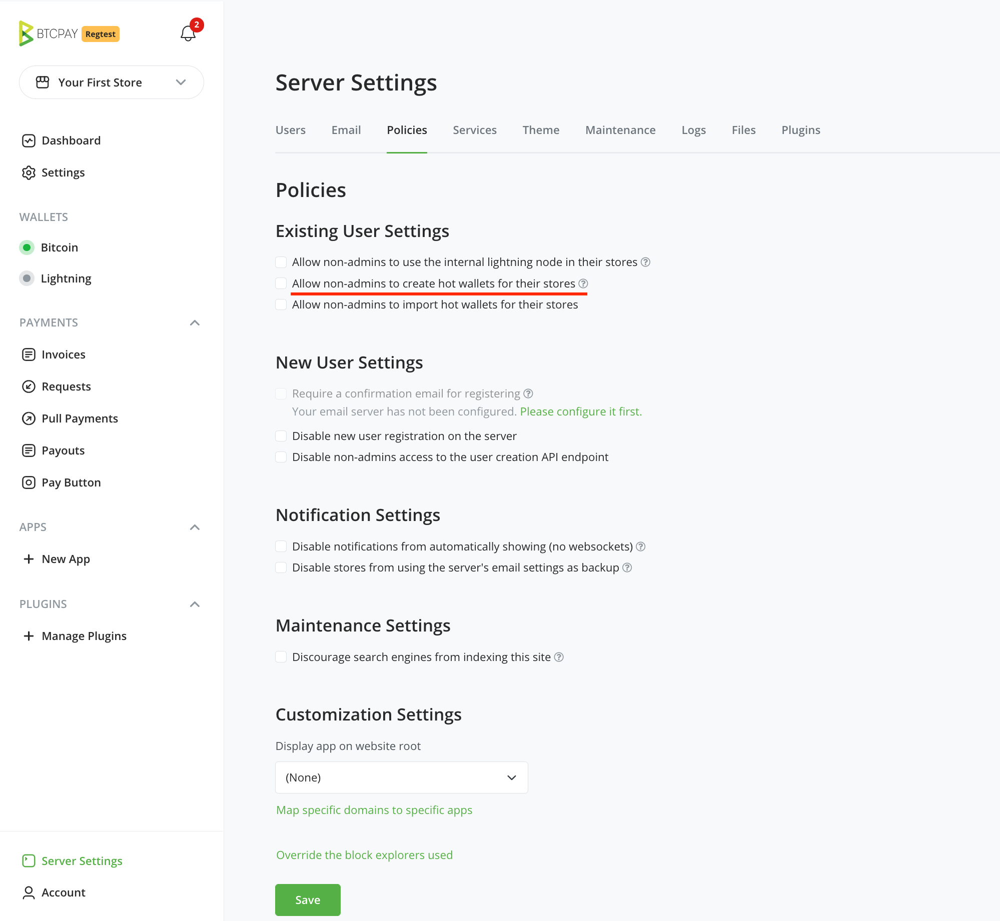
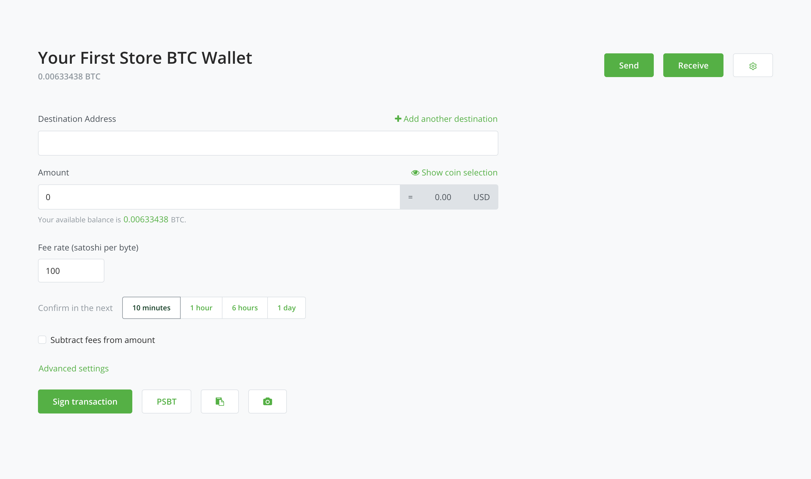
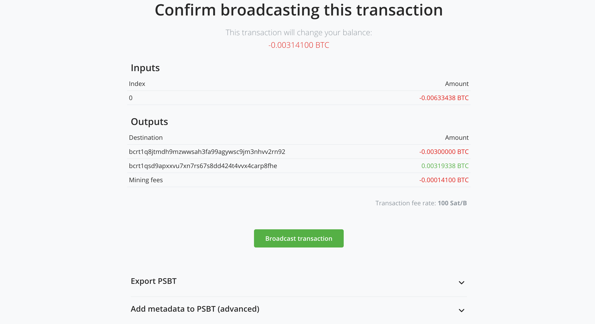
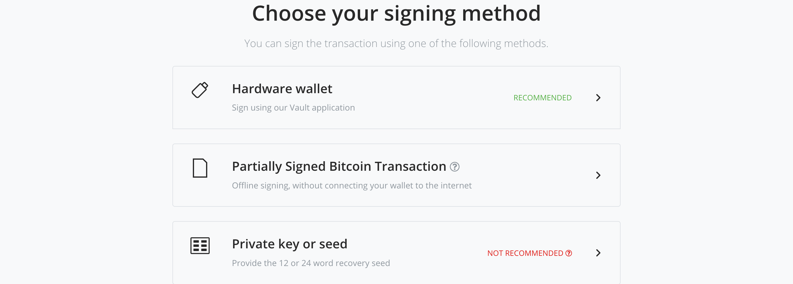

# Unda pochi mpya

- [Hot Wallet (pochi moto)](#hot-wallet)
- [Pochi ya kuona-tu (watch-only wallet)](#pochi-ya-kuona-tu-watch-only-wallet)

### Hot Wallet

Kama huna pochi iliyokuwepo, unaweza kutengeneza mpya ndani ya BTCPay Server yako. Iwe una pochi iliyokuwepo au huna, njia ya haraka zaidi ya kuwa na pochi iliyounganishwa kwenye duka lako ni kuunda pochi mpya. Unaweza kuibadilisha na pochi nyingine baada ya kupokea malipo madogo kadhaa kwenye seva yako, ikiwa ungependa tu kuandaa duka lako haraka.

Aina hii ya pochi pia inahitajika kutumia vipengele kama vile [Payjoin](/Payjoin/) na [Liquid](https://github.com/btcpayserver/btcpayserver/issues/1282).

Baada ya kuunda duka, utaweza kuunganisha pochi kwa kuenda kwanza kwenye menyu ya kando au menyu inayoteleza na kubonyeza kitufe cha **Bitcoin** chini ya kichwa cha **Wallets**. Vinginevyo, unaweza kupata chaguo la **Set up a wallet** kwenye Dashboard.

Utazingatia sehemu ya **I don't have a wallet** kwa hot wallet na kubonyeza kitufe cha **Create a new wallet**.

Kutakuwa na chaguo mbili kwenye ukurasa unaofuata, na katika hali hii, tutachagua kitufe cha **Hot wallet**.

Kwa watu wengi, chaguo za kimsingi, zikiwemo za **Address Type** (Segwit), zinapaswa kufanya kazi vyema kwa matumizi mengi, na inapendekezwa usizibadilishe isipokuwa una uhakika wa kile unachofanya. Kipengele cha **Payjoin** ni cha hiari, na unaweza kujifunza zaidi kukihusu kwenye kiungo [hapo juu](#hot-wallet).

#### Mipangilio ya Juu (Advanced Settings)

- Neno la siri la hiari la [BIP39](https://github.com/bitcoin/bips/blob/master/bip-0039.mediawiki#from-mnemonic-to-seed)

  - Unaweza kuongeza neno la siri kwa mnemonic ya hot wallet yako kwa safu ya ziada ya usalama.

- Tengeneza funguo kwa RPC

  - Hii ni kwa matumizi ya juu zaidi ya BTCPay Server. Kupeleka funguo zako kwenye RPC kutawaruhusu watumiaji kutumia [Wallet RPCs za bitcoind](https://developer.bitcoin.org/reference/rpc/index.html#wallet-rpcs) kwenye pochi iliyoagizwa.

#### Seed ya Kurejeshwa (Recovery Seed)

Hatua ya mwisho katika kuunda hot wallet ni kuandika seed yako ya kurejeshwa. Ni muhimu kuelewa kuwa mtu yeyote aliye na ufikiaji wa seed yako ya kurejeshwa anaweza kufikia na kuiba fedha zako zote, za sasa na za baadaye, kwa sababu funguo ya siri inatokana na seed hijyo ya kurejeshwa. Hifadhi seed yako kwa usalama kwa kuiandika na kuiweka mahali salama. Usichukue picha yake au kuihifadhi katika muundo wa dijitali. Usitegemee seva yako pekee kwa kuhifadhi seed yako ya kurejeshwa, weka nakala ya akiba kila wakati.

Baada ya kufanya hivyo, tiki kisanduku kinachosema _I have written down my recovery phrase and stored it in a secure location_ na ubonyeze kitufe cha **Done**.

#### Mahitaji ya kuunda pochi

Kama unatumia [mwenyeji wa mtu wa tatu](/Deployment/ThirdPartyHosting/), chaguo hili lazima liwezeshwe wazi na mameneja wa seva. Kutengeneza pochi mpya katika mazingira usiyo na uhakika kwamba yanaaminika, kunakatisha tamaa.

Kwa kimsingi, ni mameneja wa seva pekee wanaoweza kutumia kipengele cha kuunda pochi. Hii ni kwa sababu mameneja wa seva wanaweza kutoa funguo za siri kwa urahisi. Hata hivyo, kama ungependa watu wengine wanaoaminika kuunda na kudhibiti maduka yao, unaweza kuwezesha kipengele cha hot wallet kwa watu wasio mameneja. Ili kufanya hivyo, nenda kwenye Server Settings > Policies > "Allow non-admins to create hot wallets for their stores".

:::warning
Pochi mpya inapotengenezwa, BTCPay Server itakuonyesha seed ya kurejeshwa ya maneno kumi na mawili. Baada ya onyesho la awali, seed hiyo ya kurejeshwa hufutwa kutoka kwenye seva, isipokuwa chaguo la hot wallet limewezeshwa.
:::

#### Kutumia fedha na BTCPay Hot Wallet

Ukishapokea fedha kwenye pochi yako na kuamua kuzitumia, unaweza kusaini miamala kiotomatiki ndani ya BTCPay Server.

1. Katika BTCPay Server, nenda kwenye > Wallets > Bitcoin > Send
2. Jaza anwani ya lengwa (Destination) na Kiasi (Amount)
3. Rekebisha mipangilio ya miamala, ikiwemo kiwango cha ada, upendeleo wa muda wa uthibitisho, na kama ungependa ada za miamala zikatwe kutoka kwenye kiasi unachotuma
4. Saini miamala
5. Kagua miamala
6. Tangaza miamala

#### Athari za Usalama

Kuhifadhi funguo za siri kwenye seva ya umma kunakuja na hatari. Hii ni sawa na hatari za kuendesha na kutumia [Mtandao wa Lightning](/LightningNetwork/) (isipokuwa kwamba unaweza kurejeshwa fedha na nakala ya akiba).
**Tafadhali, DAIMA hakikisha kuwa umehifadhi akiba ya seed yoyote inayotengenezwa na kipengele hiki na kamwe usiache pesa ambazo huwezi kumudu kupoteza ziwe zinatumika na funguo hizo za siri**.

#### Kupunguza hatari

Kama ilivyotajwa hapo juu, utendakazi wa kuunda pochi unajumuisha hatari ya fedha kuibiwa ikiwa seva au akaunti imeathiriwa. Ili kupunguza hatari hii, tunakushauri:

- Wezesha uthibitisho wa sababu mbili au U2F
- Mara kwa mara hamisha fedha kwenye hifadhi yako ya baridi (cold storage)

:::danger
Usimpe mtu mwingine yeyote ufikiaji wa funguo za SSH za seva yako au siri za akaunti ya seva unapotumia hot wallet. Mtu yeyote aliye na ufikiaji wa akaunti yako anaweza kutumia fedha kutoka kwenye hot wallet yako. Kama unahitaji kuruhusu ufikiaji wa akaunti kwa wafanyakazi, watengenezaji, n.k. tumia [pochi iliyokuwepo](/sw/ConnectWallet/#unganisha-pochi-iliyokuwepo) badala yake.
:::

### Pochi ya kuona-tu (watch-only wallet)

Kama hot wallet, pochi ya kuona-tu inaweza mara kwa mara kuunganisha duka lako kwenye pochi. Tofauti, chaguo hili halihifadhi funguo za siri kwenye seva. Matokeo yake, pochi inakuwa "ya kuona-tu" kwa fedha zozote zinazopokelewa.

Kuna njia kadhaa za kutumia fedha na aina hii ya pochi ikiwemo kuweka maneno ya seed kwenye pochi ya maunzi ili kusaini miamala yako kwa kutumia [programu ya BTCPay Server Vault](https://docs.btcpayserver.org/Vault/), [PSBT](https://docs.btcpayserver.org/Wallet/#psbt), au njia isiyopendekezwa zaidi ya kutoa maneno ya seed kwa mikono kila wakati.

Vinginevyo, unaweza kutumia fedha katika pochi nyingine ya nje ambapo umepeleka maneno ya seed yaliyotengenezwa na BTCPay Server yako. Kama unaweka maneno ya seed kwenye pochi ya nje, unaweza pia kutumia PSBT kutumia fedha, kwa kudhani pochi hiyo inasaidia. Chaguo hili litapatikana kwenye ukurasa wa kutoa wa pochi. Hakikisha umezingatia [suala la kikomo cha pengo](/FAQ/Wallet/#missing-payments-in-my-software-or-hardware-wallet) kama unatumia pochi ya nje na pochi yako ya kuona-tu.