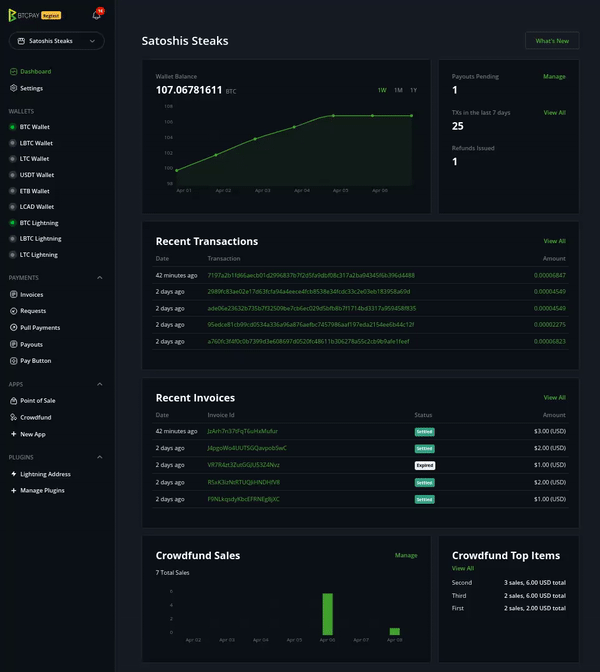
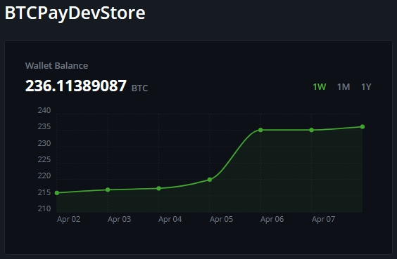
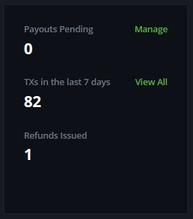
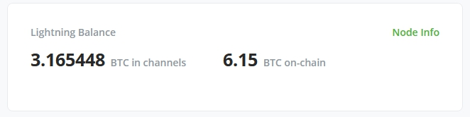
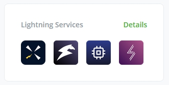
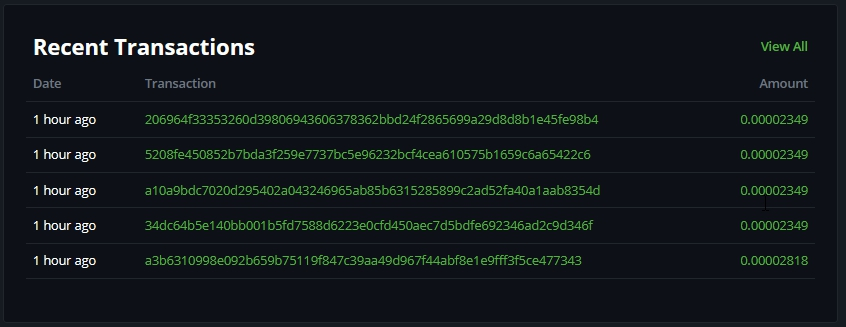
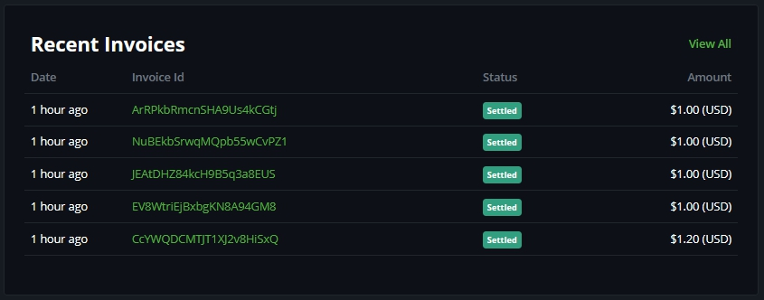
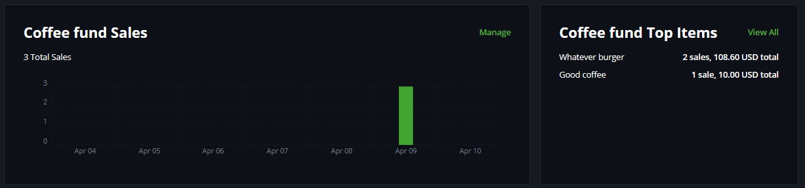

# Dashibodi

Toleo la 1.5.0 la BTCPay Server lilianzisha dhana mpya ya dashibodi inayojumuisha vigae kadhaa ambavyo vitasaidia katika usanidi wa awali, kuelewa vizuri data ya duka na kusimamia marejesho na malipo kwa urahisi.

## Vigae vya Dashibodi

Katika mwonekano mkuu wa dashibodi, utapata vigae kadhaa ambavyo tunadhani vinaweza kukusaidia kufuatilia kwa haraka utendaji wa duka lako.

### Salio la Wallet

Salio la sasa la [wallet](Wallet.md) ya duka, ikionyesha grafu kwa wiki, mwezi, au mwaka.

### Shughuli za Muamala

Dhibiti kwa haraka malipo yanayosubiri, angalia miamala ya hivi karibuni, na fuatilia [marejesho](Refund.md) ambayo hayajakamilika.

### Salio la Lightning

Hii itaonyesha salio zinazopatikana kwa nodi yako ya Lightning.
Tafadhali kumbuka kuwa salio la on-chain linarejelea wallet ya nodi ya Lightning ya duka lako, si wallet ya jumla ya on-chain ya duka.

`Maelezo ya Nodi` yatakuonyesha muhtasari wa haraka wa nodi yako, hali yake ya mtandao na anwani ya kuunganisha kwa wenza.
Kwa maelezo zaidi kuhusu `Mtandao wa Lightning` angalia [ukurasa wetu wa Mtandao wa Lightning](./LightningNetwork.md).

### Huduma za Lightning

Katika kigae hiki, utapata vitufe vya haraka vya huduma za `Mtandao wa Lightning` kama vile:

- Core Lightning (REST)
- Ride The Lightning
- ThunderHub
- Lightning Terminal

### Miamala ya Hivi Karibuni

Inaonyesha miamala mitano ya hivi karibuni iliyofika kwenye wallet yako ya on-chain.

### Invosi za Hivi Karibuni

Invosi tano za hivi karibuni zinaonyeshwa pamoja na hali na thamani yake zinazokuwezesha kufikia na kusimamia [invosi](/Invoices.md) husika kwa haraka.

### Ufadhili wa Umati Unaotumika kwa Sasa

Kigae hiki kinaonyesha ufadhili wa umati unaotumika kwa sasa, ikijumuisha bidhaa au marupurupu yao yaliyoorodheshwa kwa juu. Wakati zaidi ya programu moja ya ufadhili wa umati inatumika, vigae vitaonekana chini ya kile cha kwanza. Hiyo ni njia rahisi ya kusimamia kampeni zako za ufadhili wa umati zinazotumika na kuona marupurupu yote na jinsi yanavyofanya.

:::warning
Ukurasa huu unaweza kubadilika kadri programu inavyoendelea. Vipengele vitasasishwa kwa kila toleo.
:::
