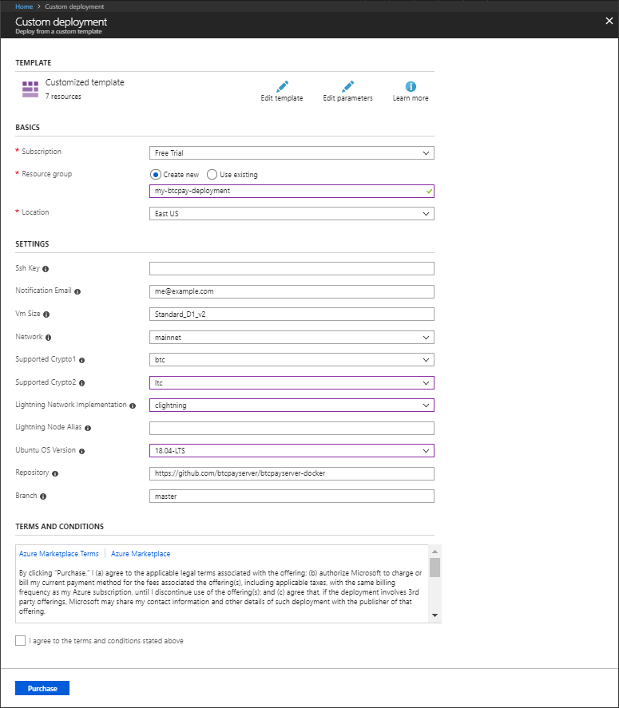
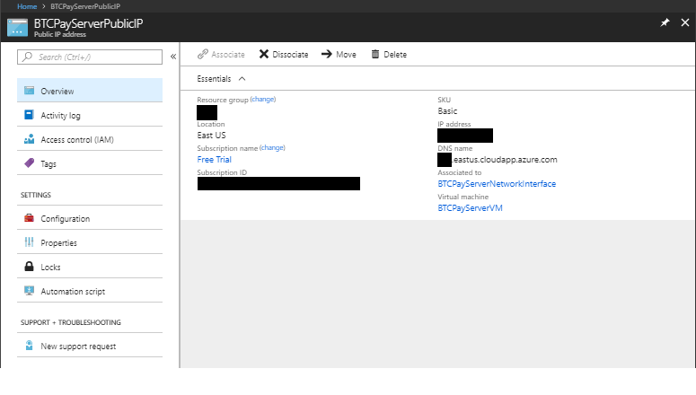

# Usambazaji wa Azure

Usanidi huu unafanana na [Usambazaji wa Docker](https://docs.btcpayserver.org/Docker/), isipokuwa kwamba `docker-compose` inapangishwa na **Microsoft Azure**.

## Usanidi wa kubofya moja

Anza kwa kubofya kitufe kifuatacho:

Unaweza kuingia kwenye [Azure](https://azure.microsoft.com/en-us/account/) kwa akaunti yako ya Microsoft.

Hatua za mwisho za usakinishaji:

Jaza chaguo zilizobaki: 

- Bofya 'Purchase' kuthibitisha
- (Subiri usambazaji wa Azure)
- Andika `ip` kwenye upau wa utafutaji na uchague chaguo la kwanza, `BTCPayServerPublicIP`
- Nakili jina la mwenyeji kwa usambazaji wako wa Azure, chini ya `DNS name`: 
- Tembelea (vivinjari vyote vikuu vinaungwa mkono)
- Bofya 'Register' na unda akaunti - Hii itakuwa akaunti yako ya **msimamizi**!
- Kwenye msajili wa kikoa chako, elekeza kikoa chako kwenye jina hili la mwenyeji (soma zaidi: [Jinsi ya kubadilisha jina la kikoa cha BTCPay Server yako](../FAQ/Deployment.md#how-to-change-your-btcpay-server-domain-name))
- Kisha, tembelea `https://EXAMPLE.eastus.cloudapp.azure.com/server/maintenance`
- Weka jina la kikoa chako na bofya 'Confirm'
- (Subiri dakika 1-5)
- **Imekamilika!** Tembelea `https://EXAMPLE.MYSITE.com/stores` kuunda duka lako na kuanza kutoa ankara.

Kwa watumiaji wa hali ya juu, unaweza kuunganisha kupitia SSH kwa maelezo kwenye `https://EXAMPLE.MYSITE.com/server/services/ssh`, na:

- Endesha `docker ps` na `docker logs xxx` kuona michakato inayoendesha
- Endesha `btcpay-down.sh` na `btcpay-up.sh` kusimamisha na kuanzisha BTCPayServer

Takriban Gharama (bila kupunguzwa, Bitcoin pekee, baada ya jaribio la bure la Azure la $200): **Dola 60 za Marekani kwa mwezi**

Baada ya nodi zako zote kusawazishwa na umethibitisha kila kitu kinafanya kazi, fuata [mwongozo huu](./AzurePennyPinching.md) ili kurekebisha kwa akiba; gharama zinapaswa kushuka hadi **Dola 30 au 40 za Marekani kwa mwezi**.

Jifunze zaidi: [btcpayserver/btcpayserver-azure](https://github.com/btcpayserver/btcpayserver-azure)
