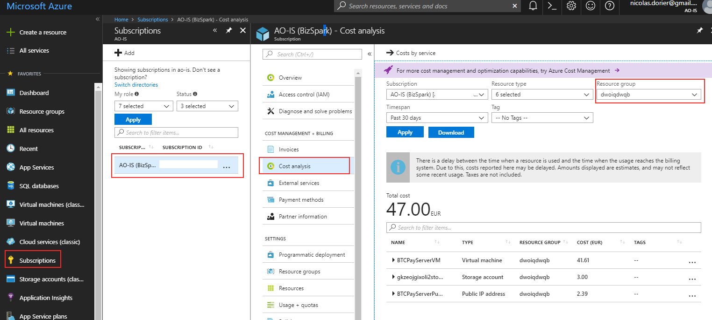
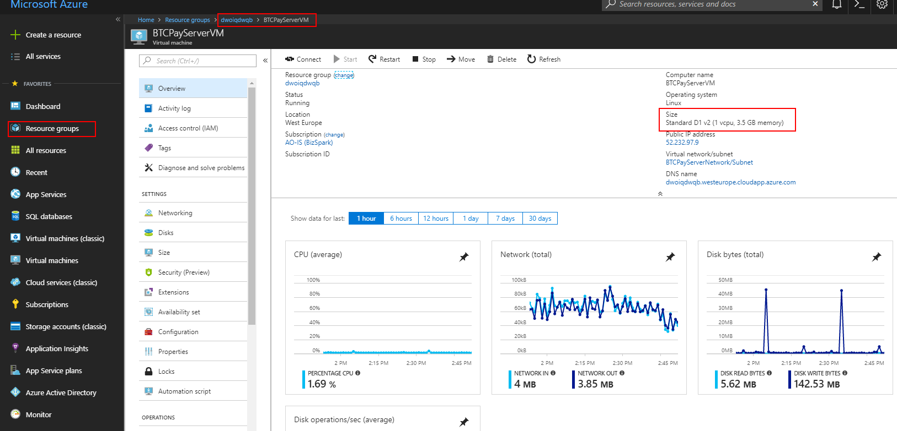
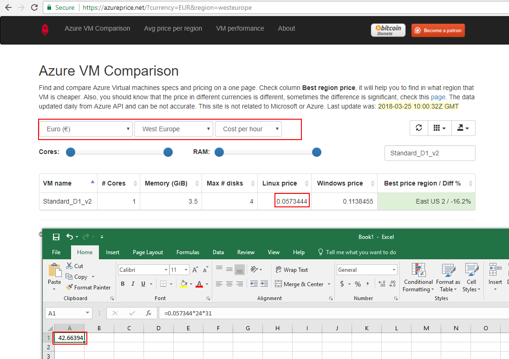
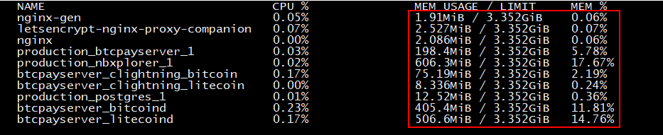
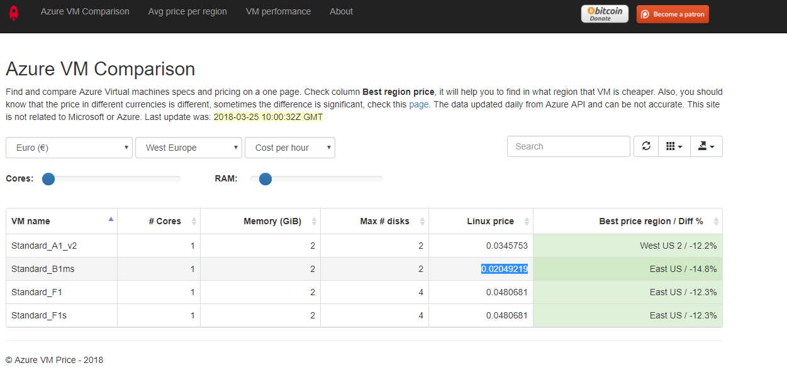
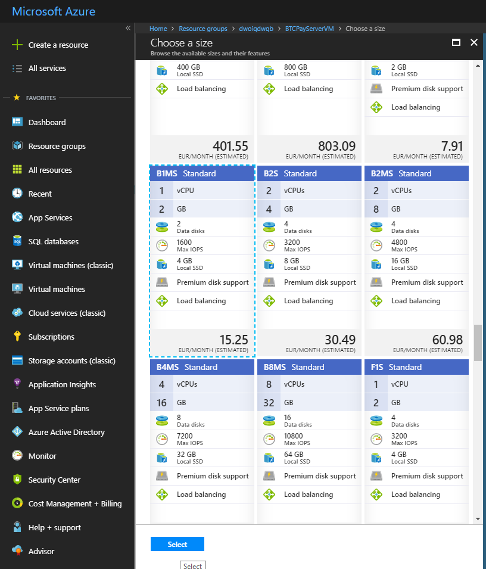
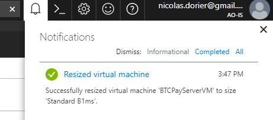
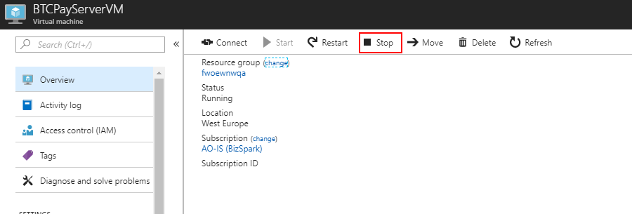

# Jinsi ya kubana matumizi kwenye usambazaji wako wa Azure

Mwongozo huu ni kwa watumiaji waliosambaza [kwenye Azure](https://github.com/btcpayserver/btcpayserver-azure) wanaotaka kufanya akiba fulani kwenye usakinishaji wao.

Tafadhali fanya hivi **baada tu ya nodi zako kusawazishwa kikamilifu**.
Wakati wa usawazishaji unahitaji usanidi wenye nguvu.

**Kubana matumizi** ni fursa kwako kuelewa vyema rasilimali unazotumia na kurekebisha usanidi kulingana na mzigo wako wa kazi.

Upande mbaya:

- Kuendesha `btcpay-update.sh` au kuwasha upya kutachukua muda mrefu zaidi
- Unaweza kuona `502 Bad Gateway` na nodi yako ikichukua muda mwingi kuanza
- Seva yako inaweza kuwa polepole sana

Upande mzuri:

- Akiba ya 50%

Ikiwa unaona kuwa seva yako ni polepole sana:

- Acha usaidizi wa sarafu kwa kuhariri mipangilio `BTCPAY_DOCKER_COMPOSE` katika `/etc/profile.d/btcpay-env.sh`, au
- Ongeza ukubwa wa Mashine yako ya Mtandao

:::onyo
Baada ya majaribio fulani, inaonekana kuwa kufuata mwongozo huu kwa usanidi kwenye mainnet unaohusisha BTC+LTC+CLightning ni mzigo mkubwa kidogo na hufanya seva iwe na ucheleweshaji mwingi.

Zingatia kuwa seva inakuwa na ucheleweshaji mdogo kadri muda unavyopita baada ya kuwasha upya, kwa hivyo bado inaweza kuwa sawa kwa hali yako.
Ikiwa haikubaliki, unapaswa kubadilisha kutoka aina ya `B1MS` (Dola 20/Mwezi) hadi aina ya `B2S` (Dola 40/Mwezi).
:::

## Ninatumia kiasi gani sasa?

Gundua ni kiasi gani usakinishaji wako unagharimu:

- Nenda kwenye lango la Azure
- Nenda kwenye Usajili (Ikiwa hupati menyu ya `Subscription` tafuta `Subscription` kwenye upau wa utafutaji karibu na kengele ya arifa.)
- Nenda kwenye Uchambuzi wa Gharama
- Chagua kikundi chako cha Rasilimali (changu kinaitwa "dwoiqdwqb")
- Muda wa siku 30
- Bofya tumia



Kama unavyoona, usakinishaji wangu unagharimu `Euro 47.00/Mwezi`.
Gharama nyingi hutumika kwenye mashine ya mtandao.

## Usanidi wangu wa sasa ni upi

Kwanza ona ni Mashine ya mtandao gani unayo sasa:

- Nenda kwenye lango la Azure
- Nenda kwenye Vikundi vya Rasilimali
- Chagua kikundi chako cha rasilimali
- Chagua BTCPayServerVM



Kama unavyoona CPU haitumiki sana, diski pia. Tunaweza pengine kupunguza hapa.
Pia aina ya VM yangu ni `Standard_D1_v2`. Kama unavyoona kwenye [Tovuti ya Bei za Azure](https://azureprice.net/).



Hii inanigharimu `Euro 0.0573444/Saa` au `Euro 42.66/Mwezi`.

Sasa tunajua kuwa kupunguza VM hii kutaleta faida kubwa zaidi ya gharama.
Tuone ni kwa kiasi gani tunaweza kwenda.

Unganisha kwa SSH kwenye VM yako, kisha:

```bash
sudo su -
docker stats
```



Kama unavyoona, nina GB 3.352 za RAM, na karibu 55%.

Amri ya free pia inaonekana kuniambia nina takriban GB 1 ya RAM kama ziada:

```
root@BTCPayServerVM:~# free --human

             total       used       free     shared    buffers     cached
Mem:          3.4G       3.2G       138M        30M       8.8M       991M
-/+ buffers/cache:       2.2G       1.1G
Swap:           0B         0B         0B
```

## Kuchagua Mashine mpya ya Mtandao

Sasa tunajua kuwa GB 2 za RAM, na CPU isiyokuwa na nguvu sana pengine itafanya kazi.

Lakini kwanza, hutaki mashine yako ianguke ikiwa inaishiwa na RAM, kwa hivyo unahitaji kuongeza swap:
Zingatia kuwa `/mnt` inatumika katika Azure kwa data ya muda, na imeboreshwa kwa ucheleweshaji mdogo, ndiyo sababu tunaweka faili ya swap hapa.

```bash
sudo su -
fallocate -l 2G /mnt/swapfile
chmod 600 /mnt/swapfile
mkswap /mnt/swapfile
swapon /mnt/swapfile
echo "/mnt/swapfile   none    swap    sw    0   0" >> /etc/fstab
```

Kama unavyoona, swap imeongezwa:

```
root@BTCPayServerVM:~# free -h
             total       used       free     shared    buffers     cached
Mem:          3.4G       3.2G       141M        30M       9.8M       983M
-/+ buffers/cache:       2.2G       1.1G
Swap:         **2.0G**         0B       2.0G
```

Sasa, rudi kwenye [azureprice.net](https://azureprice.net/) na utafute kitu cha bei nafuu kuliko `Euro 0.0573444/Saa`.



Wow! `Standard_B1ms` inagharimu tu `Euro 0.02049219/Saa` - tubadilishe kwenda huko!

Mtazamo wa haraka kwenye [makala hii](https://www.singhkays.com/blog/understanding-azure-b-series/) unatuonyesha kuwa aina hii ya mashine ya mtandao imebadilishwa kwa matumizi ya chini ya CPU na milipuko ya mara kwa mara. Hivi ndivyo BTCPay Server inavyohusu baada ya nodi kusawazishwa.

- Nenda kwenye lango la Azure
- Nenda kwenye Vikundi vya Rasilimali
- Chagua kikundi chako cha rasilimali
- Chagua BTCPayServerVM
- Chagua `Size`
- Chagua `B1MS` (ikiwa hauoni, angalia [Maswali Yanayoulizwa Mara kwa Mara](#b1ms))
- Bofya `Select`



Subiri kati ya dakika 5 na 15.

Azure inapokuwa na furaha:



Hongera! Umepunguza gharama kwa 50% kwa mwezi! :)

### Maswali Yanayoulizwa Mara kwa Mara: B1MS haionekani kwenye orodha <a name="b1ms"></a>

Katika hali fulani, huenda usione Mashine ya Mtandao B1MS kwenye orodha.
Inamaanisha kundi lako la vifaa vya Azure haliungi mkono aina hii.

:::onyo
Kusimamisha Mashine yako ya Mtandao kutabadilisha Anwani ya IP ya Umma ya seva yako. Ikiwa umesanidi rekodi ya A (kinyume na CNAME) kwenye msajili wa kikoa chako, utahitaji kuisasisha.
:::

Unahitaji kwenda kwenye:

- Rasilimali ya Mashine yako ya Mtandao
- Menyu ya `Overview`
- Bofya `Stop`



Subiri hadi Mashine ya Mtandao imesimama, kisha badilisha ukubwa.

Mara ukubwa umebadilishwa, rudi kwenye `Overview` na ubofye `Start`.
