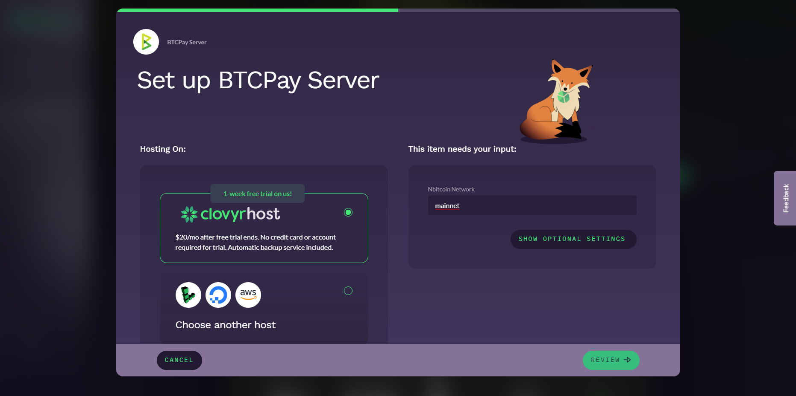
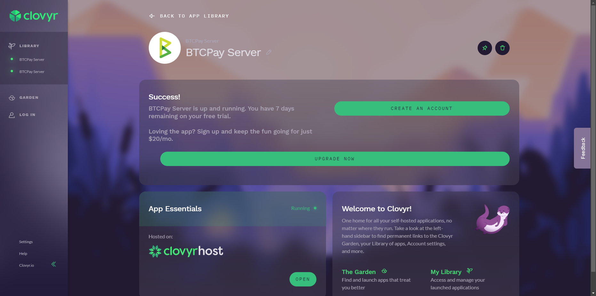
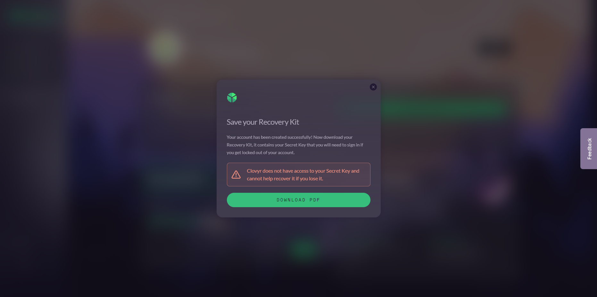
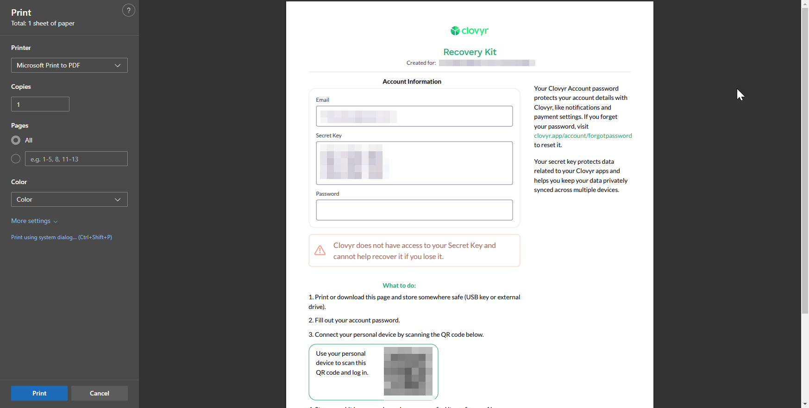

# Usambazaji wa mtandao wa Clovyr BTCPay Server.

Katika mwongozo huu, tutakuongoza kupitia usanidi wa awali wa usambazaji wako wa mtandao wa Clovyr BTCPay Server.
Clovyr inatoa usambazaji wa haraka na rahisi wa huduma mbalimbali, ikijumuisha BTCPay Server. Wanaruhusu kusambaza kwenye seva zao wenyewe, au kwa watoa huduma wengine wa VPS, kama vile Digital Ocean, AWS, na Linode.

## 1. Tembelea ukurasa wa uzinduzi wa Clovyr BTCPay Server

Nenda kwenye [ukurasa wa uzinduzi wa Clovyr BTCPay Server](https://clovyr.app/apps/btcpayserver/launch)

Kisha, chagua unapotaka kupangisha. Tutaendelea na chaguo la msingi, seva zao wenyewe.
Bofya Kagua (Review), kisha Zindua (Launch).

## 2. Uundaji wa akaunti

Sasa unapaswa kuona skrini ya mafanikio ndani ya dashibodi ya Clovyr.

Bofya Unda akaunti (Create account), na ujaze maelezo yako.

Sasa itakuuliza uhifadhi seti ya kurejesha, inayokuwezesha kurejesha akaunti yako ikiwa utasahau au kupoteza nenosiri lako.

## 3. Kufikia BTCPay Server

Ukisharudi kwenye dashibodi ya Clovyr, bofya kitufe cha "Fungua" (Open) chini ya Muhimu za Programu (App Essentials), na BTCPay Server itafunguka kwenye kichupo kipya.

## 4. Anzisha duka lako la kwanza.

Utaombwa kuunda akaunti ya kwanza kwenye BTCPay Server yako mpya. Hakikisha umechagua akaunti ya Msimamizi (Administrator).

Sasa uko tayari kusanidi duka lako la kwanza!
Ili kufuata zaidi juu ya kusanidi duka lako, fuata [Mwongozo huu](../RegisterAccount.md).

## 5. Karibu kwenye dashibodi yako ya BTCPay Server

Sasa uko ndani ya BTCPay Server yako mpya.
Pochi ya bitcoin bado haipo. Unaweza kufuata [mwongozo huu wa kusanidi pochi](../WalletSetup.md)

:::tip
Ikiwa kuna maswali kuhusu nodi yako, usambazaji, au visasisho, tafadhali wasiliana na usaidizi wa Clovyr, kwa kutumia kichupo chao cha Maoni (Feedback).
:::

## 6. Malipo

Utakuwa na majaribio ya bure ya siku 7 ili kujaribu huduma. Baada ya hapo, utatozwa $20 kwa mwezi na utahitaji kusanidi hili kupitia dashibodi ya Clovyr kwa kubofya "Boresha sasa" (Upgrade now).
