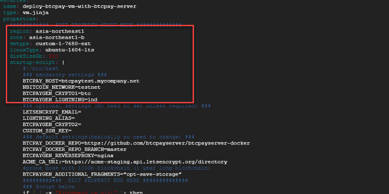

# Usambazaji wa Google Cloud

Usanidi huu unafanana na [Usambazaji wa Docker](https://docs.btcpayserver.org/Docker/), isipokuwa kwamba `docker-compose` inapangishwa na **Google Cloud**.

## Usanidi wa shell ya Google Cloud

Google Cloud ni njia mbadala ya kusanidi BTCPayServer.

Anza kwa kubofya kitufe kifuatacho:

Unaweza kuingia kwenye [Google Cloud Console](https://console.cloud.google.com) kwa akaunti yako ya Google.

Hatua za mwisho za usakinishaji:

- Kwenye shell ya Google Cloud, Weka mradi na eneo chaguo-msingi la kusambaza mfano
- Badilisha faili ya yaml ili kusanidi mfano wa VM na seva ya BTCPay: 
- Badilisha hali kuwa 755 kwa skripti za shell na uendeshe 'deploy.sh \<jina lolote la usambazaji\>' ili kuanza usambazaji
- (Subiri kwa usambazaji wa Google Cloud kwa dakika moja)
- IP tuli itaonyeshwa kwenye shell ya Google Cloud
- Nenda kwenye huduma yako ya DNS na uihusishe na jina lako la kikoa, tuseme EXAMPLE.MYSITE.com
- ssh kwenye vm kutoka kwenye orodha ya mifano ya VM ya Google Cloud console
- kwenye ssh, Nenda kwenye saraka ya /btcpayserver-docker na uendeshe 'changedomain.sh EXAMPLE.MYSITE.com'
- Fikia https://EXAMPLE.MYSITE.com kwa kivinjari
- Bofya 'Jisajili' (Register) na uunde akaunti - Hii itakuwa akaunti yako ya **msimamizi**!
- **Imekamilika!** Tembelea `https://EXAMPLE.MYSITE.com/stores` ili kuunda duka lako na kuanza kutoa ankara.

Kwa watumiaji wa juu, unaweza kuunganisha kupitia SSH na maelezo kwenye `https://EXAMPLE.MYSITE.com/server/services/ssh`, na:

- Endesha `docker ps` na `docker logs xxx` ili kuona michakato inayoendesha
- Endesha `btcpay-down.sh` na `btcpay-up.sh` kusimamisha na kuanzisha BTCPayServer

Gharama Takriban : **70 USD kwa mwezi**

Jifunze zaidi: [btcpayserver/btcpayserver-googlecloud](https://github.com/btcpayserver/btcpayserver-googlecloud)
