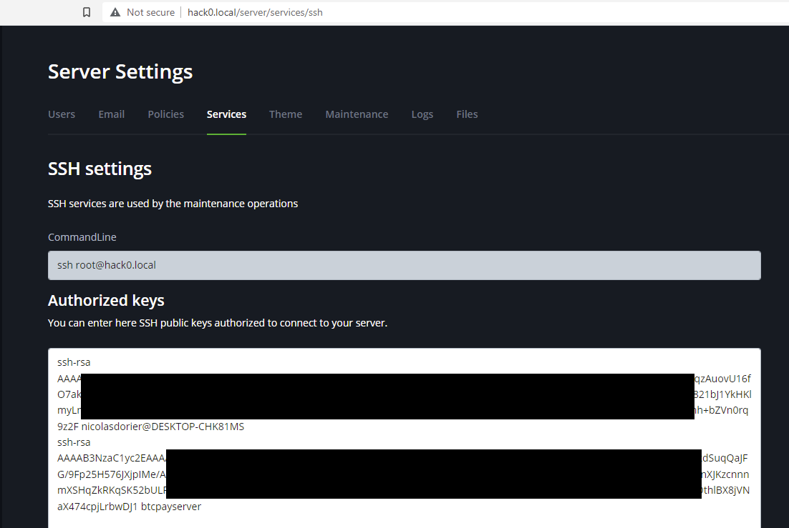

# Hack0

Hack0 ni mbadala wa usambazaji wa [Raspberry Pi](/Deployment/RaspberryPi.md).
Inarahisisha sana hatua za usakinishaji kwa kutoa vifaa na mfumo wa uendeshaji ili kuendesha BTCPay Server yako kwa usambazaji wa docker.

Mradi huu unadumishwa na [DG Lab](https://www.dglab.com/en/), ikiwa unahitaji msaada, njoo kwenye [mazungumzo yetu ya usaidizi](https://chat.btcpayserver.org/btcpayserver/channels/hack0).

Hack0 inalenga aina mbili tofauti za watumiaji: `Wasambazaji` (Distributors) na `Watumiaji wa mwisho` (End users).

- `Watumiaji wa mwisho` ni watu wanaoendesha Hack0 kwa madhumuni yao wenyewe.
- `Wasambazaji` ni watu wanaonunua sehemu mbalimbali za vifaa, kuzikusanya pamoja, kusakinisha Hack0, na kusambaza kisanduku cha plug-and-play kwa `Watumiaji wa mwisho`.

Ikiwa unanunua vipande mbalimbali vya vifaa kwa Hack0 yako, kuvikusanya, kusakinisha hack0, kisha kuitumia wewe mwenyewe, wewe ni `msambazaji` na `mtumiaji wa mwisho` kwa mujibu wa nyaraka hizi.

Unaweza kutazama utangulizi hapa:

## Maelezo ya vifaa (kwa wasambazaji)

Hapa kuna sehemu zinazopendekezwa kwa kuendesha Hack0:

- RockPro64 4GB ([Kiungo](https://store.pine64.org/?product=rockpro64-4gb-single-board-computer)) `79.99$`
- adapta ya USB kwa Moduli ya EMMC ([Kiungo](https://pine64.com/product/usb-adapter-for-emmc-module/)) `4.99$`
- EMMC 32GB ([Kiungo](https://pine64.com/product/32gb-emmc-module/)) `24.95$`
- Feni Kwa ROCKPro64 20mm Mid Profile Heatsink ([Kiungo](https://pine64.com/product/fan-for-rockpro64-20mm-mid-profile-heatsink/)) `2.99$`
- ROCKPro64 20mm Mid Profile Heatsink ([Kiungo](https://pine64.com/product/rockpro64-20mm-mid-profile-heatsink/)) `3.29$`
- SSD 500GB PCIe NVMe ([Kiungo](https://www.crucial.com/ssd/p2/CT500P2SSD8)) `66.99$`
- adapta ya M.2 kwa PCIe ([Kiungo](https://www.silverstonetek.com/en/product/info/expansion-cards/ECM25/)) `25$`

Jumla: `188.2$`

Inawezekana kubadilisha moduli ya EMMC na adapta kwa microSD. Lakini majaribio yameonyesha kuwa microSD haziaminiki kwa muda mrefu na zinaweza kuacha kufanya kazi baada ya miaka 2-3 ya matumizi.

## Usakinishaji wa kiwandani (kwa wasambazaji)

Ukishapata vifaa vyako, unahitaji kuwaka picha ya Hack0.

Hack0 inategemea usambazaji wa armbian. Unaweza kujenga picha mwenyewe kwa kufuata maagizo [kwenye ukurasa wetu wa github](https://github.com/dgarage/hack0-armbian/tree/btcpay/userpatches). Unaweza pia kupata [picha zilizojengwa tayari](https://github.com/dgarage/hack0-armbian/tree/btcpay/userpatches#pre-built-images) zilizo tayari kupakuliwa ili kuokoa muda kwenye ukurasa huu.

Ukishapata picha, unaweza kuiwaka kwenye moduli ya EMMC kwa kutumia adapta ya USB ya Moduli ya EMMC.
Wakati wa kuanza kwa mara ya kwanza, hack0 iko katika `hali ya usanidi` (setup mode), hali ya usanidi itafanya:

> :warning: Unapoanza kuwasha picha zilizojengwa tayari kwa mara ya kwanza, hack0 itakuwa katika `hali ya usanidi`, ambayo itafuta data zote kwenye kiendeshi cha SSD.

Wakati wa `hali ya usanidi`, angalia taa mbili za led zilizowekwa karibu na kiunganishi cha ethernet. Utaona taa nyekundu ikiwaka, wakati taa nyeupe inamulika.
Mara hali ya usanidi inapofaulu, taa nyekundu inazimika na taa nyeupe inawaka bila kumulika. Katika hatua hii, unaweza kukata Hack0 kwa usalama. Sasa iko tayari kutumiwa na `watumiaji wa mwisho`.

Ikiwa usanidi umeshindwa, basi taa nyekundu itawaka, wakati taa nyeupe inazimika.

## Usanidi wa mtumiaji wa mwisho

Kama mtumiaji wa mwisho, unahitaji tu kuunganisha hack0 yako kwa kebo ya ethernet kwenye mtandao wako.
Baada ya kusubiri dakika 5, unapaswa kuwa na uwezo wa kufikia `http://hack0.local` ambayo itakuonyesha fomu ya usajili ya mfano wako wa BTCPay Server.

Katika baadhi ya matukio, `hack0.local` inaweza isifanye kazi, na unahitaji kutumia zana kama [Angry IP Scanner](https://angryip.org/) kupata anwani ya IP ya hack0 yako, kisha unganisha kwake. Ikiwa kipanga njia chako cha mtandao kina ukurasa wa usanidi, unaweza pia kupata IP ya hack0 yako huko. Kisha unaweza kuunganisha kwenye `http://<anwaniiyaip>`.

## Maswali Yanayoulizwa Mara kwa Mara

### Jinsi ya kuunganisha kupitia SSH kwenye hack0 yako?

Unahitaji kuongeza ufunguo wako wa umma wa ssh kwenye `http://hack0.local/server/services/ssh`. Usiondoe ufunguo wa `btcpayserver` uliopo tayari.
Baada ya hili, unapaswa kuwa na uwezo wa kuunganisha kupitia ssh kwa `ssh root@hack0.local` au Putty.

