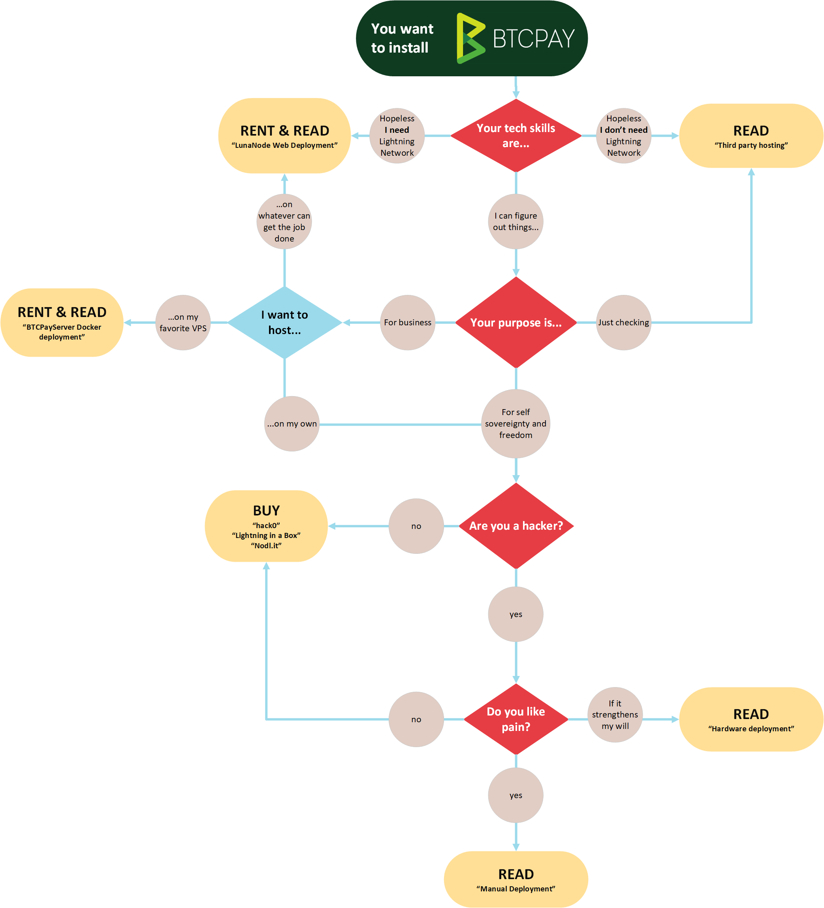

# Kuchagua Mbinu ya Usambazaji

Kuna **mbinu kadhaa tofauti za usambazaji** zinazopatikana, zote zikitumia **programu hiyohiyo ya BTCPay Server**. Kwa sababu BTCPay ni kichakataji malipo cha sarafu ya fiche cha bure na cha chanzo huria, tunasaidia utofauti katika mbinu za usambazaji kwa watumiaji. Suluhisho tofauti hufanya kazi vyema kwa [matumizi tofauti](../UseCase.md).

Mbinu za usambazaji wa biashara zinaweza kutofautiana kwa usanidi, matengenezo, usaidizi, bei, n.k. Unaweza kuendesha **BTCPay kama suluhisho la kujisimamia** kwenye seva yako mwenyewe, au kutumia **mwenyeji wa tatu**. Suluhisho la kujisimamia linakuruhusu sio tu kuambatisha idadi isiyo na kikomo ya maduka na kutumia [Mtandao wa Lightning](../LightningNetwork.md) bali pia kuwa kichakataji malipo kwa wengine.

BTCPay ni mfumo wa ankara usio wa ulezi ambao unaondoa ushiriki wa mtu wa tatu wakati wa kusimamia fedha. Malipo kwa BTCPay huenda moja kwa moja kwenye pochi yako. Funguo zako za kibinafsi hazipakiwi kamwe kwenye seva. Maana yake **Wahudumu wa BTCPay wa tatu hawadhibiti fedha za watumiaji**, wanapangisha tu mfano wako wa programu ya BTCPay kwa ajili yako.

:::warning TAFADHALI ZINGATIA
Usambazaji wa mwongozo na ujenzi wa vifaa haupendekezwi kwa mazingira ya uzalishaji na unahitaji mtumiaji kuwa na ujuzi wa kiufundi unaohusiana na ujenzi huo.
:::

## Ili kuchagua utakaokufaa zaidi, zingatia yafuatayo: 

| Mbinu ya usambazaji                                                                                                                                                                                                                                                                                                                                                                                                                                                                                                                                                                                           |    Ugumu    | Uzalishaji/Maendeleo |   Vipengele vyote  vinapatikana    |               Takriban gharama  kwa mwezi                |
| :----------------------------------------------------------------------------------------------------------------------------------------------------------------------------------------------------------------------------------------------------------------------------------------------------------------------------------------------------------------------------------------------------------------------------------------------------------------------------------------------------------------------------------------------------------------------------------------------------------- | :----------: | :------------------: | :-----------------------------------: | :---------------------------------------------------------: |
| **Lunanode** [usakinishaji wa kubofya moja](./LunaNode.md)                                                                                                                                                                                                                                                                                                                                                                                                                                                                                                                                                 |     Rahisi    |     Uzalishaji      |                 Ndiyo                 |                            $10                             |
| **Clovyr** [usakinishaji wa kubofya moja](./Clovyr.md)                                                                                                                                                                                                                                                                                                                                                                                                                                                                                                                                                     |     Rahisi    |     Uzalishaji      |                 Ndiyo                 |                            $20                             |
| **Comet Cash** [usakinishaji wa kubofya moja](./CometCash.md)                                                                                                                                                                                                                                                                                                                                                                                                                                                                                                                                              |     Rahisi    |     Uzalishaji      |                 Ndiyo                 |                    $30 (Mpango wa msingi - hadi mifano 4)                   |
| **Wahudumu wa Tatu** [Hii ni nini?](./ThirdPartyHosting.md)                                                                                                                                                                                                                                                                                                                                                                                                                                                                                                                                                |     Rahisi    |     Uzalishaji      | **Mwenyeji:** Ndiyo **Mwenyejiwa:** Hapana | **Bure** au **Kulipia** upangishaji, kutegemea mtoaji.  |
| **Vifaa & Wingu Kama Huduma:** - [embassyOS](https://start9.com) - [Lightning in a Box](https://lightninginabox.co/) - [Nodl.it](https://www.nodl.it/) - [Nodl.cloud](https://nodl.cloud/)                                                                                                                                                                                                                                                                                                                                                        | Rahisi hadi Wastani |     Uzalishaji      |                 Ndiyo                 |                   Inategemea mtoaji                        |
| **Seva ya Kibinafsi ya Mtandao:**  OpenVZ haitumiki - [LunaNode](https://medium.com/@BtcpayServer/hosting-btcpayserver-on-lunanode-bf9ef5fff75b) - [Microsoft Azure](./Azure.md) - [Digital Ocean](https://medium.com/@molthoff/running-btcpay-on-digital-ocean-for-10-month-how-to-add-other-coins-7a497339fb2f) - [Google Cloud](./GoogleCloud.md) - VPS Nyingine   ([mahitaji ya chini](../FAQ/Deployment.md#what-are-the-minimal-requirements-for-btcpay)) | Wastani hadi Ngumu |     Uzalishaji      |                 Ndiyo                 |             $10-70 kutegemea mtoaji                     |
| **Usambazaji wa Mwongozo:** - [Sakinisha Kutoka Mstari wa Amri](https://web.archive.org/web/20210416102027/http://blog.sipsorcery.com/?p=1052) - [Jenga Bila Picha ya Docker](./ManualDeployment.md)                                                                                                                                                                                                                                                                                                                                                                                           |    Ngumu sana   |    Maendeleo    |                 Ndiyo                 |                Vipengele + Umeme                            |
| **[Ujenzi wa Vifaa](./Hardware.md):** - [Raspberry Pi 4](./RaspberryPi4.md) - [Hack0](./Hack0.md)  - [LightningInABox](./LightningInABox.md)                                                                                                                                                                                                                                                                                                                                                                                                                                                         |     Ngumu     |    Maendeleo    |                 Ndiyo                 |                Vipengele + Umeme                            |

_Maelezo:_ 
_- Watoaji wa VPS wanaotumia OpenVZ hawatumiki._ 
_- [Fast Sync](https://github.com/btcpayserver/btcpayserver-docker/tree/master/contrib/FastSync) inaweza kutumika kuharakisha muda wa usawazishaji wa awali kwa usambazaji mwingi._
