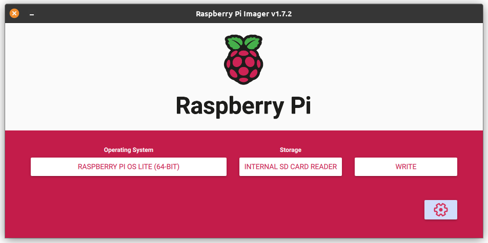
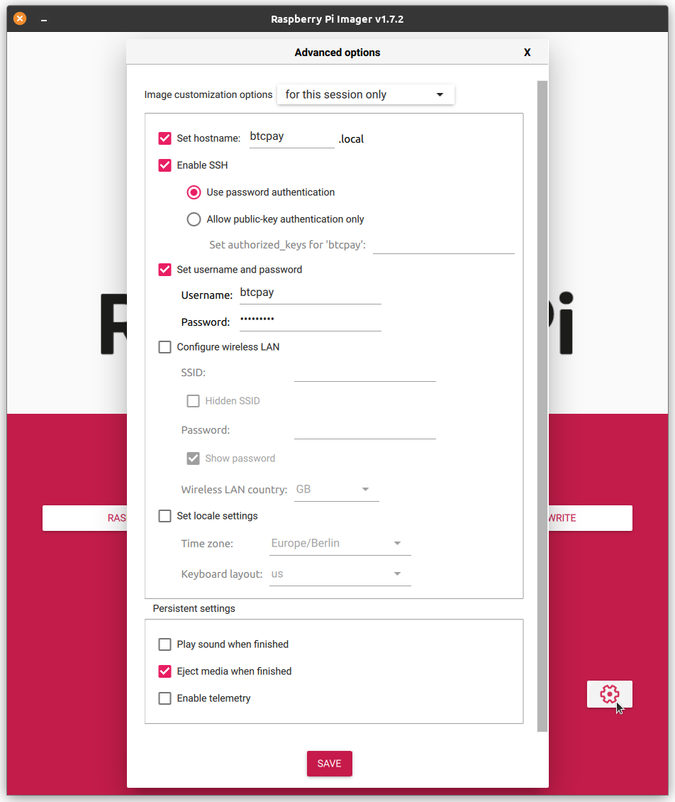

# Usambazaji wa Raspberry Pi

Hati hii inakuongoza hatua kwa hatua juu ya **jinsi ya kuendesha BTCPay Server kwenye Raspberry Pi 4**.

**Raspberry Pi 4** kwa sasa ni kompyuta bora ya bodi moja ya gharama nafuu inayopatikana.
Unaweza **kutumia Raspberry Pi 4 kuendesha BTCPay Server yako** nyumbani kwa takriban $150 ya thamani ya sehemu, zilizoelezwa hapa chini.

Tayari una Raspberry Pi 4 yenye vipimo vifuatavyo?

- Kumbukumbu ya 4GB
- 1TB USB 3.0 SSD
- Kadi ya SD ya 16GB au zaidi

Ikiwa ndivyo, unaweza kwenda moja kwa moja kwenye [maelekezo ya haraka](#kuanzakwa-haraka).
Vinginevyo, hiki ndicho unachohitaji ...

## Vifaa Vinavyohitajika

### Raspberry Pi 4

- [Raspberry Pi 4 yenye **4GB RAM**](https://www.canakit.com/raspberry-pi-4-4gb.html) (~$65)
- [Sandisk 16GB SD Card](https://www.amazon.com/dp/B073K14CVB/) (~$10)

Usikubali 1GB au 2GB ya RAM pekee. Toleo la **4GB RAM** ni vigumu zaidi kupatikana kuliko matoleo mengine, lakini unahitaji kabisa hiyo **4GB ya RAM** kwa dola chache za ziada, na inafaa kabisa kutumia dakika chache za ziada kutafuta kwenye Mtandao ili kupata muuzaji ambaye ana toleo la 4GB RAM kwenye hisa. Utahitaji pia **kisoma kadi ya SD** ikiwa tayari huna.

### Chaguzi za Hifadhi ya Data

- [Samsung SSD T7 1TB](https://www.amazon.com/dp/B0874XN4D8/) (~$100)
- [SanDisk Ultra 3D 1TB](https://www.amazon.com/dp/B071KGRXRG/) (~$100)

SSD ya 1TB inakuruhusu kuweka nakala kamili ya blockchain ya Bitcoin.
Unaweza pia kutumia BTCPay Server bila nakala kamili ya blockchain ya Bitcoin kwa kutumia [chaguo la kupogoa](/Docker/#how-i-can-prune-my-nodes).

### Chaguzi za Adapta ya Nguvu

- [Adapta Rasmi ya Nguvu ya Raspberry Pi 4 USB-C 5.1V/3A kwa Marekani](https://shop.pimoroni.com/products/raspberry-pi-official-usb-c-power-supply-us?variant=29391144648787) ($10)
- [Adapta Rasmi ya Nguvu ya Raspberry Pi 4 USB-C 5.1V/3A kwa EU](https://shop.pimoroni.com/products/raspberry-pi-official-usb-c-power-supply-eu?variant=29391130624083) ($10)
- [Adapta Rasmi ya Nguvu ya Raspberry Pi 4 USB-C 5.1V/3A kwa AU](https://shop.pimoroni.com/products/raspberry-pi-official-usb-c-power-supply-au?variant=29391160737875) ($10)

Usipoteze muda wako na adapta za nguvu za bei nafuu za nasibu kutoka Amazon, au kutarajia kuwa zile ulizo nazo nyumbani zitafanya kazi vizuri. Raspberry Pi 4 ina matatizo na adapta zisizo rasmi, na kwa $10 pekee ni bora **kupata adapta rasmi** badala ya kujifunza hili kwa njia ngumu.

### Chaguzi za Kasha na Kupoza

- [Flirc Heatsink Case](https://www.amazon.com/dp/B07WG4DW52/) (~$15)
- [Kasha la alumini la kupoza pasiv](https://www.amazon.com/dp/B07VQRYTPR/) (~$15)

Bila shaka, kutumia kasha ni hiari kabisa, lakini tunapendekeza moja kulinda Raspberry Pi yako kwa muda mrefu.
Kwa ukali, hauitaji suluhisho la kupoza, lakini hakika **unataka** angalau kupoza pasiv.
Mara tu joto la msingi la Raspberry PI linafikia 70°C, litapunguza kasi ya CPU.

## Kuanza kwa Haraka

Pakua na ufungue [Raspberry Pi Imager](https://www.raspberrypi.com/software/) ya hivi karibuni.



Chagua chaguzi zifuatazo:

- Mfumo wa Uendeshaji: Raspberry Pi OS Lite (64-bit)
  - Ipate kupitia "Raspberry Pi OS (Nyingine)"
- Hifadhi: Chagua kadi yako ya SD

Fungua Mipangilio ya Kina kupitia kitufe kwenye kona ya chini kulia.



Mipangilio ya Kina:

- Weka jina la mwenyeji kwa unavyopenda, mwongozo huu unadhani `btcpay.local`.
- Imewasha SSH
- Weka jina la mtumiaji na nenosiri, mwongozo huu unadhani `btcpay` kama jina la mtumiaji.

Mipangilio mingine ni hiari, huhitaji kusanidi LAN isiyo na waya.

Funga Mipangilio ya Kina na bonyeza kitufe cha "Andika".

### Kusanidi Raspberry Pi

Mara tu picha imeandikwa kwenye kadi ya SD, unaweza kuitoa na kuiingiza kwenye Raspberry Pi.
Unganisha SSD na kebo ya mtandao kwenye Raspberry Pi.
Mwishowe, unganisha kebo ya nguvu — hii inaanza mchakato wa kuwasha.
Inapaswa kuwaka na kupata anwani ya IP kwa kutumia DHCP.

Ingia kwenye Raspberry Pi kwa kutumia vitambulisho ulivyosanidi kwenye Raspberry Pi Imager:

```bash
ssh btcpay@btcpay.local
```

Thibitisha swali la `Are you sure you want to continue connecting?` kwa `yes`

Ikiwa Raspberry Pi yako haiwezi kupatikana kwa anwani ya `btcpay.local`, utahitaji kuingia kwenye kipanga njia chako ili kupata anwani yake ya IP.
Anwani ya IP ambayo Raspberry Pi yangu ilipata ilikuwa `192.168.1.5`.

```bash
ssh btcpay@192.168.1.5
```

Badilisha hadi mtumiaji wa `root`:

```bash
sudo su -
```

Baadaye, unaweza kuchagua kati ya [LND](https://github.com/lightningnetwork/lnd) na [Core Lightning](https://github.com/ElementsProject/lightning) kwa nodi yako ya Lightning.

**Inahitajika:** Chagua moja kati ya zifuatazo ...

```bash
# Core Lightning
export BTCPAYGEN_LIGHTNING="clightning"

# LND
export BTCPAYGEN_LIGHTNING="lnd"
```

**Hiari:** Unaweza pia kusanidi [mipangilio ya ziada](/Docker/#environment-variables) ...

```bash
# hiari, huu ni mfano tu wa kuendesha nodi iliyopogolewa kwenye kikoa cha umma
export BTCPAYGEN_ADDITIONAL_FRAGMENTS="opt-save-storage"
export BTCPAY_ADDITIONAL_HOSTS="btcpay.YourDomain.com"
```

Pakua na endesha hati ya usakinishaji:

```bash
wget -O btcpayserver-install.sh https://raw.githubusercontent.com/btcpayserver/btcpayserver-doc/master/scripts/btcpayserver-rpi4-install.sh
chmod +x btcpayserver-install.sh
. btcpayserver-install.sh
```

Baada ya usanidi wa awali kukamilika, fungua kivinjari kwenye kompyuta nyingine na nenda kwa `btcpay.local`.

:::tip
Usakinishaji wako umekamilika na nodi yako inapaswa kuwa imeanza kusawazisha.
Kwa nodi kamili ya Bitcoin, upakuaji wa awali wa block unachukua takriban masaa 40 baada ya usakinishaji.
:::

Ikiwa una hamu ya kujua, haya ni maelezo ya kile ambacho hati za usakinishaji hapo juu hufanya ...

## Maelekezo ya Kina Hatua kwa Hatua

Hizi ni hatua zinazofuata baada ya mchakato wa jumla wa usanidi ulioelezwa katika [maelekezo ya haraka](#kuanzakwa-haraka).

:::tip KUMBUKA
Hatua zifuatazo zinahitaji wewe kuwa mtumiaji wa mizizi.

```bash
sudo su -
```

:::

### Sasisha vifurushi vya OS hadi vya hivi karibuni

```bash
apt update && apt upgrade -y && apt autoremove
```

### Kusanidi hifadhi

Tunapendekeza kuzima swap ili kuzuia kuchoma kadi yako ya SD:

```bash
dphys-swapfile swapoff
dphys-swapfile uninstall
update-rc.d dphys-swapfile remove
systemctl disable dphys-swapfile
```

Gawa SSD yako kwa vigae:

```bash
fdisk /dev/sda
# andika 'p' kuorodhesha vigae vilivyopo
# andika 'd' kufuta vigae vilivyochaguliwa kwa sasa
# andika 'n' kuunda kigae kipya
# andika 'w' kuandika jedwali jipya la kigae na kutoka fdisk
```

Unda muundo kwenye kigae kipya kwenye SSD yako:

```bash
mkfs.ext4 /dev/sda1
```

Sanidi kigae cha SSD kupachika kiotomatiki wakati wa kuwasha:

```bash
mkfs.ext4 /dev/sda1
mkdir /mnt/usb
UUID="$(sudo blkid -s UUID -o value /dev/sda1)"
echo "UUID=$UUID /mnt/usb ext4 defaults,noatime,nofail 0 0" | sudo tee -a /etc/fstab
mount -a
```

Unapohariri `/etc/fstab` ongeza mfumo wa faili wa RAM kwa kumbukumbu (hiari).
Hii pia ni kuzuia kuchoma kadi yako ya SD haraka sana:

```bash
echo 'none /var/log tmpfs size=10M,noatime 0 0' >> /etc/fstab
```

### Sakinisha Docker

```bash
apt install apt-transport-https ca-certificates curl gnupg lsb-release -y
curl -fsSL https://download.docker.com/linux/debian/gpg | gpg --dearmor -o /usr/share/keyrings/docker-archive-keyring.gpg
echo "deb [arch=$(dpkg --print-architecture) signed-by=/usr/share/keyrings/docker-archive-keyring.gpg] https://download.docker.com/linux/debian \
  $(lsb_release -cs) stable" | tee /etc/apt/sources.list.d/docker.list > /dev/null
apt update
apt -y install docker-ce docker-ce-cli containerd.io
```

### Unda mahali pa kupachika kwa viwango vya Docker

```bash
rm -rf /var/lib/docker
mkdir -p /var/lib/docker
mount --bind /mnt/usb /var/lib/docker
echo "/mnt/usb /var/lib/docker none bind,nobootwait 0 2" >> /etc/fstab
systemctl restart docker
```

### Kusanidi firewall

Sakinisha firewall na ruhusu SSH, HTTP, HTTPS, Bitcoin, na Lightning:

```bash
apt install -y ufw
ufw default deny incoming
ufw default allow outgoing
```

Amri hii inaruhusu miunganisho ya SSH kutoka kwenye mitandao ya ndani pekee:

```bash
ufw allow from 10.0.0.0/8 to any port 22 proto tcp
ufw allow from 172.16.0.0/12 to any port 22 proto tcp
ufw allow from 192.168.0.0/16 to any port 22 proto tcp
ufw allow from 169.254.0.0/16 to any port 22 proto tcp
ufw allow from fc00::/7 to any port 22 proto tcp
ufw allow from fe80::/10 to any port 22 proto tcp
ufw allow from ff00::/8 to any port 22 proto tcp
```

Bandari hizi zinahitaji kufikiwa kutoka popote (Subnet ya msingi ni 'any' isipokuwa utabainisha moja):

```bash
ufw allow 80/tcp
ufw allow 443/tcp
ufw allow 8333/tcp
ufw allow 9735/tcp

# Wezesha firewall
ufw enable

# Thibitisha usanidi
ufw status
```

### Sanidi BTCPay Server

Pakua BTCPay Server kutoka GitHub:

```bash
cd # hakikisha tuko kwenye nyumba ya mizizi
apt install -y fail2ban git
git clone https://github.com/btcpayserver/btcpayserver-docker
cd btcpayserver-docker
```

Sanidi BTCPay kwa kuweka baadhi ya [vigezo vya mazingira](https://github.com/btcpayserver/btcpayserver-docker#environment-variables):

```bash
export BTCPAY_HOST="btcpay.local"
export REVERSEPROXY_DEFAULT_HOST="$BTCPAY_HOST"
export NBITCOIN_NETWORK="mainnet"
export BTCPAYGEN_CRYPTO1="btc"
export BTCPAYGEN_LIGHTNING="clightning"
export BTCPAYGEN_REVERSEPROXY="nginx"
export BTCPAYGEN_ADDITIONAL_FRAGMENTS="opt-more-memory"
export BTCPAY_ENABLE_SSH=true
```

Ikiwa unataka kutumia majina ya mwenyeji mengi, yaongeze kupitia kigezo cha hiari cha `BTCPAY_ADDITIONAL_HOSTS`:

```bash
export BTCPAY_ADDITIONAL_HOSTS="btcpay.YourDomain.com"
```

Iwapo unataka kuzuia ufikiaji kwenye mtandao wako wa ndani pekee, tafadhali kumbuka kuwa unahitaji kutumia kikoa cha `.local`.

Endesha usakinishaji wa BTCPay:

```bash
. ./btcpay-setup.sh -i
```

Inapaswa kuwa tayari na kufanya kazi ndani ya dakika chache. Jaribu kufungua http://btcpay.local kwenye kivinjari chako cha wavuti. Ikiwa kila kitu ni sahihi, utaona ukurasa wa mbele wa BTCPay Server.

Sasa, unahitaji tu kusubiri siku moja au zaidi kwa blockchain ya Bitcoin [kusawazisha na kuthibitisha kikamilifu](../FAQ/Synchronization.md). Chini ya kiolesura cha mtumiaji cha wavuti cha BTCPay Server kitaonyesha kisanduku cha mazungumzo ibukizi kufuatilia maendeleo.

### FastSync (hiari)

Tafadhali soma kwa uangalifu sana kuelewa [FastSync](/Docker/fastsync.md) ni nini na kwa nini ni muhimu kuthibitisha seti ya UTXO mwenyewe.

Kwa kutumia FastSync, unajiweka wazi kwa mashambulizi ikiwa [picha mbovu ya seti ya UTXO](https://github.com/btcpayserver/btcpayserver-docker/blob/master/contrib/FastSync/README.md#what-are-the-downsides-of-fast-sync) itatumwa kwako.
Ikiwa una nodi nyingine inayoaminika mahali pengine, unaweza kuangalia uhalali wa seti ya UTXO iliyokusanywa na FastSync kwa kufuata [maelekezo haya](https://github.com/btcpayserver/btcpayserver-docker/blob/master/contrib/FastSync/README.md#dont-trust-verify).

```bash
# Simamisha BTCPay Server
cd /root/btcpayserver/btcpayserver-docker
./btcpay-down.sh

# Ingiza seti ya UTXO ya FastSync
cd contrib/FastSync
./load-utxo-set.sh
```

FastSync kwa sasa inachukua takriban dakika 30 kwenye muunganisho wa mtandao wa kasi ya juu.
Baada ya FastSync kumaliza, endesha amri ifuatayo kuanzisha upya BTCPay Server:

```bash
cd ../..
./btcpay-up.sh
```
