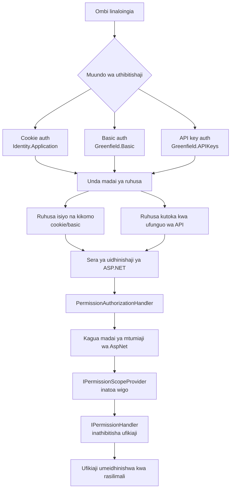

# Kupanua ruhusa

**Jedwali la yaliyomo**

[[toc]]

## Kuongeza ufafanuzi mpya wa Sera

Programu-jalizi inaweza kufafanua sera maalum kwa kuingiza moja kwa moja `PolicyDefinition` kwenye `ServiceCollection`.

```csharp
private void AddPolicies(IServiceCollection services)
{
    services.AddPolicyDefinitions(new[]
    {
        new PolicyDefinition(
            SubscriptionsPolicies.CanViewOfferings,
            new PermissionDisplay("View your offerings", "Allows viewing offerings on all your stores."),
            new PermissionDisplay("View your offerings", "Allows viewing offerings on the selected stores.")),
        new PolicyDefinition(
            SubscriptionsPolicies.CanModifyOfferings,
            new PermissionDisplay("Modify your offerings", "Allows modifying offerings on all your stores."),
            new PermissionDisplay("Modify your offerings", "Allows modifying offerings on the selected stores."),
            new[] { SubscriptionsPolicies.CanViewOfferings, SubscriptionsPolicies.CanManageSubscribers, SubscriptionsPolicies.CanCreditSubscribers },
            includedByPermissions: [Policies.CanModifyStoreSettings]),
        new PolicyDefinition(
            SubscriptionsPolicies.CanManageSubscribers,
            new PermissionDisplay("Manage your subscribers", "Allows managing subscribers on all your stores."),
            new PermissionDisplay("Manage your subscribers", "Allows managing subscribers on the selected stores.")),
        new PolicyDefinition(
            SubscriptionsPolicies.CanCreditSubscribers,
            new PermissionDisplay("Credit your subscribers", "Allows crediting subscribers on all your stores."),
            new PermissionDisplay("Credit your subscribers", "Allows crediting subscribers on the selected stores.")),
    });
}
```

### Majina ya sera

1. Kila jina la sera linahitaji kuanza na `btcpay.`
2. Sera kutoka kwa programu-jalizi ambazo zina duka kama wigo zinapaswa kuanza na `btcpay.plugin.store`
3. Sera kutoka kwa programu-jalizi ambazo wigo wake ni mipangilio ya seva (wasimamizi wa seva pekee) zinapaswa kuanza na `btcpay.plugin.server`
4. Sera kutoka kwa programu-jalizi ambazo wigo wake ni mtumiaji zinapaswa kuanza na `btcpay.plugin.user`

Sera zenye wigo wa mtumiaji kwa kawaida ni ruhusa zisizo na wigo, isipokuwa ukitoa mtoaji wa wigo na kishughulikiaji maalum kwa upeo wa kila mtumiaji.

Ikiwa sera yako siyo mojawapo ya aina hizo, unaweza kuhitaji kutekeleza mtoaji wako wa wigo na kishughulikiaji cha ruhusa kama ilivyoelezwa hapa chini.

### Mti wa sera

Inawezekana kwa sera kujumuisha nyingine kiotomatiki.

Katika mfano hapa chini, sera `SubscriptionsPolicies.CanModifyOfferings` inajumuisha `SubscriptionsPolicies.CanViewOfferings`.

Na, kupitia `includedByPermissions`, ruhusa `SubscriptionsPolicies.CanModifyOfferings` inajumuishwa na `Policies.CanModifyStoreSettings`.

Kwa hivyo ikiwa mtumiaji amepewa `Policies.CanModifyStoreSettings`, basi pia atapewa `SubscriptionsPolicies.CanModifyOfferings` na `SubscriptionsPolicies.CanViewOfferings`.

```csharp
new PolicyDefinition(
            SubscriptionsPolicies.CanModifyOfferings,
            new PermissionDisplay("Modify your offerings", "Allows modifying offerings on all your stores."),
            new PermissionDisplay("Modify your offerings", "Allows modifying offerings on the selected stores."),
            new[] { SubscriptionsPolicies.CanViewOfferings, SubscriptionsPolicies.CanManageSubscribers, SubscriptionsPolicies.CanCreditSubscribers },
            includedByPermissions: [Policies.CanModifyStoreSettings])
```

## Ruhusa za BTCPay Server

Ruhusa katika BTCPay Server zinaweza kupewa ufunguo wa API unaozalishwa na mtumiaji. Ruhusa inaundwa na:

1. `Sera ya BTCPay` kama ilivyofafanuliwa na `PolicyDefinition` iliyoingizwa
2. `Wigo` wa hiari

Kwa mfano, `btcpay.store.cancreateinvoice:2wN4XCmJJGXcp5NtPUJN1jn4h4K6` ina sera ya BTCPay `btcpay.store.cancreateinvoice` na wigo `2wN4XCmJJGXcp5NtPUJN1jn4h4K6`.

- Bila wigo, `btcpay.store.cancreateinvoice` inamaanisha ufunguo wa API unaweza kuunda ankara katika maduka yote ya mtumiaji.
- Kwa wigo, `btcpay.store.cancreateinvoice:2wN4XCmJJGXcp5NtPUJN1jn4h4K6` inamaanisha ufunguo wa API unaweza kuunda ankara kwenye duka `2wN4XCmJJGXcp5NtPUJN1jn4h4K6` pekee.

## Vichakataji vya Uthibitishaji

Uthibitishaji kwa BTCPay Server unaweza kutokea kwa njia tatu tofauti:

1. `Cookie authentication`, inayotumika kwa njia zote za UI (`Identity.Application`)
2. `Basic authentication`, inayotumika na njia za API (`Greenfield.Basic`)
3. `ApiKey authentication`, inayotumia funguo za API zinazohusishwa na mtumiaji kufikia njia za API (`Greenfield.APIKeys`)

Miundo miwili ya Greenfield inarejelewa na `AuthenticationSchemes.Greenfield`, na muundo wa kuki na `AuthenticationSchemes.Cookie`.

Kufuatia uthibitishaji, kishughulikiaji kinaathiri madai ya ruhusa kwa mtumiaji (`GreenfieldConstants.ClaimTypes.Permission`). Jukumu la madai hayo ni kupunguza haki za mtumiaji anayefanya wito.

### APIKeysAuthenticationHandler

Kishughulikiaji hiki cha uthibitishaji kinathibitisha maombi kulingana na kichwa cha `Authorization` cha ombi la HTTP. (`Authorization: token $API_KEY`)

Huu ni mfano wa kutumia kishughulikiaji hiki cha uthibitishaji (`AuthenticationSchemes.Greenfield`).

```csharp
[Authorize(Policy = Policies.CanViewInvoices,
    AuthenticationSchemes = AuthenticationSchemes.Greenfield)]
[HttpGet("~/api/v1/stores/{storeId}/invoices")]
public async Task<IActionResult> GetInvoices(string storeId, [FromQuery] string[]? orderId = null, [FromQuery] string[]? status = null,
```

BTCPay Server inaambatisha madai ya ruhusa yanayohusishwa na ufunguo wa API kwa mtumiaji.

### BasicAuthenticationHandler

Kishughulikiaji hiki cha uthibitishaji kinathibitisha maombi kulingana na kichwa cha `Authorization` cha ombi la HTTP. (`Authorization: basic base64(user@example.com:password)`)

Njia hii ya uthibitishaji ina kikomo cha kiwango, na imekusudiwa tu kuunda Ufunguo wa API kwa mtumiaji mpya. Shughuli za kawaida zinapaswa kutumia Funguo za API.

Kama ilivyo kwa `APIKeysAuthenticationHandler`, njia zinazotumia `AuthenticationSchemes.Greenfield` pia zinaunga mkono njia hii.

BTCPay Server inaingiza dai la ruhusa la `Unrestricted` kwa mtumiaji. (Hii inamaanisha kwamba kishughulikiaji hiki hakipunguzi ruhusa za mtumiaji.)

### CookieAuthenticationHandler

Kishughulikiaji hiki cha uthibitishaji ni sehemu ya maktaba ya ASP.NET na kinathibitisha maombi kwa njia za UI kwa kutumia kuki za HTTP.

Huu ni mfano wa njia inayotumia kishughulikiaji hiki cha uthibitishaji. (`AuthenticationSchemes.Cookie`)

```csharp
[HttpGet("/stores/{storeId}/invoices/{invoiceId}")]
[Authorize(Policy = Policies.CanViewInvoices, AuthenticationSchemes = AuthenticationSchemes.Cookie)]
public async Task<IActionResult> Invoice(string invoiceId)
```

BTCPay Server inaingiza dai la ruhusa la `Unrestricted` kwa mtumiaji. (Hii inamaanisha kwamba kishughulikiaji hiki hakipunguzi ruhusa za mtumiaji.)

## Sera za uidhinishaji

Sera za uidhinishaji zinafafanua mahitaji ambayo mtumiaji lazima ayatimize ili kufikia huduma.
Kwa kila `PolicyDefinition` iliyosajiliwa, BTCPay Server inaunda sera mbili za uidhinishaji za ASP.NET (zisichanganywe na sera za BTCPay hapo juu):

- Moja ambapo ruhusa isiyo na wigo haihitajiki. (k.m. `btcpay.store.canviewstoresettings`)
- Moja ambapo ruhusa isiyo na wigo inahitajika. (k.m. `btcpay.store.canviewstoresettings:`, kumbuka `:` inayofuata)

Katika mfano ufuatao, `GetStores` inaweza kuitwa na ufunguo wa API wenye ruhusa yenye wigo (k.m. `btcpay.store.canviewstoresettings:2wN4XCmJJGXcp5NtPUJN1jn4h4K6`).
Utekelezaji wa `GetStores` unategemea `HttpContext.GetStoresData`, ambayo imewekwa kiotomatiki na kishughulikiaji cha ruhusa kwa maduka yote ambayo ufunguo wa API una ufikiaji (katika hali hii ni `2wN4XCmJJGXcp5NtPUJN1jn4h4K6` pekee).

Ikiwa ufunguo wa API una ruhusa isiyo na wigo, maduka yote yataorodheshwa.

```csharp
[Authorize(Policy = Policies.CanViewStoreSettings, AuthenticationSchemes = AuthenticationSchemes.Greenfield)]
[HttpGet("~/api/v1/stores")]
public async Task<ActionResult<IEnumerable<Client.Models.StoreData>>> GetStores()
{
    var storesData = HttpContext.GetStoresData();
    var stores = new List<Client.Models.StoreData>();
    foreach (var storeData in storesData)
    {
        stores.Add(await FromModel(storeData));
    }
    return Ok(stores);
}
```

Hata hivyo, katika mfano ufuatao, tunatumia `CanModifyStoreSettingsUnscoped` (`btcpay.store.canmodifystoresettings:`) badala ya `Policies.CanViewStoreSettings` (`btcpay.store.canviewstoresettings`).

```csharp
        [HttpPost("~/api/v1/stores")]
        [Authorize(Policy = Policies.CanModifyStoreSettingsUnscoped, AuthenticationSchemes = AuthenticationSchemes.Greenfield)]
        public async Task<IActionResult> CreateStore(CreateStoreRequest request)
```

Katika hali hii, ufunguo wa API wa awali wenye ruhusa `btcpay.store.canmodifystoresettings:2wN4XCmJJGXcp5NtPUJN1jn4h4K6` hauwezi kuunda duka jipya, kwa sababu sera ya ASP.NET inahitaji ruhusa isiwe na wigo.

Katika BTCPay Server, kijenzi kinachohusika na kukagua uidhinishaji ni `PermissionAuthorizationHandler`.

### PermissionAuthorizationHandler

Darasa hili linakagua ikiwa ombi la sasa linakidhi sera ya uidhinishaji kwa njia hiyo.

Kwanza, kishughulikiaji cha uidhinishaji kinajaribu kujua ni rasilimali gani inayofikiwa haswa.
Katika BTCPay Server, tunaita hii `wigo`, na programu-jalizi zinaweza kubinafsisha jinsi ya kupata wigo kutoka kwa ombi kwa kutekeleza `IPermissionScopeProvider`.

Kwa chaguo-msingi, BTCPay Server inakuja na `BuiltInPermissionScopeProvider` ambayo inaweza kutoa wigo wa sera za duka kutoka kwa vigezo vya data vya njia. (Angalia sehemu inayofuata)

Mara wigo (ikiwepo) unapofafanuliwa, kuna viwango viwili vya ukaguzi wa ruhusa kabla ya kuidhinisha ombi:

1. Je, madai ya mtumiaji aliyethibitishwa yanapunguza ruhusa iliyoombwa?
2. Je, mtumiaji anaweza kweli kufikia ombi? (`IPermissionHandler`)

Programu-jalizi inaweza kubinafsisha ikiwa mtumiaji kweli ana ufikiaji wa rasilimali kwa kutekeleza `IPermissionHandler`.
Hata hivyo, BTCPay Server tayari inakuja na kishughulikiaji cha ruhusa kilichojengwa ndani (`BuiltInPermissionHandler`) kinachokagua sera za seva na duka:

- Kwa sera za duka, inakagua mara mbili kwamba jukumu la duka la mtumiaji lina ruhusa iliyoombwa.
- Kwa sera za seva, inakagua mara mbili kwamba mtumiaji ana jukumu la Msimamizi wa Seva la ASP.NET.



#### BuiltInPermissionScopeProvider

`BuiltInPermissionScopeProvider` ni utekelezaji uliojengwa ndani wa `IPermissionScopeProvider`, na inatoa sehemu za upanuzi kutatua wigo wa duka kutoka kwa thamani za njia.

Katika mfano hapa chini, ikiwa mtumiaji anaita API hii na `storeid=2wN4XCmJJGXcp5NtPUJN1jn4h4K6`, wigo unatolewa kuwa `2wN4XCmJJGXcp5NtPUJN1jn4h4K6` na kwa hivyo `PermissionAuthorizationHandler` itakagua ikiwa ruhusa `btcpay.store.canviewstoresettings:2wN4XCmJJGXcp5NtPUJN1jn4h4K6` inaweza kutimizwa.

```csharp
[Authorize(Policy = Policies.CanViewStoreSettings, AuthenticationSchemes = AuthenticationSchemes.Greenfield)]
[HttpGet("~/api/v1/stores/{storeId}")]
public async Task<IActionResult> GetStore(string storeId)
```

Wigo umefafanuliwa kutoka kwa kaida na `BuiltInPermissionScopeProvider`, utekelezaji wetu wa chaguo-msingi wa `IPermissionScopeProvider`.

`BuiltInPermissionScopeProvider` inatoa wigo kiotomatiki kutoka kwa data ya njia: `appId`, `invoiceId`, `payReqId`, na `storeId` kwa sera zozote za duka. (k.m. sera inayoanza na `btcpay.plugin.store` au `btcpay.store`)

Programu-jalizi zinaweza pia kutoa utekelezaji wao wa `IPermissionScopeProvider` kwa mantiki tofauti kabisa.

Hata hivyo, inaweza pia kupanua `BuiltInPermissionScopeProvider` tu kuunga mkono data nyingine za njia zinazostahili. (angalia sehemu hapa chini kuhusu `BuiltInPermissionScopeProvider`)

Kwa mfano, mfano huu hapa chini utasababisha wigo wa duka kupatikana kwa njia yoyote yenye thamani `appId` kwa kuendesha ombi `SELECT \"StoreDataId\" FROM \"Apps\" WHERE \"Id\" = @id`.

```csharp
services.AddSingleton(new BuiltInPermissionScopeProvider.RouteValueToStoreIdQuery("appId", "SELECT \"StoreDataId\" FROM \"Apps\" WHERE \"Id\" = @id"));
```

Ikiwa storeId ya programu ni `ABC`, njia kama hii itatathmini ipasavyo `btcpay.store.canviewstoresettings:ABC`

```csharp
[HttpPost("~/api/v1/apps/{appId}")]
[Authorize(Policy = "btcpay.store.canviewstoresettings", AuthenticationSchemes = AuthenticationSchemes.Greenfield)]
public async Task<IActionResult> GetApp(string appId)
```

BTCPay Server yenyewe inatumia sehemu hii ya upanuzi kutoa wigo (storeId) kutoka kwa `appId`, `payReqId` na `invoiceId`:

```csharp
foreach (var routeDataToStoreId in new BuiltInPermissionScopeProvider.RouteValueToStoreIdQuery[]
            {
                new("appId", "SELECT \"StoreDataId\" FROM \"Apps\" WHERE \"Id\" = @id"),
                new("payReqId", "SELECT \"StoreDataId\" FROM \"PaymentRequests\" WHERE \"Id\" = @id"),
                new("invoiceId", "SELECT \"StoreDataId\" FROM \"Invoices\" WHERE \"Id\" = @id"),
            })
    services.AddSingleton(routeDataToStoreId);
```

Kumbuka kwamba `BuiltInPermissionScopeProvider` inatumika tu kwa sera za duka. (k.m. zinazoanza na `btcpay.store` au `btcpay.plugin.store`)

### Visaidizi vya sera za duka

Baada ya uidhinishaji uliofaulu, BTCPay Server itaweka vipengee kiotomatiki katika `HttpContext` ambavyo utekelezaji wa njia unaweza kutumia.

- `HttpContext.GetStoreData()` (au `HttpContext.GetStoresData()` ikiwa hakuna wigo uliopatikana kwenye njia)
- `HttpContext.GetAppData()`
- `HttpContext.GetPaymentRequestData()`
- `HttpContext.GetInvoiceData()`
