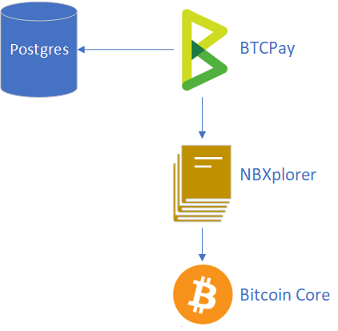
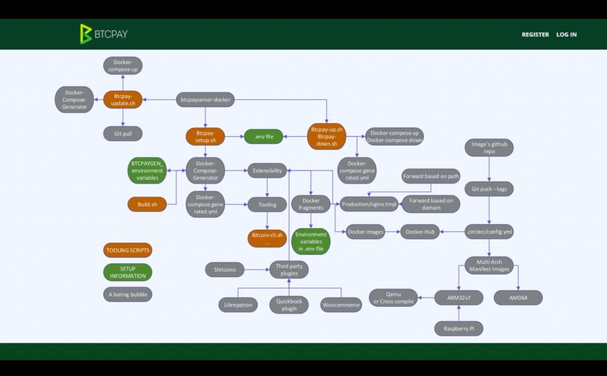

# Usanifu

BTCPay Server ni mradi unaounganisha **vipengele kadhaa vinavyohusiana na Bitcoin** kuwa uzoefu thabiti wa mtumiaji kwa kusanikisha na kudhibiti kichakataji chako cha malipo.

Usanidi mdogo unahusisha:

- [BTCPay Server](https://github.com/btcpayserver/btcpayserver)
- [NBXplorer](https://github.com/dgarage/NBXplorer) (Kichunguzi chepesi cha bloku, kinachohusika na kufuatilia malipo)
- Bitcoin Core
- PostgreSQL

Zaidi ya hayo, ikiwa unahitaji ufikiaji wa Lightning Network, NBXplorer inasaidia miunganisho kwa:

- Core Lightning (CLN) (kupitia soketi za unix)
- LND (kupitia kiolesura cha REST)

Video hapa chini inaonyesha **Usanifu wa BTCPay** kwa kina.

---

Tunatoa njia kadhaa za kusambaza BTCPay Server, kulingana na kama unapendelea unyumbufu au urahisi wa matumizi.

Kutoka njia rahisi zaidi hadi ngumu zaidi:

- [Usambazaji wa Web-Interface LunaNode](/Deployment/LunaNode.md)
- [Usambazaji wa Azure](/Deployment/Azure.md) (Kwa kutumia usambazaji wa bonyeza mara moja kwenye Microsoft Azure)
- [Usambazaji wa Docker](https://docs.btcpayserver.org/Docker/) (Kwa kutumia faili ya `docker-compose.yml` inayounganisha tegemezi zote pamoja, katika karibu mazingira yoyote)
- [Usambazaji wa mkono](/Deployment/ManualDeployment.md) (Kupakua, kujenga na kuendesha tegemezi zote mwenyewe)

Baadhi ya wanajamii pia hutoa [upangishaji wa wahusika wengine](/Deployment/ThirdPartyHosting.md) (Kuwa na mtu mwingine akikusimamia BTCPay Server).

Kumbuka **thamani kubwa** ya kuwa na **udhibiti wa moja kwa moja** wa pochi yako na huduma ya wavuti; kwa sababu hii tunapendekeza utumie [usambazaji wa Azure](/Deployment/Azure.md) au [usambazaji wa Web-Interface](/Deployment/LunaNode.md) na **ufanye usanidi mwenyewe** - ni rahisi sana!