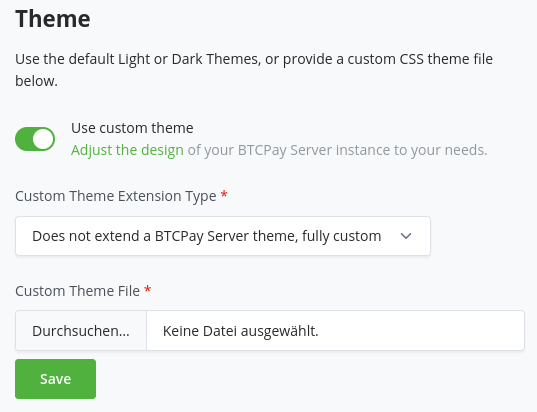

# Kubinafsisha mandhari

BTCPay Server imejengwa juu ya Bootstrap na inatoa unyumbufu wa kurekebisha mwonekano wake kulingana na mahitaji yako.
Jifunze zaidi kuhusu [vipimo vya kawaida vya muundo vinavyotumika katika BTCPay](https://design.btcpayserver.org/).

## Kuendeleza na kupanua mandhari maalum

Kiolesura cha mtumiaji cha BTCPay Server kimejengwa juu ya **toleo lililobinafsishwa la Bootstrap** linalounga mkono [sifa maalum za CSS](https://developer.mozilla.org/en-US/docs/Web/CSS/--*).
Hii inaturuhusu kubadilisha mipangilio inayohusiana na mandhari kama fonti na rangi bila kuathiri [`bootstrap.css`](#maelezo-kuhusu-bootstrap-css).
Pia tunaweza kutoa sehemu husika zilizobinafsishwa badala ya kusafirisha faili nzima ya `bootstrap.css` kwa kila mandhari.

Angalia [mandhari zilizofafanuliwa awali](https://github.com/btcpayserver/btcpayserver/blob/master/BTCPayServer/wwwroot/main/themes/) kupata muhtasari wa mbinu hii.

### Kurekebisha mandhari zilizopo

Ufafanuzi wa sifa maalum katika kiteuzi cha `:root` umegawanywa katika sehemu kadhaa, ambazo zinaweza kuonekana kama mtiririko:

- Sehemu ya kwanza ina ufafanuzi wa jumla (k.m. kwa rangi maalum za chapa na zisizo na upande).
- Sehemu ya pili inafafanua vigezo kwa madhumuni mahususi.
  Hapa unaweza kuorodhesha ufafanuzi wa jumla au kuunda mengine ya ziada.
- Sehemu ya tatu ina ufafanuzi kwa sehemu mahususi za ukurasa, sehemu au vijenzi.
  Hapa unapaswa kujaribu kutumia tena ufafanuzi kutoka juu kadri inavyowezekana ili kutoa mwonekano thabiti.

Vigezo vilivyofafanuliwa katika faili ya mandhari vinatumika katika faili ya [`site.css`](https://github.com/btcpayserver/btcpayserver/blob/master/BTCPayServer/wwwroot/main/site.css).

#### Kubatilisha viteuzi vya Bootstrap

Mbali na vigezo unaweza pia kutoa mitindo kwa **kuongeza viteuzi vya CSS** moja kwa moja kwenye faili hii.
Hii inaweza kuonekana kama suluhisho la mwisho iwapo hakuna kigezo cha kitu unachotaka kubadilisha au marekebisho madogo.

#### Kuongeza vigezo vya mandhari

Kwa ujumla ni wazo zuri kuanzisha **vigezo mahususi** kwa madhumuni maalum (kama kuweka rangi za viungo vya sehemu maalum).
Hii inaturuhusu kushughulikia sehemu binafsi za mitindo bila kuathiri sehemu nyingine ambazo zinaweza kuwa zimefungwa kwenye kigezo cha jumla.

Kwa hali ambazo unataka kuanzisha vigezo vipya vinavyotumika katika mandhari zote, viongeze kwenye faili ya `site.css`.
Faili hii ina marekebisho yetu ya mitindo ya Bootstrap.
Epuka kurekebisha `bootstrap.css` moja kwa moja – angalia [maelezo ya ziada](#maelezo-kuhusu-bootstrap-css) kwa sababu za hili.

#### Kuongeza mandhari mpya

Unapaswa kunakili moja ya mandhari zetu zilizofafanuliwa awali na kubadilisha vigezo kulingana na mahitaji yako.

Ili kujaribu na kucheza na marekebisho, unaweza pia kutumia zana za msanidi programu za kivinjari:
Kagua kipengele cha `<html>` na urekebishe vigezo katika sehemu ya `:root` ya mkaguzi wa mitindo.

Katika hali nyingi inapaswa kutosha kurekebisha rangi za msingi kama hivi:

```css
:root {
  --btcpay-primary-100: #fef3e6;
  --btcpay-primary-200: #fcdcb5;
  --btcpay-primary-300: #fbc584;
  --btcpay-primary-400: #f9ae53;
  --btcpay-primary-500: #f79621;
  --btcpay-primary-600: #de7d08;
  --btcpay-primary-700: #ac6106;
  --btcpay-primary-800: #7b4504;
  --btcpay-primary-900: #4a2a03;

  --btcpay-primary-rgb: 247,150,33;
  --btcpay-primary-accent-rgb: 222, 125, 8;
  --btcpay-primary: rgb(var(--btcpay-primary-rgb));
  --btcpay-primary-accent: rgb(var(--btcpay-primary-accent-rgb));
  --btcpay-primary-shadow: rgba(var(--btcpay-primary-rgb), .5);
}
```

Mara unapomaliza kurekebisha, hifadhi CSS kama faili na uipakie kwenye ukurasa wa `Server Settings > Branding`:



Mandhari itatumika mara baada ya kupakiwa.
Kwa mfano hapo juu, sehemu inaonekana kama hivi baada ya kutumia mandhari maalum:


