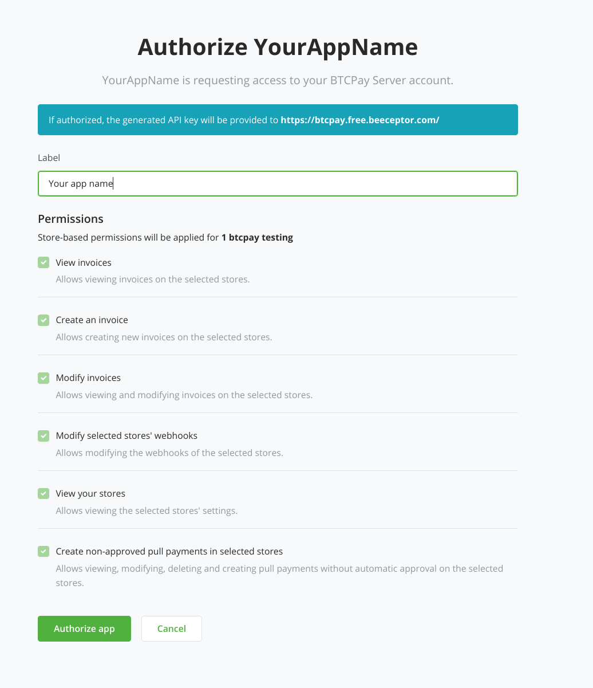
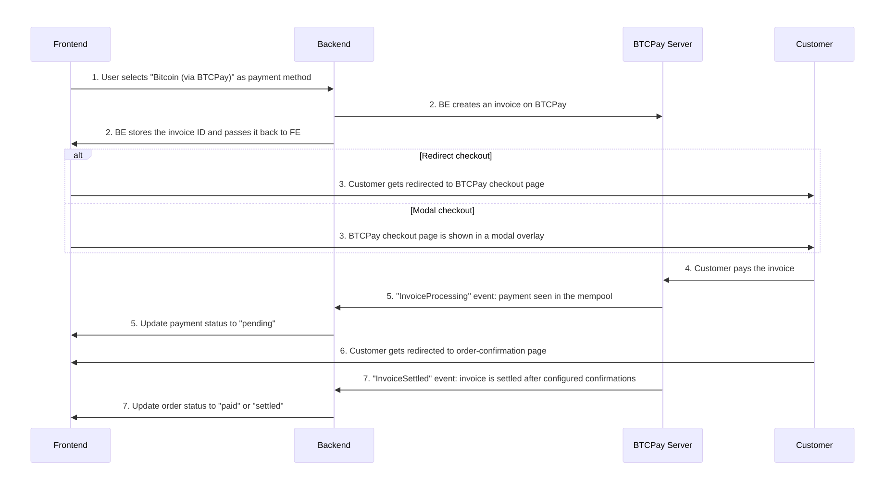

# Mwongozo wa Uunganishaji wa eCommerce

Hati hii inalenga kutoa mazoea bora na mwongozo wa jinsi ya kuunganisha BTCPay Server kama suluhisho la malipo katika eCommerce, ERP, Point of Sale au mifumo mingine. Ikiwa unataka kufanya uunganishaji mpana ambao pia unasimamia maduka na watumiaji kwenye BTCPay, mwongozo huu bado ni muhimu kama hatua ya kuanzia. Unaweza kupata mifano ya jinsi ya kusimamia BTCPay Server yako bila kiolesura cha picha kupitia [cURL](https://docs.btcpayserver.org/Development/GreenFieldExample/), [Node.js](https://docs.btcpayserver.org/Development/GreenFieldExample-NodeJS/) au [PHP](https://docs.btcpayserver.org/Development/GreenfieldExample-PHP/) katika nyaraka zetu.


## Yaliyomo
[[toc]]

## Maelezo ya jumla

Wazo la jumla ni kuwa na usanidi laini kwa watumiaji wako na uzoefu usio na mshono wa malipo kwa wateja wao. Kwa kutoa mchawi wa usanidi wa kiotomatiki kama ilivyoelezwa hapa chini unaweza kuepuka kuandika nyaraka nyingi na kufanya mchakato uwe rahisi iwezekanavyo kwa watumiaji wako.

## Nyaraka za Greenfield API

Unaweza kupata nyaraka za API ya kile tunachokiita Greenfield API [hapa](https://docs.btcpayserver.org/API/Greenfield/v1/) (au kwenye BTCPay Server yako kwenye njia ya `/docs`). Kama mwanzilishi wa haraka, tumefunika mifano ya vituo vya msingi zaidi vya uunganishaji wa eCommerce kwa [cURL](https://docs.btcpayserver.org/Development/GreenFieldExample/), [Node.js](https://docs.btcpayserver.org/Development/GreenFieldExample-NodeJS/) na [PHP](https://docs.btcpayserver.org/Development/GreenfieldExample-PHP/). Tutarejelea mifano hiyo katika hati hii yote.

Katika mifano hapa chini tunatumia seva yetu ya onyesho [https://mainnet.demo.btcpayserver.org](https://mainnet.demo.btcpayserver.org) kama mfano. Kwenye uunganishaji wako, hii itakuwa URL ya mfano wa BTCPay Server iliyotolewa na mtumiaji.

## Uthibitishaji

Uthibitishaji unaweza kufanywa kupitia Basic-Auth au funguo ya API. Kutumia Basic-Auth haipendekezwi kwani itakuwa na ufikiaji kamili wa mtumiaji wako kila wakati. Kwa funguo za API unaweza kutoa ruhusa za kina kwa kila duka ambazo haziwezi kufanya uharibifu mkubwa hata kama funguo yako ya API itavuja.

**Muhimu**: Kichwa cha Authorization kimeumbizwa hivi:

`Authorization: token API_KEY`
(Badilisha API_KEY na funguo halisi ya API)

Mfano kwa kutumia cURL:
```bash
curl -s \
     -H "Content-Type: application/json" \
     -H "Authorization: token API_KEY" \
     -X GET \
     "https://mainnet.demo.btcpayserver.org/api/v1/stores/STORE_ID"
```

### Funguo za API

Unaweza kuzalisha funguo za API kupitia [kituo cha uthibitishaji](https://docs.btcpayserver.org/API/Greenfield/v1/#tag/Authorization) (kama ilivyoelezwa kwa kina hapa chini katika [usanidi wa kiotomatiki](#usanidi-wa-kiotomatiki)) au kwa majaribio unaweza kufanya hivyo kwa mkono kama ilivyoelezwa kwenye [usanidi wa mkono](#usanidi-wa-mkono).

### Ruhusa

Unahitaji ruhusa zifuatazo kwa uunganishaji wa kawaida wa eCommerce na kama hatua ya kuanzia kuchakata malipo na marejesho:

`btcpay.store.canviewinvoices` \
`btcpay.store.cancreateinvoice` \
`btcpay.store.canmodifyinvoices` \
`btcpay.store.webhooks.canmodifywebhooks` \
`btcpay.store.canviewstoresettings` \
`btcpay.store.cancreatenonapprovedpullpayments`

Hii inakuwezesha kuwa na ruhusa za chini zinazohitajika kuunda ankara, marejesho na kusajili webhook kiprogramu. Unapaswa pia kuweka kikomo kwa funguo yako ya API kwa duka mahususi, vinginevyo funguo ya API itafanya kazi kwa maduka yote ya mtumiaji.


## Mazoea bora ya usanidi

### Usanidi wa kiotomatiki



Ili kufanya mtiririko wa muunganisho kati ya mfumo wako wa eCommerce na BTCPay Server uwe laini na rahisi iwezekanavyo kwa watumiaji wako, unaweza kuwaongoza kupitia mchawi wa usanidi. Hii inamaanisha kwamba kwa hakika mtumiaji anaingiza tu URL ya mfano wao wa BTCPay Server (km. [https://mainnet.demo.btcpayserver.org](https://mainnet.demo.btcpayserver.org)) na kubonyeza kitufe cha "_Unganisha BTCPay Server_" ambacho kitaanzisha mchakato ufuatao:

* Mtumiaji ataelekezwa kwenye ukurasa wa uthibitishaji wa BTCPay Server
* Mtumiaji anaingia na akaunti yao ya BTCPay Server (ikiwa hajafanya hivyo tayari)
* Mtumiaji anachagua duka analotaka (ikiwa ana maduka mengi)
* Mtumiaji anaweza kuingiza lebo kutambua funguo ya API katika akaunti yao ya BTCPay Server (hiari)
* Ruhusa zinazohitajika (angalia picha hapo juu) tayari zimejazwa mapema kwa mtumiaji
* Mtumiaji akibonyeza "Idhinisha programu" BTCPay itazalisha funguo ya API yenye ruhusa na kufungwa kwa duka moja na kuituma tena kwenye mfumo wako wa eCommerce
* Hapo unaweza kuchakata mzigo uliorejeshwa ulio na funguo ya API na kitambulisho cha duka
* Kwa kutumia funguo hiyo ya API unaweza kusajili kituo cha webhook (cha mfumo wako wa eCommerce) kwenye duka la mtumiaji
* Kituo hicho kitarudisha "siri" ya webhook ambayo utahitaji baadaye kuhifadhi na kutumia kuthibitisha matukio yanayoingia ya webhook kuhusu mabadiliko ya hali ya ankara
* Unahifadhi taarifa hizo zote katika mfumo wako wa eCommerce na usanidi umekamilika

#### Mfano wa ombi la [kituo cha Uthibitishaji](https://docs.btcpayserver.org/API/Greenfield/v1/#operation/ApiKeys_Authorize):

**Muhimu**: "selectiveStores" inahitaji kuwekwa kuwa true ili mtumiaji lazima achague duka mahususi ambalo funguo ya API itapata ruhusa. Vinginevyo mtumiaji anaweza kuchagua maduka mengi.

```bash
curl -s \
      -H "Content-Type: application/json" \
      -X GET \
      "https://mainnet.demo.btcpayserver.org/api-keys/authorize?permissions=btcpay.store.canviewinvoices&permissions=btcpay.store.cancreateinvoice&permissions=btcpay.store.canmodifyinvoices&permissions=btcpay.store.webhooks.canmodifywebhooks&permissions=btcpay.store.canviewstoresettings&permissions=btcpay.store.cancreatenonapprovedpullpayments&strict=true&selectiveStores=true&applicationName=YourAppName&redirect=https://example.com/your-callback-url"
```

### Usanidi wa mkono

Wewe au mtumiaji wako pia mnaweza kuunda funguo za API kwa mkono katika UI ya BTCPay Server. Hata hivyo, usanidi wa kiotomatiki ni rahisi zaidi kwa mtumiaji na una makosa machache. Usanidi wa mkono unafanywa kama ifuatavyo:

* Mtumiaji anaingia kwenye mfano wa BTCPay Server
* Mtumiaji anabonyeza "_Akaunti_" -> "_Dhibiti Akaunti_" -> "_Funguo za API_"
* Hutengeneza funguo ya API yenye ruhusa zilizotajwa hapo juu, iliyowekewa kikomo kwa duka mahususi
* Hunakili funguo ya API na kitambulisho cha duka kwenye fomu yako
* Hutengeneza webhook katika duka: "_Mipangilio_" -> "_Webhooks_"; Hunakili `secret` kwenye fomu yako ya mipangilio

## Mtiririko wa malipo

### Muhtasari wa mtiririko wa malipo

**_Ufafanuzi_**:

**FE**: Frontend (tovuti yako/mfumo uliopo) \
**BE**: Backend (tovuti yako/mfumo uliopo) \
**BTCPay**: Mfano wa BTCPay Server unaopangishwa na wewe au mhusika wa tatu



1. FE: Wakati wa malipo mtumiaji anachagua njia ya malipo (katika kesi hii km. Bitcoin (kupitia BTCPay))
2. FE/BE: Data ya malipo inapitishwa kwa BE na BE [inaunda ankara](#kuunda-ankara) kwenye BTCPay, BE yako inahifadhi kitambulisho cha ankara pamoja na kitambulisho chako cha ndani cha agizo au malipo ili kiweze kulinganishwa baadaye.
3. FE chaguo 1: mteja anaelekezwa kwenye ukurasa wa ankara wa BTCPay na kuona QR-code na chaguo za malipo  \
   FE chaguo 2: mteja anaona ukurasa wa malipo wa BTCPay katika dirisha ibukizi
4. Mteja analipa ankara
5. BTCPay: mara tu malipo yanapoonekana kwenye mempool (na ankara imelipwa kikamilifu) BTCPay inawasha webhook na tukio la "InvoiceProcessing"; BE inahitaji kusasisha hali ya malipo kuwa km. "inasubiri", "imeidhinishwa", "imeshikiliwa"
6. Mteja anaelekezwa kwenye ukurasa wa uthibitisho wa agizo ama kiotomatiki au kwa kubonyeza kitufe
7. BTCPay: kulingana na idadi iliyosanidiwa ya uthibitisho (chaguo-msingi ni uthibitisho 1) BTCPay inawasha webhook na tukio la "InvoiceSettled"; BE inasasisha hali ya agizo kuwa km. "imelipwa", "imesuluhishwa"

Kumbuka: webhooks za 5. na 7. huwaka kwa pengo la wastani la dakika 10, kulingana na wakati bloku inayofuata inapatikana kwa miamala ya bitcoin ya on-chain. Kwa miamala ya Lightning Network (off-chain) matukio hayo mawili huwaka mara moja baada ya nyingine na malipo yanasuluhishwa.


### Kuonyesha BTCPay (Bitcoin / Lightning Network) kama lango la malipo

Hii inategemea sana jinsi mtiririko wako wa malipo unavyofanya kazi. Kwenye maduka mengi ya eCommerce una hatua ya malipo na kwenye hatua hiyo njia tofauti za malipo zimeorodheshwa. Kwa kawaida unaorodhesha "Bitcoin / Lightning Network". Chaguo-msingi ni kwamba njia zote za malipo zilizosanidiwa upande wa BTCPay Server zitapatikana kwenye ukurasa wa ankara ambapo QR-code inaonyeshwa. Kwa matukio ya juu zaidi unaweza pia kuorodhesha njia za malipo zinazoungwa mkono kando na kuzipitisha wakati wa kuunda ankara, kwa njia hii unaweza kutoa km. punguzo kwa malipo ya Lightning Network ikilinganishwa na malipo ya on-chain.

### Kuunda ankara

Mteja anapochagua BTCPay (Bitcoin / Lightning Network) kama chaguo la malipo kwenye FE, BE yako inahitaji kuunda ankara kwa kutumia kituo cha kuunda ankara. Hii itakurudishia kitu cha ankara chenye kitambulisho cha ankara, kitambulisho hiki cha ankara kinapaswa kuhifadhiwa pamoja na agizo lako kwani kitatumika katika webhooks ili uweze kulinganisha na kupata agizo lako. Kitu cha ankara kilichorejeshwa pia kina sifa "checkoutLink" hii ni kiungo ambacho unaweza kumuelekeza mteja wako kulipa, angalia hapa chini.

Hii inafanywa kwa kutumia [kituo cha kuunda ankara](https://docs.btcpayserver.org/API/Greenfield/v1/#operation/Invoices_CreateInvoice), angalia mifano katika [cURL](https://docs.btcpayserver.org/Development/GreenFieldExample/#create-an-invoice), [Node.Js](https://docs.btcpayserver.org/Development/GreenFieldExample-NodeJS/) au [PHP](https://docs.btcpayserver.org/Development/GreenfieldExample-PHP/#create-an-invoice).

Ni muhimu kwamba uhifadhi kitambulisho cha ankara pamoja na kitu chako cha ndani cha agizo au malipo. Hii inahitajika ili uweze kupata agizo la ndani linalolingana unapochakata [matukio ya webhook](#matukio-ya-webhook-ya-ankara).

### Uelekezaji

Kitu cha ankara kina sifa `checkoutLink` ambayo ni URL ya ukurasa wako wa malipo wa BTCPay kwa ankara hiyo mahususi. Unaweza kuwaelekeza wateja kwenye ukurasa huo ili waweze kulipa.

Baada ya malipo yenye mafanikio mteja ataelekezwa tena kwenye duka lako au kwa `redirectURL` iliyobainishwa katika kitu cha `checkout`, unaweza kuweka hiyo wakati wa kuunda ankara.

### Ukurasa wa ankara wa modali (ya juu, hiari)

Badala ya kumuelekeza mteja kwenye ukurasa wa nje wa malipo ya ankara ya BTCPay unaweza pia kuionesha kupitia modali/dirisha ibukizi moja kwa moja kwenye malipo ya duka lako. Kwa hili unahitaji kupakia `btcpay.js` kutoka kwenye mfano wako wa BTCPay na kuongeza Javascript fulani kwenye frontend yako inayosikiliza matukio ya malipo.

Pakia hati ya `btcpay.js` kutoka kwenye mfano wako wa BTCPay:
`https://mainnet.demo.btcpayserver.org/modal/btcpay.js`

Hapa chini ni mfano uliorahisishwa wa jinsi ya kusikiliza matukio ya malipo. Unaweza kupata mfano kamili katika programu-jalizi yetu ya WooCommerce [hapa](https://github.com/btcpayserver/woocommerce-greenfield-plugin/blob/master/resources/js/frontend/modalCheckout.js).

```js
let invoice_paid = false;
window.btcpay.onModalReceiveMessage(function (event) {
  if (isObject(event.data)) {
    if (event.data.status) {
      switch (event.data.status) {
        case 'complete':
        case 'paid':
          invoice_paid = true;
          window.location = data.orderCompleteLink;
          break;
        case 'expired':
          window.btcpay.hideFrame();
          // Show some error to the user.
          break;
      }
    }
  } else { // handle event.data "loaded" "closed"
    if (event.data === 'close') {
      if (invoice_paid === true) {
        window.location = data.orderCompleteLink;
      }
      // Show some error to the user, user closed the modal by clicking the X.
    }
  }
});
const isObject = obj => {
  return Object.prototype.toString.call(obj) === '[object Object]'
}
```

### Thibitisha na chakata webhooks

#### Matukio ya webhook ya ankara

Matukio haya ya webhook ya ankara yanapatikana, kwa maelezo bofya kiungo cha nyaraka za API.
- **InvoiceCreated**: Ankara imeundwa
- **InvoiceReceivedPayment**: Malipo yameonekana kwenye mempool (hayajathibitishwa)
- **InvoicePaymentSettled**: Malipo yamethibitishwa kwenye blockchain
- **InvoiceProcessing**: Malipo kamili ya ankara yameonekana kwenye mempool (hayajathibitishwa), BE inapaswa kusasisha hali ya agizo kuwa "inasubiri" au "imeidhinishwa"
- **InvoiceExpired**: Malipo hayajaonekana kwenye mempool ndani ya muda uliopangwa, BE inapaswa kusasisha hali ya agizo kuwa "imeisha muda"
- **InvoiceSettled**: Malipo yamethibitishwa kwenye blockchain, BE inapaswa kusasisha hali ya agizo kuwa "imelipwa" au "imesuluhishwa"
- **InvoiceInvalid**: Malipo si sahihi, BE inapaswa kusasisha hali ya agizo kuwa "batili"

Matukio muhimu zaidi ni:
- InvoiceProcessing
- InvoiceExpired
- InvoiceSettled
- InvoiceInvalid

Lakini pia unahitaji matukio haya km. kushughulikia malipo baada ya muda kumalizika:
- InvoiceReceivedPayment
- InvoicePaymentSettled

#### Hali zinazowezekana za ankara

Kwa kawaida matukio ya webhook yanatosha kuweka hali ya agizo katika BE yako na hakuna haja ya kufanya ombi la ziada la GET kuangalia hali ya ankara. Hata hivyo wakati mwingine bado unahitaji kufanya hivyo na kuangalia hali halisi ni ipi. Unaweza kufanya hivyo kwa kutumia [kituo cha kupata ankara](https://docs.btcpayserver.org/API/Greenfield/v1/#operation/Invoices_GetInvoice).

Kama ilivyo na matukio ya webhook unahitaji kufahamu hali za pembeni kama malipo ya sehemu au malipo ya ziada. Kwenye kitu cha ankara kilichorejeshwa una sifa mbili muhimu zitakazokupa hali wazi ya hali ya sasa ya ankara ni ipi:
- **status**: `Expired` `Invalid` `New` `Processing` `Settled`
- **additionalStatus**: `Invalid` `Marked` `None` `PaidLate` `PaidOver` `PaidPartial`

Unahitaji kuangalia sifa zote mbili kila wakati ili kupata picha kamili ya hali ya ankara. Inaweza kutokea kwamba ankara imeisha muda lakini ililipwa kwa sehemu au kikamilifu baada ya ankara kumalizika muda.

#### Thibitisha saini ya webhook

Unapopokea tukio la webhook unapaswa kuthibitisha saini ili kuhakikisha tukio linatoka kwenye mfano wako wa BTCPay Server. Saini ni heshi ya HMAC-SHA256 ya mzigo wa tukio na siri yako ya webhook. Siri inarejeshwa unaposajili webhook kwenye duka (kama ilivyotajwa hapo juu). Unaweza kupata siri katika UI ya BTCPay Server chini ya "_Mipangilio_" -> "_Webhooks_".

Unaweza kupata mifano kwa [Node.Js](https://docs.btcpayserver.org/Development/GreenFieldExample-NodeJS/#validate-and-process-webhooks) na [PHP](https://docs.btcpayserver.org/Development/GreenfieldExample-PHP/#validate-and-process-webhooks) katika nyaraka zetu.

#### Chakata matukio ya webhook

Kila mzigo wa webhook utakuwa na sifa ya `invoiceId`, hiki ni kitambulisho cha ankara ambacho tukio linahusiana nacho. Kwa vile ulihifadhi kitambulisho hicho cha ankara pamoja na agizo lako sasa unaweza kupata agizo linalolingana na kusasisha hali ipasavyo.

Katika hali nyingi unaweza kupuuza tukio la `InvoiceCreated` kwani uliunda ankara wakati wa mchakato wa malipo na tayari umehifadhi kitambulisho cha ankara pamoja na agizo lako. Lakini kuna hali za pembeni ambapo utakuwa na ankara zilizoisha muda ambazo zimelipwa kwa sehemu au kuzidi. Unaweza kuangalia msimbo wa PHP wa programu-jalizi yetu ya WooCommerce kwa mfano wa jinsi ya kushughulikia hali hizo [hapa](https://github.com/btcpayserver/woocommerce-greenfield-plugin/blob/master/src/Gateway/AbstractGateway.php#L504).

:::tip
Kwenye ukurasa wa maelezo ya ankara unaweza kuwasha tena matukio ya webhook kwa mkono kwa madhumuni ya majaribio, kwa kubonyeza kiungo cha "Redeliver" kwenye orodha ya webhooks.
:::

### Marejesho

Marejesho yanaweza kutolewa kupitia [kituo cha marejesho ya ankara](https://docs.btcpayserver.org/API/Greenfield/v1/#operation/Invoices_Refund). Hii itarudisha kiungo ambapo mteja anaweza kudai marejesho. Unaweza kupata mifano kwa [Node.Js](https://docs.btcpayserver.org/Development/GreenFieldExample-NodeJS/#issue-a-full-refund-of-an-invoice) na [PHP](https://docs.btcpayserver.org/Development/GreenfieldExample-PHP/#issue-a-full-refund-of-an-invoice) katika nyaraka zetu.

Vinginevyo unaweza pia kutumia [kituo cha malipo ya kuvuta cha jumla](https://docs.btcpayserver.org/API/Greenfield/v1/#operation/PullPayments_CreatePullPayment).

## Uwekaji kumbukumbu / Utatuzi wa makosa

Kwenye kila wito wa API na mwingiliano wa ndani kama sasisho za hali unapaswa kunasa makosa na kuyaweka kwenye kumbukumbu ipasavyo. Ili katika BE yako watumiaji/wasimamizi waweze kuona tatizo ni nini na kuwasiliana nawe na kosa halisi. Unaepuka mawasiliano mengi ya kurudi na kurudi kwa njia hii. Unaweza pia kufikiria kufanya "hali ya utatuzi" ambayo itaweka kwenye kumbukumbu data zaidi kama mizigo ya webhook na sasisho za hali za ndani - kuruhusu uwindaji wa mende kwa kina zaidi.

## Upungufu wa data

Ingawa inawezekana kupitisha data yoyote kama metadata kwenye ankara, hupaswi kutuma data ya mteja isipokuwa una sababu nzuri za kufanya hivyo. Metadata muhimu zaidi unayotaka kutuma ni `orderId` ambayo unaweza kutumia kisha kuunganisha na `invoiceId` ya BTCPay. Kwa njia hii hakuna haja ya kupitisha data yote ya mteja na kuhatarisha kuvuja kwa data ikiwa kuna udukuzi wa mfano wako wa BTCPay Server (au iwapo watumiaji wako wanatumia mwenyeji wa mhusika wa tatu).