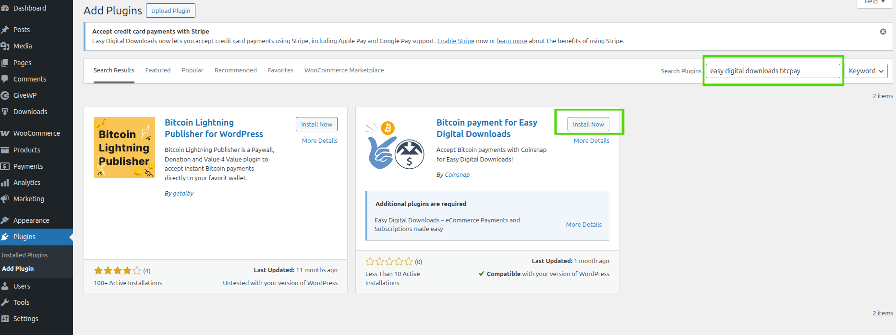
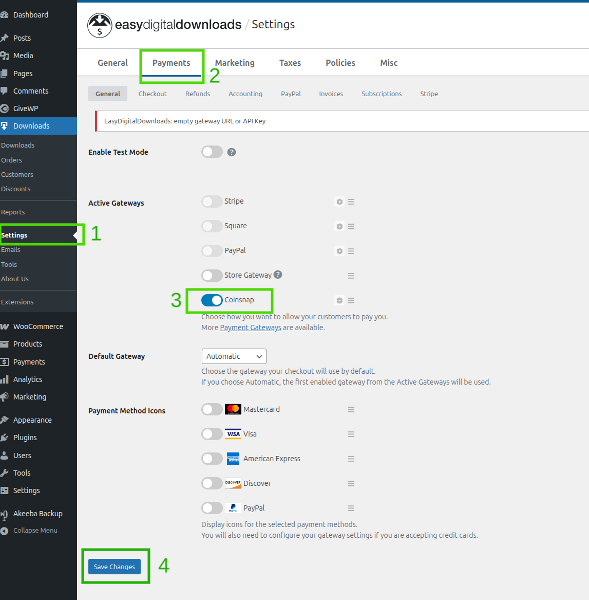
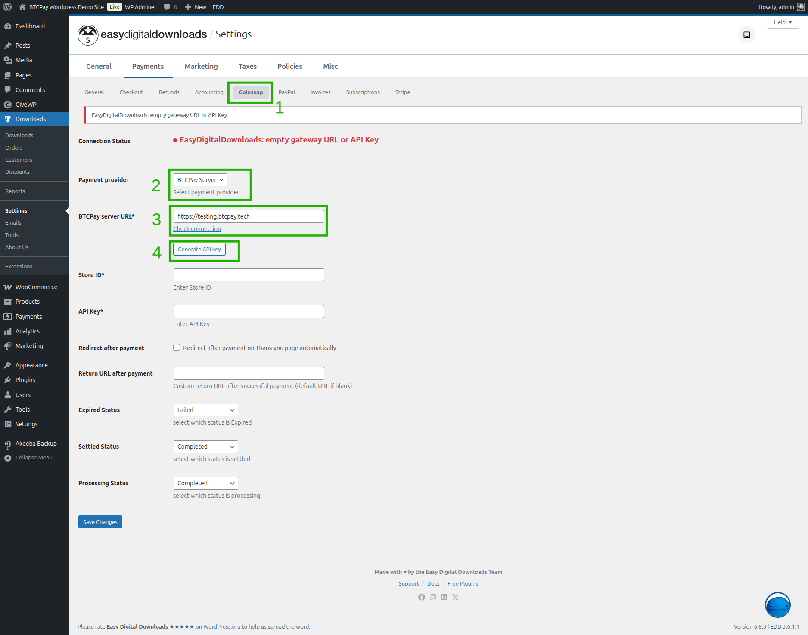
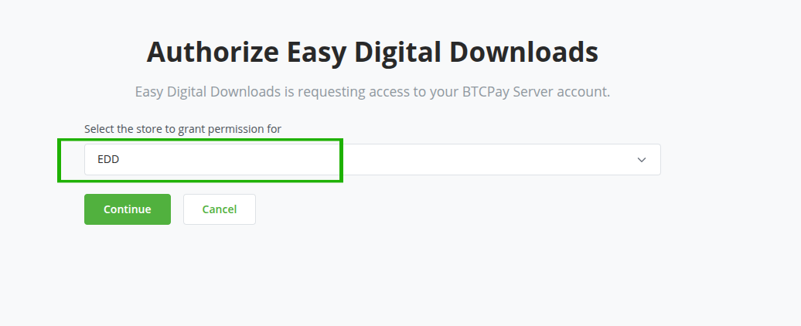
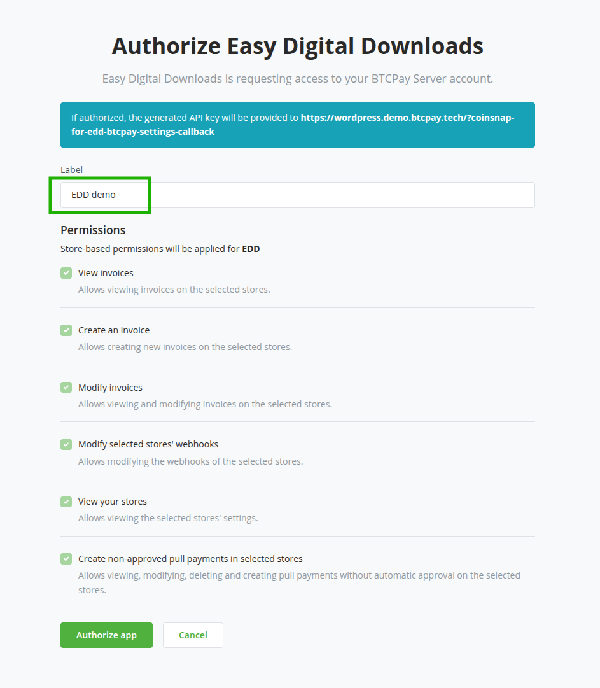
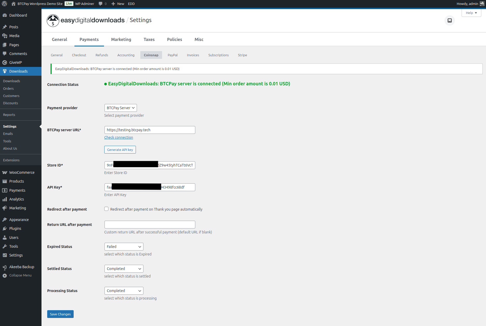
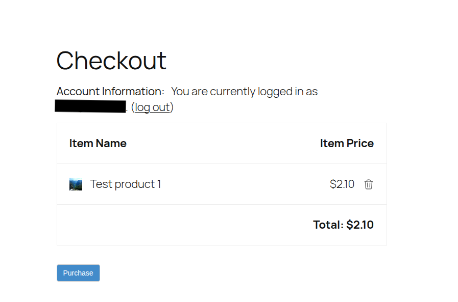
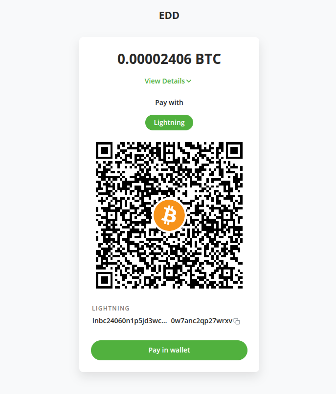
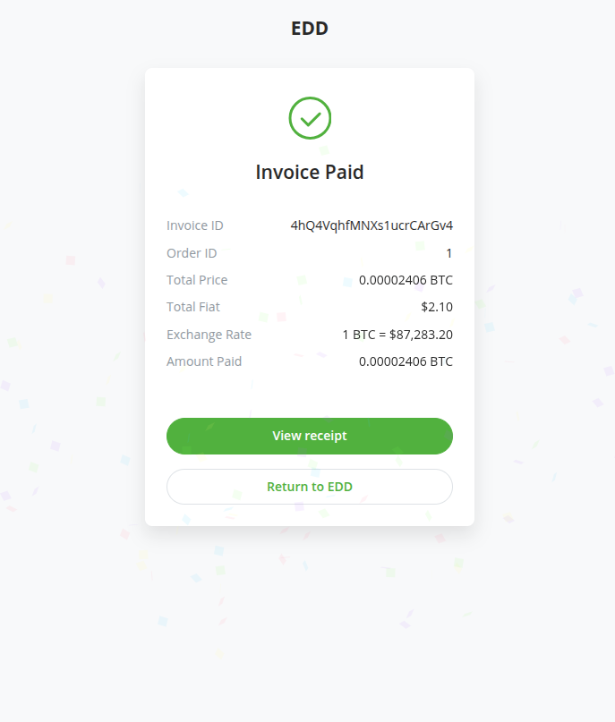
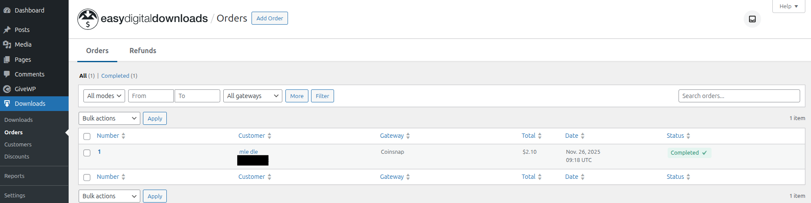

# Muunganisho wa Easy Digital Downloads (EDD)

:::warning
Tafadhali fahamu kuwa muunganisho huu hautunzwi na timu ya BTCPay Server. Ikiwa una maombi yoyote ya vipengele au ripoti za makosa, tafadhali fanya hivyo kwenye [hazina ya coinsnap](https://github.com/Coinsnap/Coinsnap-for-EasyDigitalDownloads) moja kwa moja.
:::

## Mahitaji

Tafadhali hakikisha unakidhi mahitaji yafuatayo kabla ya kusakinisha programu-jalizi hii.

- Toleo la PHP 8.0 au jipya zaidi
- Viendelezi vya PHP vya cURL, gd, intl, json, na mbstring vinapatikana
- Tovuti ya WordPress yenye Easy Digital Downloads (EDD) imesakinishwa ([maagizo ya usakinishaji](https://easydigitaldownloads.com/docs/quickstart-guide/))
  Kumbuka: huhitaji toleo la Pro la EDD ili kuanza
- Una BTCPay Server toleo la 2.0.0 au jipya zaidi, ama [inayojisimamia mwenyewe](/Deployment/README.md) au [inayoendeshwa na mhusika wa tatu](/Deployment/ThirdPartyHosting.md)
- [Una akaunti iliyosajiliwa kwenye mfano](./RegisterAccount.md)
- [Una duka la BTCPay kwenye mfano](./CreateStore.md)
- [Una pochi iliyounganishwa na duka lako](./WalletSetup.md)

## 1. Sakinisha Programu-jalizi ya Bitcoin for Easy Digital Downloads

Shukrani kwa [Coinsnap](https://coinsnap.io), kwa programu-jalizi yao ya **Bitcoin for Easy Digital Downloads** unaweza pia kuiunganisha na BTCPay Server.

Kuna njia tatu za kusakinisha programu-jalizi:

- Kutoka ndani ya WordPress kupitia Dashibodi ya Msimamizi (inapendekezwa, tazama hapa chini)
- [Saraka ya programu-jalizi ya WordPress](https://wordpress.org/plugins/coinsnap-for-easy-digital-downloads/)
- [Hazina ya GitHub](https://github.com/Coinsnap/Coinsnap-for-EasyDigitalDownloads)

### 1.1 Sakinisha programu-jalizi kutoka Dashibodi ya Msimamizi wa WordPress (inapendekezwa)

1. Kwenye utepe wa kushoto bofya _Plugins_ -> _Add New_.
2. Katika Utafutaji, andika "easy digital downloads btcpay".
3. Bofya _Install now_ kisha _Activate_.

### 1.2 Pakua na usakinishe programu-jalizi kutoka GitHub

Vinginevyo, unaweza kupakua programu-jalizi kutoka GitHub na kuisakinisha mwenyewe:

1. [Nenda kwenye hazina ya programu-jalizi](https://github.com/Coinsnap/Coinsnap-for-EasyDigitalDownloads).
2. Pakua .zip kwa kubofya _Code_ -> _Download ZIP_.
3. Kwenye dashibodi ya msimamizi wa WordPress bofya _Plugins_ -> _Add Plugin_.
4. Bofya kitufe cha _Upload Plugin_ na uchague faili ya .zip uliyopakua sasa hivi.
5. Bofya _Install Now_ kisha _Activate_.

## 2. Kuunganisha EDD na BTCPay Server

Programu-jalizi ya Bitcoin for EDD ni **daraja kati ya BTCPay Server yako (kichakataji malipo) na duka lako la EDD**.
Haijalishi ikiwa unatumia suluhisho la kujisimamia mwenyewe au la mhusika wa tatu, mchakato wa kuunganisha ni sawa.

### 2.1 Wezesha usaidizi wa Bitcoin katika EDD

:::info
Baada ya usakinishaji hapo juu, lango la malipo litaorodheshwa kama "Coinsnap" katika malango ya malipo ya EDD.
:::

1. Katika UI ya msimamizi wa WordPress: bofya _[Settings]_ ndani ya sehemu yako ya EDD (Downloads) kwenye utepe wa kushoto
2. Bofya kwenye kichupo cha _"Payments"_ juu
3. Geuza kigeuzi cha _Coinsnap_ ili kukiwezesha.
4. Bofya kitufe cha _[Save Changes]_ chini.

### 2.2 Sanidi lango la Coinsnap

1. Hakikisha upo kwenye fomu ya mipangilio ya Coinsnap, ikiwa sivyo bofya kwenye kichupo cha _"Coinsnap"_ juu.
2. Kwenye sehemu ya "Payment provider" hakikisha umechagua _"BTCPay Server"_.
3. Utaona sehemu ya kuingiza ya _"BTCPay Server URL"_, weka URL ya mfano wako wa BTCPay Server (k.m., `https://btcpay.example.com`).
4. Sasa unaweza kubofya kitufe cha _[Generate API key]_.

Utaelekezwa tena kwenye mfano wa BTCPay Server na ufuate hatua hapa chini:

### 2.3 Kwenye BTCPay Server: Idhinisha ufikiaji wa programu-jalizi

Kwenye mfano wako wa BTCPay Server:

1. Utaona ukurasa wa uidhinishaji ambapo unahitaji kuchagua duka lako, kwa upande wetu "EDD". Bofya _[Continue]_.
   
2. Kwenye skrini inayofuata utaona ruhusa zinazohitajika na programu-jalizi. Weka lebo na ubofye kitufe cha _[Authorize app]_ chini.
   
3. Utaelekezwa tena kwenye fomu ya mipangilio ya EDD. Sasa unapaswa kuona kuwa "Connection status" inasema BTCPay Server imeunganishwa na sehemu za "Store ID" na "API key" tayari zimejazwa.
   
4. Ili kuhakikisha kila kitu kimehifadhiwa, bofya kitufe cha _[Save Changes]_ chini.

Hongera, sasa uko tayari kuuza vipakuliwa vyako kwa Bitcoin kupitia BTCPay Server!

## 3. Kujaribu malipo

Kufanya malipo madogo ya jaribio kutoka duka lako kutakupa amani ya akili.
Daima hakikisha kuwa kila kitu kimesanidiwa kwa usahihi kabla ya kuanza rasmi.

Kwenye Malipo weka agizo lako:

Utaelekezwa tena kwenye BTCPay Server na msimbo wa QR wa ankara utaonyeshwa:

Baada ya kulipa ankara unaweza kurudi kwenye tovuti yako:

Utaona ukurasa wa uthibitisho wa agizo, na hali ya malipo iliyokamilika:

Kwenye sehemu ya nyuma ya msimamizi chini ya "_Downloads_" -> _"Orders"_ utaona pia agizo limekamilika:

## Pata usaidizi
Unaweza kufungua suala kwenye [hazina ya Coinsnap Github](https://github.com/Coinsnap/Coinsnap-for-EasyDigitalDownloads) au kutufikia kwenye [Telegram](https://t.me/btcpayserver) au [mazungumzo ya Mattermost](http://chat.btcpayserver.org/).