# Kuunganisha Pochi ya Electrum kwenye BTCPay Server

Hati hii inaelezea **jinsi ya kuunganisha [Pochi ya Electrum](https://electrum.org/) ya eneo-kazi kwenye BTCPay Server**.

**Tahadhari** Pochi ya Electrum inategemea seva za Electrum ambazo zinadhibitiwa na watu wa tatu. Taarifa, kama anwani za umma, salio na kiasi kilichohamishwa zinaweza *kwa uwezekano* kuvuja.

Ili kujilinda dhidi ya uvujaji kama huo, sanidi [Seva ya ElectrumX](./ElectrumX.md) au [Electrum Personal Server - EPS](https://github.com/chris-belcher/electrum-personal-server).

Unaweza kusoma kuhusu tofauti kati ya EPS na ElectrumX [hapa](https://www.reddit.com/r/Electrum/comments/7xb0lz/whats_the_difference_between_electrumx_server_and/).

1. Unda Duka katika BTCPay Server
2. [Pakua](https://electrum.org/#download) na usakinishe Pochi ya Electrum

## Usanidi wa Pochi ya Electrum

Baada ya usakinishaji, fungua **Pochi ya Electrum** kwa kubonyeza ikoni kwenye eneo-kazi lako.

### Usanidi wa Haraka

Njia rahisi zaidi ya kusanidi pochi yako ya Electrum na BTCPay ni kuingiza hifadhi rudufu ya faili ya pochi kwenye BTCPay Server yako.

1. Unda Pochi mpya ya Electrum
2. Katika Electrum, File > Save Backup > Save in folder
3. Katika BTCPay Server, Store > Settings > Setup > Import Wallet File > Choose File > Continue
4. Nenda kwenye kichupo cha Receive katika Electrum.
5. Linganisha anwani katika Electrum na BTCPay Server, zinapaswa kulingana.
6. Thibitisha ulinganifu wa anwani katika BTCPay.

## Hatua kwa Hatua

Usanidi ufuatao unakuongoza katika kusanidi pochi mpya kabisa ya Bech32(SegWit) katika Electrum. Ikiwa tayari una pochi ruka hadi sehemu ya kunakili Ufunguo wa Umma Uliopanuliwa.

Kwanza, ipe pochi yako jina, kwa mfano, `BTCPay Server Wallet` na ubonyeze `Next`.

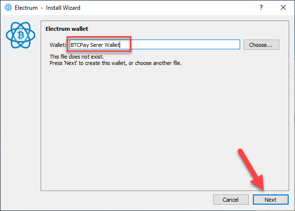

Chagua `Standard wallet` na uendelee kwa kubonyeza kitufe cha `Next`.

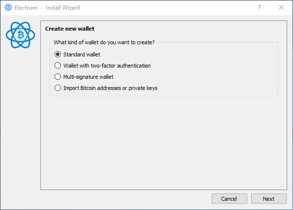

Kwa vile tunaunda pochi mpya kabisa, chagua `Create a new seed` na `Next`

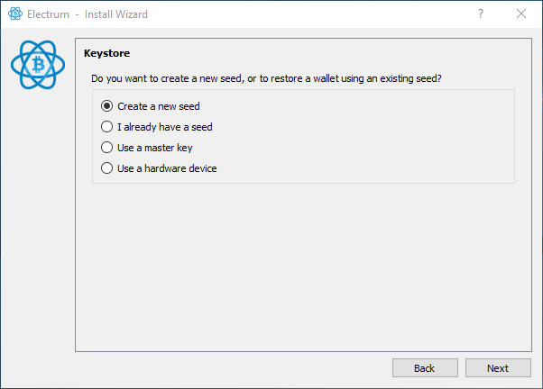

Kutoka kwenye menyu ya chaguo nyingi, chagua `SegWit` na `Next`

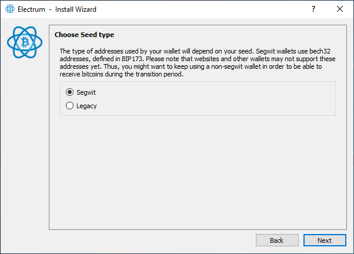

**KUMBUKA MUHIMU:** Ikiwa wewe ni mfanyabiashara, badala ya SegWit (Bech32), inapendekezwa kutumia muundo wa SegWit wrapped (P2SH). [Mwongozo huu](https://www.youtube.com/watch?v=-1DBJWwA2Cw) unaelezea jinsi ya kuunda pochi ya P2SH katika Electrum inayofaa zaidi kwa wafanyabiashara, kutokana na upatanifu na pochi za kizamani ambazo wateja wanatumia.

**KUMBUKA MUHIMU 2:** Andika maneno yako ya urejeshaji kwa mpangilio unavyoyaona kwenye skrini. Yaandike kwenye karatasi na uyahifadhi mahali salama. Chukua muda wako na angalia kila neno mara tatu. Usihifadhi mbegu yako katika muundo wa kidijitali (picha, hati ya maandishi). Yeyote mwenye ufikiaji wa mbegu yako anaweza kufikia fedha zako. Thibitisha kwamba mbegu imehifadhiwa rudufu ipasavyo kwa kuiingiza tena kwa mpangilio ule ule. Mara mbegu inapothibitishwa, endelea kwenye hatua inayofuata.

Nakili na ubandike maneno yako ya mbegu kukamilisha uundaji wa pochi yako katika Electrum. Pochi yako lazima iwe bila usimbaji fiche ili kuiingiza kwenye BTCPay Server yako. Mara utakapomaliza usanidi wa pochi yako katika BTCPay unaweza kuongeza usimbaji fiche wa nenosiri baadaye katika Electrum.

Fuata katika video hapa chini jinsi ya kuingiza kwenye BTCPay Server.

[](https://www.youtube.com/watch?v=kf3BHaQWSAc)

### Usanidi Mbadala

Badala ya kuingiza faili ya pochi unaweza badala yake kuhamisha ufunguo wa umma kwenye BTCPay Server yako. Hii inaweza kuwa muhimu ikiwa pochi yako imesimbwa kwa fiche na hutaki kuiondoa usimbaji fiche.

1. Unda Pochi mpya ya Electrum
2. Katika Electrum, Wallet > Wallet Information - nakili **Master Public Key**.
3. Katika BTCPay Server, Store > Settings > Setup > Connect an existing wallet > Enter extended public key
4. Nenda kwenye kichupo cha Receive katika Electrum.
5. Linganisha anwani katika Electrum na BTCPay Server, zinapaswa kulingana.
6. Thibitisha ulinganifu wa anwani katika BTCPay.

Pochi inapopakia (inaweza kuchukua muda mfupi), katika menyu ya juu, bonyeza `Wallet` na kisha `Information`.

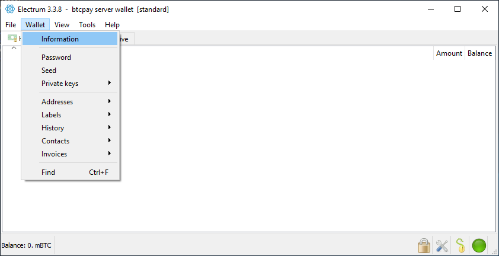

Chagua na **nakili** `Master Public Key`. Huu ni ufunguo wa **umma** ambao BTCPay itatumia kutoa anwani.

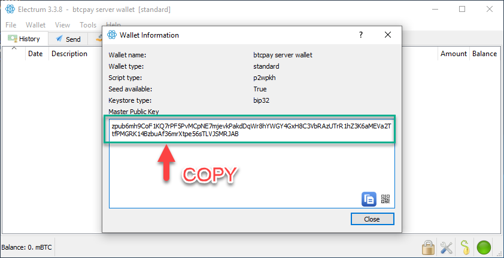

Rudi kwenye BTCPay Server yako. Bonyeza `Bitcoin` kwenye menyu ya kushoto au `Set up a wallet` kwenye dashibodi yako mpya.

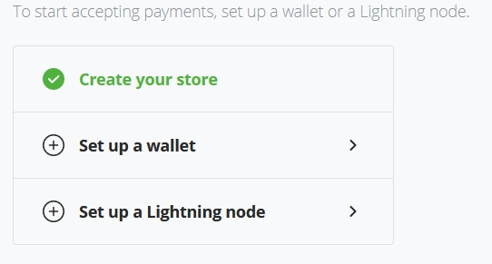

Bonyeza `Connect an existing wallet`

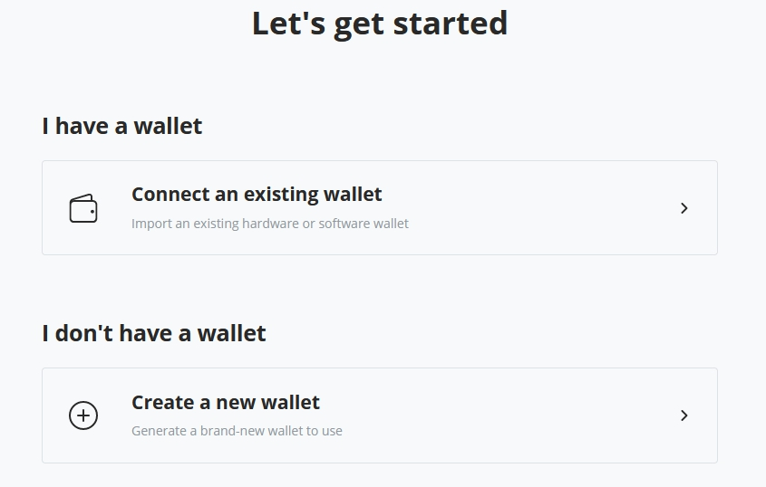

Sasa bonyeza chaguo la `Enter extended public key` ili kuingiza ufunguo wako.

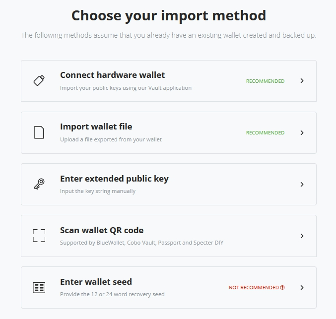

Bandika `Master Public Key` kwenye uga wa mpango wa utoleaji kama ilivyo, bila kuongeza kitu chochote kingine. Hakikisha kwamba kisanduku cha `Enabled` kimetikiwa na ubonyeze `Continue`.

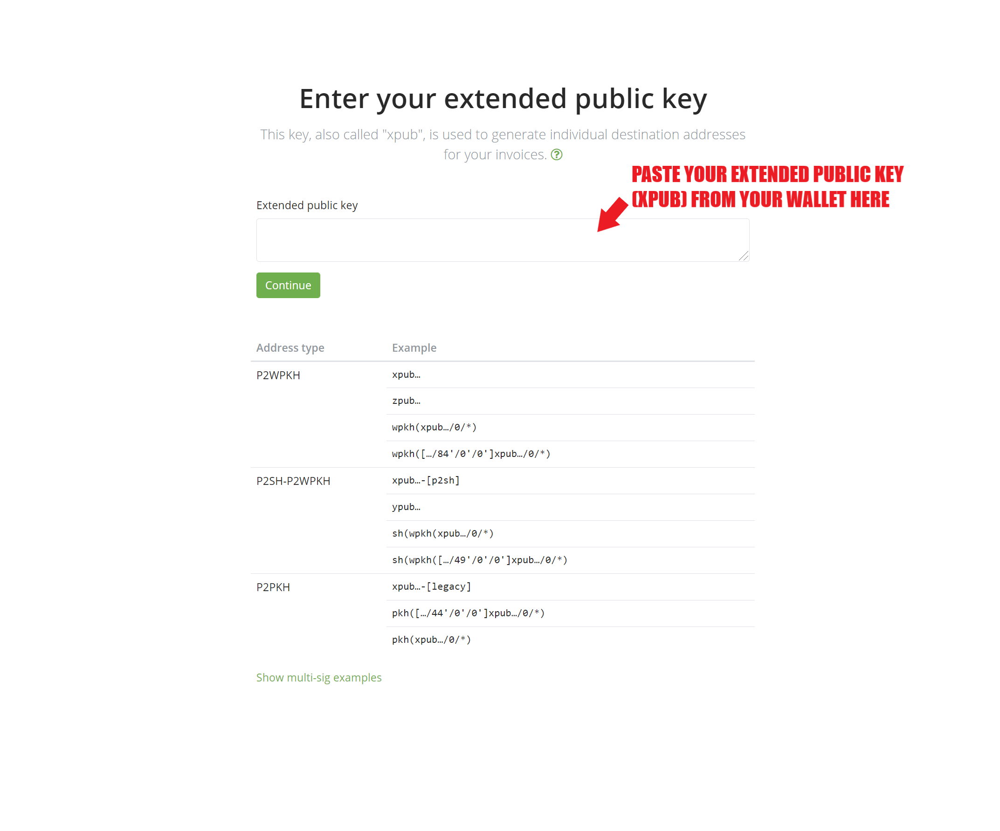

Rudi kwenye **Pochi ya Electrum**. Nenda kwenye `Receive tab` inayoonyesha anwani yako ya kupokea ya pochi.

**Linganisha anwani unayoona katika Pochi ya Electrum na Anwani zilizoonyeshwa katika BTCPay Server**. Ikiwa kuna ulinganifu, endelea (`continue`). Ikiwa hakuna ulinganifu, angalia mara mbili kwamba kweli unabandika `Master Public Key`.

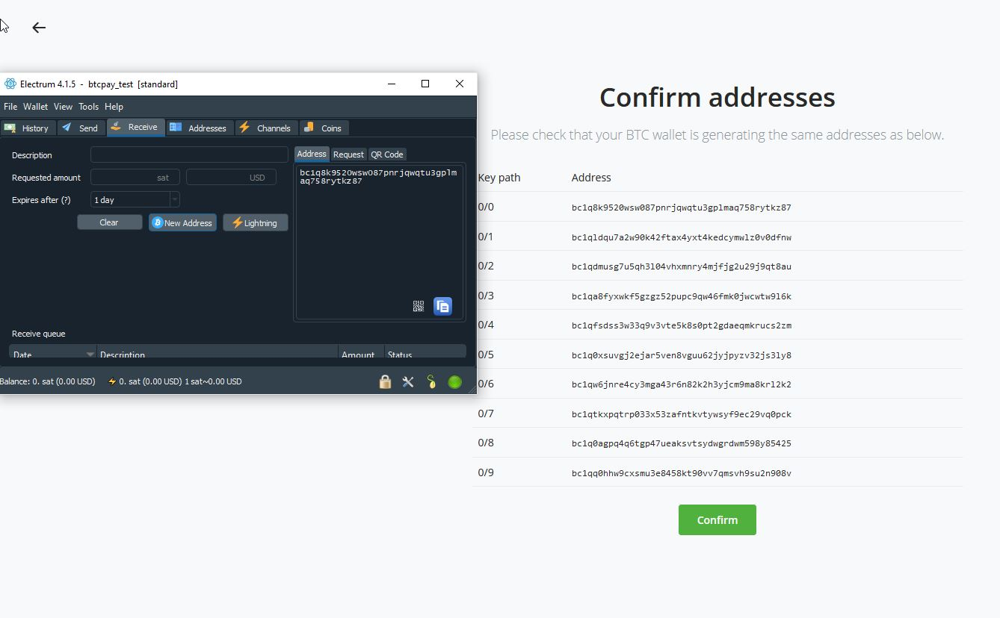

### Kusanidi Kikomo cha Pengo katika Electrum

Katika menyu ya juu, bonyeza `View` na kisha `Show Console`.

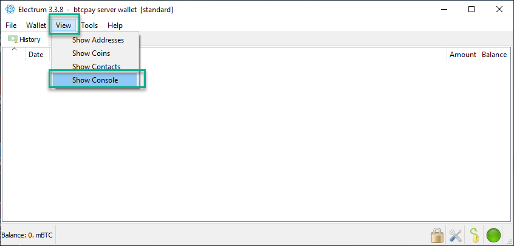

Ingiza amri zifuatazo katika kiweko cha Electrum na ubonyeze `enter` kwenye kibodi yako.

```
 wallet.change_gap_limit(100)
```

Ikiwa unatumia toleo la zamani kuliko Electrum 4, pia ingiza amri ifuatayo na ubonyeze `enter`

```
wallet.storage.write()
```

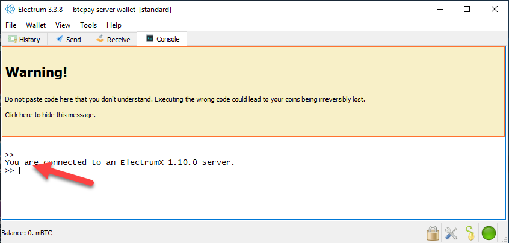

Anzisha upya Electrum yako na uthibitishe kwamba kikomo kipya cha pengo kilichowekwa ni sahihi kwa kuingiza kwenye kiweko:

```
wallet.gap_limit
```

Hakuna jibu zuri la kiasi gani unapaswa kuweka kikomo cha pengo. Wafanyabiashara wengi huweka 100-200. Ikiwa wewe ni mfanyabiashara mkubwa mwenye kiasi kikubwa cha miamala, unaweza kujaribu kikomo cha juu zaidi cha pengo.

Kwa maelezo zaidi kuhusu [Kikomo cha Pengo, angalia Maswali Yanayoulizwa Mara kwa Mara](./FAQ/Wallet.md#missing-payments-in-my-software-or-hardware-wallet).

**Electrum na BTCPay Server sasa zimeunganishwa**. Malipo yoyote yaliyopokelewa kwenye BTCPay yako yataonekana katika Electrum, ambapo unaweza kuyatumia zaidi.
