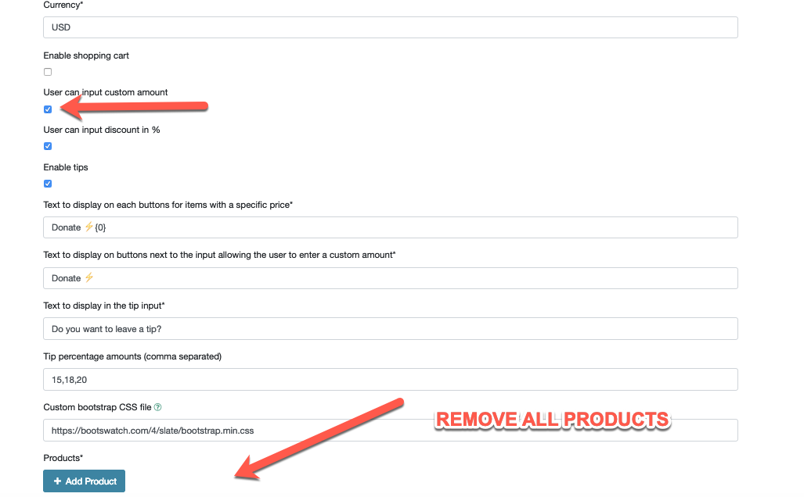
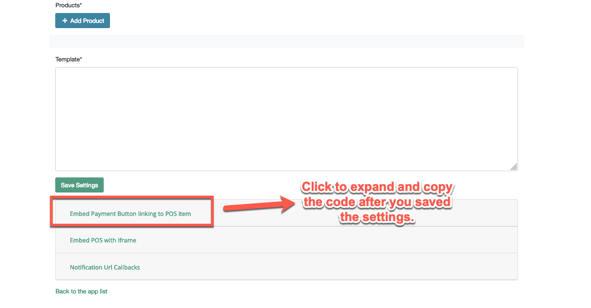
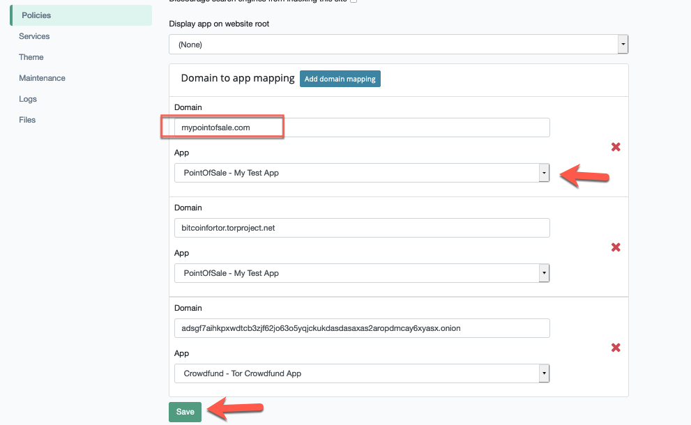
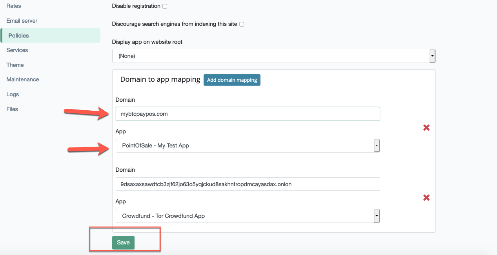
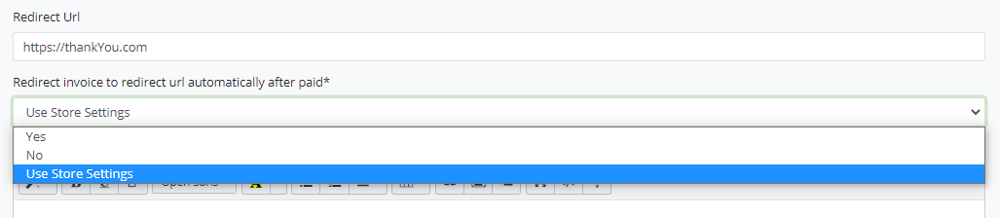
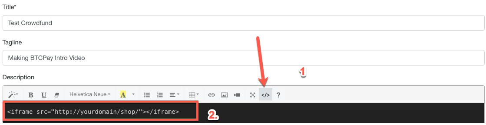

# Maswali ya Programu

Hati hii inashughulikia maswali yanayoulizwa mara kwa mara kuhusu Programu za BTCPay Server.

[[toc]]

## Programu katika BTCPay ni zipi?

Programu ni vipengele unavyoweza kutumia kupanua matumizi ya BTCPay yako. Tazama [nyaraka za programu](../Apps.md) kwa taarifa zaidi.

## Je, kuna kikomo cha idadi ya Programu ninazoweza kuunda?

Programu zinaongezwa katika kiwango cha duka. Ili kuunda moja, unahitaji kuwa na duka tayari limesanidiwa. Hakuna kikomo cha idadi ya programu zinazoweza kupewa duka.

## Je, kuna kipengele cha Point of Sale katika BTCPay?

Ndiyo. Tafadhali soma [mwongozo wetu wa kuunda programu ya POS](../WhatsNext.md#creating-the-pay-button).

## Ninawezaje kutumia BTCPay katika duka la kimwili?

Unaweza kutumia programu yetu ya Point of Sale (PoS). Unapounda programu ya PoS ndani ya BTCPay Server, itapatikana kwa umma kupitia URL ambapo vitufe vya malipo vya bidhaa ulizounda kwa PoS yako vitaonyeshwa.
Ili kuwa na PoS ya kimwili, suluhisho rahisi (kwa sasa) ni kuunda Programu ya PoS katika BTCPay na kuionyesha kwenye kifaa chochote cha wavuti kama vile simu, kompyuta kibao au PC.

Tafadhali fuata mwongozo wetu wa kina wa jinsi ya kutumia [Programu yetu ya PoS kwenye kifaa cha mkononi](https://blog.btcpayserver.org/bitcoin-pos/). Pia kumbuka kuwa Sehemu ya 2.3 Kuunganisha Pochi imefunikwa kwa kina zaidi hapa katika [sehemu ya pochi](../WalletSetup.md).

## Jinsi ya kubinafsisha mwonekano wa Programu ya Point of Sale katika BTCPay

Ni rahisi sana kubinafsisha mwonekano wa programu ya Point of Sale. [Fuata mwongozo huu](../Development/Theme.md) kujifunza jinsi ya kubadilisha mandhari.

## Kitufe cha Malipo ni nini?

Kitufe cha Malipo ni kitufe rahisi na kinachoweza kubinafsishwa cha HTML unachoweza kuunda na kuingiza kwenye tovuti yako. Ili kuunda kitufe cha malipo, [fuata mwongozo huu](../WhatsNext.md#creating-the-point-of-sale-app).

## Jinsi ya kuunda Kitufe cha Malipo chenye kiasi maalum?

Kitufe cha Malipo cha BTCPay Server ambacho kinaweza kupatikana katika Mipangilio ya Duka > Kitufe cha Malipo, kwa sasa hakiungi mkono viwango maalum.
Hata hivyo, unaweza kutumia njia mbadala:

- [Unda programu ya Point of Sale](../WhatsNext.md#creating-the-point-of-sale-app)
- Washa sehemu ya `mtumiaji anaweza kuingiza kiasi maalum`
- Ondoa bidhaa zote kutoka kwenye kiolezo kilichozalishwa kiotomatiki.
- Hifadhi mipangilio.
- Bofya kwenye `Ingiza kitufe cha malipo kinachounganisha kwenye kipengee cha PoS` chini ya ukurasa na unakili msimbo uliopanuliwa. Ubandike kwenye ukurasa wa html wa tovuti yako.
- Ondoa sehemu za ziada ambazo huhitaji, hasa `<input name="price" type="hidden" value="10" />` ili kitufe kielekeze kwenye sehemu ya mauzo.




## Jinsi ya kuweka jina la kikoa kwenye programu?

Programu za BTCPay Server zinaweza kuwa na jina la kikoa tofauti na kikoa cha seva. Hebu tuchukulie una BTCPay Server katika mybtcpayserver.com na unataka kuonyesha programu yako ya PoS kwenye mybtcpaypos.com badala ya mybtcpayserver.com/apps/pos/abc123
Kwanza, [sanidi mipangilio ya DNS](../FAQ/Deployment.md#setting-up-dns-records) ya mypointofsale.com na uhakikishe inaelekeza kwenye IP ya nje ya BTCPay Server yako.

Kisha, ongeza jina la kikoa au vikoa vidogo vya ziada kwa kuongeza kigezo kipya cha mazingira kupitia SSH:

```bash
sudo su -
export BTCPAY_ADDITIONAL_HOSTS="mybtcpaypos.com"
. btcpay-setup.sh -i
```

Ikiwa unataka kuongeza vikoa vingi, unahitaji tu kusasisha vigezo vya env tena:

```bash
sudo su -
export BTCPAY_ADDITIONAL_HOSTS="mybtcpaypos.com,subdomain.domain2.com,domain3.com"
. btcpay-setup.sh -i
```

Mwishowe, katika Mipangilio ya Seva > Sera, bofya kwenye `Weka vikoa maalum kwenye programu maalum`



Ingiza jina la kikoa, chagua programu iliyoundwa hapo awali kutoka kwenye menyu kunjuzi na ubofye `hifadhi` kuweka programu kwenye kikoa maalum.



Ikiwa yoyote ya seva pangishi zilizoongezwa kwa ziada hazina DNS iliyosanidiwa vizuri, Let's Encrypt haitaweza kusasisha cheti kwa vikoa vyovyote, ikiwemo kikoa kikuu. Ikiwa unatumia seva pangishi za ziada na unakumbana na masuala ya https na kikoa kikuu, jaribu kuondoa kikoa kutoka `BTCPAY_ADDITIONAL_HOSTS` na endesha upya usanidi. Suala la https pia hutokea ikiwa [Dynamic DNS](/Deployment/DynamicDNS.md) haijasasishwa na imesanidiwa kama seva pangishi ya ziada.

Ikiwa kwa sababu yoyote, unataka programu iwe kwenye kikoa sawa na ukurasa wa nyumbani wa BTCPay Server, unaweza kuchagua kuionyesha kwenye mzizi. Katika hali hiyo, hakuna usanidi wa DNS unaohitajika, kwani kikoa chako tayari kinaelekeza vizuri. Kutumia programu kwenye kikoa cha mzizi cha BTCPay Server kunamaanisha utalazimika kufikia kuingia na kurasa zingine kwa mwongozo. Njia rahisi ni kuongeza njia ya ukurasa kama `/apps` au `/maduka` kwenye kikoa chako cha mzizi. (Mfano: `mybtcpayserver.com/apps`). Hii itafanya urambazaji kwenda kwenye programu iliyoonyeshwa kwenye mzizi kuwa rahisi, lakini urambazaji kwenda kwenye kurasa zingine (kama vile Kuingia) kuwa changamoto zaidi kwa watumiaji.

## Jinsi ya kuelekeza kwenye tovuti nyingine baada ya malipo?

Programu za Point of Sale zinaruhusu kuwaelekeza wateja kwenye URL yoyote baada ya ankara kulipwa. Rekebisha utendaji wa uelekezaji katika Programu > Mipangilio



Katika mipangilio ya PoS, hizi ni chaguo zifuatazo za uelekezaji kwenye ankara zilizolipwa:

- **Hapana** - _Bila_ URL ya Kuelekeza
  - Ankara inaonyesha kidokezo kwa mtumiaji kurudi kwenye Programu ya PoS (Mpangilio chaguomsingi).
- **Hapana** - _Na_ URL ya Kuelekeza
  - Ankara inaonyesha kidokezo kwa mtumiaji kurudi kwenye URL iliyotolewa ya Kuelekeza Programu.
- **Ndiyo** - _Bila_ URL ya Kuelekeza
  - Ankara iliyolipwa inaelekeza kiotomatiki kwenye Programu ya PoS.
- **Ndiyo** - _Na_ URL ya Kuelekeza
  - Ankara iliyolipwa inaelekeza kiotomatiki kwenye URL iliyotolewa ya Kuelekeza Programu.
- **Tumia Mipangilio ya Duka**
  - Washa/zima uelekezaji wa kiotomatiki kwenye Programu ya PoS katika [kiwango cha duka](../FAQ/Stores.md#how-to-redirect-store-invoices-after-payment).

Vidokezo:

1. Toa URL ya Kuelekeza katika Mipangilio ya Programu (juu ya chaguo la uelekezaji).
2. [Ankara](../Invoices.md#invoice-statuses) zilizoisha muda wake au zilizolipwa kwa sehemu hazitaelekeza, hata ikiwa mpangilio umewashwa. Kipengele hiki ni kwa ankara zilizolipwa pekee.
3. Vinginevyo, URL za kuelekeza zinaweza kutajwa kupitia API (yaani PoS Iliyoingizwa).

## Jinsi ya kujumuisha Duka la WooCommerce katika programu ya Crowdfund ya BTCPay?

Ikiwa unataka kutoa njia kwa wafadhili wako kupokea faili za kidijitali na bidhaa za kimwili, unaweza kuingiza duka la WooCommerce katika programu yako ya Crowdfund.


Mafunzo yafuatayo yanachukulia una uelewa wa kati hadi wa juu wa BTCPay, WordPress na WooCommerce.

### Mahitaji

1. Tovuti ya WordPress
2. [Programu-jalizi ya WooCommerce](https://wordpress.org/plugins/woocommerce/)
3. [Programu-jalizi ya BTCPay for WooCommerce](https://wordpress.org/plugins/btcpay-for-woocommerce/)
4. [Mandhari ya Storefront](https://wordpress.org/themes/storefront/) (ikiwa unatumia mandhari nyingine, unaweza kuhitaji kurekebisha msimbo wa CSS ili kuendana na mandhari yako.
5. BTCPay Server

**Kumbuka Muhimu** Hakikisha kwamba duka lako la WooCommerce na BTCPay Server **ziko kwenye kikoa kimoja**. Baadhi ya vivinjari vina njia kali za kuzuia maudhui yaliyoingizwa kutoka vikoa tofauti. Hasa, Safari kwenye iOS itaharibu kuki wakati bidhaa inapoongezwa, jambo litakalopelekea kikapu tupu. Hakuna njia nyingine ya kurekebisha hili isipokuwa kuwa na BTCPay na Woo kwenye kikoa kimoja kama vikoa vidogo angalau.

#### Programu-jalizi za Hiari za WordPress

Programu-jalizi zifuatazo zinapendekezwa, lakini sio lazima. Sio lazima kuzitumia ikiwa wewe ni mtumiaji mwenye ujuzi wa WordPress.

- [Flexible Checkout Fields](https://wordpress.org/plugins/flexible-checkout-fields/) (kuhariri malipo na kuondoa sehemu zisizo za lazima za malipo katika Woo)
- [WooCommerce Direct Checkout](https://wordpress.org/plugins/woocommerce-direct-checkout/) (ondoa hatua zisizo za lazima katika mchakato wa malipo na ufanye uwekaji ahadi kuwa wa haraka)
- [Header and Footer Scripts](https://wordpress.org/plugins/header-and-footer-scripts/) (weka msimbo wa `<script>` hapa)

### Maagizo

#### 1. Kuunganisha maduka mawili kwenye pochi moja

Katika BTCPay Server yako, unda maduka mawili tofauti:

1. Duka la WooCommerce
2. Duka la programu ya Crowdfunding

Ongeza **mpango sawa wa utoaji wa ufunguo wa umma uliopanuliwa**, ili maduka yote mawili yabaki yamesawazishwa.

#### 2. Kurekebisha CSS katika WordPress

Katika hatua ya kwanza, unahitaji kuondoa upungufu wote kutoka kwa duka la WordPress na kulifanya liwe safi na rahisi, ili liingizwe vizuri ndani ya programu ya Crowdfund.

Weka msimbo ufuatao maalum wa CSS ndani ya WordPress. Mwonekano > Binafsisha > **CSS Maalum**

<details>
  <summary>Click to view CSS</summary>

Faili ya CSS:

```css
#header,
#masthead,
.site-footer,
.storefront-breadcrumb,
.storefront-sorting,
.storefront-product-section .section-title,
.woocommerce-products-header,
.woocommerce-additional-fields,
.woocommerce-form-coupon-toggle,
.woocommerce-breadcrumb,
.related.products {
  display: none;
}

.iframe {
  overflow: hidden;
}

ul.products li.product .button {
  margin-bottom: 0.236em;
  display: block;
}

.product:hover {
  background-color: rgba(0, 0, 255, 0.3);
  color: rgba(0, 0, 0, 0);
  padding-bottom: 45px;
}

.product:hover a * {
  visibility: hidden;
}

.product:hover a.add_to_cart_button {
  position: absolute;
  top: 0;
  left: 0px;
  width: 100%;
  height: 100%;
  padding-top: 50%;
  color: white;
  background-color: rgba(0, 0, 255, 0.3);
}

.product:hover a.add_to_cart_button:hover {
  background-color: rgba(0, 0, 255, 0.5);
}
```

</details>

Msimbo hapo juu unaondoa na kuficha vitu vyote visivyo vya lazima kutoka kwenye duka lako (vichwa, vijachini, makombo ya mkate, na upangaji). Ikiwa hutumii mandhari ya Storefront, unaweza kuhitaji kuirekebisha kidogo. Mbali na kuondoa, sehemu ya chini ya msimbo inaongeza mtindo tofauti kidogo unaoboresha uzoefu wa malipo na kuufanya uwe kama KickStarter zaidi. Jisikie huru kurekebisha rangi. Unapaswa pia kuondoa upau wa pembeni.

Ili kuondoa sehemu zisizo za lazima katika malipo ya WooCommerce, tumia [Flexible Checkout Fields](https://wordpress.org/plugins/flexible-checkout-fields/).

Ili kuharakisha mchakato wa malipo, tumia [WooCommerce Direct Checkout](https://wordpress.org/plugins/woocommerce-direct-checkout/) (ondoa hatua zisizo za lazima katika mchakato wa malipo na ufanye uwekaji ahadi kuwa wa haraka)

#### 2. Kurekebisha kazi za WordPress

Ingiza msimbo ufuatao chini ya faili ya **functions.php** ya mandhari ya mtoto wako.

```php
// Code goes in theme functions.php
add_action( 'after_setup_theme', 'wc_remove_frame_options_header', 11 );

// Allow rendering of checkout and account pages in iframes
function wc_remove_frame_options_header() {
    remove_action( 'template_redirect', 'wc_send_frame_options_header' );
}
```

Ikiwa utaongeza msimbo wa PHP moja kwa moja kwenye Mwonekano>Mhariri>functions.php, wakati mwingine unaposasisha mandhari, mabadiliko yatafutwa. Kwa hivyo, tumia programu-jalizi maalum ya kazi ya aina fulani, au [unda mandhari ya mtoto](https://docs.woocommerce.com/document/set-up-and-use-a-child-theme/) na weka msimbo chini kila wakati.

#### 3. Kuongeza hati kwenye WordPress

Sakinisha programu-jalizi ya [Header and Footer Scripts](https://wordpress.org/plugins/header-and-footer-scripts/). Ongeza msimbo ufuatao kwenye kichwa au kijachini chako. Mipangilio > Hati za Vichwa na Vijachini, bandika msimbo na uhifadhi mabadiliko.

```html
<script>
  jQuery(document).ready(function () {
    jQuery('.product').each(function () {
      var product = jQuery(this)
      var item = product.find('.woocommerce-loop-product__link')
      var cartLink = product.find('.add_to_cart_button').attr('href')
      item.attr('href', cartLink)
    })
  })
</script>
```

Kipande hiki cha msimbo kinahakikisha kwamba kila bonyezo kwenye eneo la bidhaa linaiongeza kwenye kikapu na inazuia watumiaji kutazama maelezo ya bidhaa, ambayo hayahitajiki kabisa kwa matumizi yetu.

#### 4. Kurekebisha programu ya Crowdfunding

Katika BTCPay yako, Programu > Unda Programu Mpya > Crowdfunding.

Katika maelezo ya programu yako, geuza msimbo na ubandike msimbo ufuatao na uongeze `<iframe src="http://yourdomain/shop/"></iframe>`
Badilisha na URL ya ukurasa wako wa Duka la WooCommerce.



Kisha, bandika msimbo ufuatao katika sehemu ya **Msimbo Maalum wa CSS** ya programu yako ya Crowdfunding:

<details>
  <summary>Click to view CSS</summary>

Faili ya CSS:

```css
#crowdfund-body-header-tagline-container,
#crowdfund-body-description-container {
  max-width: 100% !important;
  width: 100% !important;
  flex: 100%;
}

#crowdfund-body-contribution-container {
  display: none;
}

#crowdfund-body-header-cta {
  display: none;
}

#crowdfund-body-description-container iframe {
  width: 100%;
  border: 0;
  min-height: 500px;
}
/* // Medium devices (tablets, 768px and up) */
@media (min-width: 768px) {
  #crowdfund-body-description-container {
    padding-right: 30%;
    min-height: 1200px;
  }
  #crowdfund-body-description-container iframe {
    width: 30%;
    position: absolute;
    right: 0;
    top: 0;
    height: 100%;
    border-left: 1px #e5e5e5 solid;
  }
}
```

</details>

Jambo moja la mwisho, hakikisha umeteua (kuwasha) **Hesabu ankara zote zilizoundwa kwenye duka kama sehemu ya lengo la Crowdfunding**
Hifadhi mabadiliko na onyesha kihakiki cha programu.
