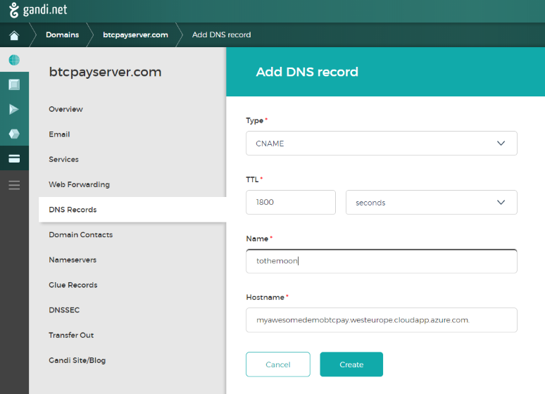
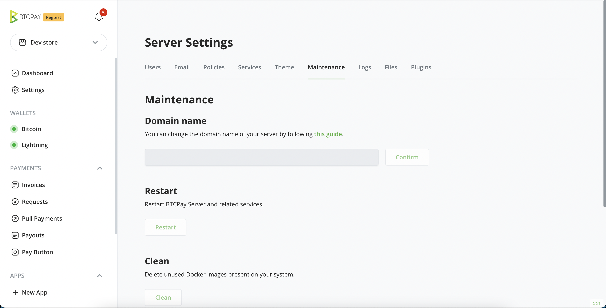
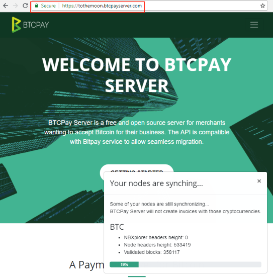

# Maswali ya Usambazaji

Hati hii inashughulikia maswali, makosa, na masuala ya kawaida zaidi unayoweza kukutana nayo kabla na wakati wa usakinishaji wa programu. Kwa orodha ya kina ya njia za usambazaji na maagizo kwa kila moja, tafadhali angalia [ukurasa wa Usambazaji](../Deployment/README.md).

[[toc]]

## Usambazaji wa Jumla

### Inagharimu kiasi gani kuendesha BTCPay Server?

BTCPay ni programu huru na ya chanzo wazi kwa 100%. Hatukutozi chochote.
Hata hivyo, ili kuiendesha, unapaswa kuipangisha. Unaweza kuiendesha kama suluhisho la kujiendesha kwenye seva yako ya ndani, au kutumia mtoa huduma wa seva ya wingu, ambayo ndiyo watumiaji wengi hufanya. Watumiaji wa juu wanaweza kuendesha BTCPay kwenye [vifaa vyao wenyewe](/Deployment/Hardware.md). Watumiaji wasio na ujuzi wa kiufundi wanaweza kutumia [chaguo za Vifaa kama Huduma](/Deployment/HardwareAsAService.md). Ikiwa hutaki kupangisha seva yako mwenyewe, unaweza kutumia [Seva ya Mtu wa Tatu](/Deployment/ThirdPartyHosting.md) ya bure. Tembelea [Ukurasa wetu wa Usambazaji](/Deployment/README.md) kwa taarifa zaidi kuhusu njia mbalimbali ambazo unaweza kuendesha BTCPay.

### Mahitaji ya chini ya BTCPay ni yapi?

Ikiwa ungependa kuendesha nodi za Bitcoin na Mtandao wa Lightning, mahitaji ya chini ni:

- 2GB RAM
- 80 GB ya hifadhi [ukiwa na upunguzaji uliowashwa](../Docker/README.md#generated-docker-compose)
- Docker

### Njia rahisi zaidi ya kusambaza BTCPay Server inayojiendesha ni ipi?

Kwa wanaoanza, tunapendekeza sana [usambazaji wa wavuti](/Deployment/LunaNode.md) ikiwa unataka suluhisho la kujiendesha au [seva ya mtu wa tatu](/Deployment/ThirdPartyHosting.md).

Ikiwa utaongeza zaidi ya sarafu moja ya crypto, unahitaji kupanua hifadhi kulingana na ukubwa wa blockchain ya sarafu hiyo.

### Jinsi ya kuchagua njia sahihi ya usambazaji?

Tafadhali angalia [ukurasa wa Usambazaji](/Deployment/README.md) kwa ulinganisho wa njia tofauti za usakinishaji na uchague ile inayofaa mahitaji yako na kiwango chako cha ujuzi zaidi.

### Je, ninaweza kuendesha BTCPay kwenye vifaa vyangu?

Ndiyo, unaweza. Angalia [ukurasa wa Usambazaji wa Vifaa](/Deployment/Hardware.md) kwa maagizo ya kina.

### Je, ninaweza kusambaza BTCPay kwenye VPS yangu iliyopo?

Ndiyo. BTCPay haizuiliwi kwa njia za usambazaji zilizoorodheshwa. Unaweza kutumia suluhisho lolote la upangishaji unalolipendelea, linalokidhi mahitaji ya chini.

### Je, kuna seva za bure ambapo ninaweza kujaribu?

Kwenye BTCPay inayojiendesha, idadi isiyo na kikomo ya watumiaji na maduka inaweza kuambatishwa. Baadhi ya watumiaji wa jamii wana usajili wazi kwenye seva zao kwa wengine kutumia BTCPay Server yao hasa kwa majaribio na kujifunza. Wengi wao wanaendeshwa na jamii na ni bure. Tazama [nyaraka za seva za mtu wa tatu](/Deployment/ThirdPartyHosting.md) kwa taarifa zaidi.

### Baada ya usambazaji wa awali, siwezi kujiandikisha na sina kuingia bado?

Unaposambaza BTCPay Server yako, unapaswa kwanza kujiandikisha mtumiaji (wakati wa usawazishaji wa seva). Mtumiaji huyu ni msimamizi wa seva kiotomatiki. Ikiwa BTCPay yako inaonyesha tu Ingia kwenye menyu ya kichwa, na huwezi kujiandikisha mtumiaji wa kwanza baada ya usambazaji wa awali, mtu mwingine amejiandikisha kwenye seva yako kama msimamizi. Ingawa hii haiwezekani kutokea (mtumiaji angehitaji kujua na kufuatilia jina la kikoa chako cha BTCPay), walikuwa na ufikiaji wa vifunguo vyako vya faragha vya SSH, hivyo unapaswa kusambaza seva mpya kwa sababu za usalama.

### Ninawezaje kuwasha Tor kwenye BTCPay Server yangu?

Tor inawashwa kwa chaguomsingi kwenye usambazaji wa Docker.

### Ninawezaje kuzima Tor kwenye BTCPay Server yangu?

Hiyo ni rahisi sana: ingia tu kwenye mfano wako kwa SSH, na ingiza amri zifuatazo kama mtumiaji mkuu:

```bash
BTCPAYGEN_EXCLUDE_FRAGMENTS="$BTCPAYGEN_EXCLUDE_FRAGMENTS;opt-add-tor"
. btcpay-setup.sh -i
```

Kisha subiri dakika chache kwa seva kuanza upya, na umemaliza!

### Kwa nini kuwasha Tor? Je, inamaanisha kuwa hakuna anayejua mimi ni nani?

Tor kwa seva ya BTCPay inakusudiwa zaidi kama uboreshaji wa mchakato wa usanidi, na inaruhusu unyumbufu zaidi kwa upangishaji kwenye kifaa chako mwenyewe nyumbani au ofisini.

Kuwasha Tor kungeruhusu matumizi rahisi, ya kuchomeka-na-kutumia ya BTCPay, kwani inaondoa hitaji la hatua zifuatazo za usanidi:

- Kufungua milango mingi kwenye firewall
- Kusanidi NAT kwa uelekezaji wa mlango kwenye kifaa chako kwenye mtandao wako wa ndani
- Kuweka ingizo la DNS kupata cheti cha HTTPS
- Kuwa na IP isiyobadilika kwa Lightning

Ingawa hatua hizi kwa kawaida sio tatizo wakati BTCPay inapangishwa kwenye VPS, inaweza kuwa vigumu kutatua kwa watumiaji wasio na ujuzi wa kiufundi kwenye mitandao ya nyumbani au ofisini.

Tor inatatua masuala haya yote kwa pamoja, unachohitaji kufanya ni kuchomeka kifaa chako kwenye mtandao wa ndani. Ni muhimu hasa kwa programu ya POS.

Lakini ikiwa unatafuta faragha na usalama kamili, **kuwasha Tor na BTCPay yako hakutoshi.**

Tor ni programu gumu sana kutumia kwa watengenezaji, kwani kosa dogo linaweza kubomoa kutokujulikana inayotoa. Kwa kuwa BTCPay inabadilika kuwa huduma changamano na kuongeza programu-jalizi zaidi na zaidi, hata kama tumejaribu kuelekeza trafiki hii yote kupitia Tor, hatungeweza kuhakikisha kuwa hakutakuwa na uvujaji wa data wazi.

Tunafikiri kuwa udanganyifu wa usalama ni hatari zaidi kuliko kutokuwa na usalama, au angalau usalama tunaoujua kuwa si mkamilifu. Kwa hivyo fahamu kuwa kuwasha Tor hakuzuii wengine kuunganisha kwenye tovuti ya mfano wako, nodi yako ya Bitcoin au Lightning wazi, **haikufanyi kutokujulikana hata kidogo.**

Ikiwa unataka kujua zaidi kuhusu falsafa iliyo nyuma ya haya yote, unaweza kusoma [makala yetu kwenye Medium](https://medium.com/@BtcpayServer/about-tor-and-btcpay-server-2ec1e4bd5e51).

### Jinsi ya kufikia anwani ya .onion bila clearnet?

Ili kuona anwani ya .onion ya mfano wako wa BTCPay bila kufikia kupitia clearnet na kubofya nembo ya Tor kwenye kona ya juu kushoto, tumia amri ifuatayo:

```bash
cat /var/lib/docker/volumes/generated_tor_servicesdir/_data/BTCPayServer/hostname
```

### Ninawezaje kurekebisha au kuzima vigezo vya mazingira?

Katika BTCPay, chaguo mbalimbali huwashwa kupitia vigezo vya mazingira. Unaweza kurekebisha au kufuta yoyote ya chaguo hizi kwa kutumia amri za mstari kwa kusafirisha thamani mpya na `export {kigezo cha mazingira}="{thamani}"` na kisha kuendesha `. ./btcpay-setup.sh -i` tena.

Kwa mfano, tuseme nataka kuzima Tor kwa seva yangu ya BTCPay:

```bash
# Ingia kama mtumiaji mkuu
sudo su -

# Nenda kwenye saraka ya root/btcpayserver-docker
cd /root/btcpayserver-docker

# Chapisha orodha kamili ya chaguo unazoendesha (kwa ajili ya maonyesho, tuseme kwamba mbali na Tor una hali ya upunguzaji imewashwa pia)
echo $BTCPAYGEN_ADDITIONAL_FRAGMENTS
opt-save-storage-s;opt-add-tor

# Safirisha kigezo cha BTCPAYGEN_ADDITIONAL_FRAGMENTS bila opt-add-tor
export BTCPAYGEN_ADDITIONAL_FRAGMENTS="opt-save-storage-s"

# Endesha btcpay-setup.sh
. btcpay-setup.sh -i

exit
```

Vivyo hivyo ikiwa unaongeza kigezo cha mazingira, amri ya export ingeonekana kama hivi badala yake:

```bash
# Washa Tor pamoja na vigezo vyako vilivyopo vya mazingira (kama vile upunguzaji)
export BTCPAYGEN_ADDITIONAL_FRAGMENTS="$BTCPAYGEN_ADDITIONAL_FRAGMENTS;opt-add-tor"
```

Ikiwa unahitaji kujua ni kigezo gani cha mazingira unahitaji kurekebisha, angalia [orodha hii](https://github.com/btcpayserver/btcpayserver-docker#environment-variables).

### Ninawezaje kuendesha BTCPay kwenye testnet?

Kujenga juu ya sehemu iliyo juu, hivi ndivyo unavyosanidi BTCPay kutumia `testnet` badala ya `mainnet` chaguomsingi:

```bash
# Safirisha kigezo cha NBITCOIN_NETWORK kubadilisha kwenda testnet
export NBITCOIN_NETWORK="testnet"

# Endesha btcpay-setup.sh kwa mabadiliko kuanza kutumika
. btcpay-setup.sh -i
```

Ikiwa unataka tu kujaribu mambo haraka bila kusambaza kila kitu mwenyewe, angalia sehemu ya [Jaribu](../TryItOut.md).
Inatoa viungo na maelezo kwa mfano wa testnet wa BTCPay uliopangishwa na sisi.

### Je, ninaweza kuanzisha BTCPay tu ninapotarajia malipo?

Hapana, unahitaji kuweka BTCPay yako ikiendelea wakati wote ili nodi yako ya Bitcoin ibaki imesawazishwa na blockchain kuthibitisha miamala. Ikiwa utaianzisha mara kwa mara tu, itachukua muda mrefu kufikia uthibitishaji wa bloku za hivi karibuni, na malipo yako hayataonekana hadi baadaye sana.

### Je, ninaweza kuunganisha kwenye BTCPay Bitcoin P2P yangu kwenye mlango 8333?

Nodi ya Bitcoin Core ya BTCPay haifunuliwi nje kwa chaguomsingi. Kwa madhumuni ya BTCPay, kwa kawaida si kwa maslahi ya mtumiaji, kwani huongeza mahitaji ya kipimo data. BTCPay pia inaweka orodha nyeupe kwa miunganisho ya mlango huu, kwa hivyo kufungua kungeweza kufichua nodi kwa DDoS inayowezekana.

Hata hivyo, tunafichua muunganisho wa P2P kwa nodi yako kamili kwenye Tor. Unaweza kupata anwani ya Tor kwa kuendesha:

```bash
cat /var/lib/docker/volumes/generated_tor_servicesdir/_data/BTC-P2P/hostname
```

Au kupitia `Mipangilio ya Seva` ya mfano wako wa BTCPay Server, ukiwa umeingia kama msimamizi.

Tafadhali usishiriki huduma hii iliyofichwa ya Tor na watu wasioaminika. Miunganisho ya huduma hii iliyofichwa imewekwa kwenye orodha nyeupe na nodi ya Bitcoin, mtu mbaya angeweza DDoS nodi yako.

Ikiwa unahitaji kufichua kwa njia isiyo salama mlango wa P2P 8333 wa bitcoind (kwa mfano ikiwa unahitaji P2P kwa Bisq, DOJO, Esplora, nk.) na unatumia usambazaji wa Docker, unaweza kutumia kipande cha ziada cha [opt-unsafe-expose](https://docs.btcpayserver.org/Docker/#generated-docker-compose).

:::danger WARNING
TUMIA TU KWA LAN INAYOAMINIKA AU NA SHERIA ZA FIREWALL ZINAZOWEKA OREDHA NYEUPE KWA SEVA MAALUM
:::

### Ninawezaje kusasisha cheti changu cha SSL?

Ikiwa cheti chako cha SSL kimeisha muda wake kwa BTCPay Server yako, unaweza kukisasisha kwa mwongozo. Kwa usambazaji wa Docker njia rahisi ya kufanya hivyo ni [kuanzisha upya kontena](../Troubleshooting.md#13-restarting-a-service) linaloitwa `letsencrypt-nginx-proxy-companion` kwenye seva yako.

### Je, ninaweza kutumia seva iliyopo ya Nginx kama proksi ya nyuma na kusitisha SSL?

Ndiyo unaweza! Hakikisha tu unatumia usanidi sahihi.

Unda faili ya ziada ya usanidi kwa vhost yako katika `/etc/nginx/sites-available/btcpayserver` na unda kiungo cha mfano kwa faili hii katika `/etc/nginx/sites-enabled/btcpayserver`

Yaliyomo ya faili hii ya vhost yanapaswa kuonekana kama hivi:

```nginx
server {
	listen 80;

	root /var/www/html;
	index index.html index.htm index.nginx-debian.html;

	# Weka jina lako la kikoa hapa
	server_name btcpay.domain.com;

	# Inahitajika kwa uthibitishaji wa Let's Encrypt
	location ~ /.well-known/acme-challenge {
		allow all;
	}

	# Lazimisha HTTP kwenda HTTPS
	location / {
		return 301 https://$http_host$request_uri;
	}
}

server {
	listen 443 ssl http2;

	ssl on;

	# Cheti cha SSL na Let's Encrypt katika Nginx hii (sio kutumia Let's Encrypt iliyokuja na Docker ya BTCPay Server)
	ssl_certificate      /etc/letsencrypt/live/btcpay.domain.com/fullchain.pem;
	ssl_certificate_key  /etc/letsencrypt/live/btcpay.domain.com/privkey.pem;

	root /var/www/html;
	index index.html index.htm index.nginx-debian.html;

	# Weka jina lako la kikoa hapa
	server_name btcpay.domain.com;

	# Elekeza kila kitu kwenye seva halisi ya BTCPay
	location / {
		# URL ya BTCPay Server (yaani usakinishaji wa Docker na REVERSEPROXY_HTTP_PORT iliyowekwa kuwa 10080)
		proxy_pass http://127.0.0.1:10080;

		proxy_set_header Host $http_host;
		proxy_set_header X-Forwarded-Proto $scheme;
		proxy_set_header X-Real-IP $remote_addr;
		proxy_set_header X-Forwarded-For $proxy_add_x_forwarded_for;

		# Kwa websockets (zinazotumiwa na pochi za vifaa za Ledger)
		proxy_set_header Upgrade $http_upgrade;
	}

	# Inahitajika kwa uthibitishaji wa Let's Encrypt
	location ~ /.well-known/acme-challenge {
		allow all;
	}
}

```

Pia, weka yafuatayo katika faili yako kuu ya usanidi ya Nginx katika `/etc/nginx/nginx.conf`:

```nginx
http {

	# ... # Vitu vilivyopo

	# Inahitajika kuruhusu URL ndefu sana kuzuia masuala wakati wa kusaini PSBTs
	server_names_hash_bucket_size 128;
	proxy_buffer_size          128k;
	proxy_buffers              4 256k;
	proxy_busy_buffers_size    256k;
	client_header_buffer_size 500k;
	large_client_header_buffers 4 500k;

	# Inahitajika msaada wa websocket (unatumiwa na pochi za vifaa za Ledger)
	map $http_upgrade $connection_upgrade {
    	default upgrade;
    	''      close;
	}

}
```

Sasa jaribu usanidi wako wa Nginx kwa `service nginx configtest` na pakia upya usanidi kwa `service nginx reload`.

Kisha, unahitaji kuhakikisha kuwa BTCPayServer haijaribu kushughulikia HTTPS upande wake, unaweza kufanya hivyo kwa kuizima kwenye mfano wako wa BTCPayServer.

```bash
BTCPAYGEN_EXCLUDE_FRAGMENTS="$BTCPAYGEN_EXCLUDE_FRAGMENTS;nginx-https"
. btcpay-setup.sh -i
```

Kumbuka: Ikiwa usakinishaji wako wa BTCPay Server una zaidi ya kikoa kimoja (kwa mfano `WOOCOMMERCE_HOST` au `BTCPAY_ADDITIONAL_HOSTS`) utahitaji kurekebisha usanidi wako kwa kila jina la kikoa. Mfano ulio juu unashughulikia tu jina 1 la kikoa linaloitwa `btcpay.domain.com`.

### Je, ninaweza kutumia Bitcoin Knots badala ya Bitcoin Core?

Hiyo inawezekana. Hakikisha tu umesasisha usambazaji wako hivi karibuni (`btcpay-update.sh`) na kisha endesha amri zifuatazo:

```bash
switch-node.sh bitcoinknots
```

Ikiwa unataka kurudi nyuma, tumia tu hoja `default` badala ya `bitcoinknots` hapo juu.

## Jinsi ya kubadilisha jina la kikoa cha BTCPay Server yako?

### Kuweka Rekodi za DNS

Umenunua kikoa na sasa unataka kukiunganisha kwenye BTCPay Server yako.
Mtoa huduma wa upangishaji kawaida ana ukurasa wa kudhibiti kikoa chako.
Hapa utapata ukurasa wa `rekodi za DNS` na kuongeza rekodi ya `CNAME`.

Katika rekodi hii utahakikisha, inaelekeza kwenye kikoa kilichotolewa na mtoa huduma wako wa VPS.
Unaweza pia kufanya hivyo kwa anwani ya IP, lakini basi badala ya `rekodi ya CNAME` itakuwa `Rekodi ya A`.

Huu ni mfano wa jinsi hii ingeonekana kwenye [gandi.net](https://gandi.net/)



### Badilisha jina la kikoa katika mipangilio ya BTCPay Server

Katika BTCPay Server nenda kwenye menyu ya `Mipangilio ya Seva`, na kisha kwenye kichupo cha `Matengenezo`.
Hapa utapata sehemu ya kubadilisha kikoa chako cha zamani na kipya kilichowekwa, inaweza kuchukua sekunde chache kusasisha.



Sasa ingiza kikoa kipya kilichowekwa kwenye upau wa anwani na uone ikiwa inafanya kazi!



### Badilisha kikoa kwenye mstari wa amri

Unganisha kwenye seva yako kupitia SSH.

Mfano:

```bash
ssh btcpayserver@myawesomedemobtcpay.westeurope.cloudapp.azure.com
```

Ingiza nenosiri lako na ubadilishe jina la kikoa.

```bash
sudo su -
changedomain.sh tothemoon.btcpayserver.com
```

Imefanikiwa!

## Usambazaji wa Wavuti

Hapa unaweza kupata maswali na suluhisho za kawaida kwa usambazaji wa wavuti wa BTCPay.

### Je, ninaweza kuendesha BTCPay kwenye kompyuta yangu ya nyumbani?

Sawa na mahitaji ya kupangisha tovuti, seva ya wavuti inahitajika kwa mfano wa BTCPay Server. Ingawa inawezekana kuendesha BTCPay Server kwenye PC yako ya ndani, ingehitaji kukidhi mahitaji ya chini na pia kuendeshwa 24/7 ikiwa hutaki kukatizwa kwa huduma. Unaweza pia kutotaka kufichua anwani yako ya IP ya nyumbani kwa shughuli zinazohusiana na malipo ya BTCPay Server. Kwa sababu hizi zote, ingawa upangishaji wa ndani unafaa kwa majaribio, sio suluhisho linalofaa kwa uzalishaji. Virtual Private Server (VPS) hutumiwa kwa kawaida kushughulikia matatizo haya.

### Usambazaji wa Wavuti wa LunaNode

#### Jinsi ya kubadilisha jina la kikoa kwenye BTCPay yangu ya LunaNode?

1. Katika dashibodi yako ya LunaNode, bofya Virtual Machines > Virtual Machine Yako > Kichupo cha Jumla > IP ya Nje. Nakili IP ya nje.
2. Nenda kwa mtoa huduma wako wa DNS na unda rekodi ya A. Bandika IP ya nje.
3. Nenda kwa Mipangilio ya Seva > Matengenezo > Badilisha Kikoa. Bandika yourdomain.com bila kiambishi awali cha http au https.

Nyaraka za ziada zinaweza kupatikana hapa: [Jinsi ya kubadilisha jina la kikoa cha BTCPay Server yako](../FAQ/Deployment.md#how-to-change-your-btcpay-server-domain-name)).

## Usambazaji wa Mwongozo

#### Jinsi ya kusakinisha BTCPay kwa mwongozo kwenye Ubuntu 18.04?

Angalia [mwongozo huu wa jamii](https://freedomnode.com/blog/114/how-to-setup-btc-and-lightning-payment-gateway-with-btcpayserver-on-linux-manual-install).

### Ninawezaje kusanidua BTCPay kabisa kutoka kwenye mazingira ya Linux (toleo la Docker)

Tumia hati ya [`btcpay-teardown.sh`](https://github.com/btcpayserver/btcpayserver-docker/blob/master/btcpay-teardown.sh) kama hivi:

```bash
sudo su -
. ./btcpay-teardown.sh
```

Hii itafuta kabisa BTCPay Server kutoka kwenye mfano wako na kuondoa kontena na miundo ya Docker inayohusiana.

### Jinsi ya kusambaza BTCPay Server pamoja na nodi iliyopo ya Bitcoin?

Maagizo hapa chini ni halali kwa usambazaji wa Docker:

- Endesha usanidi kama ilivyoelezwa katika [btcpayserver-docker](https://github.com/btcpayserver/btcpayserver-docker#full-installation-for-technical-users) hadi `. ./btcpay-setup.sh -i`
- Unda `bitcoin.custom.yml` katika folda ya `docker-compose-generator/docker-fragments/`.

```yml
version: '3'

services:
  btcpayserver:
    environment:
      BTCPAY_CHAINS: 'btc'
      BTCPAY_BTCEXPLORERURL: http://nbxplorer:32838/
  nbxplorer:
    environment:
      NBXPLORER_CHAINS: 'btc'
      NBXPLORER_BTCRPCURL: http://host.docker.internal:43782/
      NBXPLORER_BTCRPCUSER: 'rpc-username'
      NBXPLORER_BTCRPCPASSWORD: 'rpc-password'
      NBXPLORER_BTCNODEENDPOINT: host.docker.internal:39388
    volumes:
      - 'localBitcoinfolder:/root/.bitcoin'
```

- Badilisha: `43782` na mlango wa RPC uliosanidiwa wa nodi yako ya Bitcoin
- Badilisha: `rpc-username` na jina la mtumiaji la RPC lililosanidiwa la nodi yako ya Bitcoin
- Badilisha: `rpc-password` na nenosiri la RPC lililosanidiwa la nodi yako ya Bitcoin
- Badilisha: `39388` na mlango wa P2P uliosanidiwa wa nodi yako ya Bitcoin
- Badilisha `localBitcoinfolder` na njia ya folda yako ya data ya Bitcoin

Ikiwa unaendesha kwenye Linux, kutokana na [kizuizi cha Docker](https://github.com/docker/for-linux/issues/264), utahitaji pia kufanya yafuatayo:

- Endesha `ip route | grep docker0 | awk '{print $9}'`
  - Ongeza yafuatayo mwishoni mwa faili ya `bitcoin.custom.yml`, ukibadilisha `$DOCKER_HOST_IP` na matokeo ya amri iliyotangulia.

```yml
extra_hosts:
  - 'host.docker.internal:$DOCKER_HOST_IP'
```

- Endesha `export BTCPAYGEN_EXCLUDE_FRAGMENTS="bitcoin"`
- Endesha `export BTCPAYGEN_ADDITIONAL_FRAGMENTS="$BTCPAYGEN_ADDITIONAL_FRAGMENTS;bitcoin.custom"`
- Endesha `. ./btcpay-setup.sh -i`

Ikiwa unatafuta jinsi ya kusambaza pamoja na nodi iliyopo ya Lightning [tazama hii](./LightningNetwork.md#can-i-use-my-existing-ln-node-with-btcpay).

### Kwa usambazaji wa Docker, jinsi ya kutumia kiasi tofauti kwa data?

Kwanza, unahitaji kuhakikisha kuwa btcpayserver na Docker haziendeshwi

```bash
sudo su -
btcpay-down.sh
systemctl stop docker
```

Sasa, unahitaji kuunda muundo kwenye kiendeshi chako. Ikiwa tayari umefanya hivyo, unaweza kuruka hatua hii.

```bash
# Hatua ya 1: Chomoa kiendeshi
lsblk

# Hatua ya 2: Chomeka kiendeshi
lsblk
```

`lsblk` ya pili inapaswa kuonyesha kiendeshi ulichochomeka. (ya AINA `disk`)
Hakikisha hufanyi kosa kwani amri inayofuata itafuta data yote kwenye diski hii.

Kwa ajili ya mfano, tuseme ina JINA `/dev/sdd`.

```bash
# Hifadhi jina katika kigezo
DEVICE_NAME="/dev/sdd"
# Weka jina la kizigeu
PARTITION_NAME="/dev/sdd1"
```

Sasa tunaweza kugawanya diski na kuunda muundo wa kizigeu:

```bash
echo "Partitioning the external drive $DEVICE_NAME..."
### ENEO LA HATARI ###
(
	echo o # Create a new empty DOS partition table
	echo n # Add a new partition
	echo p # Primary partition
	echo 1 # Partition number
	echo   # First sector (Accept default: 1)
	echo   # Last sector (Accept default: varies)
	echo w # Write changes
) | fdisk ${DEVICE_NAME}
partprobe ${DEVICE_NAME}
while ! lsblk $PARTITION_NAME &> /dev/null; do
	sleep 1
done
mkfs.ext4 -F "$PARTITION_NAME"
```

Kisha tunahitaji kupandisha kizigeu kwenye mfumo wa faili wa Linux.

```bash
# Kupandisha kizigeu
MOUNT_DIR="/mnt/external"
mkdir "$MOUNT_DIR"
mount -o defaults,noatime "$PARTITION_NAME" "$MOUNT_DIR"

# Hakikisha kizigeu kipo kwenye kuwasha tena kinachofuata, tunatumia UUID iwapo
# jina la kizigeu ni tofauti kwenye kuwasha tena kunachofuata
if ! grep -qF "$MOUNT_DIR" /etc/fstab; then
	UUID="$(sudo blkid -s UUID -o value $PARTITION_NAME)"
	echo "UUID=$UUID $MOUNT_DIR ext4 defaults,noatime,nofail 0 2" >> /etc/fstab
fi
```

Kisha, tunahitaji kuhakikisha kuwa Docker haianza kabla ya kupandisha.

```bash
MOUNT_UNIT="$(systemd-escape --path "$MOUNT_DIR").mount"
docker_service="/lib/systemd/system/docker.service"
if ! grep -qF "After=$MOUNT_UNIT" "$docker_service"; then
	sed -i "s/After=/After=$MOUNT_UNIT /g" "$docker_service"
fi
```

Sasa, fikiria unataka kuweka data yote ya kiasi cha Docker kwenye kizigeu kilichotangulia

```bash
DOCKER_VOLUMES="/var/lib/docker/volumes"
# Nakili data yote kutoka kwa kiasi chetu kwenda saraka ya kupandisha (hii inaweza kuchukua muda)
cp -a -r "$DOCKER_VOLUMES/." "$MOUNT_DIR"
# Fanya folda kuwa sehemu ya kupandisha
rm -rf "$DOCKER_VOLUMES"
mkdir -p "$DOCKER_VOLUMES"
mount --bind "$MOUNT_DIR" "$DOCKER_VOLUMES"
# Hakikisha sehemu ya kupandisha imepandishwa baada ya kuwasha tena
if ! grep -qF "$DOCKER_VOLUMES" /etc/fstab; then
	echo "$MOUNT_DIR $DOCKER_VOLUMES none bind,nobootwait 0 2" >> /etc/fstab
fi
```

Sasa anzisha tena Docker na btcpayserver

```bash
systemctl start docker
btcpay-up.sh
```

Kumbuka: Tunatumia mount bind badala ya kiungo cha mfano kwa sababu Docker italalamika wakati wa kuendesha `docker volume rm`.

### Napata 503 Service Temporarily Unavailable nginx

#### Sababu ya 1: Kujaribu kufikia BTCPay yangu kwa anwani ya IP

Wakati nginx inapokea ombi la HTTP, inahitaji kuamua ni huduma gani ndio lengo halisi. Ikiwa uliweka `BTCPAY_HOST` kuwa `http://raspberrypi.local/`, basi unaweza kufikia BTCPay Server tu kupitia URL hii. Kujaribu kufikia BTCPay na jina lingine la kikoa au kwa anwani ya IP (kwa mfano `http://192.168.0.2`) itasababisha hitilafu ya HTTP 503.

```
503 Service Temporarily Unavailable
-----------------------------------
nginx
```

Unaweza kurekebisha hili kwa kuuliza nginx kuelekeza ombi hilo la HTTP kwenye BTCPay Server badala yake.
Kwa urahisi, endesha tena hati ya usanidi kama hivi:

```bash
sudo su -

REVERSEPROXY_DEFAULT_HOST="$BTCPAY_HOST" && . btcpay-setup.sh -i
```

Sasa kuvinjari hadi `http://192.168.0.2` kunapaswa kufanya kazi vizuri.

#### Sababu ya 2: btcpayserver au letsencrypt-nginx-proxy haziendeshwi

Ili kuangalia, endesha:

```bash
sudo  docker ps | less -S
```

Bonyeza "q" kutoka kwenye less.

Matokeo yanapaswa kuwa na:

- btcpayserver/letsencrypt-nginx-proxy-companion
- btcpayserver/btcpayserver

Na hali inapaswa kuwa "Up"

Ikiwa kontena la Docker haliendeshwi, basi angalia sababu ya kuacha kufanya kazi kama hivi:

```bash
 sudo  docker logs 6a6b9fd75692 --tail 20
```

Ambapo 6a6b9fd75692 ni kitambulisho cha kontena kinachokuwa na matatizo.

#### Sababu ya 3: BTCPay inatarajia ufikie tovuti hii kutoka

Unaweza pia kuona hitilafu ifuatayo: `Unapata BTCPay Server kupitia mtandao usio salama`.

Unaweza kuona hitilafu hii kwenye ukurasa wa mbele wa BTCPay Server yako tangu toleo `1.0.3.73`.

Hii inasababishwa na mabadiliko makubwa yaliyofanywa katika BTCPay ili kuweza kushughulikia kikoa tofauti kwenye seva moja.

Inatokea kwa sababu BTCPay Server yako haifunuliwi moja kwa moja kwenye mtandao, badala yake proksi ya nyuma (kama nginx au IIS) inapokea ombi na kulielekeza kwenye BTCPay Server.

Kwa bahati mbaya, kulingana na usanidi wa proksi yako ya nyuma, ama kichwa cha HOST ya HTTP kimebadilishwa, au proksi ya nyuma haikuelekeza itifaki mbele na kichwa cha http `X-Forwarded-Proto`.

Ikiwa unatumia NGinx, hiki ndicho unachohitaji kuwa nacho katika kiwango cha juu katika `/etc/nginx/conf.d/default.conf`:

```nginx
map $http_x_forwarded_proto $proxy_x_forwarded_proto {
  default $http_x_forwarded_proto;
  ''      $scheme;
}
proxy_set_header Host $http_host;
proxy_set_header X-Forwarded-Proto $proxy_x_forwarded_proto;

server_names_hash_bucket_size 128;
proxy_buffer_size          128k;
proxy_buffers              4 256k;
proxy_busy_buffers_size    256k;
client_header_buffer_size 500k;
large_client_header_buffers 4 500k;
```

Ikiwa proksi yako ya nyuma ni Apache 2, unahitaji kuweka mipangilio hiyo miwili

```
<VirtualHost *:443>
    RequestHeader set X-Forwarded-Proto "https"
    ProxyPreserveHost on
...
</VirtualHost>
```

Utahitaji pia mipangilio hiyo katika `apache2.conf` ili kuzuia matatizo wakati wa kusaini PSBTs.

```
LimitRequestLine 500000
LimitRequestFieldSize 500000
```

#### Sababu ya 4: Kupata hitilafu 500 ya nginx kwenye seva ya ndani https na kwa http BTCPay inatarajia ufikie tovuti hii kutoka

Unahitaji kufungua mlango 80 na 443. Mara utakapofanya hivyo, anzisha tena Docker `btcpay-restart.sh`

#### Sababu ya 5: Nyingine

Kunaweza kuwa na sababu nyingi za hitilafu za 5XX za HTTP. Tafadhali unda [Suala](https://github.com/btcpayserver/btcpayserver-docker/issues) na wakati sababu inapojulikana iongeze hapa katika hati ya [Maswali ya Usambazaji](/FAQ/Deployment.md).
