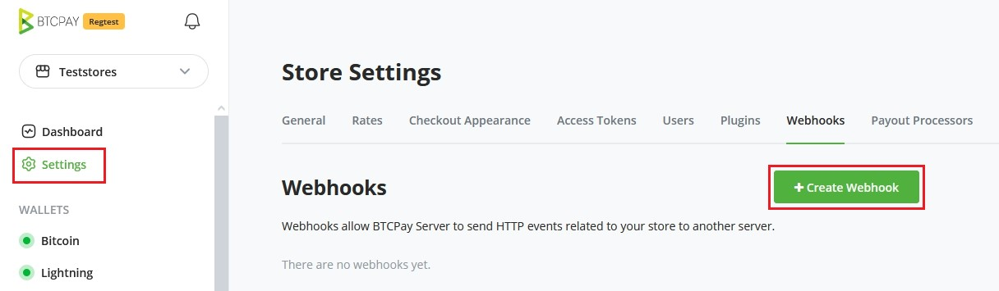
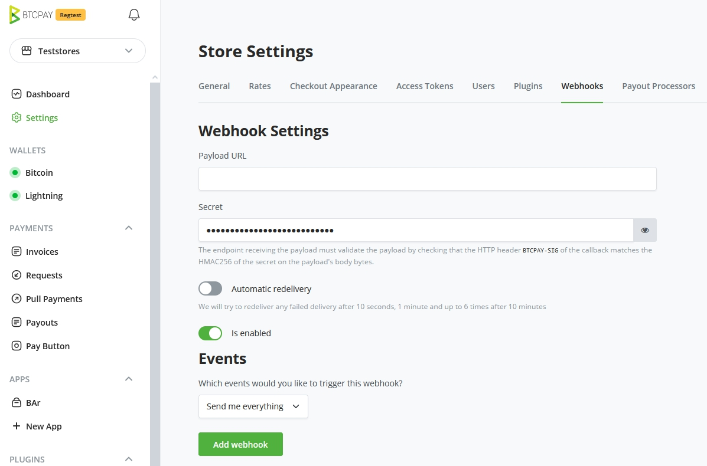
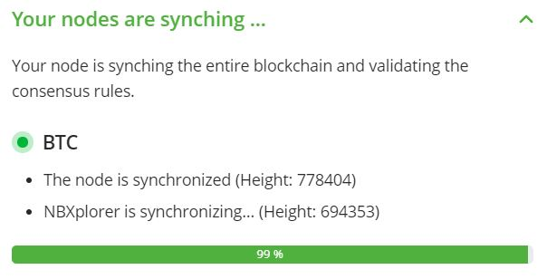

---
tags:
  - refund
  - merchant refund
---

# Maswali ya Jumla

Ukurasa huu una maswali na majibu ya jumla kuhusu BTCPay Server. Ni nini, jinsi inavyofanya kazi, jinsi ya kuisakinisha.

[[toc]]

## BTCPay Server ni nini?

BTCPay Server ni programu huria na ya chanzo wazi ya kusindika malipo ya sarafu ya kidijitali inayokuruhusu kupokea malipo kwa Bitcoin (kwenye mnyororo na kupitia Mtandao wa Lightning) na altcoins moja kwa moja, bila ada, gharama ya muamala au mtu wa kati.

BTCPay ni mfumo wa ankara usio wa ulezi unaoondoa ushiriki wa mtu wa tatu. Malipo na BTCPay huenda moja kwa moja kwenye pochi yako, jambo linaloongeza faragha na usalama. Vifunguo vyako vya faragha havitakiwi kamwe kupokea malipo kwenye BTCPay Server yako. Hakuna [utumiwaji tena wa anwani](#how-does-btcpay-create-a-new-address-for-each-invoice) kwani kila ankara hutumia anwani mpya ya kupokea malipo kwenye pochi yako.

## Kwa nini nichague BTCPay badala ya wasindikaji wengine?

Faida kubwa zaidi ya BTCPay juu ya wasindikaji wengine ni kwamba ni programu isiyo ya ulezi, huru kabisa na ya chanzo wazi, iliyoundwa na jamii. Wakati wasindikaji wengi wengine wanashikilia Bitcoin zako, BTCPay inakuruhusu kupokea malipo P2P, moja kwa moja kwenye pochi yako ya programu au vifaa.

BTCPay ni programu inayojiendesha. Hii inamaanisha kuwa wewe ni msindikaji wako mwenyewe wa malipo. Hakuna usajili, hakuna ada za muamala. Hakuna ushiriki wa mtu wa tatu ambao kwa kiasi kikubwa unaongeza upinzani dhidi ya udhibiti, faragha, na usalama kwako na kwa wateja wako. Zaidi ya hayo, BTCPay inakuwezesha kuwa msindikaji mwenyewe, ili uweze kutoa vifurushi tofauti na kusaidia kueneza matumizi ndani au duniani kote.

Ukiwa na BTCPay, wewe ni benki yako mwenyewe.

## Kwa nini kila mtu anafurahia BTCPay?

Jamii inafurahia BTCPay na mara nyingi inapendekeza kwa wafanyabiashara au waundaji wa maudhui kwa sababu inatoa njia ya moja kwa moja kwa wamiliki wa maduka na mashirika ya hisani kupokea malipo ya Bitcoin, jambo linaloboresha kwa kiasi kikubwa faragha ya wateja/wafadhili.

BTCPay haiachani na upinzani dhidi ya udhibiti, ambao ni moja ya vipengele vikuu vya Bitcoin. Zaidi ya hayo, kwa kuwa ni ya bure na ya chanzo wazi, inatoa fursa nzuri kwa watengenezaji kujenga vitu na ujumuishaji juu ya BTCPay.

## Nani anaweza kutumia BTCPay?

Programu ya BTCPay ni programu yenye vipengele vingi na matumizi mengi ambayo yanaweza kutatua matatizo kwa aina tofauti za watumiaji. Wafanyabiashara, waundaji wa maudhui, watumiaji wa mtandao wa Lightning, ubadilishanaji, watoa huduma za seva na wengine wengi wanaweza kuiona kuwa muhimu. Tazama [ukurasa wa Matumizi](../UseCase.md) kwa uchambuzi wa kina wa matumizi ya BTCPay.

BTCPay ina leseni chini ya [Leseni ya MIT](https://github.com/btcpayserver/btcpayserver/blob/master/LICENSE).

## Jinsi ya kusakinisha BTCPay Server?

Kwanza angalia chaguo mbalimbali za usambazaji na zingatia ni ipi inayofaa mahitaji yako maalum.

- [Tazama usambazaji wote](/Deployment/README.md)

Ikiwa bado una maswali, tembelea [Maswali ya Usambazaji](/FAQ/Deployment.md)

## Wapi kupata mafunzo ya video ya BTCPay?

Miongozo ya video ya maelekezo ya BTCPay Server inaweza kupatikana kwenye kituo rasmi cha YouTube cha BTCPay Server:

- [Kituo cha YouTube cha BTCPay](https://www.youtube.com/channel/UCpG9WL6TJuoNfFVkaDMp9ug/videos)
- [Orodha ya video zote za YouTube za BTCPay](https://www.youtube.com/playlist?list=PL7b9Wt9shK2r-WXS6ysG4tafVQRu80biZ)

## Je, ninahitaji kuwa na duka la mtandaoni ili kutumia BTCPay Server?

Unaweza kutumia BTCPay hata ikiwa huna duka la biashara ya mtandaoni. Unaweza kuzindua BTCPay Server yako na kuwa msindikaji wa malipo kwa marafiki zako au soko la ndani. Matumizi mengine ni kupokea michango kupitia programu ya POS (Point of Sale) au vitufe vya malipo ambavyo vinaweza kunakiliwa na kubandikwa kama vipande vya HTML kwenye tovuti yoyote.

## Kwa nini siwezi kumpa mnunuzi anwani yangu ya Bitcoin tu?

Kutumia tena anwani kwa ajili ya kupokea malipo ni suala la faragha. Kutoa anwani tofauti kwa mwongozo kwa kila mteja sio suluhisho bora. Fikiria kulazimika kutuma barua pepe ya kipekee kwa kila mtu anayetaka kukulipa kwa sarafu ya kidijitali.

BTCPay inatatua suala la utumiaji tena wa anwani. Inaendesha kiotomatiki mchakato wa malipo kwa mfanyabiashara kwa kuunda ankara mpya yenye anwani ya kipekee iliyoundwa kutoka kwenye pochi ya mfanyabiashara, kila wakati mteja anapolipa kwa kutumia BTCPay. Ikiwa unatumia ujumuishaji na duka la biashara ya mtandaoni, BTCPay Server inajumuika katika mchakato wako wa malipo, na wateja wanaweza kukulipa kwa Bitcoin au altcoins kwa mibofyo michache, kama vile chaguo lolote la jadi la malipo.

Baada ya mteja kufanya malipo, programu ya BTCPay Server inaarifu duka lako kwamba agizo limelipwa/kukamilika. Kulingana na programu ya biashara ya mtandaoni unayotumia, inaweza pia kubadilisha hali ya agizo. Unachohitaji kuhangaika nacho ni kusafirisha bidhaa, acha ankara na usindikaji wa malipo kwa BTCPay.

## BTCPay inaundaje anwani mpya kwa kila ankara?

BTCPay Server inajumuisha kipengele muhimu kinachoondoa suala linalojulikana la faragha la utumiaji tena wa anwani. Inafanya hivyo kwa kutoa anwani mpya kila wakati ankara inapoomba malipo. Hii yote inafanyika kiotomatiki na mfanyabiashara hahitaji kufuatilia ni anwani zipi zinazohusiana na pochi gani, duka, nk. BTCPay Server inapanga taarifa zote za malipo katika mfumo wa kina wa ankara kwa mfanyabiashara.

Jinsi inavyofanya kazi ni rahisi sana. Wafanyabiashara wanaunganisha pochi kwenye kila duka lao ambalo wanataka kupokea malipo. Ankara zinazozalishwa kwa malipo ya duka zimeunganishwa moja kwa moja na pochi iliyounganishwa ya mfanyabiashara. Anwani za ankara zinatolewa kutoka kwa [xpubkey](https://bitcointalk.org/index.php?topic=2828777.0) ya pochi inayohusishwa na duka. Programu inahitaji tu ufunguo wako wa umma uliopanuliwa wa pochi kutoa anwani mpya kwa kila malipo. Anwani hizi zinafuatiliwa na BTCPay Server zinaposonga kwenye blockchain. Hali ya malipo kwenye anwani hizo imeelezwa kwa kina katika ukurasa wa ankara ya mfanyabiashara kwa kila duka.

## Je, BTCPay inahitaji ufunguo wangu wa faragha?

Vifunguo vya faragha havitakiwi kwa kutumia BTCPay na pochi iliyopo. Ukweli kwamba BTCPay Server haihitaji ufikiaji wa ufunguo wako mkuu wa faragha kwa miamala ya mnyororo ni faida kubwa ya usalama. Hata ikiwa seva yako itavunjwa, fedha zako kutoka kwa miamala ya mnyororo huwa salama kila wakati. Kulinda fedha zako za mnyororo inategemea [kulinda pochi yako](https://btcinformation.org/en/secure-your-wallet). Kutumia [pochi iliyopo na BTCPay Server](../WalletSetup.md#use-an-existing-wallet) kunahitaji tu ufunguo wa umma kutoka kwenye pochi yako.

Inawezekana kuzalisha pochi mpya kwa kutumia BTCPay Server ambazo ni pochi moto zilizohifadhiwa kwenye seva. Ikiwa una nodi ya Lightning, BTCPay kiufundi ina ufikiaji wa vifunguo (macaroons) vya fedha zako za Lightning pia. Ikiwa hivi ni vipengele ambavyo ungependa kutumia, hakikisha unaelewa [athari za usalama na hatari](../CreateWallet.md#security-implications) zinazohusishwa na vipengele hivi vya majaribio.

Ikiwa unatumia seva ya BTCPay ya Mtu wa Tatu, unapaswa kufahamu [wasiwasi wa usalama](../Deployment/ThirdPartyHosting.md#security-concerns) unaohusishwa na vifunguo vya faragha.

## Je, BTCPay Server inasaidia ubadilishaji wa crypto kwenda fiat?

Ubadilishaji wa Fiat unapatikana kupitia [programu-jalizi](https://plugin-builder.btcpayserver.org/public/plugins) mbalimbali za BTCPay Server. Chunguza programu-jalizi zinazopatikana ili kupata suluhisho zinazokidhi mahitaji yako.

## Je, ikiwa nina tatizo kulipa ankara?

Ikiwa una tatizo kulipa ankara ya BTCPay Server, kuna uwezekano kutokana na moja ya sababu zifuatazo:

1. Unajaribu kulipa kwa kutumia pochi isiyo ya segwit na ankara za mfanyabiashara zinatumia muundo wa Bech32.

Hili ni suala la kawaida lakini linaweza kuwachanganya watumiaji ambao watapokea hitilafu za pochi zinazofanana na `invalid address` wakati wa kufanya malipo kwa ankara. Suluhisho la hili (kwa mteja) ni kutumia [pochi inayooana na SegWit](https://en.bitcoin.it/wiki/Bech32_adoption) inayosaidia kutuma kwa anwani za Bech32.

Suluhisho la hili (kwa mfanyabiashara) ni kurekebisha ufunguo wako wa umma uliopanuliwa (xPub) unaotoa katika duka lako la BTCPay Server. Ili kufanya hivyo, unaweza kuongeza xPub yako na `-[p2sh]` ambayo itarekebisha kiotomatiki anwani zako za ankara ili kuruhusu pochi za SegWit na zisizo za SegWit kufanya malipo kwenye anwani zako. Pochi ya BTCPay Server itafanya hivyo kwa kufunika anwani za xPub na Pay to Script Hash (p2sh) ambayo inazalisha anwani zinazokubalika zaidi. Ni muhimu kuelewa jinsi hii inaweza kuathiri pochi yako na malipo yaliyopokelewa kabla na baada ya kutekeleza suluhisho hili katika duka lako la BTCPay Server. Kurekebisha xPub ya duka lako kutazalisha pochi mpya kabisa kutoka kwa mtazamo wa duka lako la BTCPay Server. Tafadhali elewa yafuatayo kabla ya kutekeleza suluhisho kwa upofu:

- Ikiwa unatumia pochi moto iliyozalishwa na BTCPay Server yako, kurekebisha xpub hakutazalisha maneno mapya ya mbegu na maneno yako ya awali ya mbegu ya pochi moto **hayahifadhiwi tena** kwenye seva.
  - Matokeo yake, hautaweza kutumia fedha zako mpya. Badala yake, unda duka jipya na pochi mpya ya moto ya BTCPay Server na uchague chaguo la `Segwit wrapped (Inaoana na pochi za zamani)` aina ya anwani, na uhamishe fedha kwenye pochi ya duka hili jipya.)
- Ikiwa uliingiza xPub yako kutoka kwenye pochi nyingine (kama vile pochi ya vifaa au programu), pochi yako ya nje haitatambua malipo baada ya kurekebisha xPub yako.
  - Matokeo yake, bado utaweza kutumia fedha kwa kutumia pochi yako ya ndani ya BTCPay Server kwa kutumia Ujumuishaji wa Pochi ya Vifaa (Vault, inapendekezwa) au kwa kusaini kwa mbegu (haipendekezwi).
- Fedha za zamani na miamala ambayo ilionyeshwa hapo awali kwenye pochi ya duka lako hazitaonekana tena.
  - Matokeo yake, unaweza kutaka kuzingatia kuunda duka la pili na xpub iliyorekebishwa, ili kuhifadhi historia ya awali ya miamala yako.

Jifunze zaidi kuhusu miundo ya xpub na jinsi ya kuzirekebisha [hapa](./Wallet.md#what-is-a-derivation-scheme). Ikiwa huelewi chaguo zilizoorodheshwa hapo juu, uliza ufafanuzi katika [jamii kwenye Mattermost](https://chat.btcpayserver.org/).

2. Ankara inapokea malipo, lakini haijalipwa kikamilifu.

Watumiaji wanaweza kujaribu kulipa ankara kutoka kwa ubadilishanaji au huduma nyingine ya ulezi ambapo sehemu ya malipo inakatwa kama ada kutoka kwa malipo. Suluhisho ni kulipa kiasi kinachodaiwa (mradi ankara haijaisha muda wake) au wasiliana na mfanyabiashara kwa kurejeshewa fedha au njia ya kulipa salio la malipo linalodaiwa.

## Je, ikiwa nina tatizo na ankara iliyolipwa?

:::tip
Ili kuomba kurejeshewa fedha kutoka kwa mfanyabiashara, lazima uwasiliane na mfanyabiashara moja kwa moja! BTCPay Server haina uhusiano na mfanyabiashara uliyenunua bidhaa au huduma kutoka kwake.
:::

BTCPay Server ni safu ya programu ya chanzo wazi inayojiendesha, si kampuni. Jamii na wachangiaji walioko nyuma ya BTCPay Server hawana udhibiti juu ya nani anatumia programu au jinsi wanavyotumia.
Ikiwa ulilipa ankara kwa mfanyabiashara na una tatizo na agizo lako, lazima uwasiliane na mfanyabiashara moja kwa moja ili kuona kilichotokea.

Kila mfanyabiashara anayeendesha programu anadhibiti duka lake mwenyewe na pochi zilizounganishwa zinazopokea fedha. Jamii ya BTCPay Server haishikilii au kuwa na ufikiaji wa fedha zozote za duka linalotumia programu ya BTCPay Server, ni mfanyabiashara pekee.

## Wapi ninaweza kupata msaada na usaidizi?

BTCPay ni mradi wa chanzo wazi. Sio kampuni; hakuna barua pepe, gumzo la moja kwa moja au usaidizi wa simu. Programu inategemea mtandao wa wachangiaji na watumiaji kutoa usaidizi.

Ikiwa ulikutana na tatizo au una ombi la kipengele, tafadhali [fungua suala kwenye GitHub](https://github.com/btcpayserver/btcpayserver/issues). Kwa maswali ya jumla zaidi, jiunge na [jamii yetu kwenye Mattermost](https://chat.btcpayserver.org/). Baadhi ya wanajamii wanatoa [msaada wa malipo (unaolipiwa)](../Support.md).

## Ninawezaje kuchangia BTCPay?

Kuna njia nyingi ambazo unaweza kuchangia mradi wa chanzo wazi kama BTCPay.

Njia rahisi ni kutumia programu, kutoa maoni na kuripoti makosa au matatizo yoyote ambayo wewe au wateja wako mnakutana nayo. Ikiwa wewe ni mtengenezaji, unaweza kutusaidia kuunda na kuboresha programu kwa kuchangia katika [hazina za GitHub](https://github.com/btcpayserver) za BTCPay Server. Kutafsiri BTCPay katika lugha yako ya asili kwenye [Transifex](https://www.transifex.com/btcpayserver/btcpayserver/), kutusaidia na nyaraka na uandishi ni njia ambazo unaweza kutusaidia, hata ikiwa wewe si mtengenezaji au mjuzi wa teknolojia. Tunamshukuru kila mchangiaji wa mradi.

Angalia [sehemu ya kuchangia](../Contribute/README.md) kwa njia zote za kuchangia na kusaidia kuboresha mradi.

## Ninawezaje kutumia API ya BTCPay Server?

API ya asili ya BTCPay Server inaoana kwa sehemu kubwa na [API ya BitPay](https://bitpay.com/api/) ili kuruhusu wafanyabiashara kubadilisha kwa urahisi kutumia BTCPay ikiwa wanapendelea mbadala wa bure, wa chanzo wazi, wa usindikaji wa malipo.

Mwaka 2020, BTCPay Server ilianza kutoa API mpya ya Greenfield. API hii mpya itaishi pamoja na API ya asili na kuruhusu matumizi kamili ya vipengele vyote vya BTCPay Server, bila kuhitaji UI. Unaweza kuona [nyaraka za sasa za Greenfield API](https://docs.btcpayserver.org/API/Greenfield/v1/).

Utendaji wa BTCPay Server ambao haupatikani katika nyaraka za Greenfield API unamaanisha kuwa bado haujatekelezwa kikamilifu katika API mpya na watumiaji wanapaswa kutumia API ya asili badala yake. Majadiliano kuhusu uundaji wa API mpya ya Greenfield yanaweza kupatikana [hapa](https://github.com/btcpayserver/btcpayserver/issues/1320).

## Jinsi ya kuunda webhook?

Ndani ya BTCPay Server, ni rahisi kiasi kuunda `Webhook` mpya.
Ukiwa kwenye Dashibodi ya BTCPay Server, nenda kwenye `Mipangilio ya Duka` kisha bofya kwenye kichupo cha `Webhooks`.



Sasa uko kwenye mwonekano wa kuunda `Webhook`.
Hakikisha unajua URL yako ya `Payload` na uibandike kwenye BTCPay Server yako.
Ulipobandika URL ya `payload`, chini yake inaonyesha siri ya `webhook`.

Nakili siri ya `webhook` na uitoee kwenye endpoint.
Kila kitu kikiwa kimewekwa, unaweza kuwasha katika BTCPay Server chaguo la `Utumaji upya wa Kiotomatiki`.
Tutajaribu kutuma upya utumaji wowote ulioshindwa baada ya sekunde 10, dakika 1, na hadi mara 6 baada ya dakika 10.
Unaweza kubadilisha kati ya kila tukio au kutaja matukio kwa mahitaji yako.

Hakikisha unawasha webhook na bofya `Ongeza webhook` ili kuihifadhi.



## Muundo wa Webhook hauoani na BitPay?

Webhooks hazikusudiwi kuoana na API ya BitPay.
Kuna IPN mbili tofauti (katika istilahi za BitPay: "Arifa za Malipo ya Papo Hapo") katika BTCPay Server.

- Webhooks
- Arifa

Ambapo `Webhooks` ni Matukio ya Greenfield na `Arifa` ni matukio ya BitPay.
Tumia `URL ya Arifa` wakati wa kuunda ankara kupitia BitPay.

Kusoma zaidi kuhusu swali hili; [Chanzo](https://github.com/btcpayserver/btcpayserver/discussions/2282)

Kusoma zaidi kuhusu [Greenfield API](https://docs.btcpayserver.org/API/Greenfield/v1/)

Kwa mwongozo wa jinsi ya kusindika `Webhook` katika PHP, angalia [mfano wa hati](https://github.com/btcpayserver/btcpayserver-greenfield-php/blob/master/examples/webhook.php) ufuatao

## Ninawezaje kuhifadhi nakala rudufu ya BTCPay Server yangu?

Inawezekana [kuunda nakala rudufu za mfano wako wa BTCPay Server](https://docs.btcpayserver.org/Docker/backup-restore/) na data yake. Tafadhali kumbuka kuwa hati za nakala rudufu hazijajaribiwa kwa kina kwa aina zote za usanidi wa BTCPay Server na usambazaji maalum. Hakikisha unatumia nakala yako rudufu kuthibitisha inarejesha usanidi wako vizuri, kabla ya kuitegemea.

## Ninawezaje kutoza kwa kutumia mfano wangu wa BTCPay Server?

Kwa sasa kuwatoza watumiaji kwa kutumia mfano wako wa BTCPay Server, iwe ni asilimia ya miamala au ada ya usajili, haisaidiwi kiasili.
Kuwasha kipengele kama hicho kunawezekana, kwa kutumia [Greenfield API](https://docs.btcpayserver.org/API/Greenfield/v1/) lakini itahitaji ujuzi wa kiufundi wa wastani hadi wa kina.

## Imekwama kwenye usawazishaji: "NBXplorer inasawazisha"

Katika baadhi ya matukio, unaweza kukutana na NBXplorer ikikwama. Jambo la kwanza kujaribu katika hali kama hiyo ni kuisasisha. Ikiwa unatumia usambazaji wa Docker, endesha `./btcpay-update.sh` tu au nenda kwenye `Mipangilio ya Seva / Matengenezo / Sasisha`.

Ikiwa, licha ya kuanzisha upya, tatizo linaendelea na NBXplorer inabaki imekwama, unaweza kuona kidirisha cha usawazishaji kinaonekana kama ilivyoonyeshwa hapa chini, na urefu haubadiliki kama vile katika picha hii ya skrini:



Suala hili kwa ujumla hutokea wakati seva yako imekuwa nje ya mtandao kwa muda mrefu, na nodi yako kamili ya Bitcoin imepunguzwa, ambayo ni mpangilio chaguomsingi katika usambazaji wa Docker wa BTCPay Server.

Wakati seva inapoanza upya, nodi kamili ya Bitcoin inasawazisha kabla ya kuruhusu NBXplorer kusawazisha. Hata hivyo, baada ya nodi kamili kusawazisha, inaweza kuwa imepunguza bloku ambazo NBXplorer inahitaji kwa usawazishaji.

Njia pekee ya kutatua hali hii ni kulazimisha NBXplorer kuruka bloku zilizoathirika. Hii inamaanisha kuwa haitaweza kuona miamala yoyote iliyotokea katika kipindi hicho. Hata hivyo, BTCPay Server yako itakuwa mtandaoni tena.

```bash
docker stop generated_nbxplorer_1

docker exec -ti generated_postgres_1 psql -U postgres -d nbxplorermainnet -c "DELETE FROM nbxv1_settings WHERE code='BTC' AND key='BlockLocator-';"

docker start generated_nbxplorer_1
```

Seva yako sasa inapaswa kusawazishwa na iko tayari kutumika.
