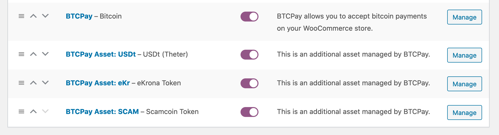
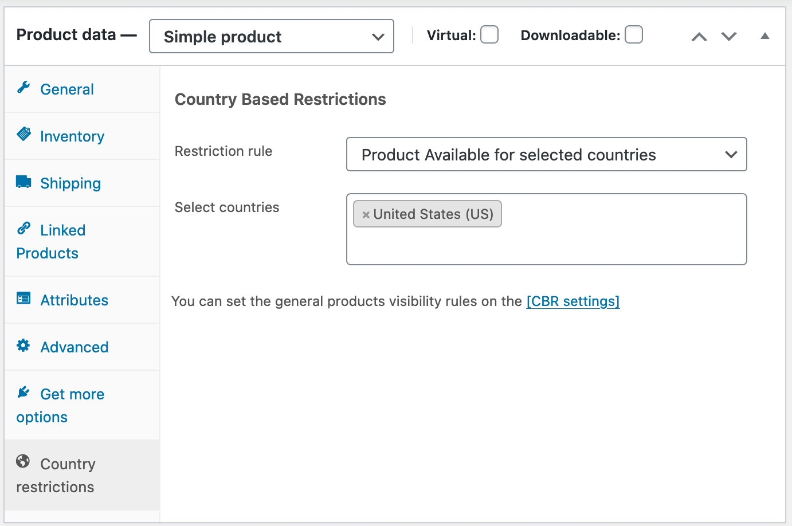
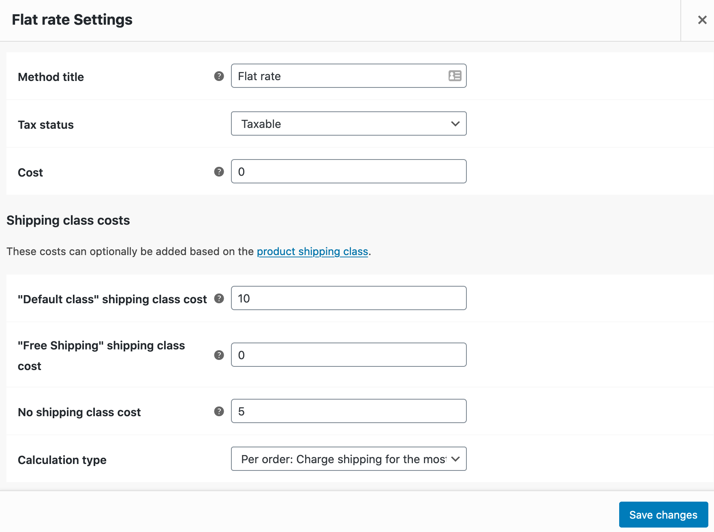
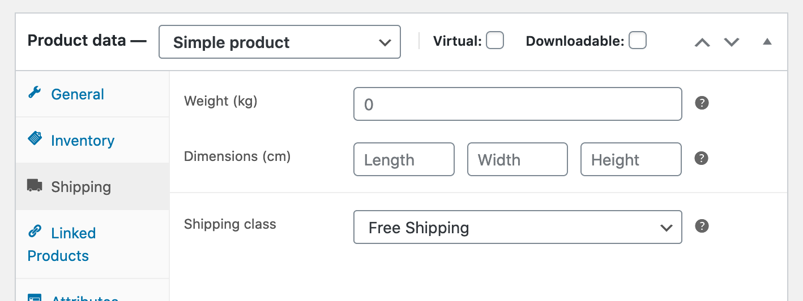
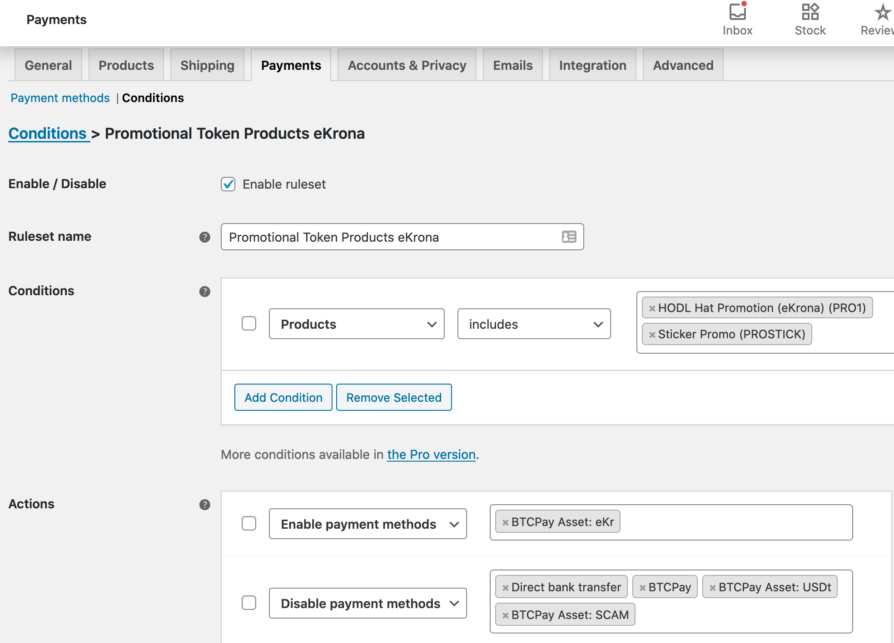
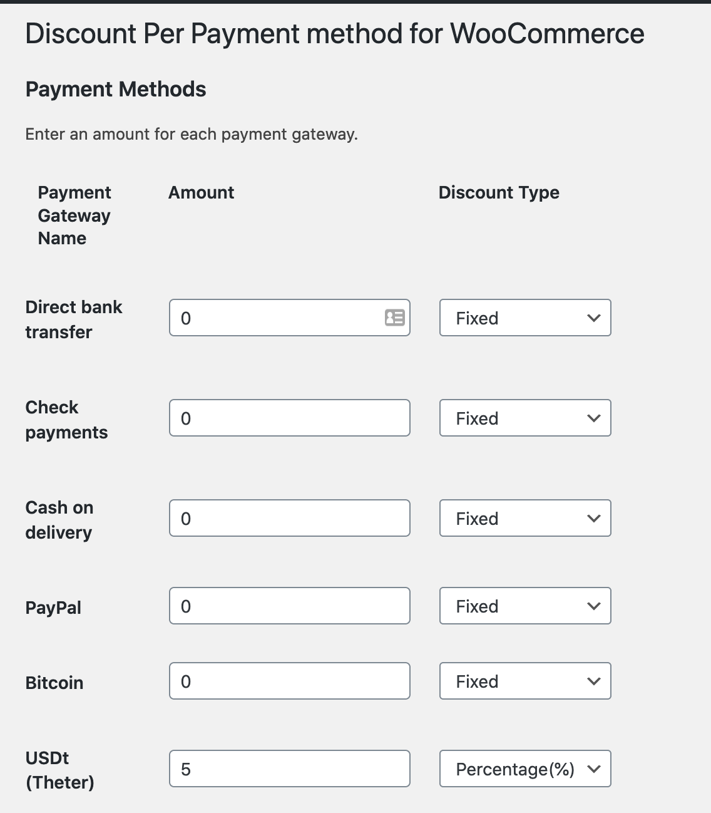
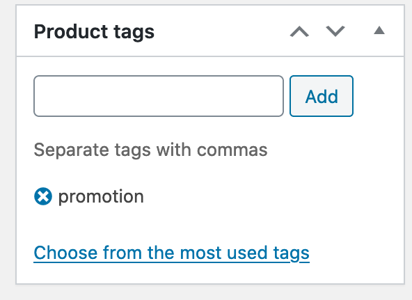

# Maswali ya Ujumuishaji

Ukurasa huu unashughulikia maswali kuhusu ujumuishaji wa BTCPay.

[[toc]]

## Maswali ya Jumla ya Ujumuishaji

### Ni ujumuishaji gani wa biashara ya mtandaoni unapatikana?

- [WooCommerce](../WooCommerce.md)
- [Drupal](../Drupal.md)
- [Magento](../Magento.md)
- [PrestaShop](../PrestaShop.md)
- [Ujumuishaji Maalum](../CustomIntegration.md)
- na mengine mengi, angalia "Ujumuishaji" kwenye upau wa pembeni wa kushoto [hapa](../Guide.md)

Ikiwa wewe ni mtengenezaji, unaweza kuunda ujumuishaji wako mwenyewe kwa kufuata [mwongozo wa ujumuishaji wa biashara ya mtandaoni](../Development/ecommerce-integration-guide.md) na [nyaraka za Greenfield API](https://docs.btcpayserver.org/API/Greenfield/v1).

### Jinsi ya kutumia duka la WooCommerce na BTCPay?

- [BTCPay na WooCommerce](https://www.youtube.com/watch?v=tTH3nLoyTcw)
- [Usakinishaji wa programu-jalizi ya WordPress ya BTCPay](https://www.youtube.com/watch?v=6QcTWHRKZag)
- [Kuunganisha duka lako kwenye seva ya BTCPay ya mtu wa tatu](https://www.youtube.com/watch?v=IT2K8It3S3o)
- [Unganisha pochi yako kwenye BTCPay](https://www.youtube.com/watch?v=xX6LyQej0NQ)
- [Jaribu malipo ya duka lako unapomaliza usanidi](https://www.youtube.com/watch?v=Fi3pYpzGmmo)

### Jinsi ya kutumia BTCPay na Drupal?

- [Usakinishaji na usanidi wa BTCPay na Drupal](../Drupal)

### Jinsi ya kutumia BTCPay na PrestaShop?

- [Kutumia programu-jalizi ya BTCPay kwa Prestashop](../PrestaShop.md)

### Je, BTCPay ina programu-jalizi ya Shopify?

Ndiyo, kuna ujumuishaji wa BTCPay na Shopify. Ili kuanza, angalia [Mwongozo wetu wa Ujumuishaji wa Shopify](../Shopify.md)

### Je, ninaweza kutumia BTCPay bila ujumuishaji?

Ndiyo, unaweza. Ingawa CMS mbalimbali za biashara ya mtandaoni zinatumia ujumuishaji, unaweza kutumia BTCPay hata ikiwa wewe si mfanyabiashara. Kwa taarifa zaidi kuhusu matumizi, angalia [ukurasa huu](../UseCase.md)

## Maswali ya WooCommerce

### Jinsi ya kupandisha toleo hadi programu-jalizi mpya ya BTCPay for WooCommerce V2?

Hakuna upandishaji wa moja kwa moja kutoka kwa [programu-jalizi ya zamani inayotegemea BitPay](https://wordpress.org/plugins/btcpay-for-woocommerce/) hadi [toleo jipya la V2](https://wordpress.org/plugins/btcpay-greenfield-for-woocommerce/) lakini unasakinisha programu-jalizi tofauti kabisa (tazama maagizo ya usakinishaji [hapa](../WooCommerce.md)). Ingawa zote mbili zinafaa kufanya kazi bega kwa bega, inapendekezwa sana uondoe programu-jalizi ya zamani baada ya kufuata maagizo ya usakinishaji na kuhakikisha inafanya kazi. Vinginevyo, kulingana na usanidi wako, inaweza kusababisha tabia isiyotarajiwa na mkanganyiko.

### Jinsi ya kusanidi hali ya agizo katika WooCommerce?

Hali ya agizo inategemea mtindo wa biashara wa mfanyabiashara. Ili kuelewa vizuri hali ya agizo (ankara) ya BTCPay [soma hati hii](../WooCommerce.md#btcpay-order-statuses).
Hakuna njia bora ya kuzisanidi bila majaribio na makosa na kuona kinachofaa kwa biashara yako. Usanidi chaguomsingi unafaa kufanya kazi kwa wafanyabiashara wengi.

### Kubatilisha hali ya malipo ya Imelipwa

Hali ya malipo ya "Imelipwa (haijathibitishwa)" inachora kwenye hali ya agizo ya WooCommerce ya "Kwenye kushikilia" kwa chaguomsingi. Hii ni kutokana na ukweli kwamba miamala ambayo haijathibitishwa inashughulikiwa sawa na malipo ya kadi ya mkopo "yaliyoidhinishwa". Bado hayajakamilika na malipo bado yanaweza kushindwa. Ikiwa bado unataka kubatilisha uchoraji huo, fahamu kwamba inaweza kusababisha matatizo pamoja na kipengele cha "Linda hali ya agizo". Kwa mfano, ikiwa utaweka hali ya malipo ya "Imelipwa (haijathibitishwa)" kuwa "Inachakatwa" na muamala ukabadilishwa au haujathibitishwa kabla ya ankara kuisha muda wake. Hali ya agizo HAITAsasishwa kwa hali ya "Imeghairiwa" kwani kipengele cha "Linda hali ya agizo" kimewashwa. Ikiwa unajua unachofanya, basi unaweza kuzima kipengele cha "Linda hali ya agizo".

### Jinsi ya kubinafsisha uthibitishaji wa barua pepe katika WooCommerce?

Ikiwa unataka kutuma barua pepe baada ya hali fulani kwa mteja, unahitaji kuhariri violezo vya barua pepe vya agizo la WooCommerce. Hii inapendekezwa tu ikiwa unajua unachofanya. [Angalia mwongozo huu](https://www.cloudways.com/blog/how-to-customize-woocommerce-order-emails/).

### Hitilafu: Ikiwa unatumia mfumo mbadala wa nambari za agizo, tafadhali angalia class-wc-gateway-btcpay.php ili kutumia kichujio cha utafutaji

:::warning Warning
Mwongozo huu ni wa [programu-jalizi ya zamani](https://wordpress.org/plugins/btcpay-for-woocommerce/) ambayo imeachishwa na hautumiki kwa [V2 ya programu-jalizi](https://wordpress.org/plugins/btcpay-greenfield-for-woocommerce/) ya hivi karibuni zaidi.
:::

Ikiwa kwa bahati yoyote unatumia nambari tofauti za agizo kuliko kiwango katika WooCommerce, hitilafu ifuatayo inaweza kuonekana katika kumbukumbu zako za programu-jalizi ya BTCPay WooCommerce:

> [Error] The BTCPay payment plugin was called to process an IPN message but could not retrieve the order details for order_id: "ON123". If you use an alternative order numbering system, please see class-wc-gateway-btcpay.php to apply a search filter.

Bandika msimbo ufuatao chini ya faili ya **functions.php** ya mandhari ya mtoto wako:

<details>
  <summary>Click to view code snippet</summary>

```php
function get_order_id_from_custom_order_style($orderid){
  if(is_string($orderid)){
    $result = preg_replace('~\D~', '', $orderid);
    return $result;
  }
  return $orderid;
}

add_filter('woocommerce_order_id_from_number', 'get_order_id_from_custom_order_style', 1);
```

</details>

### Jinsi ya kusanidi Usaidizi wa Tokeni za Ziada / Malango Tofauti ya Malipo

:::warning Warning
Mwongozo huu ni wa [programu-jalizi ya zamani](https://wordpress.org/plugins/btcpay-for-woocommerce/) ambayo imeachishwa na hautumiki kwa [V2 ya programu-jalizi](https://wordpress.org/plugins/btcpay-greenfield-for-woocommerce/) ya hivi karibuni zaidi. Kwenye programu-jalizi ya V2 hii sasa inaitwa "**Malango Tofauti ya Malipo**". Matumizi yote hapa chini bado yanatumika, tofauti pekee ni kwamba **huhitaji** kufuata hatua katika [Sanidi tokeni zako za ziada](#setup-your-additional-tokens), badala yake [sasa una chaguo](../WooCommerce.md#41-global-settings) linalowasha kipengele hiki na kupata tokeni zote zinazosaidiwa kiotomatiki kutoka kwa mfano wako wa BTCPay Server.
:::

::: tip Note
Programu-jalizi za nje za WordPress na WooCommerce zinazotumiwa katika ujumuishaji huu hazijaidhinishwa wala hazijathibitishwa kwa kina au kuchunguzwa na timu ya BTCPay Server. Zitumie kwa hatari yako mwenyewe.
:::

Kwa kutumia usanidi wa tokeni za ziada, utaweza kuwa na njia tofauti za malipo kwa kila Sarafu, Mali, Altcoin au Tokeni iliyosanidiwa. Hii inamaanisha unaweza kuwa na njia tofauti za malipo kwa BTC, Mtandao wa Lightning, LTC, ETH (na tokeni za ERC20), mali za Liquid, ... na kadhalika. Hii inakuruhusu kutoa na kutumia Mali za Liquid kama kuponi au vocha, tazama maelezo zaidi hapa chini.

#### Matumizi

- toa bidhaa bure kupitia tokeni za matangazo
- ruhusu punguzo kwa njia fulani za malipo (tokeni)
- zuia bidhaa kwa njia fulani za malipo (tokeni)
- zuia njia za malipo (tokeni) kwenye kanda za usafirishaji
- na mengi zaidi, tazama mifano hapa chini

#### Mahitaji

- tokeni zote unazosanidi upande wa WooCommerce zinahitaji kupatikana katika duka lako upande wa BTCPay Server
- kutumia tokeni za matangazo unahitaji kuwa na [programu-jalizi ya Mali za Liquid](https://github.com/btcpayserver/btcpayserver-plugins) imesakinishwa kwenye BTCPay Server

#### Aina za tokeni

##### Tokeni za malipo

Tokeni za malipo ni zile zinazosaidiwa na BTCPay Server kwa kawaida (BTC, Mtandao wa Lightning, LTC, XMR, nk.). Zinatumika kama sarafu ya kawaida ya malipo inayobadilishwa kwa kiwango cha sasa cha ubadilishaji dhidi ya sarafu ya fiat ya duka lako.

##### Tokeni za matangazo (punguzo la 100%)

Kwa kuanzishwa kwa programu-jalizi ya Mali za Liquid iliyotajwa hapo juu, sasa pia una uwezekano wa kukubali **tokeni za matangazo**. Unaweza kuzifikiria kama kuponi au vocha zinazoweza kutumiwa kukomboa bidhaa/zawadi. Ni maalum kwa maana kwamba hazina desimali na unahitaji kulipa tokeni 1 kila wakati kwa kila kiasi cha bidhaa.

Wewe kama mmiliki wa duka unaweza [kutoa mali zako za Liquid](https://docs.blockstream.com/liquid/developer-guide/developer-guide-index.html#issued-assets) kwa madhumuni haya au kukubali [zilizopo](https://blockstream.info/liquid/assets).

#### Usanidi

Hakikisha tokeni utakazosanidi kwenye duka lako la WooCommerce zinapatikana na zimesanidiwa vizuri kwenye BTCPay Server yako, vinginevyo utapata makosa wakati wa kuunda ankara wakati wa mchakato wa malipo. Hii itabadilika katika siku zijazo tutakapokuwa na programu-jalizi mpya ya WooCommerce inayopata moja kwa moja data inayohitajika kupitia Greenfield API lakini kwa sasa data inahitaji kuingizwa katika mtindo wa thamani zilizotenganishwa kwa koma (CSV).

##### Maandalizi

Hakikisha una programu-jalizi ya hivi karibuni ya WooCommerce imesakinishwa.

##### Sanidi tokeni zako za ziada

###### Mpangilio: Usanidi wa tokeni za ziada

Katika mipangilio ya njia ya malipo ya BTCPay una mpangilio mpya **"Usanidi wa tokeni za ziada"** ambapo unaweza kuingiza usanidi wa tokeni katika muundo maalum wa CSV wa safu 4.

1. **alama ya tokeni**:
   Muhimu: hii inahitaji kuendana na alama kwenye BTCPay Server, kwa mfano BTC,

2. **jina la kuonyesha**:
   Maandishi yanayoonekana kwa njia ya malipo kwenye malipo

3. **aina**:
   hii inaweza kuwa "**malipo**" au "**tangazo**" [tazama maelezo hapo juu](#token-types)

4. **ikoni ya tokeni (si lazima)**:
   url ya alama ya tokeni inayoonyeshwa wakati wa malipo (inaweza kuwa tupu lakini hakikisha umejumuisha alama za kunukuu). Unaweza kupakia ikoni katika meneja wa midia na kunakili url au unaweza kutumia kiungo cha tovuti ya nje au CDN.

:::danger
**Muhimu:** Maandishi yote ya safu yanahitaji kufungwa kwa alama za kunukuu mbili `"` na kutenganishwa kwa nukta mkato `;` kila mali inapaswa kuwekwa katika mstari mpya.
:::

**Mfano wa usanidi wa tokeni za ziada**

```
"BTC_OFFCHAIN";"Lightning BTC";"payment";""
"USDt";"USDt (Liquid Tether)";"payment";"https://example.com/wp-content/uploads/2021/01/usdt.png"
"eKr";"eKrona (Mali ya Liquid)";"promotion";""
```

Baada ya kuhifadhi, utaona kila mali inapatikana kama njia ya malipo. Unaweza kuziwasha/kuzima kama njia nyingine yoyote ya malipo. Hazitakuwa na mipangilio yoyote kwa sasa (kila kitu kimesanidiwa na data ya CSV). Lakini unaweza kuzitumia pamoja na, kwa mfano, programu-jalizi za malipo za WooCommerce kuruhusu punguzo kwa njia fulani za malipo nk.



###### Mpangilio: Tokeni za ziada: Tekeleza tokeni za malipo

Njia chaguomsingi ya malipo ya BTCPay Server (Bitcoin) **haitatekeleza** Sarafu, Mali, Altcoin au Tokeni yoyote iliyosanidiwa. Hii inamaanisha wakati una njia chaguomsingi ya malipo "Bitcoin" imewashwa, mtumiaji anaweza kuchagua Sarafu, Mali, Altcoin au Tokeni zote zilizosanidiwa (ambazo zina kiwango cha ubadilishaji) kwenye ukurasa wa malipo wa BTCPay Server. Huenda hutaki hili lakini unataka kutekeleza/kuweka kikomo ni chaguo zipi za malipo zitapatikana. Kwa kuchagua kisanduku hiki cha kuteua, ni Sarafu, Mali, Altcoin au Tokeni za aina "malipo" zilizoorodheshwa katika mpangilio [Mpangilio: Usanidi wa tokeni za ziada](#setting-additional-token-configuration) pekee.

#### Matumizi ya kawaida ya WooCommerce kwa kutumia kipengele cha Usaidizi wa Tokeni za Ziada

##### Matumizi 1: weka kikomo cha bidhaa kwa eneo/kanda ya usafirishaji

Programu-jalizi ya bure iliyotumiwa: [Country Based Restrictions for WooCommerce](https://wordpress.org/plugins/woo-product-country-base-restrictions/)
Baada ya kusakinisha na kuwasha programu-jalizi, nenda kwenye bidhaa katika kizuizi cha "Data ya bidhaa", kuna kichupo kipya "Vizuizi vya nchi". Unaweza kusanidi vizuizi unavyotaka hapo.

Mfano wa usanidi:


##### Matumizi 2: Bidhaa (za matangazo) zinapaswa kuwa na usafirishaji bure

Hii inaongeza uwezo wa kutoa usafirishaji bure wakati mteja analipa kwa Sarafu, Mali, Altcoin au Tokeni iliyochaguliwa.
Hii inawezekana na WooCommerce kwa kawaida (hakuna programu-jalizi zinazohitajika):

1. Katika mipangilio ya usafirishaji, ongeza darasa jipya la usafirishaji kwa mfano "usafirishaji-bure"
2. Kwenye usanidi wako wa kanda za usafirishaji / njia ya usafirishaji, unahitaji kuhakikisha unaweka kiwango kuwa 0 kwa darasa hilo la usafirishaji lakini pia "gharama" iko tupu au 0. Na "gharama ya darasa lisilo la usafirishaji" imewekwa kwa kiwango cha kawaida (kwa kutumia kiwango-sawa kama mfano):
   
3. Katika mipangilio ya bidhaa, kizuizi cha "Data ya bidhaa" una kichupo cha "Usafirishaji", hapo weka darasa la "Usafirishaji-bure" lililoundwa hapo juu na litashughulikiwa wakati wa malipo.
   

##### Matumizi 3: weka kikomo cha njia za malipo za bidhaa

Kwa mfano, ruhusu Sarafu, Mali, Altcoin au Tokeni fulani pekee kutumika kama malipo kwa bidhaa za matangazo

Programu-jalizi ya bure iliyotumiwa: [Conditional Payments for WooCommerce](https://wordpress.org/plugins/conditional-payments-for-woocommerce/)

Programu-jalizi hii inatoa mjenzi wa sheria za masharti ambapo unaweza kuwasha/kuzima njia za malipo zinazopatikana kwa bidhaa. Tazama usanidi wa mfano katika picha ya skrini:


##### Matumizi 4: punguzo kwa kila njia ya malipo

Inaongeza uwezo wa kutoa punguzo wakati mteja anatumia Sarafu, Mali, Altcoin au Tokeni iliyochaguliwa kama malipo.

Programu-jalizi ya bure iliyotumiwa: [Discounts Per Payment Method for WooCommerce](https://wordpress.org/plugins/woo-payment-discounts/)

Katika mpangilio wa "Punguzo kwa Malipo" unaopatikana sasa katika mipangilio yako ya WooCommerce, una orodha ya njia zote za malipo na unaweza kutoa punguzo kwa asilimia au kiasi maalum.



##### Matumizi 5: hakikisha bidhaa za matangazo zinanunuliwa pekee

Hii inahitajika kwa sababu njia za malipo zinazotegemea Sarafu, Mali, Altcoin au Tokeni iliyochaguliwa - inayotumiwa kama tokeni ya matangazo - inahitaji kubatilisha bei ya bidhaa na 1 (kwa kiasi) kuruhusu watumiaji kulipa kwa tokeni 1 ya matangazo kwa kila kiasi. Vinginevyo, mtumiaji anaweza kuchanganya bidhaa za kawaida na bidhaa za matangazo wakati wa malipo na kulipa zote kwa tokeni za matangazo, jambo ambalo unataka kuepuka.

Katika mipangilio ya bidhaa kwenye upau wa pembeni wa kulia una "Lebo za bidhaa", ingiza lebo mpya "promotion"



Bandika msimbo ufuatao chini ya faili ya **functions.php** ya mandhari ya mtoto wako:

<details>
  <summary>Click to view code snippet</summary>

```php
/**
* Check if a product is tagged with "promotion" and show a notice that it only
* can be ordered exclusively without any other products in the cart.
*/
function btcpay_check_promotion_product($valid, $product_id, $quantity) {
  $promotion_tag = 'promotion';
  // Check if there are any items in the cart.
  if (!empty($cart_items = WC()->cart->get_cart()) && $valid) {
    // Check if the product is a promotional product and abort.
    if (has_term($promotion_tag, 'product_tag', $product_id)) {
      wc_add_notice( 'Promotional products can only be purchased exclusively, please remove other items from your cart first.', 'error' );
      return false;
    }
    // Also check the case where one has already a promotion product in the
    // cart and also do not allow adding a normal product in that case.
    foreach ($cart_items as $item) {
      if (has_term($promotion_tag, 'product_tag', $item['product_id'])) {
        wc_add_notice( 'Promotional products can only be purchased exclusively, please proceed with checkout or remove the item first.', 'error' );
        return false;
      }
    }
  }

  return $valid;
}
add_filter('woocommerce_add_to_cart_validation', 'btcpay_check_promotion_product', 10, 3);
```

</details>

##### Matumizi 6: Weka kikomo cha malipo ya kipande 1 tu cha bidhaa

Inaongeza uwezo wa kuweka kikomo cha idadi ya Sarafu, Mali, Altcoin au Tokeni inayoweza kutumiwa na mteja katika malipo moja.

Inafaa kwa matangazo ya mtindo wa kuponi ambayo yana kikomo cha punguzo moja kwa kila malipo.

Hii pia imetatuliwa tayari na WooCommerce. Unaweza kuiwasha kwenye kiwango cha bidhaa katika mipangilio ya Bidhaa: Kichupo cha "**Hesabu**":
teua kisanduku cha kuteua [x] "_Washa hii kuruhusu kipande kimoja tu cha bidhaa hii kununuliwa katika agizo moja_"
