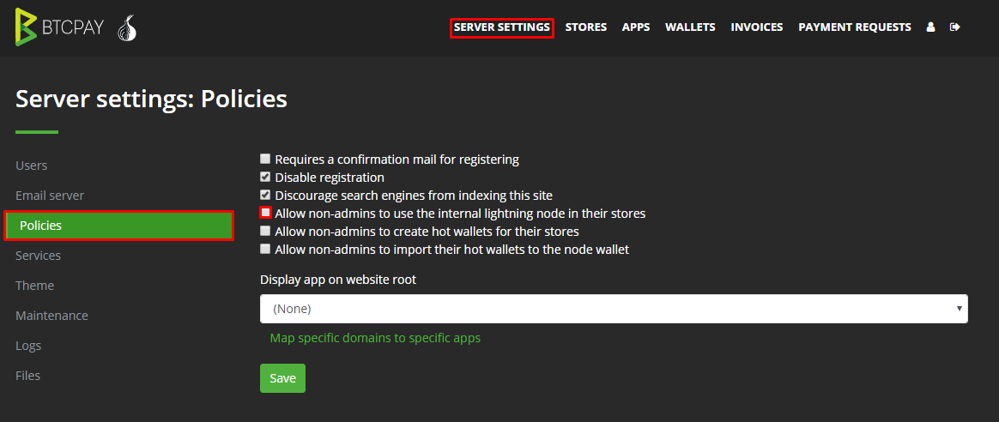
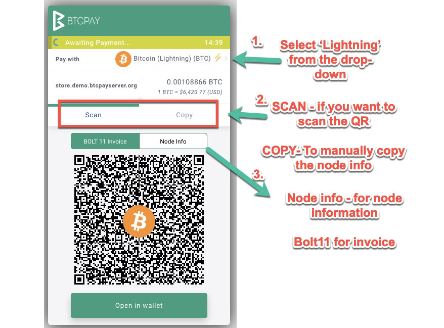
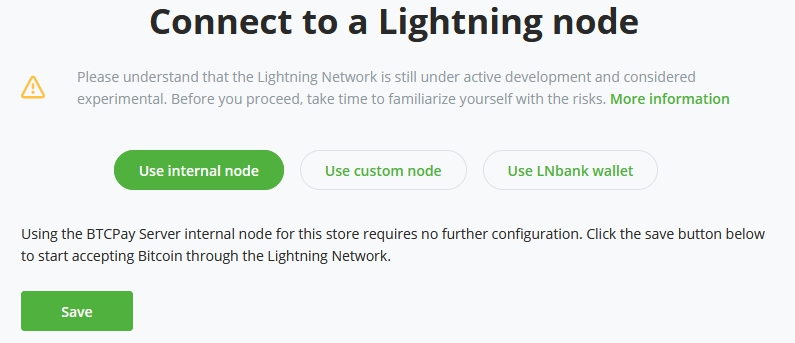
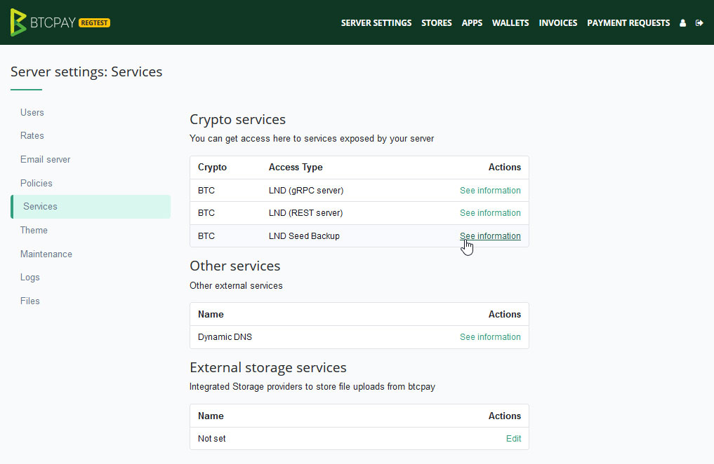
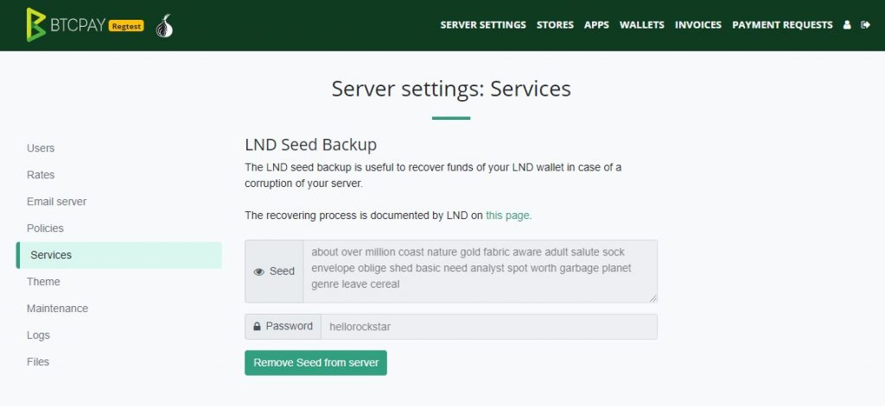

# Maswali ya Mtandao wa Lightning

Hati hii inafafanua baadhi ya maswali na masuala ya kawaida ambayo watumiaji wanakumbana nayo na Mtandao wa Lightning katika BTCPay. Kabla ya kuanza kutumia itifaki ya nje ya mnyororo, jitambulishe na hatari. Zaidi ya hayo, soma [Kuanza na Mtandao wa Lightning katika BTCPay](../LightningNetwork.md)

[[toc]]

## Maswali ya Jumla ya Mtandao wa Lightning

Hapa kuna baadhi ya maswali ya jumla kuhusu LN katika BTCPay, bila kujali utekelezaji.

### Watumiaji wangapi wanaweza kutumia Mtandao wa Lightning katika BTCPay?

Kwenye seva inayojiendesha, unaweza kutumia nodi moja tu ya ndani ya Lightning. Wamiliki wa seva wanaweza kutumia nodi hiyo hiyo ya Lightning kwa idadi isiyo na kikomo ya maduka yaliyounganishwa na akaunti yao ya msimamizi.

Tangu toleo 1.0.3.128, seva pangishi ya BTCPay Server inaweza kuwaruhusu waliojiandikisha kutumia nodi ya ndani ya Mtandao wa Lightning.
Inaweza kuwashwa katika Mipangilio ya Seva > Sera > Ruhusu wasio wasimamizi kutumia nodi ya ndani ya Lightning katika maduka yao.



:::warning Kama seva pangishi ya mtu wa tatu
Fedha zote za waliojiandikisha kwako zitaenda kwenye Pochi yako mwenyewe ya Lightning.
Utalazimika kukagua na kusambaza upya fedha kwa wamiliki wake husika kwa mwongozo. Hii inaweza kuwa mzigo wa matengenezo na kisheria. Fahamu sheria katika nchi yako.
:::

:::danger Kama mtu binafsi anayetumia seva pangishi ya mtu wa tatu
Malipo yote yanayofanywa kupitia Mtandao wa Lightning yataenda kwenye pochi ya mtu wako wa tatu.
Chukua tahadhari na tumia chaguo hili tu unapotumia seva pangishi ya mtu wa tatu inayoaminika ili kuhakikisha unapata fedha zako tena. Kwa ujumla, hii inapaswa kuepukwa na unapaswa kutumia chaguo za kujiendesha zinazopatikana.
:::

Watumiaji wasio wasimamizi wanaweza pia kuunganisha kwenye nodi zao za nje au kuunganisha pochi zao za ulezi na zisizo za ulezi, rejea mwongozo wetu wa [Mtandao wa Lightning](../LightningNetwork.md) kwa taarifa zaidi.

### Jinsi ya kupata taarifa za nodi na kufungua mkondo wa moja kwa moja na duka linalotumia BTCPay?

Ikiwa wewe ni mteja unayejaribu kulipa ankara ya Mtandao wa Lightning:

1. hakikisha umechagua "Lightning" kutoka kwa uteuzi wa sarafu.
2. Chagua Nakili/Changanua
3. Chagua Taarifa za Nodi na zichanganue au uzinakili kwa mwongozo.



Utaratibu halisi wa kufungua mkondo wa moja kwa moja wa Mtandao wa Lightning unategemea pochi unayotumia. Lakini, unapaswa kuwa na uwezo wa kuelewa kwa urahisi sasa kwa kuwa una taarifa za nodi ya mfanyabiashara.

### Kama mfanyabiashara, je, ninahitaji kufungua mikondo ya moja kwa moja?

Wafanyabiashara wanahitaji mikondo ya kuingia. Watu wengine wanaofungua mkondo nao wanatoa ukwasi kwa mfanyabiashara.

Unaweza pia kuwauliza nodi zilizounganishwa vizuri kufungua mkondo wa moja kwa moja nawe. Kufungua mkondo sio kutumia fedha, ni zaidi kama kuweka fedha kwenye kadi ya kulipia kabla, na kuzitumia baadaye, au kuzitoa kwa kufunga mkondo.

Unaweza pia kuangalia kupata ukwasi wa kuingia kwa kutumia Watoa Huduma wa Lightning (LSPs), rejea [mwongozo wetu wa kudhibiti ukwasi](../LightningNetwork-Setup/#manage-liquidity-via-a-lightning-service-provider-lsp) kwa taarifa zaidi.

### Ninawezaje kupata uwezo wa kuingia (inbound capacity) kwenye nodi yangu?

Kuna njia nyingi za kupata uwezo wa kuingia. Kwa mfano, kwa kutumia salio lako lililopo la LN, [kufungua mikondo kwa ushirikiano na wengine](https://lightningnetwork.plus/), au [kutumia LSPs](../LightningNetwork-Setup/#manage-liquidity-via-a-lightning-service-provider-lsp). Kwa maelezo ya kiufundi zaidi, unaweza kusoma [vidokezo vya vitendo vya uwezo wa kuingia](https://medium.com/lightningto-me/practical-solutions-to-inbound-capacity-problem-in-lightning-network-60224aa13393).
Unapoomba uwezo wa kuingia au kutumia LSPs, unaweza kutaka kuzingatia ada zozote za sera ya uelekezaji ambazo huduma inaweza kuwa nazo pamoja na uaminifu na miunganisho ya huduma.

### Nilisakinisha BTCPayServer hapo awali bila Lightning, je, ninaweza kuiwasha?

BTCPay Server itakuruhusu kusanidi Lightning yako wakati wowote baada ya kuunda duka lako la kwanza.
Kwa sasa tunasaidia utekelezaji tatu wa Mtandao wa Lightning.

- [LND](https://github.com/lightningnetwork/lnd)
- [Core Lightning (CLN)](https://github.com/ElementsProject/lightning)
- [eclair](https://github.com/ACINQ/eclair)



Unataka kujifunza zaidi kuhusu jinsi ya kusanidi duka lako na Lightning?
Fuata mwongozo wa [Mtandao wa Lightning](../LightningNetwork.md), na utapata duka lako limeunganishwa kwenye Mtandao wa Lightning!

### Je, ninaweza kutumia nodi iliyopunguzwa na LN katika BTCPay?

Inapendekezwa kutumia Core Lightning (CLN) kwa sababu utekelezaji unasaidia nodi zilizopunguzwa.

### Je, ninaweza kutumia nodi yangu iliyopo ya LN na BTCPay?

Ikiwa tayari una nodi ya Mtandao wa Lightning iliyounganishwa vizuri na ukwasi wa kutosha wa kuingia, unaweza kutaka kuitumia na BTCPay badala ya nodi ya Lightning iliyojumuishwa.

Ili kufanya hivyo, nenda kwenye ukurasa wa mipangilio ya nodi ya Lightning ya duka lako (Duka > Mipangilio > Lightning > Rekebisha). Hapa, kwenye ukurasa wa mipangilio ya nodi ya Lightning, chagua chaguo la Tumia nodi maalum ya Lightning.

Mifuatano ya muunganisho inatofautiana kwa kila utekelezaji wa Lightning, [ukurasa wa mipangilio](../LightningNetwork.md#connecting-an-external-lightning-node-in-btcpay) una nyaraka za mipangilio ya muunganisho kukupa mwongozo zaidi.

### Jinsi ya kubadilisha kutoka Core Lightning (CLN) kwenda LND au kinyume chake?

:::warning
Hakikisha umefunga mikondo yote na kuondoa fedha zote za mnyororo na za Lightning kutoka kwenye nodi ya Lightning kabla ya kubadilisha kutoka moja kwenda nyingine.
:::

Unahitaji kuingia kwa SSH kwenye mashine yako ya mtandaoni.

Kubadilisha kwenda LND:

```bash
sudo su -
cd btcpayserver-docker
export BTCPAYGEN_LIGHTNING="lnd"
. ./btcpay-setup.sh -i
```

Kubadilisha kwenda Core Lightning (CLN):

```bash
sudo su -
cd btcpayserver-docker
export BTCPAYGEN_LIGHTNING="clightning"
. ./btcpay-setup.sh -i
```

### Nilibadilisha utekelezaji wa Mtandao wa Lightning, lakini napata hitilafu "hakuna malipo yanayopatikana"

Unapobadilisha kutoka utekelezaji mmoja kwenda mwingine, unahitaji kusanidi upya mfuatano wako wa muunganisho wa Lightning katika kiwango cha duka, ili kutumia utekelezaji sahihi. Maduka > Mipangilio > Lightning > Sanidi > **Mfuatano wa muunganisho**. Katika mfuatano wa muunganisho, bofya kiungo cha "bofya hapa".

### Napata "ONYO: Kigezo cha LIGHTNING_ALIAS hakijawekwa. Inabadilika kuwa kamba tupu" wakati wa kuanzisha kontena

Unaweza kupuuza hili.
Ikiwa unataka kuweka jina la nodi yako ya Lightning, fungua faili ya env:

```bash
sudo su -
vim $BTCPAY_ENV_FILE
```

Na ongeza au rekebisha ingizo la `LIGHTNING_ALIAS` kuwa `LIGHTNING_ALIAS=nodiyanguyaajabu`.

### Jinsi ya kuonyesha taarifa za Nodi yangu ya Lightning ili wengine waweze kuunganisha nami?

:::tip
Kadiri Mtandao wa Lightning ulivyokomaa, ilionekana kuwa kuunganisha nodi yako mwenyewe ya LN kwa kila mfanyabiashara haipendekezwi. Ikiwa hata unaendesha nodi yako ya LN siku hizi, ni kawaida zaidi kuwa na miunganisho kwa nodi chache zilizounganishwa vizuri za LN kama LSPs au ubadilishanaji.
:::

Taarifa ambazo watumiaji wengine wanahitaji kuunganisha kwenye nodi yako tayari zinaonyeshwa kwenye malipo. Wakati mwingine, wafanyabiashara wanataka kuonyesha nodi yao ili wateja wao waweze kuunganisha mapema.

Kuna njia nyingi za kupata taarifa za nodi yako, lakini njia rahisi ya kuzionyesha kwa wengine ni kwa kutumia ukurasa wa Taarifa za Nodi ya Lightning. Nenda kwa Duka > Mipangilio > Lightning > Rekebisha. Chini ya ukurasa, kuna kitufe cha "Fungua Ukurasa wa Nodi ya Umma". Bofya juu yake kuona taarifa. Ukurasa unaweza kuingizwa kwenye tovuti yako kwa `<iframe>`.


### Wapi ninaweza kupata nakala rudufu ya mbegu ya kurejesha kwa pochi yangu ya Mtandao wa Lightning katika BTCPay Server?

Hapo awali BTCPay ilitumia `noseedbackup`, kwa hivyo usingeweza kuhifadhi nakala rudufu ya pochi yako ya LN au kupata mbegu yako ya kurejesha. Hii ilikuwa kwa sababu katika Mtandao wa Lightning hapakuwa na suluhisho la kuhifadhi nakala rudufu za fedha katika mikondo, tu katika pochi yako ya mnyororo.
Kwa sasa LND ina utendaji kama vile nakala rudufu tuli ya mkondo ambayo inategemea uwepo wa mbegu.
Lakini kwa mara nyingine tena, tafadhali elewa kuwa Mtandao wa Lightning bado uko katika awamu ya majaribio na usiweke fedha ndani yake ambazo [huko tayari kuzipoteza](https://www.youtube.com/watch?v=5fMv8MpzLgQ).

#### Kutumia LND na mbegu (tangu [`v1.0.3.138`](https://github.com/btcpayserver/btcpayserver/releases/tag/v1.0.3.138))

Unaweza kupata Huduma ya Mbegu ya LND chini ya:

- Mipangilio ya Seva > Huduma > Hifadhi Nakala Rudufu ya Mbegu ya LND



Hifadhi na uhifadhi mbegu yako ya kurejesha kwa usalama. Mbegu ni nakala rudufu ya pochi yako ya Lightning ya mnyororo, lakini pia ni muhimu kufanya nakala rudufu tuli za mikondo.



Ikiwa umeihifadhi kwa usalama, unaweza kuiondoa kwenye seva.

Ikiwa unahama kutoka toleo la zamani kwenda `v1.0.3.138`, [chapisho hili la blogu kuhusu jinsi ya kufanya uhamishaji](https://blog.btcpayserver.org/btcpay-lnd-migration) linaweza kusaidia.

### Jinsi ya kuzima malipo ya mnyororo na kutumia malipo ya LN pekee?

Kuna njia mbili rahisi za kufanya hivyo:

1. Duka > Mipangilio > Uzoefu wa Malipo > Chagua njia chaguomsingi ya malipo kwenye malipo
2. Duka > Mipangilio > Rekebisha > Ondoa tiki kwenye kisanduku cha Imewashwa ili kuzima malipo ya mnyororo

### Jinsi ya kuona toleo langu la Mtandao wa Lightning?

Unaweza kuangalia toleo lako la Mtandao wa Lightning kutoka kwa mstari wa amri.
Kwa LND

```bash
sudo su -
cd btcpayserver-docker
./bitcoin-lncli.sh help
```

Kwa Core Lightning (CLN)

```bash
sudo su -
./bitcoin-lightning-cli.sh getinfo
```

Pochi nyingi (RTL, Zap, Zeus, nk.) zinazoweza kuunganisha kwenye nodi yako ya Lightning kwa mbali zitaonyesha toleo kwenye mwonekano wa mbele pia.

### Jinsi ya kuelekeza Anwani ya Lightning?

Matumizi: Unaendesha seva ya BTCPay katika `pay.example.com`, lakini unataka kutumia `me@example.com` kama Anwani yako ya Lightning, kwa sababu inaonekana vizuri kuliko `me@pay.example.com`.

Unachohitaji kufanya ni kusanidi uelekezaji wa `301` kutoka `example.com/.well-known/lnurlp/me` kwenda `pay.example.com/.well-known/lnurlp/me`.
Unaweza kufanya hivyo katika usanidi wako wa seva ya wavuti, hapa kuna mfano kwa Nginx:

```nginx
server {
  server_name example.com;

  # Elekeza maombi ya Anwani ya Lightning kwenye BTCPay Server
  rewrite ^/\.well-known/lnurlp/(.*)$ https://pay.example.com/.well-known/lnurlp/$1 permanent;
}
```

## Maswali ya Lightning Network LND

Hapa kuna baadhi ya maswali ya kawaida kuhusu [utekelezaji wa LND](https://github.com/lightningnetwork/lnd/issues) wa Mtandao wa Lightning.

### Jinsi ya kuanzisha upya LND yangu?

```bash
sudo su -
docker restart btcpayserver_lnd_bitcoin
```

### Jinsi ya kuchanganua upya pochi ya mnyororo ya LND?

:::warning
washa kipande hiki kwa muda tu ili kuweka upya miamala ya pochi ya mnyororo ya LND na kusababisha uchanganuzi upya
baada ya uchanganuzi upya uliofanikiwa, unapaswa kuzima kipande hiki tena, au kitachanganua upya pochi ya mnyororo kila
kuanzishwa upya!
ONYO: Uchanganuzi upya unaweza tu kupata miamala ndani ya bloku zako zilizohifadhiwa (jihadharini na nodi ZILIZOPUNGUZWA!)
:::
Ili kubinafsisha mipangilio ya LND ambayo haipatikani kama vigezo vya mazingira, unaweza [kuunda kipande maalum](../Docker/README.md#how-can-i-customize-the-generated-docker-compose-file) katika `docker-compose-generator/docker-fragments/opt-lnd-wallet-rescan.custom.yml` kama hivi:

```
version: "3"
services:
  lnd_bitcoin:
    environment:
      LND_EXTRA_ARGS: |
        reset-wallet-transactions=1
  lnd_litecoin:
    environment:
      LND_EXTRA_ARGS: |
        reset-wallet-transactions=1
  lnd_bitcoingold:
    environment:
      LND_EXTRA_ARGS: |
        reset-wallet-transactions=1
```

Kwa taarifa zaidi kuhusu kipengele hiki cha LND, angalia [nyaraka zao](https://github.com/lightningnetwork/lnd/blob/master/docs/recovery.md#forced-in-place-rescan).

### Jinsi ya kuona kumbukumbu za LND?

Ili kuangalia kumbukumbu za nodi yako ya LND katika BTCPay Server (usakinishaji wa Docker), tumia amri ifuatayo:

`docker logs --tail 40 btcpayserver_lnd_bitcoin`

Unaweza kubadilisha 40 kuwa nambari yoyote unayotaka. Nambari inawakilisha mistari ya msimbo itakayoonyeshwa. Kwa taarifa zaidi kuhusu kumbukumbu, tazama [ukurasa wa Utatuzi](../Troubleshooting.md)

### Saraka chaguomsingi ya LND katika BTCPay ni ipi?

`/var/lib/docker/volumes/generated_lnd_bitcoin_datadir/_data`

### Ni macaroon gani inahitaji kutolewa kwa nodi za nje?

BTCPay Server inahitaji `admin.macaroon` kuangalia ikiwa nodi ya Lightning imesawazishwa kikamilifu kabla ya kuunda ankara.
Ikiwa unataka kuunda macaroon maalum kwa muunganisho wa BTCPay Server, tumia bakery ya macaroon ya LND:

```bash
lncli bakemacaroon address:read address:write info:read invoices:read invoices:write onchain:read
```

### Masuala ya muunganisho wa LND baada ya sasisho

Uthibitishaji huelekea kushindwa kwenye LND baada ya sasisho, dalili ni:

- Katika mipangilio ya duka, wakati wa kujaribu muunganisho kwenye nodi yako unapata `Error while connecting to the API (The HTTP status code of the response was not expected (500).)`
- Katika pochi ya Zap, `Unable to connect to host: cannot retrieve macaroon: cannot get macaroon: root key with id 0 doesn't exist`

Katika hali kama hiyo, unahitaji kufuta macaroon ya LND na kuianzisha upya.

Ikiwa unatumia usambazaji wa Docker, tafadhali unganisha na SSH kwenye VM yako na tumia amri ifuatayo:

```bash
sudo su -
docker exec btcpayserver_lnd_bitcoin rm /data/admin.macaroon
docker exec btcpayserver_lnd_bitcoin rm /data/invoice.macaroon
docker exec btcpayserver_lnd_bitcoin rm /data/readonly.macaroon
docker exec btcpayserver_lnd_bitcoin rm /data/data/macaroons.db
docker exec btcpayserver_lnd_bitcoin rm /data/data/chain/bitcoin/mainnet/invoice.macaroon
docker exec btcpayserver_lnd_bitcoin rm /data/data/chain/bitcoin/mainnet/macaroons.db
docker exec btcpayserver_lnd_bitcoin rm /data/data/chain/bitcoin/mainnet/readonly.macaroon
docker restart btcpayserver_lnd_bitcoin
```

Ikiwa macaroon haipo, utaona ujumbe wa hitilafu, unaweza kuupuuza kwa usalama.

Kwa sababu hii itabatilisha macaroons zilizotangulia, unahitaji kuunganisha upya kwa mwongozo na Zap kwa `Mipangilio ya Seva / Huduma / LND-gRPC`.

### Jinsi ya kubadilisha jina la Nodi yangu ya LND?

Ili kubadilisha jina la kuonyesha la nodi yako ya LND, unapaswa kuingia kwa SSH kwenye mashine yako ya mtandaoni na utekeleze yafuatayo:

```bash
sudo su -
cd btcpayserver-docker
export LIGHTNING_ALIAS="jinalahapa"
. ./btcpay-setup.sh -i
```

### Jinsi ya kuhariri lnd.conf?

Ili kubinafsisha [mipangilio ya LND](https://docs.lightning.engineering/lightning-network-tools/lnd/lnd.conf) ambayo haipatikani kama vigezo vya mazingira, unaweza [kuunda kipande maalum](../Docker/README.md#how-can-i-customize-the-generated-docker-compose-file) katika `docker-compose-generator/docker-fragments/opt-lnd-config.custom.yml` kama hivi:

```yml
version: '3'
services:
  lnd_bitcoin:
    environment:
      LND_EXTRA_ARGS: |
        minchansize=1234567
```

Unaweza kuongeza ubinafsishaji wako katika thamani ya `LND_EXTRA_ARGS`, kama ilivyoonyeshwa kwa kuweka thamani ya `minchansize`.

Baadaye, usanidi lazima uongezwe kwenye vipande vya ziada na usanidi unahitaji kuendeshwa:

```bash
export BTCPAYGEN_ADDITIONAL_FRAGMENTS="$BTCPAYGEN_ADDITIONAL_FRAGMENTS;opt-lnd-config.custom"
. ./btcpay-setup.sh -i
```

Kwa njia hii, mipangilio yako maalum inaongezwa kwenye usanidi na itadumu katika sasisho.

### Jinsi ya kuunganisha kwenye watchtower ya LND?

Ili kuunganisha watchtower ya LND, unahitaji kujumuisha kipande cha [`opt-lnd-wtclient`](https://github.com/btcpayserver/btcpayserver-docker/blob/master/docker-compose-generator/docker-fragments/opt-lnd-wtclient.yml) na kwa hiari kusanidi `LND_WTCLIENT_SWEEP_FEE`:

```bash
export BTCPAYGEN_ADDITIONAL_FRAGMENTS="$BTCPAYGEN_ADDITIONAL_FRAGMENTS;opt-lnd-wtclient"
export LND_WTCLIENT_SWEEP_FEE=10 # Ada itakayotumika kwa muamala wa kufagia, sat/vbyte 10 ni chaguomsingi
. ./btcpay-setup.sh -i
```

Baadaye, unaweza kutumia amri za RPC za `wtclient` kwa kudhibiti miunganisho kwenye watchtowers:

```bash
# Unganisha kwenye watchtower ya mbali
./bitcoin-lncli.sh wtclient add PUBKEY@IP:PORT

# Angalia miunganisho yako ya watchtower
./bitcoin-lncli.sh wtclient towers
```

### Jinsi ya kuendesha watchtower ya LND?

Unaweza kuendesha watchtower pamoja na mfano wako wa LND kwa kujumuisha kipande cha [`opt-lnd-watchtower`](https://github.com/btcpayserver/btcpayserver-docker/blob/master/docker-compose-generator/docker-fragments/opt-lnd-watchtower.yml):

```bash
export BTCPAYGEN_ADDITIONAL_FRAGMENTS="$BTCPAYGEN_ADDITIONAL_FRAGMENTS;opt-lnd-watchtower"
. ./btcpay-setup.sh -i
```

Hii itafanya watchtower ipatikane kwenye seva.

Ili kuruhusu miunganisho kutoka kwa wateja wengine wa watchtower (kupitia [amri za RPC za wtclient]()), utahitaji kuongeza `watchtower.externalip` kwenye [kipande maalum](../Docker/README.md#how-can-i-customize-the-generated-docker-compose-file) katika `docker-compose-generator/docker-fragments/opt-lnd-config.custom.yml` kama hivi:

```yml
version: '3'
services:
  lnd_bitcoin:
    environment:
      LND_EXTRA_ARGS: |
        watchtower.externalip=YOUR_SERVER_IP
```

Baadaye, usanidi lazima uongezwe kwenye vipande vya ziada na kufungua mlango `9911` katika mipangilio ya firewall:

```bash
# Ongeza kipande maalum cha LND
export BTCPAYGEN_ADDITIONAL_FRAGMENTS="$BTCPAYGEN_ADDITIONAL_FRAGMENTS;opt-lnd-config.custom"
. ./btcpay-setup.sh -i

# Fungua mlango wa RPC wa watchtower katika firewall
ufw allow 9911/tcp
```

Kuendesha amri ya `tower info` kunapaswa basi kuorodhesha mfano wako wa watchtower ya umma katika sehemu ya `uris`.

```bash
# ./bitcoin-lncli.sh tower info
{
    "pubkey": "YOUR_TOWER_PUBKEY",
    "listeners": [
        "172.23.0.9:9911",
        "127.0.0.1:9911"
    ],
    "uris": [
        "YOUR_TOWER_PUBKEY@YOUR_SERVER_IP:9911"
    ]
}
```

Jifunze zaidi kuhusu [kusanidi watchtowers](https://docs.lightning.engineering/lightning-network-tools/lnd/watchtower).

### Jinsi ya kusakinisha ThunderHub?

Ili kusakinisha ThunderHub kwenye mfano wako, tekeleza yafuatayo:

```bash
export BTCPAYGEN_ADDITIONAL_FRAGMENTS="$BTCPAYGEN_ADDITIONAL_FRAGMENTS;opt-add-thunderhub"
. btcpay-setup.sh -i
```

Ikiwa unapata ujumbe ufuatao wa onyo **Haiwezi kuunganisha kwenye nodi hii**, pengine ni kwa sababu cheti kinachotumiwa kuwasiliana na LND hakina vikoa sahihi. LND haitoi vipya isipokuwa vile vya zamani vifutwe kwanza.

Ili kufuta cheti cha zamani na ufunguo na kuwa na LND itoe vipya, tekeleza yafuatayo:

```bash
docker exec btcpayserver_lnd_bitcoin rm /data/tls.cert
docker exec btcpayserver_lnd_bitcoin rm /data/tls.key
docker restart btcpayserver_lnd_bitcoin
docker restart generated_bitcoin_thub_1
```

## Maswali ya Lightning Network Core Lightning (CLN)

Hapa kuna baadhi ya maswali ya kawaida kuhusu utekelezaji wa [Core Lightning (CLN)](https://github.com/ElementsProject/lightning/issues) wa Mtandao wa Lightning.

### Jinsi ya kuanzisha upya Core Lightning (CLN) yangu?

```bash
sudo su -
docker restart btcpayserver_clightning_bitcoin
```

### Jinsi ya kutangaza anwani ya IPv6?

Kwanza, nakili `bitcoin-clightning.yml` kwenye folda ya vipande vya Docker kama `bitcoin-clightning.custom.yml`.
Muhimu: faili lazima iishe kwa `.custom.yml`, au kutakuwa na migogoro ya Git kila unapoendesha `btcpay-update.sh`.

Rekebisha `bitcoin-clightning.custom.yml` mpya kama ifuatavyo:

```yaml
services:
  clightning_bitcoin:
    environment:
      LIGHTNINGD_OPT: |
        announce-addr=[ipv6 here]
```

Hakikisha unaingiza anwani kati ya mabano mawili ya mraba [].

Kisha uisanidi:

```bash
export BTCPAYGEN_ADDITIONAL_FRAGMENTS="bitcoin-clightning.custom"
. ./btcpay-setup.sh -i
```

### Jinsi ya kuhariri .lightning/config?

Ili kubinafsisha [mipangilio ya Core Lightning](https://docs.corelightning.org/reference/lightningd-config) ambayo haipatikani kama vigezo vya mazingira, unaweza [kuunda kipande maalum](../Docker/README.md#how-can-i-customize-the-generated-docker-compose-file) katika `docker-compose-generator/docker-fragments/opt-lightningd-config.custom.yml` kama hivi:

```yml
version: '3'
services:
  clightning_bitcoin:
    environment:
      LIGHTNINGD_OPT: |
        alias=JinaLaNodiYangu
        rgb=003366
```

Unaweza kuongeza ubinafsishaji wako katika thamani ya `LIGHTNINGD_OPT`, kama ilivyoonyeshwa kwa kuweka thamani za `alias` na `rgb`.

Baadaye, usanidi lazima uongezwe kwenye vipande vya ziada na usanidi unahitaji kuendeshwa:

```bash
export BTCPAYGEN_ADDITIONAL_FRAGMENTS="$BTCPAYGEN_ADDITIONAL_FRAGMENTS;opt-lightningd-config.custom"
. ./btcpay-setup.sh -i
```

Kwa njia hii, mipangilio yako maalum inaongezwa kwenye usanidi na itadumu katika sasisho.

## Maswali na Usaidizi wa Mtandao wa Lightning

Usaidizi wa jamii kwa maswali ya Mtandao wa Lightning ni mdogo sana, kwani itifaki ni mpya kiasi.

Ikiwa unakabiliwa na tatizo la kiufundi na utekelezaji wako wa Mtandao wa Lightning, ambalo halijarekodiwa hapa, unaweza kutaka kuuliza maswali katika jamii zao husika.

#### Usaidizi wa LND

- [LND GitHub](https://github.com/lightningnetwork/lnd/issues)
- [Lightning Community on Slack](https://lightningcommunity.slack.com)

#### Usaidizi wa Core Lightning (CLN)

- [CLN GitHub](https://github.com/ElementsProject/lightning/issues)
- [CLN Kikundi cha Telegram](https://t.me/lightningd)
- [Nyaraka za CLN](https://lightning.readthedocs.io/)
