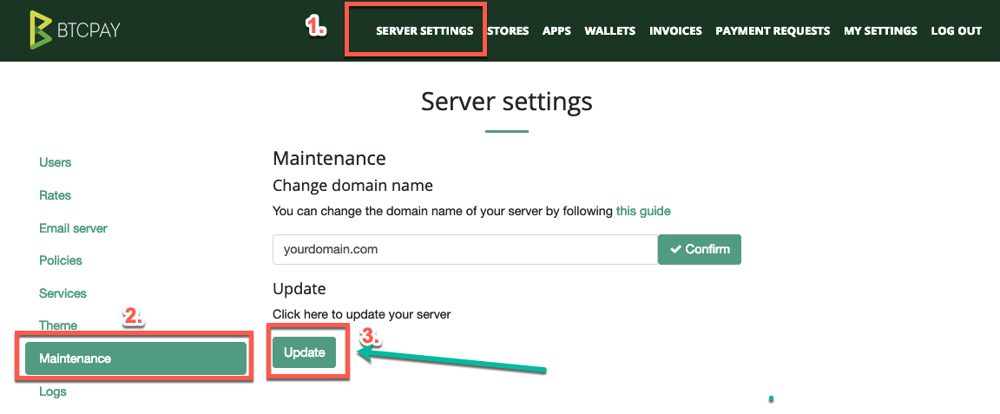
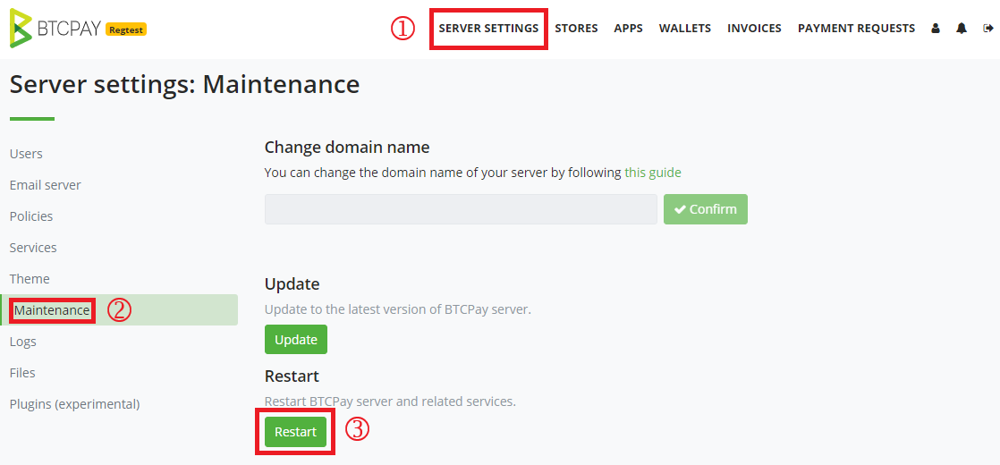
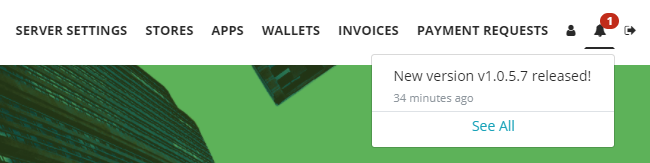
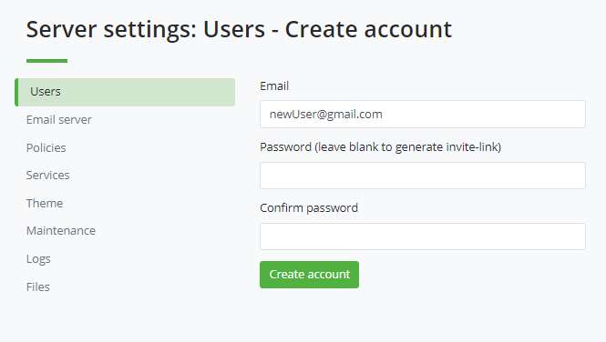
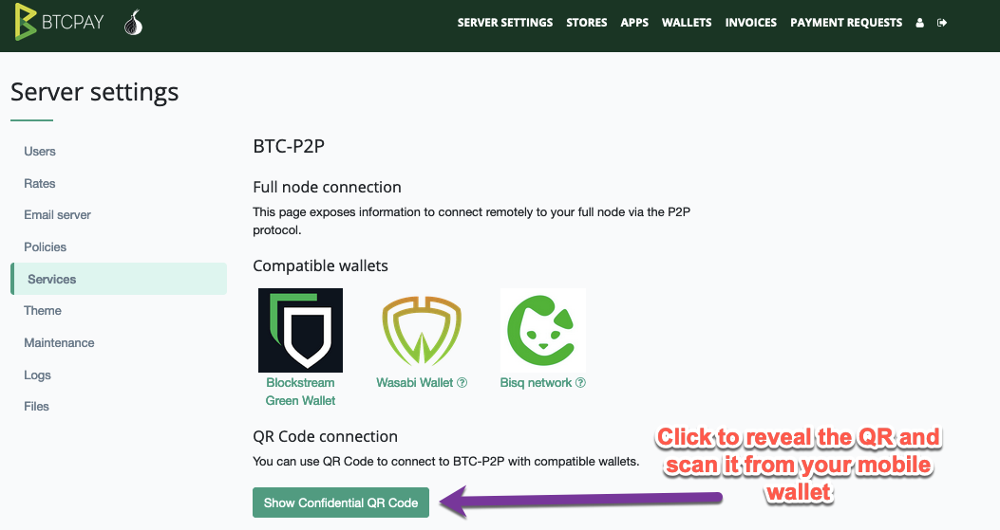

# Maswali ya Mipangilio ya Seva

Hati hii inashughulikia maswali na masuala yote yanayohusiana na Mipangilio ya Seva.
Mipangilio hii inapatikana tu kwa msimamizi wa seva. Angalia [ukurasa wa matembezi](../Walkthrough.md) ili kujifunza zaidi.

[[toc]]

## Matengenezo

### Jinsi ya kusasisha BTCPay Server?

Kuna njia 2 za kusasisha BTCPay Server yako:

1. Kusasisha katika kiolesura cha mtumiaji: Mipangilio ya Seva > Matengenezo > Sasisha.



2. Kusasisha kwa kutumia SSH: Ingia kwenye mashine yako ya mtandaoni kwa SSH, kisha tekeleza amri zifuatazo:

```bash
sudo su -
cd btcpayserver-docker
btcpay-update.sh
```

### Jinsi ya kuanzisha upya BTCPay Server?

Kuna njia 2 za kuanzisha upya BTCPay Server yako:

1. Kuanzisha upya katika kiolesura cha mtumiaji: Mipangilio ya Seva > Matengenezo > Anzisha Upya.



2. Kuanzisha upya kwa kutumia SSH: Ingia kwenye mashine yako ya mtandaoni kwa SSH, kisha tekeleza amri zifuatazo:

```bash
sudo su -
cd btcpayserver-docker
btcpay-restart.sh
```

### Jinsi ya kutumia SSH kwenye BTCPay yangu inayoendeshwa kwenye VPS?

Fuata maagizo haya kufikia SSH kupitia kikoa au IP:

```
ssh mtumiajiwakikoa@example.com (domain)
au
ssh mtumiajiwakikoa@70.32.86.175 (IP)

mtumiajiwakikoa@example.com's password:
nenosililako
```

Bonyeza Enter

Ikiwa hii ni mara yako ya kwanza kuunganisha kwenye seva kutoka kwa kompyuta hii, utaona matokeo yafuatayo.

```
The authenticity of host 'example.com (70.32.86.175)' can't be established.
RSA key fingerprint is 3c:6d:5c:99:5d:b5:c6:25:5a:d3:78:8e:d2:f5:7a:01.
Are you sure you want to continue connecting (yes/no)?

ndiyo
```

Au angalia [mfano huu wa LunaNode](https://github.com/JeffVandrewJr/patron/blob/master/SSH.md) na PuTTY.

### Jinsi ya kuona, kama msimamizi, kinachoendeshwa kwenye BTCPay Server yangu?

Unahitaji kuingia kwa SSH kwenye BTCPay Server yako, na kuendesha mstari mmoja kuona orodha ya `apps` katika mfumo:

```
docker exec -ti $(docker ps -a -q -f "name=postgres_1") psql -U postgres -d btcpayservermainnet -c 'select "Name" from "Apps";'
```

Hii kuona orodha ya `maduka` na tovuti zao:

```
docker exec -ti $(docker ps -a -q -f "name=postgres_1") psql -U postgres -d btcpayservermainnet -c 'select "StoreName","StoreWebsite" from "Stores";'
```

Unaweza pia kuendesha hii kuona orodha ya watumiaji:

```
docker exec -ti $(docker ps -a -q -f "name=postgres_1") psql -U postgres -d btcpayservermainnet -c 'select "Id", "Email" from "AspNetUsers";'
```

### Ninawezaje kuona toleo langu la BTCPay Server?

Unaweza kuona toleo lako la BTCPay Server chini kulia mwa kijachini cha ukurasa unapoingia kama msimamizi wa seva.

Usambazaji unaotumia v1.0.5.7 na baadaye utapokea arifa kiotomatiki ili kukujulisha wakati toleo jipya la BTCPay Server limetolewa.



Kumbuka: Kipengele hiki kitaweka kiotomatiki kigezo cha mazingira cha `BTCPAY_UPDATEURL` katika kontena la BTCPay Server kufanya ombi moja la kila siku kwa [endpoint hii ya Github](https://api.github.com/repos/btcpayserver/btcpayserver/releases/latest). Wasimamizi wa seva wanaweza kuzima arifa hizi kwa kuzima sera katika Mipangilio ya Seva > Sera > Angalia matoleo kwenye GitHub.

### Ninawezaje kuangalia toleo langu la BTCPay Server kupitia terminal?

Katika folda ya btcpayserver-docker: `bitcoin-cli.sh getnetworkinfo`

### Faili ya ufunguo wa SSH ya BTCPay ni nini?

Ufunguo wa SSH wa BTCPay unawawezesha watumiaji kusasisha seva yao au kubadilisha haraka jina la kikoa kutoka kwa tovuti ya BTCPay, kupitia kiolesura cha mtumiaji.

### Nimesahau nenosiri la Msimamizi wa BTCPay?

Kwanza, jiandikishe mtumiaji mpya kwenye BTCPay Server yako, kwa kubofya "Jiandikishe", kwa mfano: "msimamizimpya@example.com".

Ikiwa huwezi kuunda mtumiaji mpya kwa sababu usajili umezimwa katika Mipangilio ya Seva > Sera, unahitaji kuweka upya mipangilio ya sera. Tafadhali ruka hatua hii ikiwa unaweza kuunda mtumiaji mpya kwenye ukurasa wa mbele wa nyumbani kwa kutumia kitufe cha kujiandikisha. Endesha amri ifuatayo (Pia inafuta mipangilio mingine yoyote ya seva inayotumika kwa sasa):

```bash
# Kama mtumiaji mkuu
sudo su -
cd $BTCPAY_BASE_DIRECTORY/btcpayserver-docker/
# Fungua usajili tena
./btcpay-admin.sh reset-server-policy
```

Rudi kwenye BTCPay Server yako na ubofye kitufe cha "Jiandikishe" ambacho sasa kinapaswa kuwashwa. Iwapo huoni kiungo cha Kujiandikisha kwenye menyu, hiyo pengine ni kwa sababu ya caching. Anzisha upya btcpay yako kwa `btcpay-restart.sh`.

Kisha, ongeza mtumiaji aliyesajiliwa hivi karibuni `msimamizimpya@example.com` kama msimamizi:

```bash
# Weka mtumiaji mpya kama msimamizi
./btcpay-admin.sh set-user-admin msimamizimpya@example.com
```

Sasa unaweza kufikia kwa kutumia `msimamizimpya@example.com` kama msimamizi.

Kumbuka kwamba ikiwa ulikuwa tayari umeingia na mtumiaji kabla ya kumfanya kuwa msimamizi, utalazimika kutoka na kuingia tena.

Baada ya kutumia mabadiliko, utaona akaunti mpya ya msimamizi iliyoundwa haijaongezwa kiotomatiki kwenye maduka yoyote. Ikiwa toleo lako la BTCPayServer ni 2.0 au mpya zaidi, unaweza kumwongeza msimamizi mpya wa seva kwenye maduka kwa mwongozo. Kwa matoleo ya zamani ya BTCPayServer, unaweza kupata tena ufikiaji wa akaunti ya zamani ya msimamizi wa seva (na hivyo maduka) kwa kusanidi SMTP kutuma barua pepe ya kuweka upya nenosiri au kwa kutumia [**Admin Pass Reset** plugin kutoka R0ckstar Dev](https://github.com/rockstardev/BTCPayServerPlugins.RockstarDev/tree/master/Plugins/BTCPayServer.RockstarDev.Plugins.AdminPassReset).

### Jinsi ya kuongeza mtumiaji mpya kwa mwaliko?

Wasimamizi wa seva wanaweza kuongeza watumiaji wapya kwa kuunda kiungo cha mwaliko kushiriki nao. Hii inaweza kuwaruhusu wasimamizi kuzima usajili wa umma kwenye seva, au kuwaalika watumiaji maalum kwa kubofya: Mipangilio ya Seva > Ongeza Mtumiaji (usitoe nenosiri) > Unda akaunti



Kiungo kinachoweza kushirikiwa kitaonyeshwa kwa msimamizi wa seva kusambaza. Barua pepe itatumwa (ikiwa barua pepe [imesanidiwa kwenye seva](#how-to-configure-smtp-settings-in-btcpay)) ili kuweka nenosiri. Mtumiaji mpya ataunda nenosiri anapotembelea kiungo cha mwaliko kwa mara ya kwanza.

### Jinsi ya kuzima U2F na 2FA kwa mtumiaji?

Ondoa mipangilio ya U2F na 2FA kwa mtumiaji aliyesajiliwa, kwa mfano `mtumiaji@example.com` na amri zifuatazo:

```bash
# Kama mtumiaji mkuu
sudo su -
cd $BTCPAY_BASE_DIRECTORY/btcpayserver-docker/
# Zima U2F na 2FA
./btcpay-admin.sh disable-multifactor mtumiaji@example.com
```

### Jinsi ya kusanidi mipangilio ya SMTP katika BTCPay?

SMTP inaweza kusanidiwa katika mipangilio kwa kila duka. Inaweza pia kusanidiwa kwa seva nzima ikiwa una haki za msimamizi.

Kila mtoa huduma wa barua pepe ana usanidi tofauti, kwa hivyo hatuwezi kukupa usanidi halisi, lakini hapa kuna usanidi wa Gmail:

```
SMTP Host: smtp.gmail.com
SMTP Port: 587
SSL Protocol: ON
TLS Protocol: ON
SMTP Username: (jina lako la mtumiaji la Gmail)
SMTP Password: (nenosiri lako la Gmail)
```

Kwa Gmail, ni muhimu kuruhusu ufikiaji kutoka kwa programu zisizo salama sana. Ili kuwasha, nenda kwa: Dhibiti Akaunti Yako ya Google > Usalama > Ruhusu Programu Zisizo Salama Sana (Washa). Pia kumbuka Google inaweza kuzima mpangilio huu kiotomatiki ikiwa hautumiki. Ikiwa SMTP yako imeacha kufanya kazi, angalia mpangilio huu haujazimwa.

Ikiwa kwa bahati yoyote una uthibitishaji wa hatua 2 ulioongezwa kwenye akaunti yako ya Gmail, [tembelea makala hii](https://support.google.com/mail/answer/185833).

Tumia kipengele cha barua pepe ya majaribio katika BTCPay kuthibitisha barua pepe zako zinatuma vizuri. Ikiwa unatafuta huduma ya SMTP inayoaminika zaidi kwa mahitaji ya biashara yako, zingatia kutumia huduma maalum ya barua pepe kama Mailgun.

### Hitilafu: Kipengele cha Matengenezo kinahitaji ufikiaji wa SSH uliosanidiwa vizuri katika usanidi wa BTCPayServer

Wakati mwingine tatizo na Docker linaweza kusababisha vipengele vya matengenezo vya BTCPay Server yako kusanidiwa vibaya kwa muda. Suala hili kwa kawaida linarekebishwa kwa kuanzisha upya BTCPay Server yako. Kwa bahati mbaya, wakati hitilafu hii inaonekana katika kiolesura, kitufe cha kuanzisha upya kitakuwa kimezimwa. Utahitaji [kuanzisha upya kwa kutumia SSH](FAQ-ServerSettings.md#how-to-restart-btcpay-server) kutatua suala hilo.

### Hitilafu: Mabadiliko yako ya ndani kwenye faili zifuatazo yangefutwa na muunganisho

Wakati mwingine, faili iliyohaririwa kwa bahati mbaya inaweza kuvunja utaratibu wa kusasisha na hitilafu ifuatayo:

```bash
error: Your local changes to the following files would be overwritten by merge:
```

Ili kurekebisha hili, [ingia kwa SSH kwenye seva yako](#how-to-ssh-into-my-btcpay-running-on-vps) na endesha amri zifuatazo:

```bash
sudo su -
cd btcpayserver-docker
git reset --hard origin/master
```

### Hitilafu: BTCPAY_SSHKEYFILE haijawekwa wakati wa kuendesha usakinishaji wa Docker, au haiwezi kusasisha kupitia Mipangilio ya Seva / Matengenezo

Unaweza kuona ujumbe ufuatao unapoendesha docker-compose yako (ama kupitia `btcpay-up.sh` au `btcpay-setup.sh`):

```bash
WARNING: The BTCPAY_SSHKEYFILE variable is not set. Defaulting to a blank string.
WARNING: The BTCPAY_SSHTRUSTEDFINGERPRINTS variable is not set. Defaulting to a blank string.
```

`BTCPay Server` inahitaji ufikiaji wa SSH, kukuruhusu kufanya kazi zifuatazo kutoka kwa mwonekano wa mbele:

- Kusasisha seva
- Kubadilisha jina la kikoa cha seva

Unaweza kuendesha amri ifuatayo ya mstari kutoa ufikiaji kwa BTCPay kwa seva yako kupitia SSH.

```bash
sudo su -

# Angalia toleo la hivi karibuni la BTCPay Server
cd $BTCPAY_BASE_DIRECTORY/btcpayserver-docker
git checkout $(git tag --sort -version:refname | awk 'match($0, /^v[0-9]+\.[0-9]+\.[0-9]+$/)' | head -n 1)

# Sanidi ufikiaji wa SSH kupitia ufunguo wa faragha
ssh-keygen -t rsa -f /root/.ssh/id_rsa_btcpay -q -P "" -m PEM
echo "# Key used by BTCPay Server" >> /root/.ssh/authorized_keys
cat /root/.ssh/id_rsa_btcpay.pub >> /root/.ssh/authorized_keys
BTCPAY_HOST_SSHKEYFILE=/root/.ssh/id_rsa_btcpay
. ./btcpay-setup.sh -i
```

## Mandhari / Ubinafsishaji

### Jinsi ya kubinafsisha mtindo wa mandhari yangu ya BTCPay?

Kuna njia mbili za kubinafsisha mandhari ya BTCPay yako.
Njia rahisi ni kuchagua au kutoa mapendeleo maalum ya mandhari katika BTCPay yako kama ilivyoelezwa katika [nyaraka za Mandhari](../Development/Theme.md).

Kwa mabadiliko ya juu ya mandhari, utahitaji kugawanya hazina ya BTCPay na kutumia mabadiliko ya muundo unayotaka. Unda na uchapishe picha ya Docker kwenye Docker Hub. Weka kigezo cha mazingira cha `BTCPAY_IMAGE` kwenye tag yako ya picha ya Docker (`export BTCPAY_IMAGE="picha yako maalum ya btcpay docker"`) na endesha usanidi (`. ./btcpay-setup.sh -i`) kama kawaida kutoka [BTCPay Docker](https://github.com/btcpayserver/btcpayserver-docker). Rekebisha docker compose iliyozalishwa kutumia picha yako maalum ya Docker.

:::warning
BTCPay Server iliyogawanywa itahitaji kuunda picha mpya kwa mwongozo na kufuata hatua hizi kwa KILA sasisho la BTCPay, kwa hivyo inashauriwa kushikamana na usanidi chaguomsingi na chaguo za mandhari.
:::

### Jinsi ya kurekebisha ukurasa wa malipo?

Unaweza kubadilisha kwa urahisi mwonekano wa ukurasa wako wa malipo wa BTCPay kwa kufuata [maagizo hapa](../Development/Theme.md#checkout-page-theme)

### Jinsi ya kuongeza msimbo wa Google Analytics kwenye BTCPay?

Unapaswa kuwa na uwezo wa kufanya unachotaka kwa kuingiza msimbo wako wa GA kwenye `~/wwwroot/checkout/js/core.js.` Hii inaweza kuwa njia rahisi lakini utalazimika kuifanya upya kila unaposasisha BTCPay kwenye toleo jipya. Halafu hutakuwa na shida ya kugawanya msimbo, kuisambaza kwa mwongozo. Kila wakati kunapokuwa na sasisho. Fanya tu sasisho la Docker na ongeza mistari hiyo hiyo kwenye faili ya .js.

## Sera

### Jinsi ya kuruhusu usajili kwenye BTCPay Server yangu?

Ili kuruhusu watumiaji wengine kujiandikisha na kutumia seva yako, katika Mipangilio ya Seva > Sera, washa usajili. Ikiwa [ulisanidi SMTP vizuri](FAQ-ServerSettings.md#how-to-configure-smtp-settings-in-btcpay), unaweza kuwaomba watumiaji kutoa uthibitisho wa barua pepe ili kuzuia barua taka au roboti kujiandikisha kwenye mfano wako.

### Jinsi ya kuficha BTCPay Server yangu kutoka kwa Injini za Utafutaji?

Kukatisha tamaa injini za utafutaji kutoa faharasa tovuti yako katika Mipangilio ya Seva > Sera, huongeza `<meta name="robots" content="noindex">` kwenye kichwa cha seva yako, ambayo inaarifu injini za utafutaji kutotoa faharasa kurasa zako.

Ni juu ya injini za utafutaji kuheshimu ombi hili, na inaweza kuchukua muda kwa kurasa zako kutoweka kabisa. Kwa bahati mbaya, muda halisi uko nje ya udhibiti wetu, inategemea roboti za kutambaa za injini fulani ya utafutaji kama Google.

## Huduma

### Jinsi ya kuunganisha kwa mbali kwenye nodi yangu kamili ya BTCPay?

Ikiwa unatumia pochi ya nje inayoruhusu muunganisho wa BTC-P2P, unaweza kuiunganisha kwa urahisi kwenye nodi yako kamili ya BTCPay. Kwa kufanya hivyo, unaepuka kuvujisha taarifa kwa seva za mtu wa tatu na unategemea tu nodi yako kamili.
Ili kuunganisha kwenye pochi inayooana na BTC-P2P, nenda kwa **Mipangilio ya Seva > Huduma > Nodi kamili P2P**, onyesha msimbo wa QR na uchanganue kwa pochi inayooana na BTC-P2P, au uiingize kwa kuinakili na kuibandika.



Ikiwa huoni Nodi kamili P2P katika Huduma zako, pengine unahitaji [kuwasha Tor kwenye seva yako](FAQ-Deployment.md#how-do-i-activate-tor-on-my-btcpay-server).

## Faili

### Jinsi ya kupakia faili kwenye BTCPay?

Ili kupakia faili kwenye mfano wako wa BTCPay Server, kwanza chini ya Mipangilio ya Seva > Huduma, washa kipengele cha Hifadhi ya Nje na uchague ni mtoa huduma gani wa hifadhi ungependa kutumia. Kisha, nenda kwa Mipangilio ya Seva > Faili kuvinjari na kupakia faili za ndani. Kulingana na vikwazo vya mfumo wako wa hifadhi, unaweza kuwa na ugumu wa kupakia faili kubwa.
