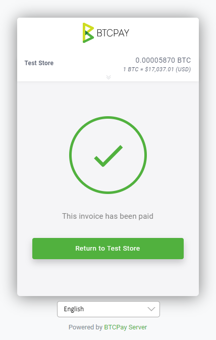

# Maswali ya Maduka

Ukurasa huu unaonyesha masuala ya kawaida na maswali yanayoulizwa mara kwa mara kuhusu maduka ya BTCPay Server.

[[toc]]

## Jinsi ya kuunda duka katika BTCPay Server?

Ili kuunda duka lako la kwanza, nenda kwa > Maduka kutoka kwenye menyu ya kichwa na ubofye "unda duka jipya."

## Ninaweza kuunda maduka mangapi?

Hakuna kikomo cha idadi ya maduka unayoweza kuunda katika BTCPay.

## Kwa nini ankara bila malipo zinaonyesha kama zimekamilika?

Wakati ankara inapoundwa kupokea thamani ya malipo ya 0 (kiasi cha sifuri kinachodaiwa), ankara kwa ufafanuzi tayari imelipwa. Ankara itaonekana kama imekamilika mara tu inapoundwa.

Madhumuni ya aina hii ya ankara kwa kawaida ni wakati mfanyabiashara anataka kuangalia maslahi ya mtumiaji katika tukio au zawadi kwa kutumia ankara za BTCPay Server bila kuhitaji mtumiaji kutoa fedha. Matumizi mengine ni kwa watengenezaji wanaojaribu mchakato wa ankara, kuwaruhusu kukwepa kutoa fedha halisi kuthibitisha programu inafanya kazi vizuri.

## Ongeza ada ya mtandao kwenye ankara (inabadilika na ada za uchimbaji)?

Ada ya mtandao (gharama) ni kipengele katika BTCPay kinachowalinda wafanyabiashara dhidi ya wateja wanaolipa ankara kwa sehemu. Wakati ankara inalipwa kutoka kwa matokeo mengi, ada kwa mfanyabiashara anayehitaji kuhamisha fedha hizo baadaye itakuwa kubwa zaidi.

Kwa mfano, mteja aliunda ankara ya 20$ na akailipa kwa sehemu, akilipa 1$ mara 20 hadi ankara ilipolipwa kikamilifu. Mfanyabiashara sasa ana muamala mkubwa zaidi unaoongeza gharama ya uchimbaji iwapo mfanyabiashara ataamua kuhamisha fedha hizo baadaye. Kwa chaguomsingi, BTCPay inaongeza **gharama ya ziada ya mtandao** kwenye jumla ya kiasi cha ankara kufidia gharama hiyo kwa mfanyabiashara.

BTCPay inatoa chaguo kadhaa za kubinafsisha kipengele hiki cha ulinzi. Unaweza kutumia ada ya mtandao:

- Ikiwa tu mteja anafanya malipo zaidi ya moja kwa ankara (Katika mfano hapo juu, ikiwa mteja aliunda ankara ya 20$ na akalipa 1$, jumla ya ankara inayodaiwa sasa ni 19$ + ada ya mtandao. Ada ya mtandao inatumika **baada ya malipo ya kwanza**)
- Kwa kila malipo (ikiwemo malipo ya kwanza, katika mfano wetu, jumla itakuwa 20$ + ada ya mtandao moja kwa moja, hata kwenye malipo ya kwanza)
- Kamwe usiongeze ada ya mtandao (inazima kabisa ada ya mtandao)

Ada ya mtandao katika BTCPay **sio ada ya uchimbaji**. Wateja bado wanahitaji kulipa ada ya mchimbaji.

Gharama ya mtandao ni kipengele cha hiari. Imewashwa kwa chaguomsingi, lakini ni juu ya mfanyabiashara kuiwasha au kuizima. Mteja anaona "gharama ya mtandao" kwenye malipo anapopanua taarifa za ankara.

Ingawa inalinda dhidi ya miamala ya vumbi, inaweza pia kuathiri vibaya biashara ikiwa haitawasilishwa vizuri. Wateja wako wanaweza kuwa na maswali ya ziada na wanaweza kufikiri unawatoza zaidi.

Tafadhali fikiria mara mbili jinsi hii inaweza kuathiri biashara yako na hakikisha unaiwasilisha kwa wateja wako vizuri ndani ya Masharti ya Huduma ya duka lako au kupitia njia nyingine.

## Ruhusu mtu yeyote kuunda ankara

Unapaswa kuwasha chaguo hili ikiwa unataka kuruhusu ulimwengu wa nje kuunda ankara katika duka lako. Chaguo hili ni muhimu tu ikiwa unatumia kitufe cha malipo au ikiwa unatoa ankara kupitia API au tovuti ya HTML ya mtu wa tatu. Programu ya POS imeidhinishwa mapema na haihitaji hii kuwashwa kwa mgeni wa kawaida kufungua duka lako la POS na kuunda ankara. Ikiwa una shaka, usiiwashe kwani unaweza kuiwasha wakati wowote ikihitajika.

## Ankara inaisha muda wake ikiwa kiasi kamili hakijalipwa baada ya ... dakika

Kipima muda cha ankara kimewekwa kuwa dakika 15 kwa chaguomsingi. Kipima muda ni utaratibu wa ulinzi dhidi ya tete kwa kuwa inafunga kiasi cha sarafu ya kidijitali kulingana na viwango vya crypto kwa fiat. Ikiwa mteja halipi ankara ndani ya kipindi kilichowekwa, ankara inachukuliwa kuwa imeisha muda wake. Ankara inachukuliwa kuwa "imelipwa" mara tu muamala unapoonekana kwenye blockchain (0-uthibitisho) lakini inachukuliwa kuwa "imekamilika" inapofikia idadi ya uthibitisho ambayo mfanyabiashara alifafanua (kwa kawaida, 1-6). Kipima muda kinaweza kubinafsishwa.

## Malipo ni batili ikiwa muamala utashindwa kuthibitisha ... dakika baada ya ankara kuisha muda wake

Ikiwa mteja analipa ankara, lakini inashindwa kupata idadi iliyowekwa ya uthibitisho ndani ya kipindi kilichowekwa, inawekwa alama kama "batili." Mfanyabiashara anaweza basi kuamua kukubali ankara baadaye kwa mwongozo au kuikataa na kuhitaji hatua zaidi kama vile mchakato wa kurejesha fedha au kuomba malipo ya ziada. Hii ni utaratibu wa ulinzi dhidi ya mashambulizi ya mchezo wa tete ya viwango. Chaguo hili linaweza kupatikana katika [mipangilio ya pochi](../Wallet.md#settings).

## Chukulia ankara imethibitishwa wakati muamala wa malipo

Ankara inachukuliwa kuwa "inachakatwa", mara tu inapoonekana kwenye blockchain (na mempool). Wakati ankara inafikia idadi iliyowekwa ya uthibitisho, inachukuliwa kuwa "imekamilishwa." Hapa unaweka kiwango cha chini cha uthibitisho ambacho baada yake ankara inapata hali ya "imethibitishwa." Kumbuka hii inatumika tu kwa malipo ya mnyororo. Ankara zilizolipwa kupitia Mtandao wa Lightning huenda moja kwa moja kwenye hali ya kukamilishwa, kwani uthibitisho wao ni wa papo hapo. Kimazoezi, kama mfanyabiashara, unasafirisha bidhaa yako mara tu unapoona ankara imewekwa alama kama imekamilishwa. Pata zaidi kuhusu [mipangilio ya pochi hapa](../Wallet.md#settings).

## Chukulia ankara imethibitishwa ikiwa na bendera ya RBF kwenye usanidi wa 0-conf

Kwa kawaida, duka lako "linachakata" ankara mara tu inapoonekana kwenye blockchain (katika mempool). Hata hivyo, muamala unaweza kuwa na bendera ya RBF, sasa nini?
BTCPay Server ina ukaguzi wa bendera za RBF. Kila wakati muamala unapowekwa alama hivyo, BTCPay Server itasubiri kiotomatiki uthibitisho 1.
Pata zaidi kuhusu [mipangilio ya pochi hapa](../Wallet.md#settings).

## Chukulia ankara imelipwa hata ikiwa kiasi kilicholipwa ni ... % pungufu kuliko kilichotarajiwa

Katika hali ambapo mteja anatumia pochi ya ubadilishanaji kulipa moja kwa moja ankara, ubadilishanaji huchukua kiasi kidogo cha ada. Hii inamaanisha kuwa ankara hiyo haichukuliwi kuwa imekamilika kikamilifu. Ankara inapata hali "imelipwa kwa sehemu." Ikiwa mfanyabiashara anataka kukubali ankara zilizolipwa pungufu, unaweza kuweka kiwango cha asilimia hapa.

## Jinsi ya kuzima barua pepe kwenye ankara

Ili kuzima hitaji la barua pepe kwa ankara za duka lako, nenda kwa Maduka > Mipangilio > Uzoefu wa Malipo > ondoa tiki kwenye kisanduku cha 'Inahitaji barua pepe ya kurejeshea fedha'.

## Jinsi ya kuweka ankara kwa satoshi

Ili kutumia Satoshi kama kitengo cha sarafu ya ankara, unaweza kutumia tu `SATS` (kwa mfano badala ya `BTC`).

Vinginevyo, unaweza pia kutumia chaguo la Duka > Mipangilio > Uzoefu wa Malipo > Onyesha kiasi cha malipo ya Lightning kwa Satoshi.

## Jinsi ya kuelekeza ankara za duka baada ya malipo?

Ili kuelekeza kiotomatiki ankara zilizolipwa kwa duka, washa mpangilio katika: Maduka > Mipangilio > Uzoefu wa Malipo > teua kisanduku cha 'Elekeza ankara kwenye URL ya kuelekeza kiotomatiki baada ya kulipwa'.

Mpangilio huu kwa kawaida hutumiwa kuelekeza ankara zilizoundwa moja kwa moja kwenye duka, kama vile na [Kitufe cha Malipo](../Apps.md#payment-button). Baada ya malipo, ankara ingerejea kwenye ukurasa wa asili ambapo kitufe cha malipo kiliingizwa au kwenye URL ya kuelekeza iliyotolewa kwenye ukurasa wa Kuhariri Kitufe cha Malipo.

Wakati kipengele hiki hakijawashwa, mteja ataombwa katika ankara kurudi kwenye ukurasa wa asili wa malipo.



Ili kuelekeza kwenye URL maalum katika programu ya Point of Sale, tumia [Uelekezaji wa PoS](../FAQ/Apps.md#how-to-redirect-to-another-site-after-payment) badala yake.

## Je, ninaweza kufuta ankara kutoka BTCPay?

Ankara katika BTCPay Server haziwezi kufutwa, lakini zinaweza kuwekwa kwenye kumbukumbu.
Ili kuweka ankara kwenye kumbukumbu, chagua ile unayotaka kuiweka kwenye kumbukumbu kutoka kwenye orodha ya ankara na uweke alama kama imewekwa kwenye kumbukumbu kutoka kwenye menyu kunjuzi ya vitendo. Au kutoka kwenye ukurasa wa maelezo ya ankara, bofya kitufe cha `Weka Kwenye Kumbukumbu` kwenye kona ya juu kulia.
Kitendo hiki kinaiondoa kwenye ukurasa wa `Ankara`.

Ankara inaweza kurejeshwa kwa kubofya kitufe cha `Imewekwa Kwenye Kumbukumbu` au kwa kutumia kichujio cha utafutaji wa kumbukumbu kuzionyesha. Pata zaidi kuhusu ankara zilizowekwa kwenye kumbukumbu [hapa](../Invoices.md#archived-invoices).

## Jinsi ya kukusanya taarifa za ziada za mnunuzi?

Sehemu ya taarifa za Mnunuzi ya ukurasa wa maelezo ya ankara inatumika tu kwa suluhisho maalum kama vile ujumuishaji, kama WooCommerce au uundaji wa ankara kwa API. Kwa sasa hakuna njia ya kukusanya Taarifa za Mnunuzi kwa kutumia kiolesura cha BTCPayServer.

## Jinsi ya kubadilisha mtoa huduma wa kiwango cha ubadilishaji kwa ankara?

Mtoa huduma chaguomsingi wa kiwango cha ubadilishaji cha fiat kwenda sarafu ya kidijitali anayetumiwa katika ankara zako za BTCPay anaweza kubadilishwa kwa kwenda kwenye Mipangilio ya Duka > Viwango > Chanzo cha bei kinachopendekezwa. Kuna chaguo kadhaa za watoa huduma wa kiwango cha ubadilishaji zinazopatikana. Kila duka linaweza kutumia mipangilio tofauti.

## Kupata hitilafu ya GetRatesAsync iliitwa kwenye coinaverage

Coinaverage ilisitisha API yao ya kiwango cha bure. Matokeo yake, hitilafu ifuatayo inaweza kuonekana:

```
GetRatesAsync was called on coinaverage when the rate is outdated. It should never happen, let BTCPayServer developers know about this.
```

Suala linaweza kurekebishwa kwa [kuchagua chanzo tofauti cha kiwango](./Stores.md#how-to-change-the-exchange-rate-provider-for-invoices) katika Maduka > Mipangilio > Viwango, au kwa [kusasisha BTCPay Server yako](./ServerSettings.md#how-to-update-btcpay-server) ikiwa unaendesha toleo 1.0.3.146 au la zamani. Sasisho litabadilisha kiotomatiki Coinaverage na CoinGecko.

## Ombi la malipo ni nini?

Ombi la malipo linakuruhusu kutoa ankara kwa wateja wako na kulipwa kwa Bitcoin, kwa kutuma tu kiungo rahisi cha malipo. Ikiwa ungemshutumu mteja kwa kutumia pochi yoyote ya Bitcoin, mchakato kawaida unaonekana kama hivi:

    Mteja: Je, ninaweza kulipa 100$ kwa Bitcoin?
    Wewe: Ndiyo unaweza! Hapa kuna anwani yangu ya BTC, na kiasi kwa BTC ni 0.0025481 (100$ wakati wa kutuma ujumbe).
    Mteja; Ah, nilikosa kabisa ujumbe wako, pochi yangu inaonyesha 0.0028 sasa, na ninahitaji kununua Bitcoin zaidi. Je, ninaweza kukulipa kesho?
    Wewe: Sawa, lakini tutalazimika kupitia mchakato huu tena kesho.

Utendaji wa ndani wa [Ombi la Malipo](../PaymentRequests.md) wa BTCPay Server unakuruhusu kulipwa kwa kushiriki kiungo rahisi na wateja/wateja wako.
Mteja anapata ukurasa wa ombi la malipo ulioundwa vizuri unaowawezesha kukulipa kwa urahisi wao, ambapo kiwango cha ubadilishaji cha Bitcoin kitakuwa kimesasishwa kila wakati na sarafu ya chaguo lako.
Malipo yanapofanywa, wateja wanaweza kuchapisha ombi la malipo kwa madhumuni ya uwekaji hesabu.

[](https://www.youtube.com/watch?v=j6CvwDPvfzQ)

Unaweza kujifunza zaidi kuhusu utendaji huu kwenye [ukurasa maalum wa ombi la malipo](../PaymentRequests.md)

## Kuna tofauti gani kati ya ombi la malipo na ankara?

Ankara ni hati iliyotolewa na muuzaji kwa mnunuzi kukusanya malipo.

Katika BTCPay Server, ankara inawakilisha hati ambayo lazima ilipwe ndani ya muda uliowekwa kwa kiwango kisichobadilika cha ubadilishaji. **Ankara zina muda wa kuisha** kwa sababu zinafunga kiwango cha ubadilishaji ndani ya muda uliowekwa ili kumlinda mpokeaji dhidi ya mabadiliko ya bei.

Tofauti na ankara ambazo zina kiwango kisichobadilika cha ubadilishaji, unaweza kufikiria maombi ya malipo kama ankara isiyoisha muda wake na inapozalishwa na mlipaji, daima inatoa kiwango cha sasa.
