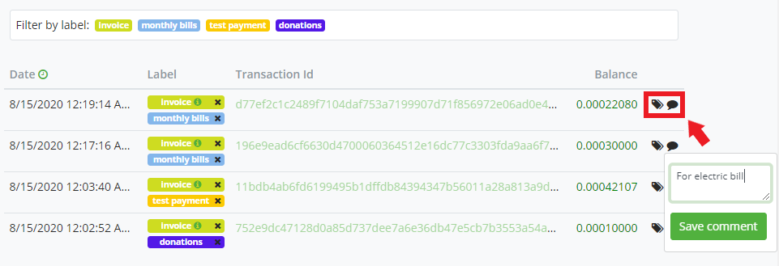
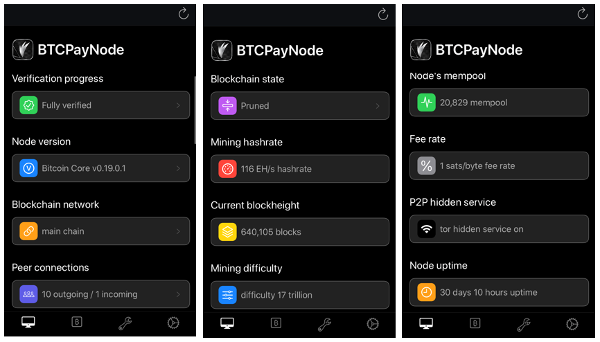

# Maswali ya Pochi

Hati hii ina maswali yanayoulizwa mara kwa mara yanayohusiana na [pochi ya ndani](../Wallet.md) ya BTCPay Server.

[[toc]]

## Pochi ya BTCPay Server ni nini?

BTCPay Server ina pochi ya ndani ambayo unaweza kutumia kuona miamala inayoingia na kutoka ya Bitcoin inayohusiana na kutumia fedha zako.

Inafanya kazi kama pochi nyingine yoyote, lakini ina vipengele vya faragha vilivyoimarishwa (isiyo ya ulezi, hakuna watu wa tatu, imethibitishwa na nodi yako kamili ya seva iliyojitolea, nk.) kwa chaguomsingi na pia inatatua matatizo fulani ya UX unayoweza kukumbana nayo unapotumia pochi iliyopo na BTCPay Server. Pia inajumuisha vipengele vingine vingi vya pochi kama vile kuweka lebo maalum za muamala, viungo vya kichunguzi cha blockchain, hali ya uthibitisho wa muamala, nk. Inaweza kuunganishwa na aina nyingi tofauti za pochi za nje na hata pochi moto zilizozalishwa na seva. Kwa sababu hizi, inapendekezwa kutumia pochi ya ndani kwa uzoefu rahisi na bora zaidi wa pochi katika BTCPay Server.

Kwa taarifa zaidi kuhusu jinsi ya kutumia pochi iliyojengwa ndani [angalia ukurasa huu](../Wallet.md). Ili kutumia pochi ya ndani, kwanza unahitaji [kusanidi pochi](../WalletSetup.md) na duka lako la BTCPay.

## Jinsi ya kusanidi pochi yangu na BTCPay Server?

Ukurasa wa usanidi wa pochi ya duka lako unapaswa kukuongoza kabisa hatua kwa hatua kusanidi aina yoyote ya pochi na BTCPay Server. Ikiwa una maswali zaidi, angalia nyaraka zetu za kina kuhusu [jinsi ya kusanidi pochi](../WalletSetup.md).

## Je, ninaweza kutumia pochi ya vifaa na BTCPay Server?

Pochi ya ndani ina [ujumuishaji wa pochi ya vifaa uliojengwa ndani](../HardwareWalletIntegration.md). Unaweza kutumia pochi ya vifaa inayosaidiwa na [pochi ya BTCPay](../Wallet.md).

Hii inamaanisha kuwa unatumia pochi ya vifaa bila kuvujisha taarifa kwa programu au seva za mtu wa tatu, tofauti na programu chaguomsingi za vifaa, kwani pochi inategemea nodi kamili katika BTCPay yako.

## Je, kuna utumiaji tena wa anwani kwa maduka tofauti yanayotumia xpub sawa?

Kwa ufupi, hapana hakuna.
Unda maduka 2 tofauti kwenye BTCpay Server chini ya mfano sawa na xpub sawa.
Ukifanya hivyo, BTCPay Server itafanya mzunguko wa anwani kwa usahihi na kamwe haitatumia tena kati ya maduka.

:::warning
Hii lazima ifanyike kwenye mfano sawa.
Kama ilivyorekodiwa katika [suala la Github #960](https://github.com/btcpayserver/btcpayserver-doc/issues/960)
:::

## Je, ni lazima nitumie pochi ya BTCPay Server?

Kwa chaguomsingi, BTCPay Server inahitaji tu ufunguo wa umma uliopanuliwa. Ili kupokea malipo kwenye duka lako la BTCPay, unatoa ufunguo wa umma uliopanuliwa (xPub) ambao unaweza kuuzalisha katika pochi ya nje (iliyopo). Sio lazima kabisa kutumia pochi iliyojengwa ndani, unaweza kudhibiti fedha katika [pochi yako iliyopo](../WalletSetup.md#use-an-existing-wallet) badala yake.

Hata hivyo, inapendekezwa kutumia pochi iliyojengwa ndani kwa usimamizi wa fedha. Pochi iliyojengwa ndani sio tu inaboresha faragha yako kwa chaguomsingi, lakini pia inatatua masuala ya uzoefu wa mtumiaji kama [kikomo cha pengo](#missing-payments-in-my-software-or-hardware-wallet).

## Kwa nini kutuma muamala kwa kutumia Trezor kunashindwa?

Ikiwa unakumbana na matatizo (kama vile "mtumiaji amekataa" au Trezor haijibu) wakati wa kujaribu kutuma muamala (PSBT) kwa kutumia [HWI (Vault)](../HardwareWalletIntegration.md) ya BTCPay na pochi yako ya Trezor, washa mpangilio wa **Daima jumuisha UTXO isiyo ya shahidi ikiwa inapatikana** kwa kupanua Mipangilio ya Juu kwenye ukurasa wa Tuma.

## Malipo yanakosekana katika pochi yangu ya programu au vifaa

Ikiwa unatumia [pochi iliyopo ya programu au vifaa](../WalletSetup.md#use-an-existing-wallet) na BTCPay Server yako, unaweza kukumbana na tofauti kati ya salio katika pochi yako ya BTCPay na programu ya wavuti, eneo-kazi au simu ya pochi ya nje. Tofauti hii kwa kawaida inahusiana na suala la **kikomo cha pengo**.

### Tatizo la kikomo cha pengo

Wengi wa pochi za mtu wa tatu ni [pochi nyepesi](https://en.bitcoin.it/wiki/Lightweight_node), ambazo zinashiriki nodi kati ya watumiaji wengi. Ili kuzuia masuala ya utendaji, pochi tegemezi za nodi nyepesi na kamili zinaweka kikomo (kawaida 20) cha anwani zisizo na salio ambazo zinafuatilia kwenye blockchain. BTCPay Server inazalisha anwani mpya kwa kila ankara.

Kwa kuzingatia hayo hapo juu, baada ya BTCPay Server kuzalisha ankara 20 mfululizo ambazo hazijalipwa, pochi ya nje inaacha kupata miamala, ikidhani hakuna miamala mipya iliyotokea. Mara ankara za 21, 22, nk zinapolipwa, pochi yako ya nje haitazionyesha.

Kwa upande mwingine, ndani, pochi ya BTCPay Server inafuatilia anwani yoyote inayozalisha yenyewe pamoja na kikomo kikubwa zaidi cha pengo. Haitegemei mtu wa tatu na inaweza kuonyesha salio sahihi kila wakati.

### Suluhisho la kikomo cha pengo

Sio rahisi kutatua tatizo la kikomo cha pengo. Una chaguo mbili:

1. Ongeza kikomo cha pengo katika pochi yako iliyopo (ya nje)
2. Tumia pochi ya ndani ya BTCPay Server

#### 1. Kuongeza kikomo cha pengo

Ikiwa [pochi yako ya nje/iliyopo](../WalletSetup.md#use-an-existing-wallet) inaruhusu usanidi wa kikomo cha pengo, suluhisho rahisi ni kuiongeza. Hata hivyo, pochi nyingi haziruhusu hili.

Pochi pekee zinazoruhusu usanidi wa kikomo cha pengo ambazo tunazijua ni zifuatazo:
- [Electrum](../ElectrumWallet.md)
- [Wasabi](../WasabiWallet.md)
- [Sparrow](https://sparrowwallet.com/)
- [Bitcoin Core](https://github.com/bitcoin/bitcoin)
- [Specter](https://specter.solutions/index.html)
- [Nunchuk](https://nunchuk.io/)
- [Samourai Wallet](https://samouraiwallet.com/) (inapotumiwa na Zana ya Matengenezo ya Dojo)

Kwa bahati mbaya, na pochi nyingine yoyote, kuna uwezekano utakutana na tatizo.

Ikiwa ungependa kutumia [pochi ya nje](../WalletSetup.md#use-an-existing-wallet) kudhibiti fedha, tunapendekeza urejeshe pochi yako iliyopo katika moja ya pochi zifuatazo na uongeze kikomo cha pengo:

- [Kuongeza kikomo cha pengo katika Electrum](../ElectrumWallet.md#configuring-the-gap-limit-in-electrum)
- [Kuongeza kikomo cha pengo katika Wasabi](../WasabiWallet.md#configuring-the-gap-limit-in-wasabi)

Baada ya kuongeza kikomo cha pengo, salio katika pochi yako ya nje na pochi ya BTCPay linapaswa kuendana. Ikiwa haviendani, unaweza kuwa umesanidi mpango wako wa utoaji vibaya.

#### 2. Tumia pochi ya ndani

Kwa uzoefu bora wa mtumiaji na faragha, tunapendekeza uzingatie kuacha pochi za nje na kuanza kutumia [pochi ya ndani ya BTCPay Server](../Wallet.md).

## Mpango wa utoaji (derivation scheme) ni nini?

Haijalishi [jinsi unavyosanidi pochi yako](../WalletSetup.md), BTCPay Server inatumia `mpango wa utoaji` kuwakilisha lengwa la fedha zinazopokelewa na ankara zako. Lengwa la fedha hizo zitakuwa pochi yako, inayopatikana kwa ufunguo wa umma uliopanuliwa unaotoa.

Kwa kutumia mipango tofauti ya utoaji na ufunguo wako wa umma uliopanuliwa, unaweza pia kuchagua kuunda aina mbalimbali za anwani za kupokea, zinazoonyeshwa katika ankara za duka lako.

| Aina ya Anwani       |             Mfano             |
| :------------------- | :---------------------------: |
| P2WPKH               |             xpub...           |
| P2SH-P2WPKH          |         xpub...-[p2sh]        |
| P2PKH                |        xpub...-[legacy]       |
| Multi-sig P2WSH      |     2-of-xpub1...-xpub2...    |
| Multi-sig P2SH-P2WSH |  2-of-xpub1...-xpub2...-[p2sh] |
| Multi-sig P2SH       | 2-of-xpub1...-xpub2...-[legacy] |

:::tip
Juu ya miundo ya ufunguo wa umma uliopanuliwa wa xPub iliyoonyeshwa hapo juu, BTCPay Server inasaidia miundo ya yPub na zPub. Tafadhali kumbuka kuwa hizi zitabadilishwa kuwa xPub mara tu usanidi wa pochi utakapokamilika. Hii haina athari kwa jinsi unavyopokea au kutuma fedha.
:::

## Muamala wa Replace-By-Fee (RBF) ni nini?

Muamala wa Replace-By-Fee (RBF) ni kipengele cha itifaki ya Bitcoin. Jifunze zaidi kuhusu ni nini, kwa nini hutokea na aina tofauti za RBF [hapa](https://bitcoin.stackexchange.com/a/54457/85016).

Uwezo wa RBF kwa chaguomsingi huwashwa/kuzimwa kwa nasibu kati ya miamala unapotumia pochi ya ndani ya BTCPay Server, kwa faragha iliyoimarishwa. Ili kuhakikisha umewashwa, au kuuzima, tazama chaguo za juu za [pochi ya ndani](../Wallet.md#rbf-replace-by-fee) ya BTCPay Server.

## Je, BTCPay Server inatumia mempoolfullrbf=1 ?

Kwa ufupi sana, ndiyo.
Tumeamua kuongeza hii kama chaguomsingi kwenye usanidi wako wa BTCPay Server. Hata hivyo, tumeifanya pia kuwa kipande ambacho unaweza kukizima mwenyewe.
Bila mempoolfullrbf=1, ikiwa mteja anafanya matumizi mara mbili ya malipo kwa muamala usioashiria RBF, mfanyabiashara angejua tu baada ya uthibitisho.

Hata hivyo, baadhi ya watumiaji hawataki kuwasha sera hii. Baadhi ya watu wanazingatia kwamba ingawa inapatana na motisha ya mfanyabiashara kuiwasha, inachukuliwa kuwa kinyume na maslahi ya mtandao, kwani inafanya kukubali malipo kwa uthibitisho 0 kuwa vigumu zaidi mara sera inaposambazwa kwa upana.

Ili kujiondoa, tumia yafuatayo:

```bash
BTCPAYGEN_EXCLUDE_FRAGMENTS="$BTCPAYGEN_EXCLUDE_FRAGMENTS;opt-mempoolfullrbf"
. btcpay-setup.sh -i
```

## Jinsi ya kuongeza lebo na maoni maalum kwenye miamala?

Mbali na [lebo za kiotomatiki](../Wallet.md#transaction-labels), unaweza kuunda kwa urahisi lebo zako maalum za muamala. Lebo zinaweza kutumiwa kuchuja miamala katika mwonekano wa pochi. Unaweza pia kuongeza maoni binafsi kwenye miamala ili kuacha notisi au maelezo kuhusu malipo.



## Sioni malipo ya mtandao wa Lightning katika pochi ya BTCPay?

[Mtandao wa Lightning](../LightningNetwork.md) na [pochi](../Wallet.md) ya BTCPay Server ni dhana tofauti. Pochi ya ndani ya BTCPay Server inaonyesha tu malipo ya mnyororo.

Katika siku zijazo zinaweza kuunganishwa lakini kwa sasa, ili kudhibiti fedha zako za Mtandao wa Lightning, tumia Ride the Lightning, ThunderHub, pochi ya nje ya Lightning iliyounganishwa (Zeus, Zap, nk.), au Kiolesura cha Mstari wa Amri (CLI).

## Je, kuna programu ya simu ya pochi ya BTCPay Server?

:::tip
Sasisho 11/2023:
Kutakuwa na programu ya simu ya pochi ya BTCPay Server katika siku zijazo. [Kwa sasa iko katika maendeleo](https://twitter.com/BtcpayServer/status/1699114457421447543).
:::

BTCPay Server ni programu ya wavuti (sio programu ya simu) na inaweza kutazamwa kwa kutumia kifaa chochote kinachoweza kuonyesha kivinjari cha wavuti. Kuna programu za simu zinazokuruhusu kuunganisha kwenye nodi yako ya Lightning ya BTCPay Server (Zeus, Zap, nk.).

Unaweza pia kutumia programu za simu kuunganisha kwenye nodi yako kamili ya Bitcoin kwa kutumia P2P au RPC. Ikiwa uko kwenye iOS, unaweza kuunganisha kwa urahisi kwenye nodi yako kamili ya Bitcoin kwa kutumia Fully Noded.

Ili kuunganisha nodi yako ya BTCPay kwenye Fully Noded:

    1. Pakua Fully Noded kutoka kwenye Duka la Programu.
    2. Katika BTCPay, nenda kwa Mipangilio ya Seva > Huduma na ubofye kwenye Nodi Kamili RPC.
    3. Fungua programu yako ya Fully Noded, Unganisha Haraka QR.
    4. Changanua msimbo wa QR ulioonyeshwa kwenye BTCPay yako.
    5. Nodi yako kamili ya Bitcoin sasa imeunganishwa kwenye Fully Noded.

Hapa kuna baadhi ya hali za nodi na taarifa za mtandao unazoweza kufuatilia kwa urahisi kutoka kwenye Fully Noded yako:



## Ninawezaje kutumia PSBT (miamala ya Bitcoin iliyosainiwa kwa sehemu) na BTCPay Server?

Unaweza kutumia BTCPay Server kuunda na/au kutangaza PSBT. Angalia miongozo yetu ya [Kusaini muamala wa PSBT na pochi ya vifaa ya ColdCard](./ColdCardWallet.md#spending-from-btcpay-server-wallet-with-coldcard-psbt) na [kuunda na kusaini muamala wa PSBT na pochi ya Sparrow](./Sign-PSBT-with-sparrow-wallet.md).
