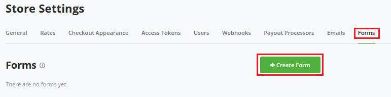
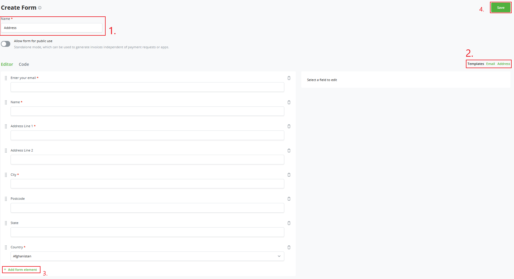
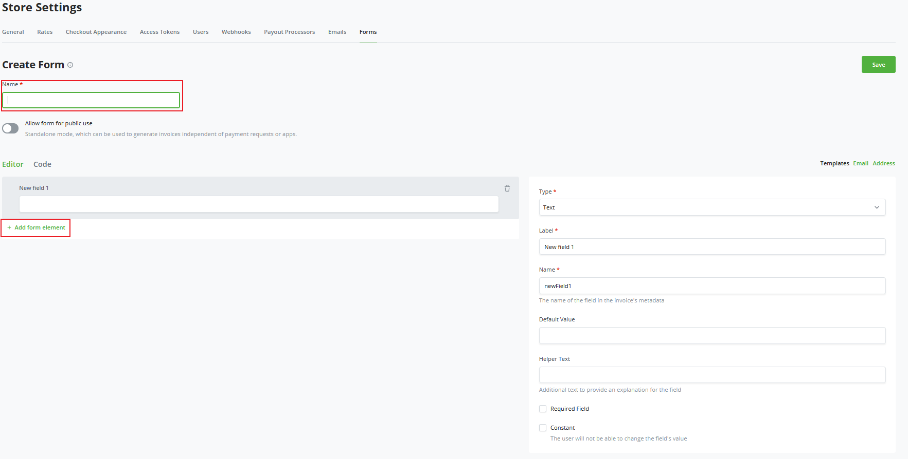
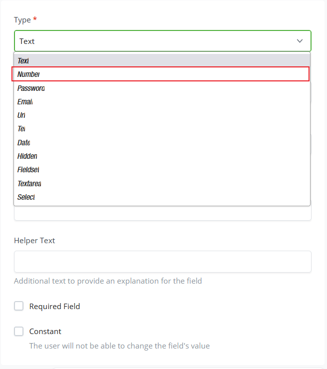
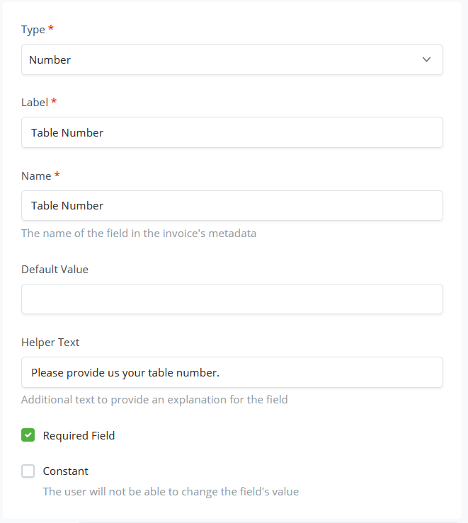
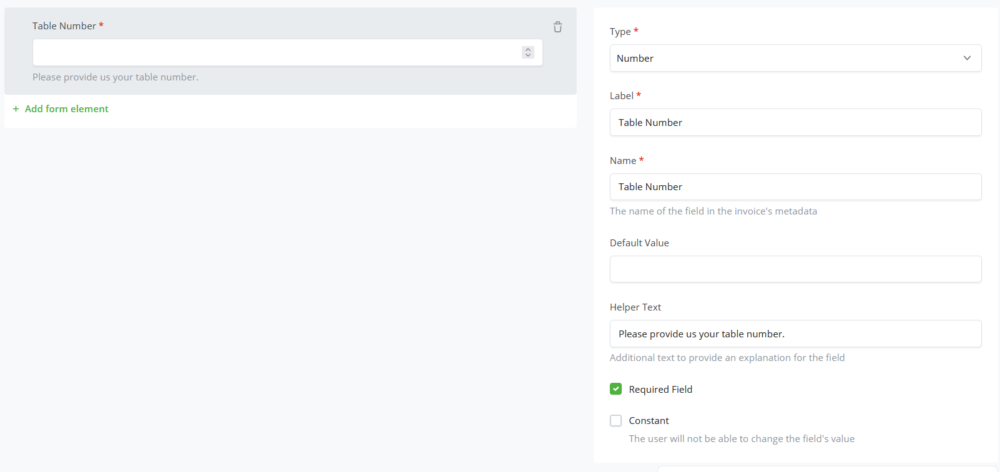
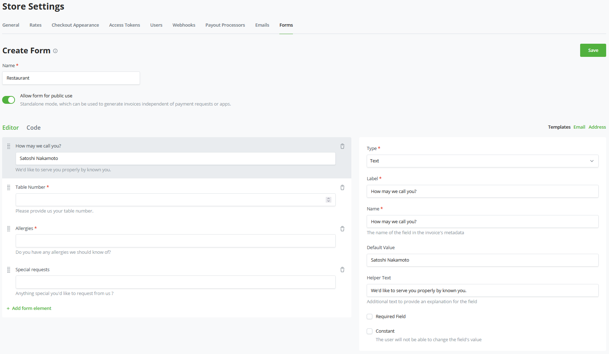

# Fomu

Kijenzi cha Fomu cha BTCPay Server kinakuwezesha kuomba taarifa maalum kutoka kwa mteja wako.

Fomu hizi zinaweza kubinafsishwa kikamilifu kulingana na mahitaji yako.
Katika utangulizi huu, tutapitia kijenzi cha fomu cha kuona; ikiwa ungependa kufanya mipangilio ya kina zaidi, tafadhali tembelea sehemu ya [Fomu za Kina](./AdvancedForms.md) ya nyaraka zetu.

## Kusanidi Fomu Maalum ya kwanza ya duka lako.

Katika mfano huu, tutaanza kwa kuunda fomu ya kawaida tuliyoitengeneza mapema.
Bofya Mipangilio ya Duka na kichupo cha mwisho cha mipangilio ya duka lako ni Fomu. Bofya Fomu kuunda Fomu yako Maalum ya kwanza.

Kwenye ukurasa wa fomu maalum, bofya Unda Fomu Mpya.
Tumeunda mifano miwili mapema, `Barua Pepe` na `Anwani`.
Kwa mfano huu, bofya fomu ya Anwani.

Sasa tunaweza kuvuta sehemu zilizoundwa mapema na BTCPay Server.
Unaweza kuzipanga upya au kuunda sehemu mpya kwa kubofya `Add form element` chini ya fomu.

## Unda fomu maalum.

Unaweza kuwa na matumizi tofauti. Kwa mfano ikiwa unamiliki mkahawa unahitaji kujua nambari ya meza, jinsi ya kumwita mteja wakati wa kuwahudumia, mizio, na maombi maalum.

Hebu tuunde fomu maalum katika hatua zifuatazo.
Tutaanza kwenye kichupo kile kile cha mipangilio kutoka kwenye mfano uliopita, Mipangilio ya duka -> Fomu.

Bofya `create form` juu kulia.
Tutaanza kwa kuipa jina; katika mfano, tutatumia `Restaurant`.
Tofauti na awali, tutaanza na sehemu tupu iliyozalishwa.

1. Tutataja sehemu ya kwanza, `Table number`
2. Fafanua `Aina` ya sehemu; tunahitaji iwe Nakala au Nambari, bofya kwenye menyu kunjuzi na uchague `Number`.

3. Lebo tuliyoweka kwa sehemu hii jinsi inavyoonekana kwa mteja; katika mfano wetu, tutaitaja `Table Number`.
4. Kuhusu Jina la sehemu, tunanakili jina la sehemu iliyotangulia, `Table Number`, kwa uthabiti.
5. Tunaweza kufafanua `Thamani chaguo-msingi`; hata hivyo, tutaiacha tupu katika mfano.
6. `Maandishi ya Msaada` Haya ni maandishi yaliyotolewa chini ya sehemu tunayounda kuonyesha kile unachoomba kutoka kwa mteja.
7. Mwisho, tunaweza kuweka vigezo viwili; moja ni kuifanya iwe ya lazima kujazwa kila wakati; katika mfano huu, tutaweka hii kuwa ndiyo. Na ikiwa ni ya Kudumu, watumiaji hawawezi kubadilisha hii kwa hivyo hatutatumia mpangilio huo kwa mfano.

Baada ya kujaza vigezo vya sehemu, inapaswa kuonekana upande wa kushoto wa kihariri chako jinsi sehemu inavyoonekana na kufanya kazi wakati mteja anapoingiliana nayo.

Sasa kwa kuwa sehemu ya kwanza imekamilika, unaweza kubofya `+ Add form element` chini ya sehemu yako ya kwanza na kuunda sehemu zilizobaki za fomu zinazohitajika. Mara baada ya kutengeneza sehemu zote, bofya `Save` juu kulia ya skrini yako, na yote yanapaswa kuwa tayari!

`Kijenzi cha Fomu` hufanya uundaji wa fomu maalum uwe rahisi na unaobadilika. Ikiwa bado unahitaji ubinafsishaji zaidi, kama ilivyotajwa mwanzoni mwa mwongozo huu, tafadhali soma [Fomu za Kina](./AdvancedForms.md) kujifunza kuhusu JSON iliyoundwa katika kichupo cha `Code` katika Kijenzi cha Fomu.

## Fomu za Hadhara

Wakati `Ruhusu fomu kwa matumizi ya hadhara` imewezeshwa, fomu inaweza kutumika kama njia ya kushiriki URL, ambapo watumiaji lazima wajaze fomu na invosi inazalishwa.

Kwa chaguo-msingi, sarafu ya invosi imewekwa kwa sarafu chaguo-msingi ya duka, na kiasi kimewekwa kuwa "any".

Unaweza kusanidi fomu kuwa na sarafu na kiasi kilichosanidiwa mapema kwa kuunda sehemu zenye majina maalum.

* Sarafu ya invosi: Unda sehemu ambayo jina lake ni `invoice_currency`. Hakikisha thamani yake inarudisha msimbo halali wa sarafu.
* Kiasi cha invosi: Unda sehemu ambayo jina lake ni `invoice_amount`. Hakikisha thamani yake inarudisha nambari.

 Unaweza kuunda sehemu hizi kwa aina ya `hidden` ili zisionyeshwe kwa mtumiaji. Zaidi ya hayo, ikiwa ungependa mtumiaji asiweze kurekebisha thamani, lazima uweke `Constant` kuwa imetiwa alama.

 Hii inaweza kutumika kama mbadala wa Kitufe cha Malipo, kwa faida ya ziada kuwa unaweza kufunga vigezo vya invosi kama vile kiasi na sarafu.

## Rekebisha viwango vya invosi kulingana na ingizo la mtumiaji

 Katika hali nyingi za kisasa za ecommerce, unahitaji kurekebisha kiasi kinachotozwa kulingana na ingizo la mtumiaji, kama vile njia yao ya usafirishaji wanayopendelea, nchi yao, misimbo ya ofa, nk.

 Fomu inakuja na utendaji kama huo kuanzia toleo la 1.11.0 la BTCPay Server. Sehemu yoyote ambayo jina lake linaanza na `invoice_amount_adjustment` (inasaidiwa tangu v1.11) au `invoice_amount_multiply_adjustment` (inasaidiwa tangu v1.12) na thamani yake ikiwa nambari halali itarekebisha kiotomatiki kiasi cha invosi.

 Utendaji huu kwa sasa unafanya kazi kwa matumizi ya fomu ya hadhara na kwa programu jalizi ya Point of Sale.
 Angalia sehemu ya [Sehemu za Kioo](./AdvancedForms/#mirror-fields) ya mwongozo wa Fomu za Kina kwa maelezo.

### Kutoza ziada kulingana na njia ya usafirishaji

Unda sehemu ya aina ya "select", yenye jina `invoice_amount_adjustment_shipping_method`, na chaguo zinazolingana na njia za usafirishaji ulizo nazo. Tutatumia chaguo 2: `DHL` yenye thamani ya `10` na `Fedex` yenye thamani ya `20`. Mtumiaji anapochagua mojawapo, kiasi cha invosi kitarekebishwa kwa 10 au 20 mtawalia.

Kumbuka: Huu ni mfano rahisi. Ingawa kiasi cha invosi kitarekebishwa kwa usahihi, hutaweza kuona chaguo la usafirishaji lililochaguliwa ndani ya invosi iliyoundwa. Lazima tutumie sehemu za `Mirror` kufanikisha hili.

Ili kuhifadhi chaguo la njia ya usafirishaji lililochaguliwa na mtumiaji lazima tufanye yafuatayo badala yake:
* Unda sehemu ya aina ya "select", yenye jina `shipping_method`, na chaguo zinazolingana na njia za usafirishaji ulizo nazo. Tutatumia chaguo 2: `DHL` yenye thamani ya `dhl` na `Fedex` yenye thamani ya `fedex`.
* Unda sehemu ya aina ya "mirror", yenye jina `invoice_amount_adjustment_shipping_method`. Katika `Field to mirror`, chagua sehemu ya `shipping_method`. Na katika `Value Mapper`, unda chaguo zote kutoka `shipping_method` na thamani ya kutoza.

### Misimbo ya ofa

* Unda sehemu ya aina ya "text", yenye jina `promoCode`.
* Unda sehemu ya aina ya "mirror", yenye jina `invoice_amount_adjustment_promo`. Katika `Field to mirror`, chagua sehemu ya `promoCode`. Na katika `Value Mapper`, unda misimbo yote ya ofa unayotaka iweze kupatikana. Kwa mfano weka `Original Value` kuwa `chocolate` na `Mapped Value` kuwa `-5`.

Mtumiaji anapoingiza `chocolate` katika sehemu ya msimbo wa ofa, kiasi cha invosi kitarekebishwa kwa -5.

### Kuonyesha ingizo la mtumiaji kwenye risiti

Kwa chaguo-msingi, hakuna ingizo la mtumiaji litakaloonyeshwa kwenye risiti ya invosi. Ili kufanya hivi, lazima tuunde ramani kwa kila sehemu.
* Unda sehemu ya aina ya `fieldset`, yenye jina `receiptData`.
* Kwa kila sehemu unayotaka kuonyesha katika risiti, unda sehemu ya aina ya `mirror`, na weka `Field to mirror` kwa sehemu unayotaka kunakili kwenye risiti.
