# Muunganisho wa michango ya GiveWP

## Mahitaji

Tafadhali hakikisha unakidhi mahitaji yafuatayo kabla ya kusakinisha programu-jalizi hii.

- Toleo la PHP 8.0 au jipya zaidi
- Viendelezi vya PHP vya cURL, gd, intl, json, na mbstring vinapatikana
- Tovuti ya WordPress yenye GiveWP imesakinishwa ([Maagizo ya usakinishaji](https://givewp.com/getting-started/intro-to-givewp/)
- Una BTCPay Server toleo la 2.0.0 au jipya zaidi, ama [inayojisimamia mwenyewe](/Deployment/README.md) au [inayoendeshwa na mhusika wa tatu](/Deployment/ThirdPartyHosting.md)
- [Una akaunti iliyosajiliwa kwenye mfano](./RegisterAccount.md)
- [Una duka la BTCPay kwenye mfano](./CreateStore.md)
- [Una pochi iliyounganishwa na duka lako](./WalletSetup.md)

## 1. Sakinisha Programu-jalizi ya BTCPay for GiveWP

Kuna njia tatu za kusakinisha programu-jalizi ya **BTCPay for GiveWP**:

- Kutoka ndani ya WordPress kupitia Dashibodi ya Msimamizi (inapendekezwa, tazama hapa chini)
- [Saraka ya programu-jalizi ya WordPress](https://wordpress.org/plugins/btcpay-for-givewp/)
- [Hazina ya GitHub](https://github.com/btcpayserver/givewp/releases)

### 1.1 Sakinisha programu-jalizi kutoka Dashibodi ya Msimamizi wa WordPress (inapendekezwa)

1. Kwenye utepe wa kushoto bofya _Plugins_ -> _Add New_.
2. Katika Utafutaji, andika "BTCPay for GiveWP".
3. Bofya _Install now_ kisha _Activate_.

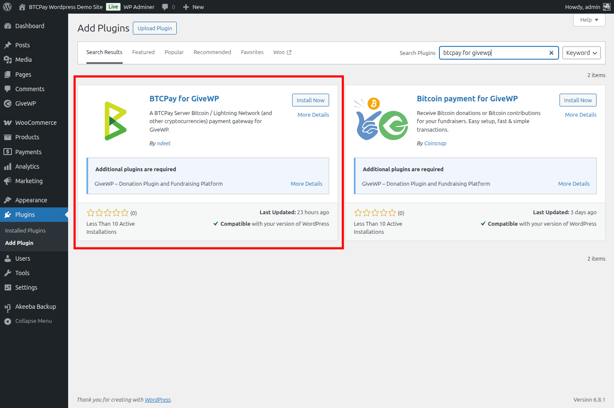

### 1.2 Pakua na usakinishe programu-jalizi kutoka GitHub

Vinginevyo, unaweza kupakua programu-jalizi kutoka GitHub na kuisakinisha mwenyewe:

1. [Pakua programu-jalizi ya hivi karibuni ya BTCPay](https://github.com/btcpayserver/givewp/releases).
2. Kwenye dashibodi ya msimamizi wa WordPress bofya _Plugins_ -> _Add Plugin_.
3. Bofya kitufe cha _Upload Plugin_ na uchague faili ya .zip uliyopakua sasa hivi.
4. Bofya _Install Now_ kisha _Activate_.

## 2. Kuunganisha GiveWP na BTCPay Server

Programu-jalizi ya BTCPay for GiveWP ni **daraja kati ya BTCPay Server yako (kichakataji malipo) na fomu zako za michango**.
Haijalishi ikiwa unatumia suluhisho la kujisimamia mwenyewe au la mhusika wa tatu, mchakato wa kuunganisha ni sawa.

### 2.1 Unda ufunguo wa API

Kwenye mfano wako wa BTCPay Server (ikiwezekana kwenye kichupo tofauti cha kivinjari):

1. Bofya _[Account]_ -> _Manage Account_ chini kushoto
2. Bofya _"API Keys"_
3. Bofya _[Generate Key]_ ili kuchagua ruhusa.
4. Bofya kiungo cha _"Select specific stores"_ na uchague duka la GiveWP unalotaka kuunganisha - kwa ruhusa zifuatazo: `View invoices`, `Create invoice`, `Modify invoices`, `Modify stores webhooks`, `View your stores`, `Create non-approved pull payments` (inatumika kwa marejesho (bado haijatekelezwa))
   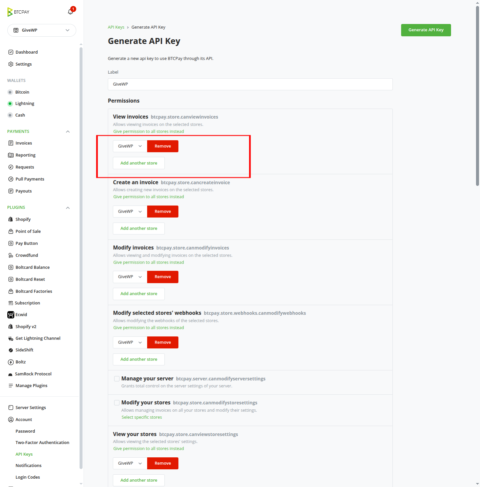
   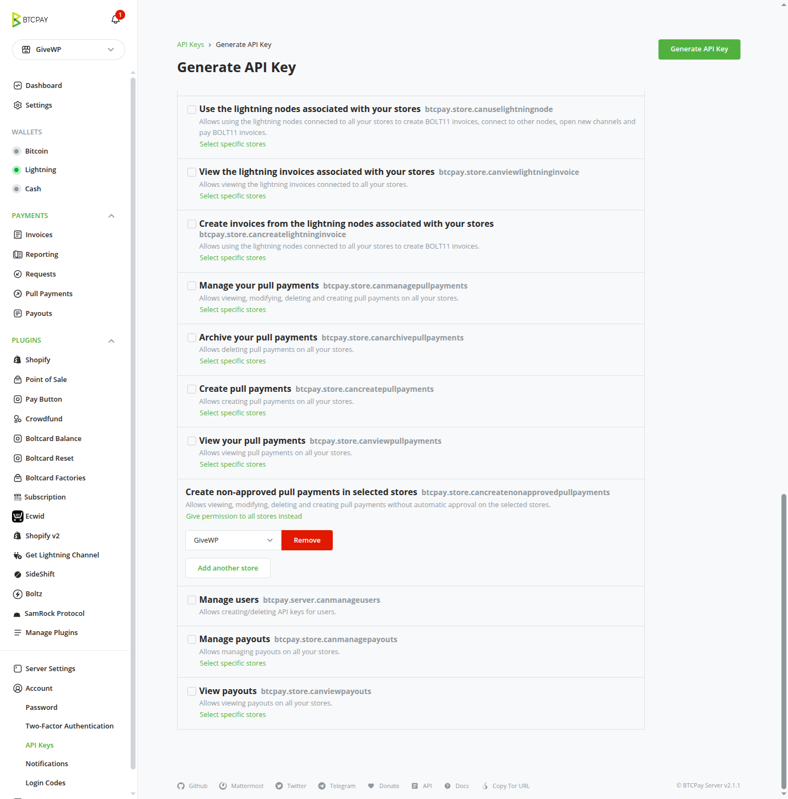
5. Bofya kitufe cha _[Generate API Key]_ kwenye kona ya juu kulia.
6. Nakili Ufunguo wa API uliozalishwa na Kitambulisho cha Duka mahali salama. Utahitaji katika hatua zinazofuata.
   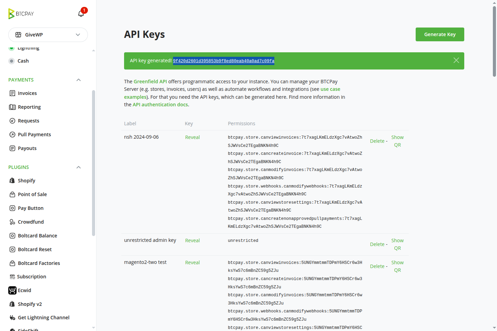

### 2.2 Nakili Kitambulisho cha Duka

Bado kwenye mfano wako wa BTCPay Server:

1. Katika utepe wa kushoto, kwenye menyu kunjuzi ya maduka, chagua duka unalotaka kuunganisha na GiveWP.
2. Bado, katika utepe wa kushoto, bofya _[Settings]_.
3. Utaona _Store ID_ juu ya ukurasa.
   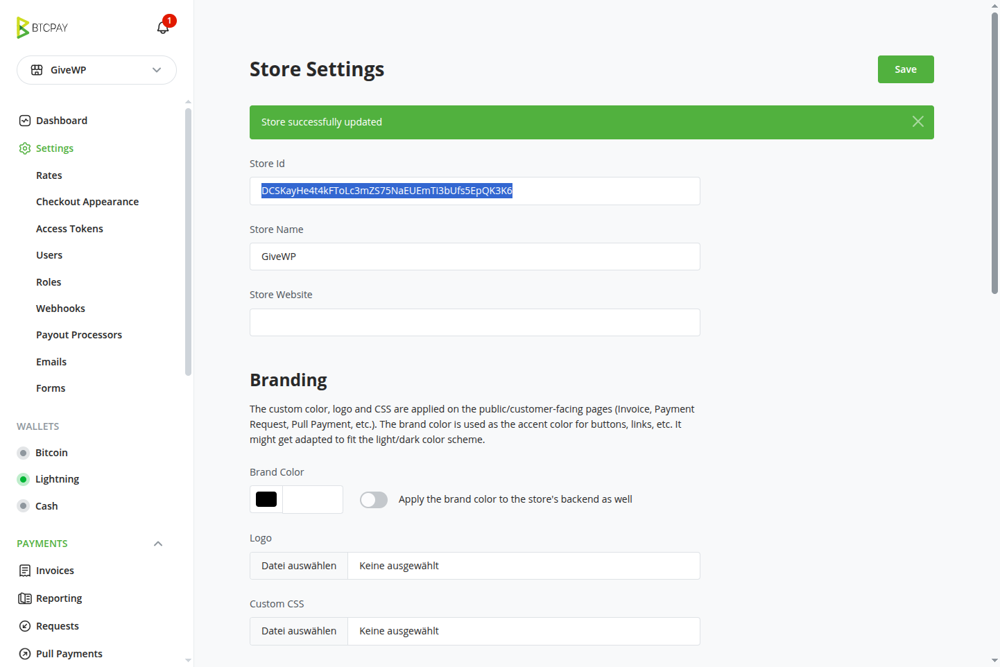
4. Nakili Kitambulisho cha Duka mahali salama. Utahitaji katika hatua zinazofuata.

### 2.3 Weka ufunguo wa API na kitambulisho cha duka katika mipangilio ya GiveWP

Rudi kwenye tovuti yako ya WordPress:

1. Nenda kwenye dashibodi yako ya WordPress.
2. Katika utepe _GiveWP_ -> _Settings_ -> _Payment Gateways_.
3. Bofya kwenye kichupo cha _BTCPay Gateway_.
4. Jaza _BTCPay Server URL_ na URL ya mfano wako wa BTCPay Server (k.m., `https://btcpay.example.com`).
5. Nakili kitambulisho cha duka kwenye _BTCPay Settings_ yako ya GiveWP
6. Nakili Ufunguo wa API uliozalishwa kwenye _BTCPay Settings_ yako ya GiveWP
   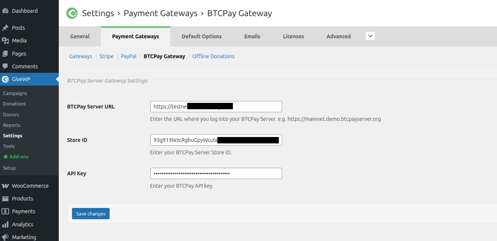
7. Bofya _[Save changes]_ chini ya ukurasa
8. Hakikisha unaona arifa "_BTCPay for GiveWP: BTCPay Server API credentials verified successfully." na "BTCPay for GiveWP: Webhook created successfully." juu ya ukurasa.
   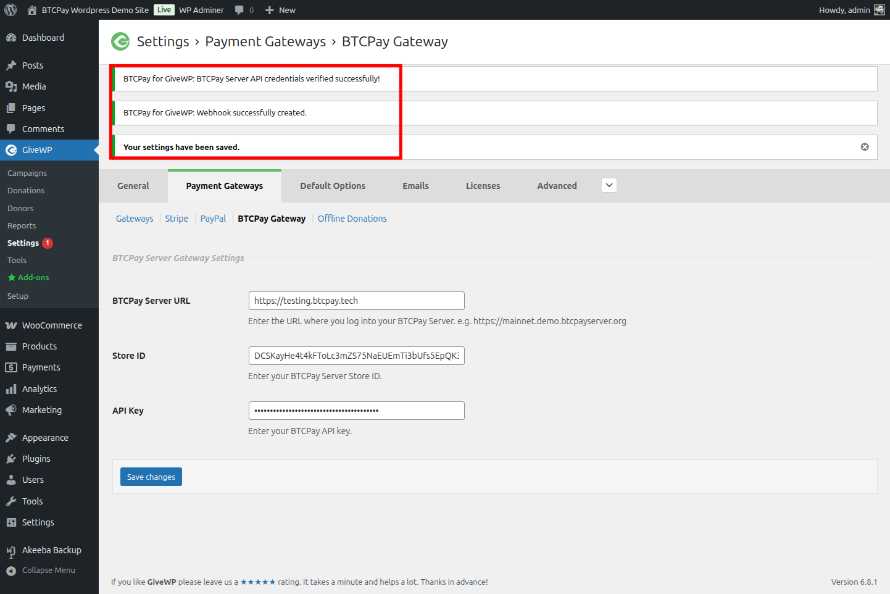
9. Sasa bofya kiungo/kichupo cha [Gateways] juu ya ukurasa kurudi kwenye muhtasari wa malango.

10. Katika muhtasari wa malango, unapaswa kuona _BTCPay Server Gateway_ imeorodheshwa kama lango la malipo linalopatikana.
11. Hakikisha kuweka alama ya tiki katika safu ya "Enabled" ili kuwezesha BTCPay Server Gateway. Unaweza pia kuifanya lango chaguo-msingi kwa kuweka tiki kwenye safu ya "Default".
    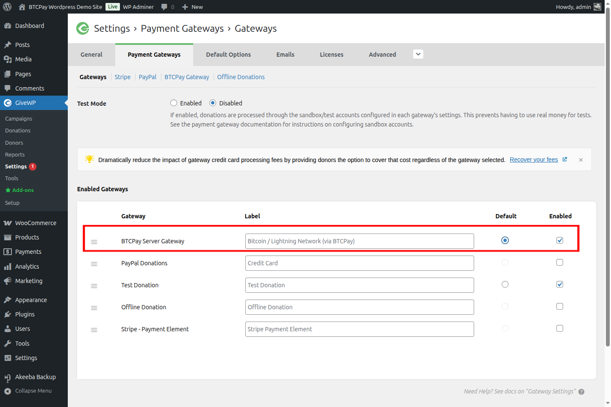

Hongera, sasa uko tayari kupokea michango kupitia BTCPay Server kwenye fomu zako za michango za GiveWP!

## 3. Kujaribu malipo ya mchango

Kufanya mchango mdogo wa jaribio kutoka duka lako kutakupa amani ya akili.
Daima hakikisha kuwa kila kitu kimesanidiwa kwa usahihi kabla ya kuanza rasmi.

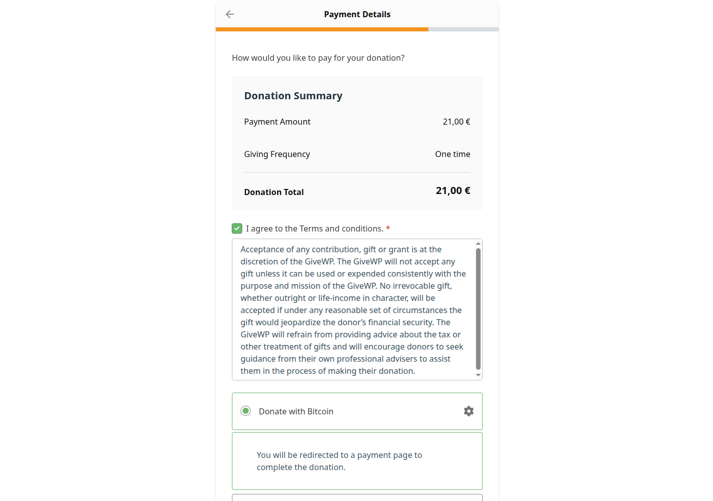
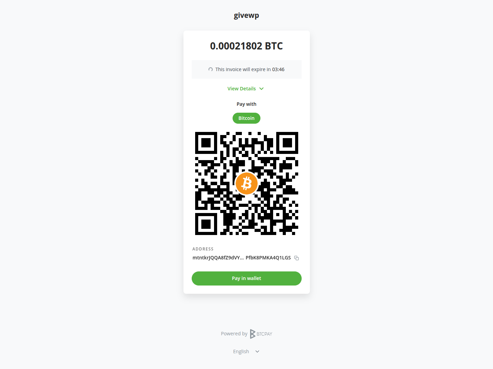
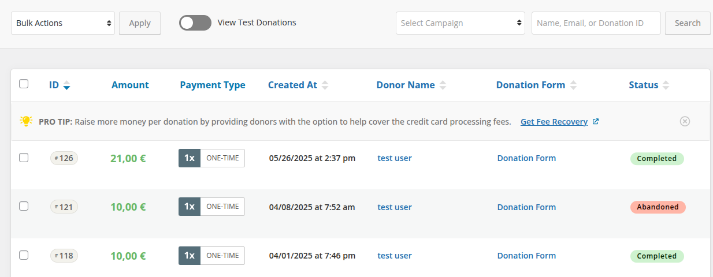

## Pata usaidizi
Unaweza kufungua suala kwenye [hazina yetu](https://github.com/btcpayserver/givewp) au kutufikia kwenye [Telegram](https://t.me/btcpayserver) au [mazungumzo ya Mattermost](http://chat.btcpayserver.org/).