# Uingizaji wa Pochi ya Maunzi

Kwa usawa bora kati ya urahisi wa matumizi, usalama na faragha, inapendekezwa kutumia [Pochi ya BTCPay Server](/sw/Wallet.md) pamoja na pochi ya maunzi.

Uingizaji wa pochi ya maunzi ndani ya BTCPay Server unakuwezesha kuingiza pochi yako ya maunzi na kutumia fedha zinazoingia kwa uthibitisho rahisi kwenye kifaa chako. Funguo zako za faragha haziondoki kamwe kwenye kifaa na fedha zote zinathibitishwa dhidi ya nodi yako kamili mwenyewe bila kuvuja kwa data.

## Kuanza

1. [Pakua programu ya BTCPay Vault](https://github.com/btcpayserver/BTCPayServer.Vault/releases)
2. Sakinisha Vault kwenye Kompyuta yako (Windows, MacOS au Linux)
3. Fungua programu ya BTCPay Vault
4. Unganisha pochi ya maunzi kwenye Kompyuta yako na hakikisha iko katika hali ya kuwashwa
5. Una duka lililopo? Ruka hadi hatua ya 7.
6. Unganisha pochi iliyopo kisha bofya kwenye Unganisha pochi ya maunzi.
7. Sasa utaona BTCPay Server ikitafuta pochi yako ya maunzi, hatua hii inakuhitaji kuendesha BTCPay Server Vault.
8. Bofya kubali kwenye programu yako ya BTCPay Vault. Vault sasa inatafuta kifaa chako, sasa itakuomba nambari yako ya siri kwenye kifaa.
9. Baada ya kifaa kupatikana na kukubaliwa, chagua aina yako ya anwani na ubofye thibitisha. BTCPay Server itaonyesha taarifa ya funguo yako ya umma kutoka kwenye pochi yako ya maunzi.
10. Mara utakapothibitisha kuwa funguo ya umma ni sahihi, BTCPay Server sasa inaonyesha anwani ya kuthibitisha kwenye kifaa chako. Ikiwa ni sahihi bofya thibitisha kukamilisha usanidi.

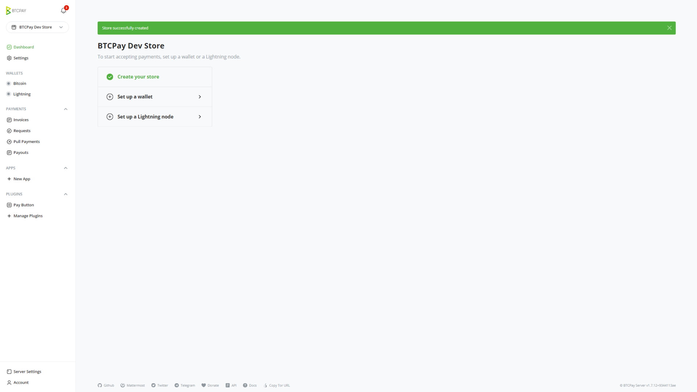

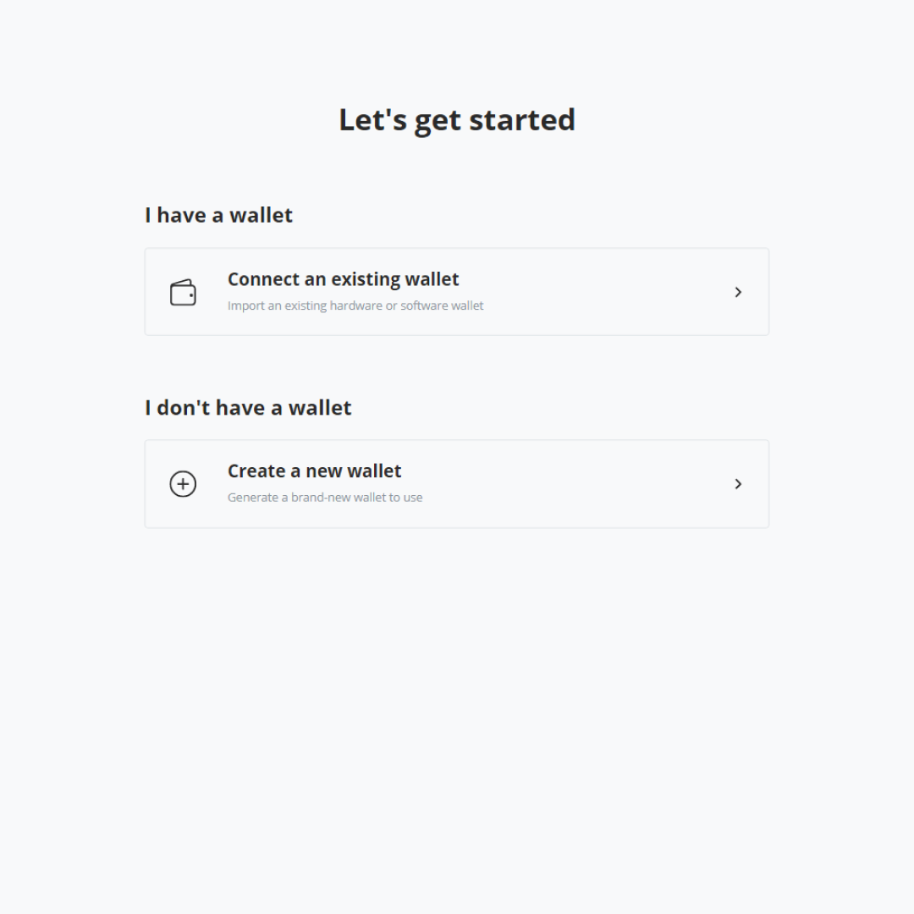

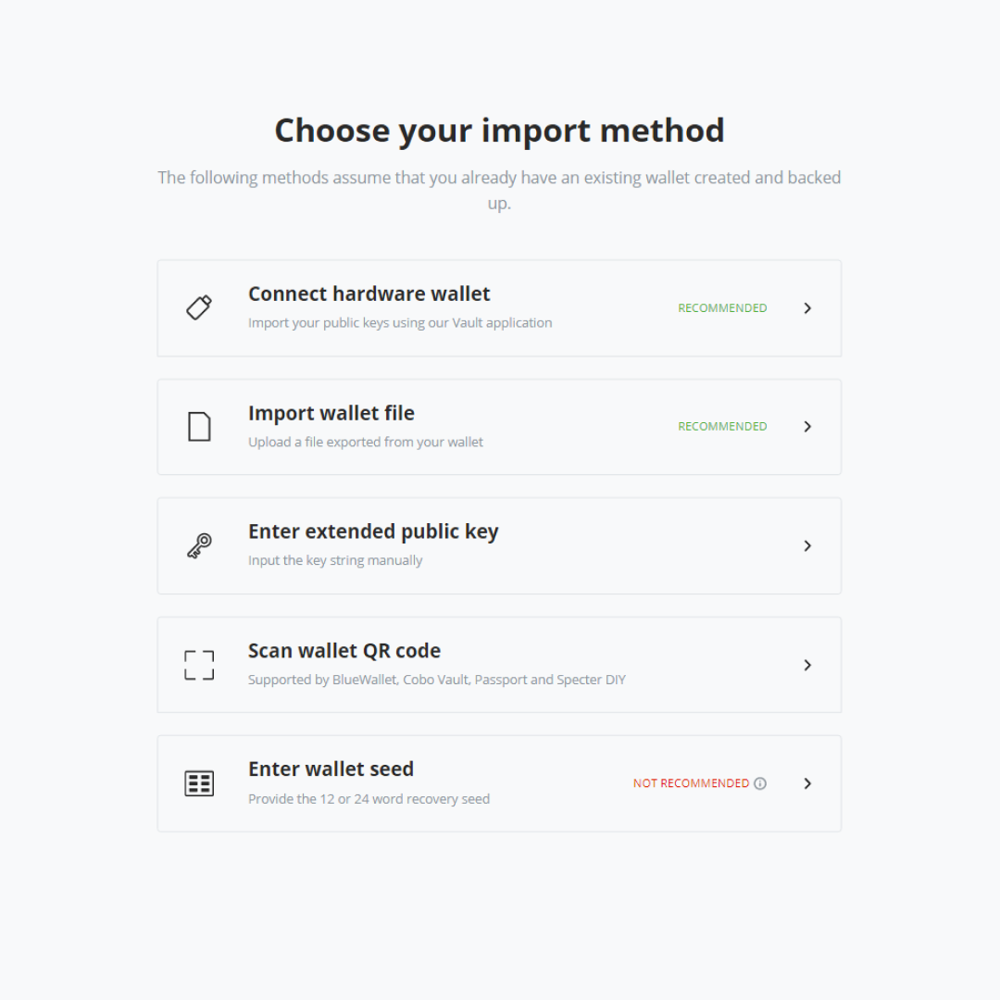

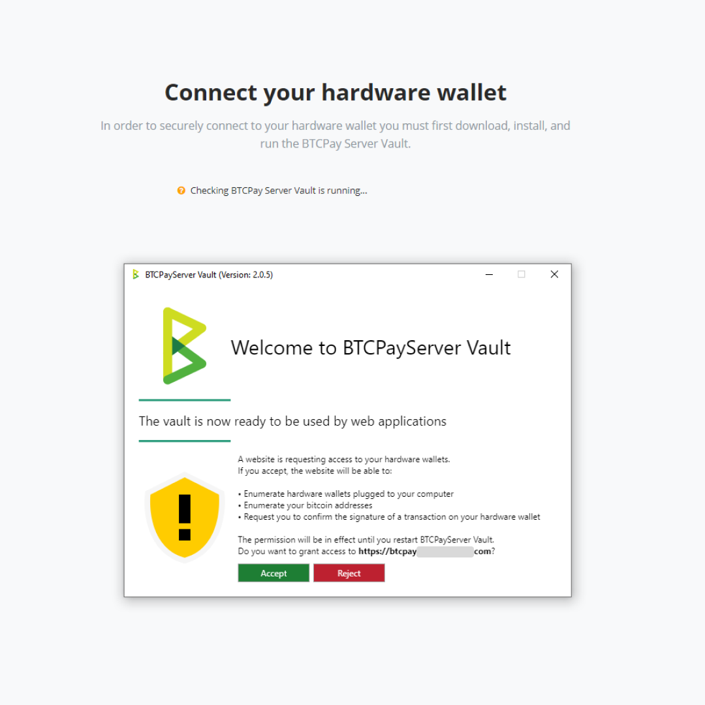

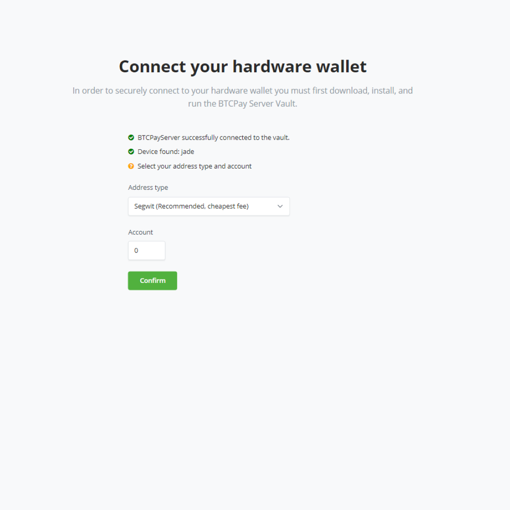

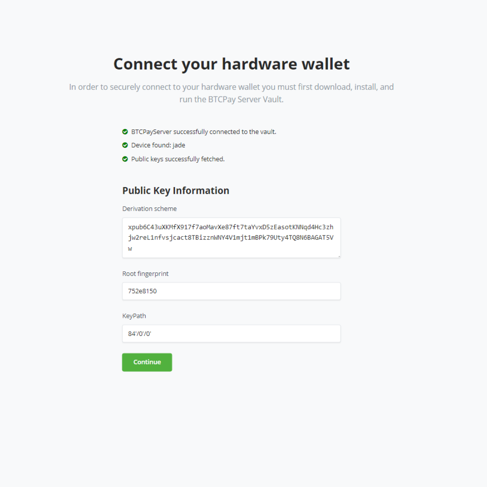

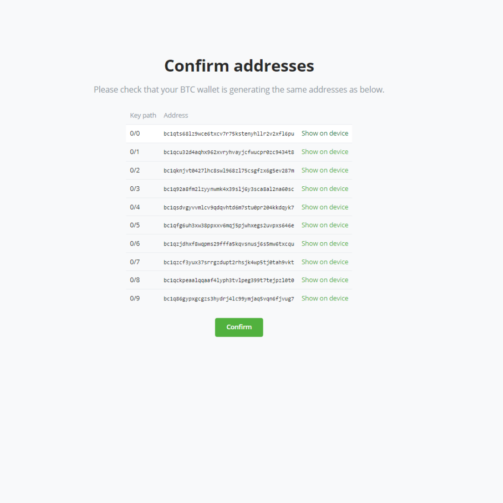

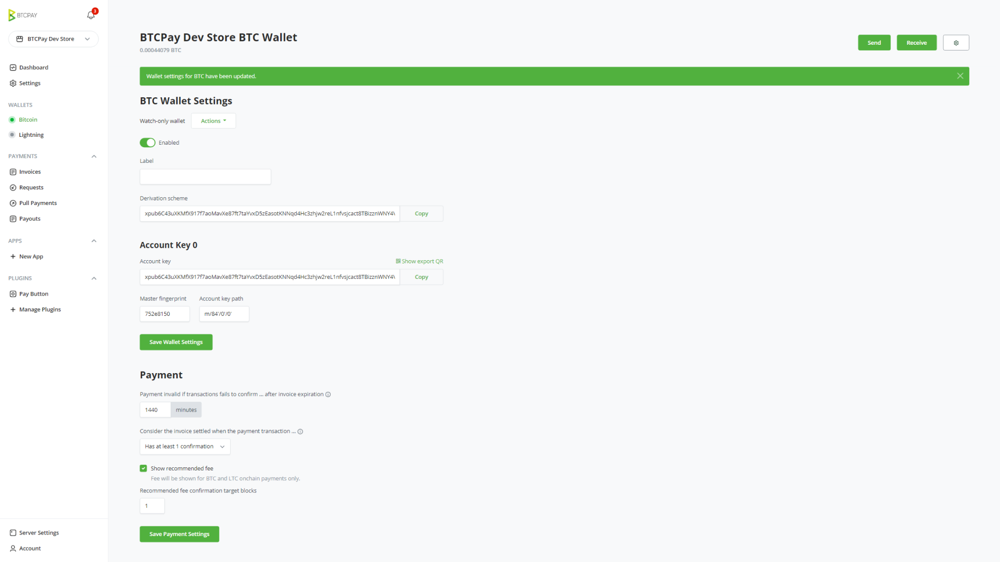

### Kutumia fedha

Mara utakapopokea fedha kwenye pochi yako na ukaamua kuzitumia, unaweza kutia sahihi muamala na pochi yako ya maunzi, yote ndani ya BTCPay Server.

1. Fungua programu ya BTCPay Vault kwenye Kompyuta yako
2. Unganisha pochi ya maunzi na hakikisha iko katika hali ya kuwashwa
3. Katika BTCPay Server, nenda kwenye Pochi yako ya Bitcoin na ubofye tuma
4. Jaza anwani ya Lengwa na Kiasi
5. Chagua Tia sahihi kwa pochi ya maunzi
6. Thibitisha muamala kwenye pochi yako ya maunzi na uthibitishe
7. Tangaza muamala

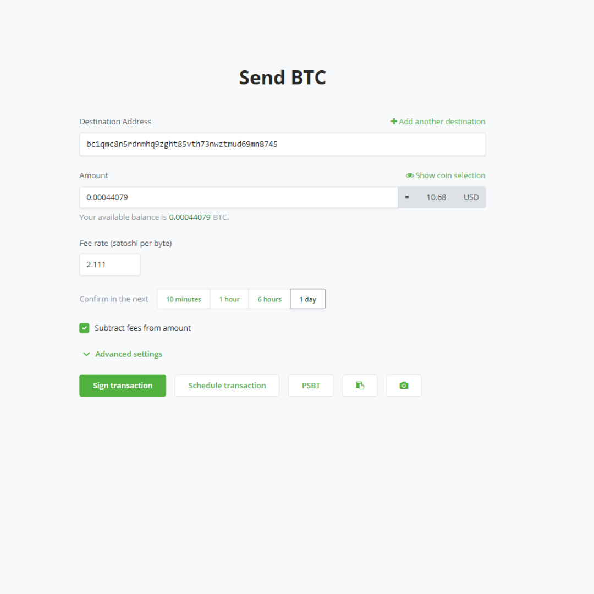

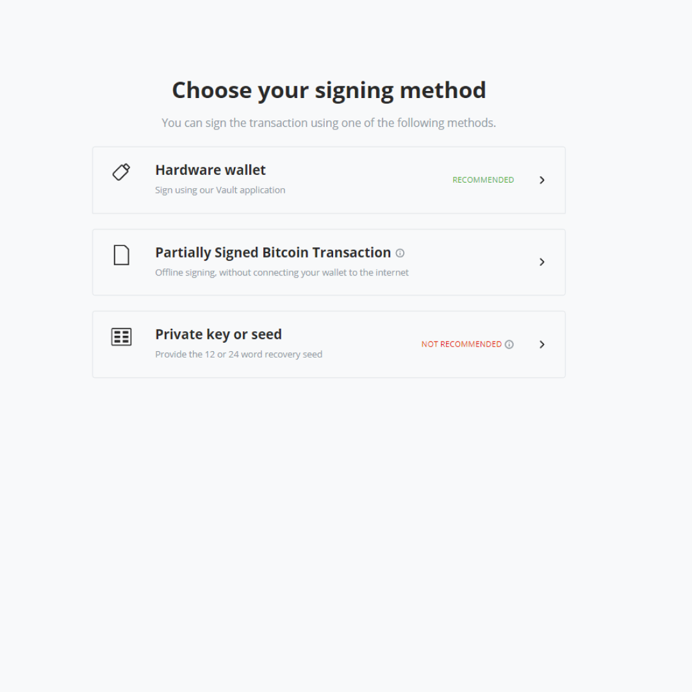

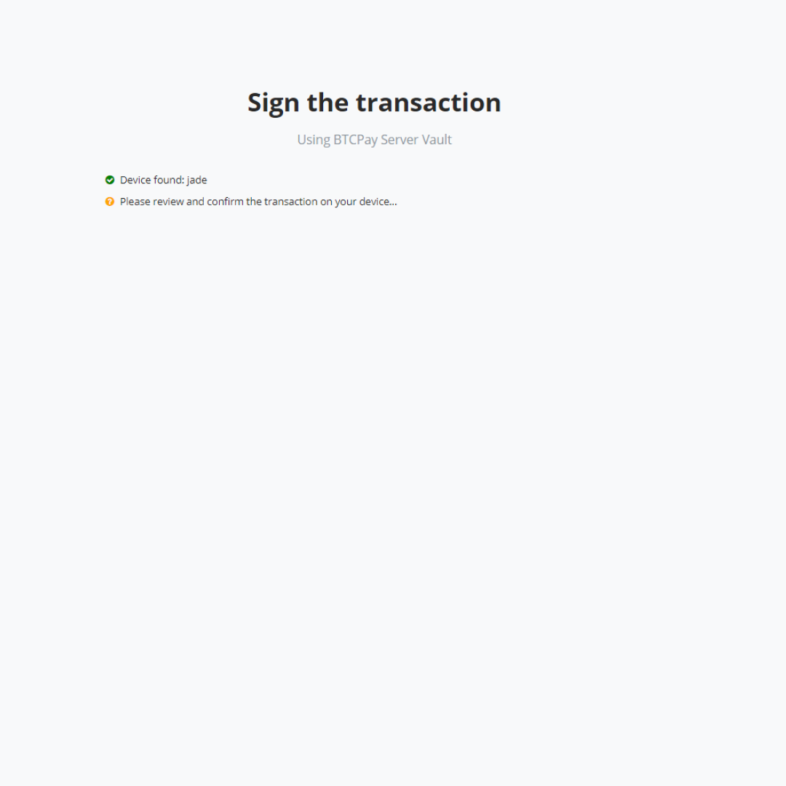

## Mipangilio ya Juu

Mipangilio ya ziada ya muamala inaweza kupatikana kwa kubofya kitufe cha [Advanced Settings](/sw/Wallet.md#advanced-settings). Ikiwa haujafahamiana na aina hizi za mipangilio, unaweza kuziacha kama zilivyo kutumia mipangilio chaguo-msingi.

Ikiwa unapata matatizo ya kutuma miamala kutoka kwenye pochi ya Trezor, unaweza kuhitaji kuwezesha [mpangilio huu wa juu](FAQ/Wallet.md#why-is-sending-a-transaction-using-trezor-failing).

## Pochi za Maunzi Zinazoauniwa

Orodha ya pochi za maunzi zinazoauniwa inapatikana kwenye [kiungo hiki](https://github.com/bitcoin-core/HWI#device-support).

:::warning
Uingizaji wa pochi ya maunzi katika BTCPay Server unasaidia Bitcoin pekee. Pochi za [Altcoin](/Development/Altcoins.md) zilizowezeshwa kwenye seva yako hazitafanya kazi.
:::
