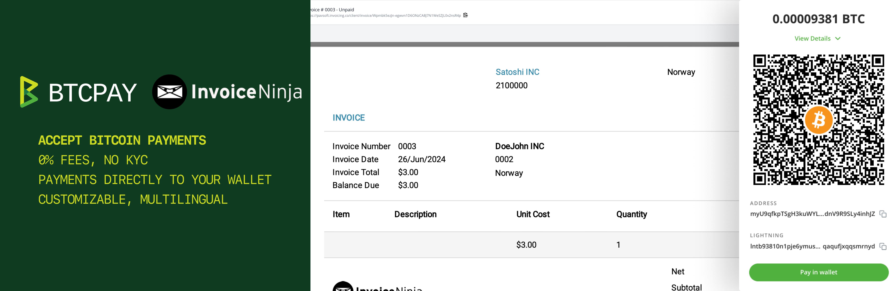
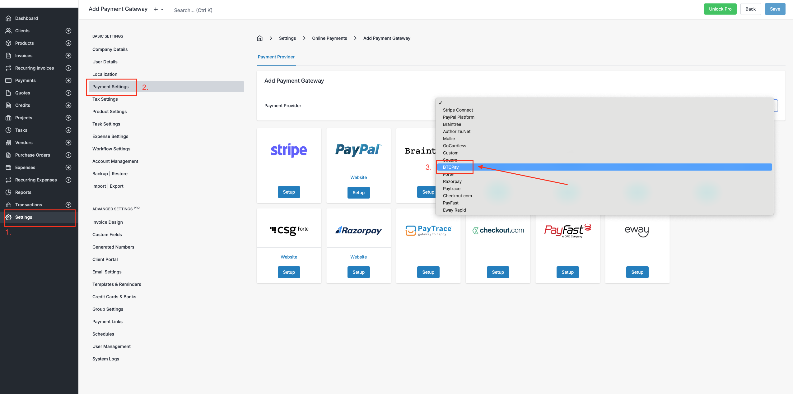
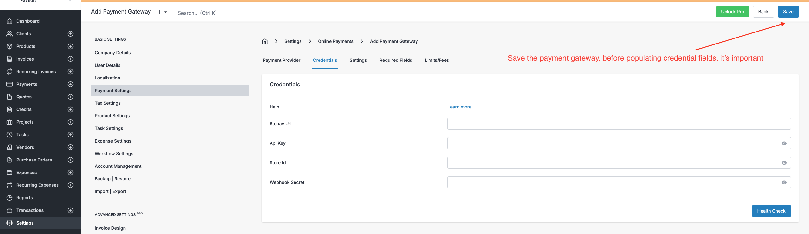
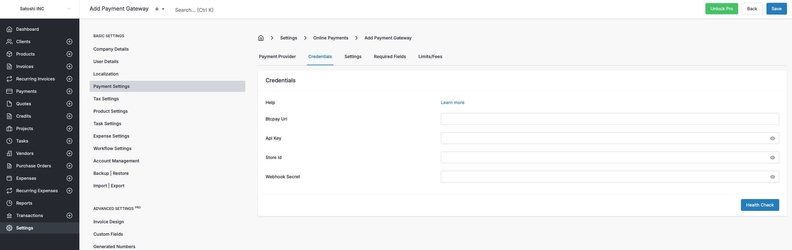
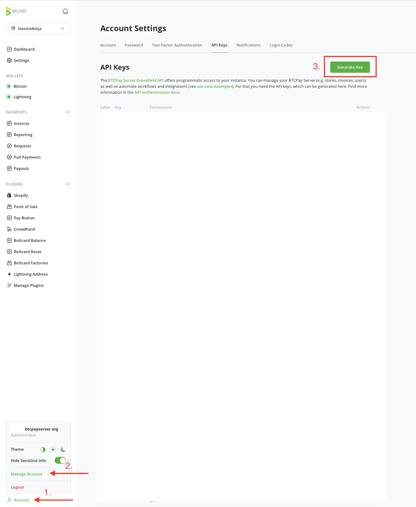
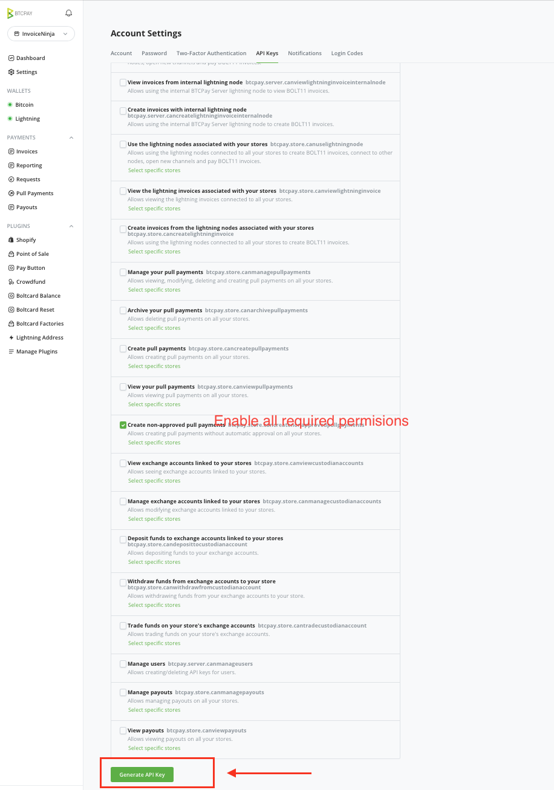
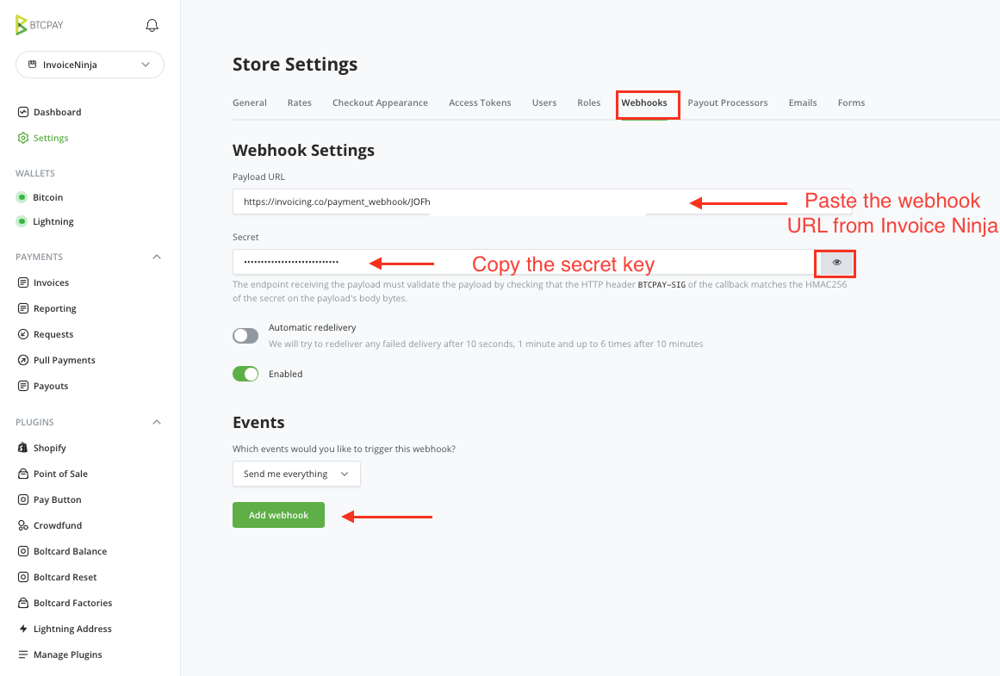
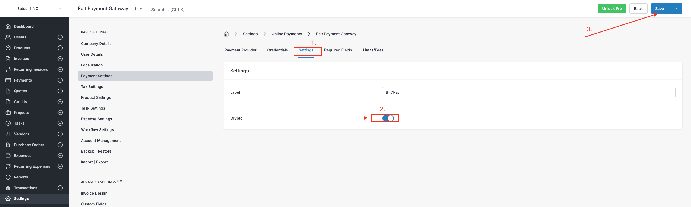
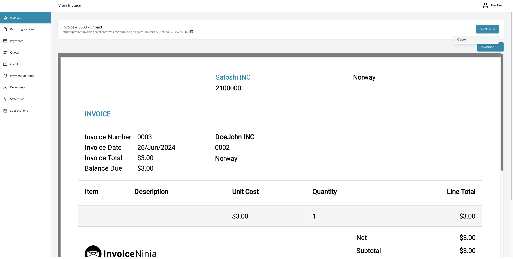
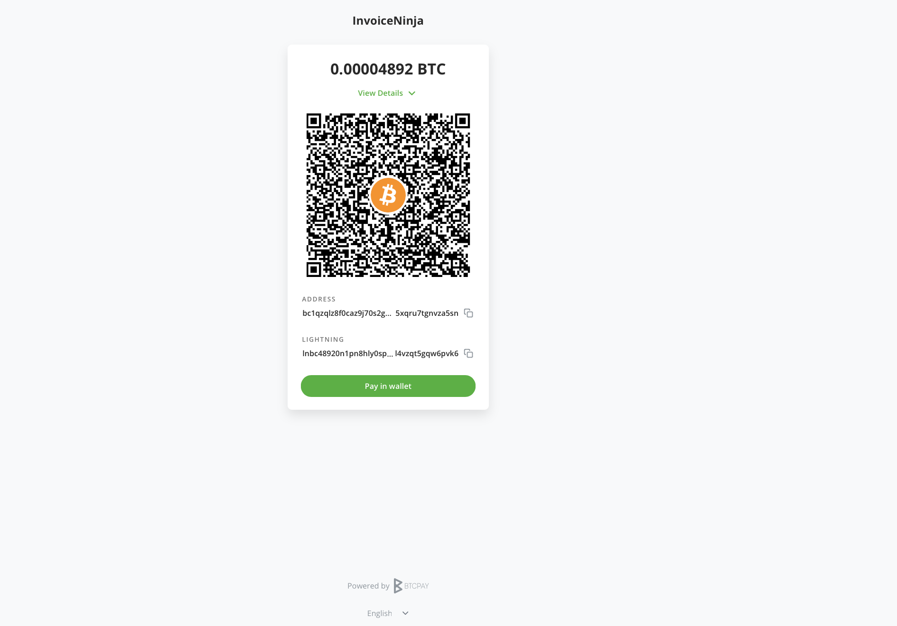

# Jinsi ya kupokea malipo ya Bitcoin kwa Invoice Ninja?

[Invoice Ninja](http://invoiceninja.com) ni programu thabiti ya kutengeneza ankara na bili iliyoundwa kusaidia biashara ndogo, wafanyakazi wa kujitegemea, na wajasiriamali kusimamia ankara zao, malipo, na wateja. Kwa safu yake pana ya vipengele, InvoiceNinja hurahisisha mchakato wa bili, ikiruhusu watumiaji kuzingatia kukuza biashara zao.

Muunganisho wa [BTCPay Server](https://btcpayserver.org) na Invoice Ninja unakuwezesha kupokea bitcoin kama njia ya malipo, bila ada, bila wasuluhishi na malipo yakienda moja kwa moja kwenye pochi yako ya bitcoin.

Mwongozo huu utakuongoza kupitia hatua za kusanidi na kutumia BTCPay Server yako na InvoiceNinja. Uwezo wa malipo wa BTCPay umeunganishwa moja kwa moja kwenye InvoiceNinja. Hakuna programu-jalizi zinazohitajika.

## Mahitaji

- InvoiceNinja (inayoendeshwa au inayojisimamia mwenyewe)
- BTCPay Server ([inayojisimamia mwenyewe](https://docs.btcpayserver.org/Deployment/) au inayoendeshwa na [mtoa huduma wa tatu](https://docs.btcpayserver.org/Deployment/ThirdPartyHosting/))
- [Duka limeundwa](https://docs.btcpayserver.org/CreateStore/) kwenye BTCPay Server
- [Pochi imeunganishwa](https://docs.btcpayserver.org/WalletSetup/) kwenye BTCPay Server

## 1. Usanidi wa Lango la Malipo

Ili kusanidi BTCPay katika Invoice Ninja, fuata hatua hizi:

1. Ingia kwenye Tovuti ya Msimamizi wa Invoice Ninja:
2. Nenda kwenye Settings > **Payment Settings**
3. Katika kona ya juu kulia, bofya **Add payment gateway**
4. Tembeza kupitia menyu kunjuzi na ubofye **BTCPay**
5. Kisha, utaona ukurasa wa usanidi wa BTCPay. Ni muhimu kwamba **kabla ya kuongeza data yoyote** katika sehemu za vitambulisho, **ubofye Save, ili kuunda lango la malipo**.

Mara tu tunapounda lango la malipo, tuendelee kwenye hatua ya 2, na tuunganishe BTCPay Server yetu na Invoice Ninja.

## 2. Kuunganisha BTCPay Server yako

### 2.1 URL ya BTCPay

Katika sehemu ya URL ya BTCPay yako, weka tu kiungo cha seva yako inayojisimamia mwenyewe au ile inayoendeshwa na [mtoa huduma wa tatu](https://directory.btcpayserver.org/#type=Hosted+BTCPay).
*Kwa mfano; https://mainnet.demo.btcpayserver.org*

### 2.2 Kitambulisho cha Duka la BTCPay

Kitambulisho cha Duka la BTCPay kinaweza kupatikana kutoka kwenye BTCPay Server yako, katika sehemu ya **Store Settings > General > Store ID**. Kinakili na ukibandike kwenye sehemu ya Kitambulisho cha Duka la BTCPay.

### 2.3 Kuzalisha ufunguo wa API

Ili kuunda ufunguo wa API wa BTCPay, bofya kwenye Akaunti iliyoko chini ya utepe.
1. Bofya **Manage Account > API Key**.
2. Bofya kitufe cha **Generate API** key
3. Bofya kwenye visanduku vya kuteua na wezesha ruhusa zifuatazo:
    - View invoices
    - Create an invoice
    - Modify invoices
    - Modify selected stores' webhooks
    - View your stores
    - Create non-approved pull payments in selected stores
4. Kwa hiari, ikiwa una Maduka mengi ya BTCPay, unaweza kuchagua duka ambalo ruhusa zitatumika
5. **Fichua na unakili ufunguo wa API** na **uubandike** kwenye Invoice Ninja katika sehemu ya API Key.

### 2.4 Kuzalisha webhook

1. Katika InvoiceNinja yako, chini ya **Payment Settings > Edit Payment Gateway,** bofya kichupo cha **Payment Gateway**, na unakili **Webhook URL**"
2. Kisha, nenda kwenye BTCPay Server Store Settings > **Webhooks**
3. Bofya kitufe cha **Create Webhook**
4. Bandika URL ya Webhook uliyonakili kutoka InvoiceNinja (hatua ya 1) kwenye sehemu ya **Payload URL**
4. Bofya ikoni ya "Jicho" karibu na sehemu ya Siri ili kufichua ufunguo wa siri na uunakili.
5. Usisahau kubofya Add webhook ili kutumia mabadiliko yote.
6. Rudi kwenye InvoiceNinja na ubandike Ufunguo wa Siri kwenye sehemu ya Webhook Secret
7. Bofya **Save** kutumia mabadiliko yote

*Katika kichupo cha "Settings" na "Limits/Fees", unaweza kuweka chaguzi zingine, zinazojulikana kwa mifumo mingine ya malipo ya InvoiceNinja.*

### 3. Wezesha njia ya malipo ya Crypto

Mara kila kitu kinaposanidiwa, usisahau kuwezesha chaguo la malipo ya Crypto kutoka kwenye kichupo cha Payment Gateway Settings, na ubofye save.

Sasa uko tayari! Jisikie huru kuzalisha ankara kwa wateja wako na ulipwe kwa Bitcoin.

