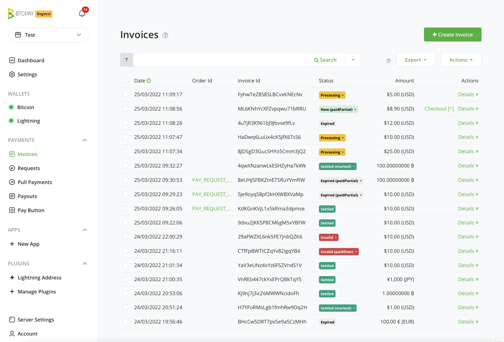
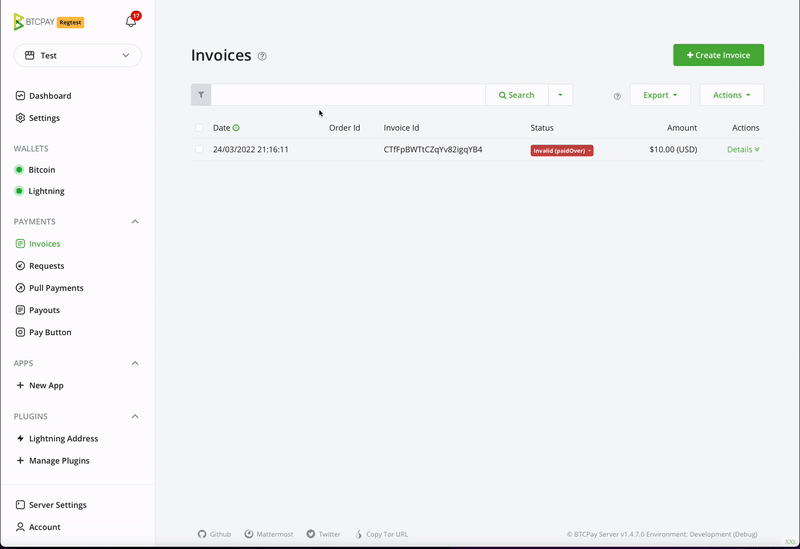

# Invosi ni nini katika BTCPay Server?

**Invosi** ni hati inayotolewa na muuzaji kwa mnunuzi kukusanya malipo.

Katika BTCPay Server, invosi inawakilisha hati ambayo lazima ilipwe ndani ya **muda uliowekwa** kwa kiwango cha ubadilishaji kilichofungwa. Invosi zina muda wa kumalizika kwa sababu zinafunga kiwango cha ubadilishaji ndani ya kipindi maalum cha muda ili kumlinda mpokeaji dhidi ya mabadiliko ya bei.

Kiini cha BTCPay Server ni uwezo wa kufanya kazi kama mfumo wa usimamizi wa invosi za bitcoin. Invosi ni zana muhimu ya kufuatilia na kusimamia malipo yaliyopokelewa.

Isipokuwa unatumia [Wallet](/Wallet.md) iliyojengewa ndani kupokea malipo kwa mikono, malipo yote ndani ya duka yataonyeshwa kwenye ukurasa wa `Invoices`. Ukurasa huu unapanga malipo kwa jumla kulingana na tarehe na ni sehemu muhimu ya usimamizi wa invosi na utatuzi wa malipo.

## Hali za invosi

Jedwali hapa chini linaorodhesha na kuelezea hali za kawaida za invosi katika BTCPay na kupendekeza hatua za kawaida.
Hatua ni mapendekezo tu.
Ni jukumu la watumiaji kufafanua hatua bora kwa matumizi yao na biashara yao.

| Hali ya Invosi                 | Maelezo                                                                                                                               | Hatua                                                                                                                        |
| ------------------------------ | ------------------------------------------------------------------------------------------------------------------------------------- | ---------------------------------------------------------------------------------------------------------------------------- | ------------------------------------------------- |
| **Mpya**                       | Haijalipwa, muda wa invosi bado haujamalizika                                                                                         | Hakuna                                                                                                                       |
| **Mpya (paidPartial)**         | Imelipwa, si kikamilifu, muda wa invosi bado haujamalizika                                                                             | Hakuna                                                                                                                       |
| **Imemalizika**                | Haijalipwa, muda wa invosi umemalizika                                                                                                 | Hakuna                                                                                                                       |
| **Imemalizika (paidPartial)** \*\* | Imelipwa, si kiasi kamili, na imemalizika                                                                                         | Wasiliana na mnunuzi kupanga marejesho au umwombe alipe deni lake. Kwa hiari weka invosi kama iliyotatuliwa au batili        |
| **Imemalizika (paidLate)**     | Imelipwa, kiasi kamili, baada ya muda wa invosi kumalizika                                                                            | Wasiliana na mnunuzi kupanga marejesho au chakata agizo ikiwa uthibitisho wa kuchelewa unakubalika.                          | Kwa hiari weka kama iliyotatuliwa au batili |
| **Iliyotatuliwa (paidOver)**   | Imelipwa zaidi ya kiasi cha invosi, imetatuliwa, imepokea kiasi cha kutosha cha uthibitisho                                            | Wasiliana na mnunuzi kupanga marejesho ya kiasi cha ziada, au kwa hiari subiri mnunuzi awasiliane nawe                       |
| **Inachakatwa**                | Imelipwa kikamilifu, lakini haijapokea kiasi cha kutosha cha uthibitisho kilichowekwa katika mipangilio ya duka                       | Subiri uthibitisho (Invosi inapaswa kuwa - iliyotatuliwa)                                                                     |
| **Inachakatwa (paidOver)**     | Imelipwa zaidi ya kiasi cha invosi, haijapokea kiasi cha kutosha cha uthibitisho                                                      | Subiri itatuliwe kisha wasiliana na mnunuzi kupanga marejesho ya kiasi cha ziada, au kwa hiari subiri mnunuzi awasiliane nawe |
| **Iliyotatuliwa**              | Imelipwa, kikamilifu, imepokea kiasi cha kutosha cha uthibitisho katika duka                                                          | Timiza agizo                                                                                                                 |
| **Iliyotatuliwa (marked)**     | Hali ilibadilishwa kwa mkono kuwa iliyotatuliwa kutoka hali ya inachakatwa au batili                                                   | Msimamizi wa duka ameweka malipo kama yaliyotatuliwa                                                                          |
| **Batili\***                   | Imelipwa, lakini imeshindwa kupokea kiasi cha kutosha cha uthibitisho ndani ya muda uliowekwa katika mipangilio ya duka               | Angalia muamala kwenye kichunguzi cha blockchain, ikiwa ilipokea uthibitisho wa kutosha, weka kama iliyotatuliwa              |
| **Batili (marked)**            | Hali ilibadilishwa kwa mkono kuwa batili kutoka hali ya iliyotatuliwa au imemalizika                                                   | Msimamizi wa duka ameweka malipo kama batili                                                                                  |
| **Batili (paidOver)**          | Imelipwa zaidi ya kiasi cha invosi, lakini imeshindwa kupokea kiasi cha kutosha cha uthibitisho ndani ya muda uliowekwa                | Angalia muamala kwenye kichunguzi cha blockchain, ikiwa ilipokea uthibitisho wa kutosha, weka kama iliyotatuliwa              |

- - Invosi zinazolipwa kupitia [Mtandao wa Lightning](./LightningNetwork.md) huenda moja kwa moja kwenye hali iliyotatuliwa, kwa kuwa utatuzi wao ni wa papo hapo.
- \*\* Invosi ya Malipo Sehemu kwa kawaida hutokea wakati mnunuzi analipa invosi kutoka kwenye wallet ya kubadilishana ambayo inachukua ada kwa huduma yao na kuikata kutoka kwa jumla. Katika baadhi ya matukio, hutokea wakati mnunuzi anaingiza kiasi kisicho sahihi kwenye wallet yake.
- \*\*\* Batili - Ikiwa unapokea invosi nyingi batili katika duka lako, unaweza kutaka [kurekebisha muda wa invosi batili katika mipangilio ya duka](./FAQ/Stores.md#payment-invalid-if-transactions-fails-to-confirm-minutes-after-invoice-expiration).

### Maelezo ya invosi

Ukurasa wa maelezo ya invosi una taarifa zote zinazohusiana na invosi.

Taarifa ya invosi huundwa kiotomatiki kulingana na hali ya invosi, kiwango cha ubadilishaji, nk. Taarifa ya bidhaa huundwa kiotomatiki ikiwa invosi iliundwa na taarifa ya bidhaa kama vile katika programu ya Point of Sale. Soma kuhusu kukusanya taarifa za Mnunuzi [hapa](./FAQ/Stores.md#how-to-collect-additional-buyer-information).

### Uchujaji wa invosi

Invosi zinaweza kuchujwa kupitia vichujio vya haraka vilivyo karibu na kitufe cha utafutaji au vichujio vya kina, ambavyo vinaweza kuwashwa kwa kubofya kiungo cha (Msaada) juu. Watumiaji wanaweza **kuchuja invosi** kwa duka, kitambulisho cha agizo, kitambulisho cha bidhaa, hali, au tarehe.

### Usafirishaji wa invosi

Invosi za BTCPay Server zinaweza kusafirishwa katika muundo wa CSV au JSON. Kwa maelezo zaidi kuhusu usafirishaji wa invosi na uhasibu, [angalia ukurasa huu](./Reporting.md).

## Kurejesha invosi

Ikiwa kwa sababu yoyote ungependa kutoa marejesho, unaweza kuunda marejesho kwa urahisi kutoka kwenye mwonekano wa invosi. Angalia [nyaraka zetu za marejesho](/Refund.md) kwa maelezo zaidi.

## Kuhifadhi kumbukumbu za invosi

Kutokana na kipengele cha kutotumia anwani tena cha BTCPay Server, ni kawaida kuona invosi nyingi zilizomalizika katika ukurasa wa invosi wa duka lako. Ili kuzificha kutoka kwenye mwonekano wako, zichague kwenye orodha na uziweke kama **zilizohifadhiwa**. Invosi ambazo zimewekwa kama zilizohifadhiwa hazijafutwa. Malipo kwa invosi iliyohifadhiwa bado yatagunduliwa na BTCPay Server yako (hali ya paidLate). Unaweza kuona invosi zilizohifadhiwa za duka wakati wowote kwa kuchagua invosi zilizohifadhiwa kutoka kwenye menyu kunjuzi ya kichujio cha utafutaji.
