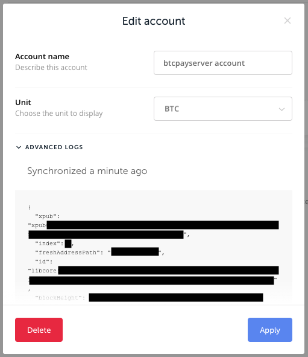

# Kuunganisha Pochi ya Ledger kwenye BTCPay Server

Hati hii inaonyesha **jinsi ya kuunganisha Pochi ya Ledger Nano S kwenye BTCPay Server**.

:::warning
Unganisho wa moja kwa moja wa Ledger Nano S **hauungwi mkono tena**. Kwa pochi za Bitcoin, unaweza kutumia pochi yako ya maunzi ya Ledger kwa njia ya kawaida kupitia [unganisho jipya la pochi ya maunzi](./HardwareWalletIntegration.md).

Kwa pochi za [altcoin](/Development/Altcoins.md), unaweza kutumia fedha kutoka kwenye pochi yako ya nje, kutia saini muamala ndani ya [pochi ya ndani](./Wallet.md) kwa [HD Private Key au mbegu ya mnemonic](./Wallet.md#signing-with-hd-private-key-or-mnemonic-seed) au [pochi moto](./Wallet.md#signing-with-a-hot-wallet).

Ili kusanidi pochi mpya ya altcoin, ongeza ufunguo wa umma uliopanuliwa kwa mkono au [unda pochi mpya](./CreateWallet.md).
:::

## Usanidi wa Pochi ya Ledger Nano S

Mwongozo huu unachukulia kuwa una pochi ya Nano S iliyosanidiwa. Ili kusanidi Nano S, tafadhali angalia [mwongozo wa usanidi wa haraka kwenye tovuti ya mtengenezaji](https://www.ledger.com/start/).

### Mahitaji

1. Programu ya Bitcoin imesakinishwa kwenye Ledger
2. Google Chrome au Firefox
3. Kwa Firefox, U2F inahitaji kuwashwa katika about:config
4. Hakuna vifaa vingine vya U2F vilivyochomekwa kwenye PC yako (Yubikey, pochi nyingine, n.k.)

### Usanidi wa Haraka

1. Chomeka Ledger Nano S kwenye PC yako.
2. Fungua programu ya Bitcoin kwenye Ledger yako.
3. Katika BTCPay Server, Store > Settings > Wallet > Setup > Derivation Scheme > Import from Hardware Device > Ledger wallet
4. Chagua akaunti unayotaka kutumia, katika hali nyingi ni `Account 0`
5. Thibitisha `Export public key` kwenye pochi.
6. Ufunguo wa umma uliopanuliwa sasa utaongezwa kiotomatiki kutoka Ledger hadi kwenye Duka lako la BTCPay Server.
7. Hakikisha kwamba mpango wa utoleaji umewashwa (`Enabled`)
8. Bonyeza `Continue`
9. `Thibitisha` ulinganifu wa anwani katika BTCPay.

Pochi yako ya Ledger sasa imeunganishwa kwenye BTCPay yako. Malipo yanaenda moja kwa moja kwenye Ledger.

#### Usanidi wa Mkono

Ikiwa una zaidi ya akaunti 20 kwenye Ledger yako huenda usiweze kupata akaunti sahihi kwa sababu uteuzi unaonyesha upeo wa viingizo 20.
Katika hali hii unaweza kupata ufunguo wa umma uliopanuliwa kwa akaunti yako unayotaka kwa hatua hizi:

1. Fungua [programu ya Ledger live](https://shop.ledger.com/pages/ledger-live)
2. Accounts -> chagua akaunti yako
3. Edit Account upande wa juu kulia kupitia ikoni ya zana
4. Katika Edit Account -> ADVANCED LOGS
5. Nakili mfuatano wa ufunguo wa umma uliopanuliwa
6. Bandika kwa mkono kwenye uga wa maandishi wa "DerivationScheme"
7. Endelea na [Hatua ya 7 ya Usanidi wa Haraka hapo juu](#usanidi-wa-haraka)

### Kutumia fedha kutoka kwa pochi ya BTCPay Server na Ledger

Mara kunapokuwa na fedha fulani zilizopokelewa kwenye Pochi yako ya BTCPay iliyounganishwa na Ledger, unaweza kuzitumia kwa kutia saini muamala na pochi yako ya maunzi. Hii inaruhusu mwingiliano rahisi wa pochi ya Ledger na nodi yako kamili, bila kuvujisha taarifa kwa seva za watu wa tatu.

1. Chomeka Ledger Nano S kwenye PC yako.
2. Fungua programu ya Bitcoin kwenye Ledger yako.
3. Katika BTCPay, nenda kwa Wallets > Manage > Send
4. Jaza anwani ya pokezi na kiasi
5. Bonyeza Sign with `your Ledger Wallet device`.
6. BTCPay itaanzisha muunganisho na pochi ya Ledger na kuonyesha taarifa za muamala kwenye skrini ya pochi.
7. Thibitisha muamala kwenye Ledger.
8. Katika Ledger, bonyeza `Ready To Sign`
9. Kagua miamala yako na ubonyeze `Broadcast` kuitangaza kwenye mtandao.

Video hapa chini inaonyesha jinsi ya kuunganisha duka lako la BTCPay kwenye Ledger yako na jinsi ya kutumia Ledger na [pochi ya ndani ya BTCPay](./Wallet.md).

