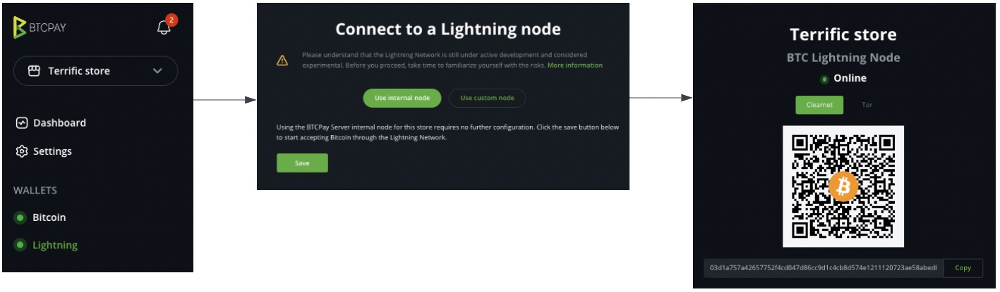

# Chaguo za Usanidi wa Mtandao wa Lightning

Kwenye ukurasa huu tutakupa maelekezo ya ufungaji na/au kiungo kwenye nyaraka husika. Kwa mwonekano mpana zaidi kuhusu Mtandao wa Lightning na manufaa na hasara za chaguo tofauti, tafadhali angalia [muhtasari wetu wa Mtandao wa Lightning](/LightningNetwork/),

:::tip
Kama ungependa kuanza haraka na huna muda wa kusoma haya yote, angalia kutumia Itifaki ya SamRock kwa [usanidi wa pochi kiotomatiki](/SamRockProtocol/) kwako.
:::

Ruka moja kwa moja kwenye sehemu unayovutiwa nayo:
[[toc]]

## Kuunganisha pochi ya Lightning ya kukodisha (custodial)

Pochi za Lightning za kukodisha hukuruhusu kupokea malipo ya Lightning bila kuendesha nodi yako mwenyewe. Kuanzia wakati wa kuandika, BTCPay Server inasaidia ushirikiano na:

### Blink

Blink (zamani Galoy) hutoa pochi ya Lightning ya kukodisha yenye ubadilishaji kiotomatiki hadi stablecoins/fiat.

**Mwongozo wa usanidi:** [Blink BTCPay Server Plugin](https://dev.blink.sv/examples/btcpayserver-plugin)

### Strike

Strike hutoa malipo ya Lightning yenye ubadilishaji wa hiari hadi fiat currencies.

**Mwongozo wa usanidi:** [Strike BTCPay Server Plugin](https://github.com/rockstardev/strike-btcpayserver-plugin)

Kwa maelezo zaidi kuhusu chaguo za kukodisha na manufaa/hasara zao, ona [sehemu ya pochi ya kukodisha](/LightningNetwork/#using-a-custodial-walletservice) kwenye muhtasari wa Mtandao wa Lightning.

## Kutumia huduma ya kubadilisha (swapping)

Huduma za kubadilisha kama vile Boltz hukuruhusu kupokea malipo ya Lightning ambayo hubadilishwa kiotomatiki hadi Bitcoin kwenye mnyororo (on-chain) au Liquid Bitcoin (L-BTC).

### Boltz

Boltz hutumia kubadilishana kwa atomu kubadilisha malipo ya Lightning hadi Liquid BTC bila kuchukua udhibiti wa fedha zako.

**Mwongozo wa usanidi:** [Nyaraka za Boltz BTCPay Plugin](https://btcpay.docs.boltz.exchange/)

Kwa usanidi wa haraka wa kiotomatiki na Aqua Wallet, angalia [mwongozo wa Itifaki ya SamRock](/SamRockProtocol/).

Kwa maelezo zaidi kuhusu huduma za kubadilisha na manufaa/hasara zao, ona [sehemu ya huduma ya kubadilisha](/LightningNetwork/#using-boltz-swapping-service) kwenye muhtasari wa Mtandao wa Lightning.

## Kusanidi nodi yako mwenyewe ya Mtandao wa Lightning (kujitawala kabisa)

Mwongozo huu utakuonyesha jinsi ya kusanidi nodi ya Mtandao wa Lightning (LN) katika BTCPay Server na kukuelekeza kwenye misingi.

BTCPay Server kwa sasa inatoa utekelezaji huu wa Mtandao wa Lightning:

- [LND](https://github.com/lightningnetwork/lnd)
- [Core Lightning (CLN)](https://github.com/ElementsProject/lightning) (zamani c-lightning)
- [Eclair](https://github.com/ACINQ/eclair)

::: danger
Kabla ya kuendelea, tafadhali elewa kwamba kuendesha nodi za LN bado ni kigumu kwa kiasi fulani. Unahitaji kuhakikisha kuwa una nakala za akiba sahihi ili uweze kurejesha fedha.
Kutumia Mtandao wa Lightning kunaweza kuweka pesa zako kwenye hatari. Usitumie zaidi ya kile unachoweza kumudu kupoteza.
:::

Chukua muda kufahamu hatari zinazohusishwa na kutumia Mtandao wa Lightning.

Kama unachagua kuendesha Nodi ya Ndani ya Lightning katika BTCPay Server, zingatia:

1. Nodi yoyote ya LN hufanya kazi katika viwango viwili: **kwenye mnyororo (on-chain)** na **nje ya mnyororo (off-chain)**.
2. Utekelezaji wa LN wa uchaguzi wako utaunda pochi moto ya on-chain ambayo itatumika kulipia vituo vya malipo vya off-chain.
3. Hakikisha umehifadhi akiba ya **on-chain** hot wallet seed (angalia maelekezo hapa chini kwa utekelezaji binafsi).
4. Seed katika hatua #3 inaweza tu **kurudisha fedha za on-chain**, ingawa inahitajika kwa utendakazi wa off-chain.
5. Fedha za **off-chain** zilizofungwa kwenye vituo **haziwezi** kuhifadhiwa akiba kwa kutumia seed moja. Soma nyaraka zilizotolewa na utekelezaji wa LN uliochagua.
6. Njia za kurejeshwa kwa **off-chain** ziko chini ya utafiti na maendeleo makini. Kufuta BTCPay Server yako au uendeshaji usio salama wa mazingira ya kompyuta (k.m. uharibifu wa mfumo wa faili, funguo zilizoathiriwa) kunaweza kusababisha **upotezaji wa kudumu wa fedha**.
7. Tumia [skribti yetu ya akiba](/Docker/backup-restore/) kuhifadhi akiba mara kwa mara ya kielelezo chako cha BTCPay Server. Hii itakusaidia kurejesha fedha zako endapo kuna hitilafu.

Teknolojia inapokomaa na kuendelezwa, njia za kuhifadhi akiba sahihi zitakuwa rahisi kutekeleza katika BTCPay Server.
Kuanzia [v1.0.3.138](https://blog.btcpayserver.org/btcpay-lnd-migration/), LND ni utekelezaji pekee wa Mtandao wa Lightning unaoruhusu [uhifadhi wa akiba wa seed ya lightning na BTCPay Server](/FAQ/LightningNetwork/#where-can-i-find-recovery-seed-backup-for-my-lightning-network-wallet-in-btcpay-server).

### Kuchagua utekelezaji wa Mtandao wa Lightning

Kwanza, soma [hapa](/FAQ/LightningNetwork/#can-i-use-a-pruned-node-with-ln-in-btcpay) kuhusu kutumia nodi zilizopunguzwa (pruned) za Bitcoin na utekelezaji wa Mtandao wa Lightning kabla ya kusambaza.

Kwenye usanidi, utaweza kuchagua utekelezaji.

Kwa [sakinisho za kiolesura cha web kama vile kwenye LunaNode](/Deployment/LunaNode/), unaweza kuchagua utekelezaji kutoka kwenye menyu ya kushuka.
Kwa [njia nyingine za usambazaji](/Deployment/) za [docker](https://github.com/btcpayserver/btcpayserver-docker) unahitaji:

```bash
sudo su -
cd btcpayserver-docker
export BTCPAYGEN_LIGHTNING="implementationgoeshere"
. ./btcpay-setup.sh -i
```

- Kwa **Core Lightning (CLN)** tumia `export BTCPAYGEN_LIGHTNING="clightning"`
- Kwa **LND** tumia `export BTCPAYGEN_LIGHTNING="lnd"`
- Kwa **Eclair** tumia `export BTCPAYGEN_LIGHTNING="eclair"` NA `export BTCPAYGEN_ADDITIONAL_FRAGMENTS="opt-txindex"`

Hatimaye, ili kuanza kutumia LN, blockchain yako inahitaji kuwa imesawazishwa kikamilifu.

### Kuunganisha Nodi yako ya Ndani ya Lightning

Bila kujali utekelezaji wa LN uliosambazwa, mchakato wa kuunganisha Nodi yako ya Ndani ya Lightning katika BTCPay Server ni sawa.

1. Chagua duka
2. Nenda kwenye "Lightning" > Chagua "Use internal node"
3. Bonyeza "Save" > Ione ujumbe wa "BTC Lightning node updated."
4. Nenda kwenye "Public Node Info" > Nodi inapaswa kuonekana **"Online"**



Kama muunganisho wa ndani unashindwa, thibitisha:

1. Nodi ya Bitcoin kwenye mnyororo imesawazishwa kikamilifu
2. Nodi ya ndani ya lightning ime"Enabled" chini ya "Lightning" > "Settings" > "BTC Lightning Settings"

Kama huwezi kuunganisha nodi yako ya Lightning, jaribu [kuwasha seva yako upya](/FAQ/ServerSettings/#how-to-restart-btcpay-server) au kupitia [mwongozo wetu wa utatuzi](/Troubleshooting/). Hutaweza kupokea malipo ya lightning katika duka lako mpaka nodi yako ya Lightning itaonekana "Online". Jaribu kupima muunganisho wako wa Lightning kwa kubonyeza kiungo cha "Public Node Info".

### Kuunganisha Nodi ya Nje ya Lightning katika BTCPay Server

BTCPay Server hutoa chaguo la kuunganisha nodi ya nje ya Lightning. Kusanyi:

1. Nenda kwenye "Lightning" > Chagua "Use custom node" ikiwa hakuna nodi ya Lightning iliyosanidiwa.
2. Nenda kwenye "Lightning" > Chagua "Settings" > Chagua "Change connection" > Chagua "Use custom node" kurekebisha muunganisho uliopo
3. Ongeza maelezo ya usanidi yanayolingana na utekelezaji wa lightning unaotumiwa, bonyeza "Test connection"
4. Ikifanikiwa, bonyeza "Save" > Ione ujumbe wa "BTC Lightning node updated.".

::: tip
Kama tayari unatumia [AlbyHub](https://getalby.com/) unaweza kutumia msaada wa muunganisho wa LNDHub kuunganisha pochi yako ya BTCPay moja kwa moja kwenye akaunti yako ya Alby. Kwa kuwa AlbyHub inasaidia akaunti ndogo, unaweza kuitumia sawa na plugin maarufu ya LNBank iliyokomeshwa. Jifunze zaidi kuhusu [jinsi ya kuunganisha pochi yako ya BTCPay kwa Alby](https://guides.getalby.com/user-guide/v/alby-account-and-browser-extension/alby-lightning-account/connect-your-alby-lightning-account-to-other-apps/connect-to-btcpay-server).
:::

### Kuanza na BTCPay Server na LND

#### Kudhibiti LND yako kwa kutumia Ride The Lightning (RTL)

Njia rahisi zaidi ya kutumia utekelezaji wa LND na BTCPay Server ni kutumia huduma ya **[Ride The Lightning](https://github.com/Ride-The-Lightning/RTL)** (RTL). Kiolesura cha web kwa Mtandao wa Lightning, RTL hukuruhusu kuendesha nodi yako bila kuacha BTCPay Server, kutoka kwenye kivinjari chako.

Ili kuanzisha RTL katika BTCPay Server, nenda kwenye Server Settings > Services > Ride The Lightning > Ione habari.

#### Kudhibiti LND yako kwa kutumia Zeus

Kwa udhibiti wa mbali wa nodi yako ya LN na simu yako, unaweza kutumia [ZEUS](https://docs.zeusln.app/for-users/remote-connections/btcpay/)

#### Kudhibiti LND kupitia amri-msingi: lncli

LND inaweza kufikiwa kupitia amri-msingi kwa kutumia skribti ya shell `bitcoin-lncli.sh`.

Kama uko kwenye Docker, hakikisha uko kwenye saraka ya Docker.

```bash
sudo su -
cd btcpayserver-docker
./bitcoin-lncli.sh $command
./bitcoin-lncli.sh getinfo #show info about the node
```

Endesha `./bitcoin-lncli.sh --help` kuona orodha kamili ya amri au angalia [nyaraka kamili za API](https://api.lightning.community/).

### Kuanza na BTCPay Server na Core Lightning (CLN)

#### Kudhibiti CLN yako kwa kutumia Ride The Lightning (RTL)

Njia rahisi zaidi ya kutumia utekelezaji wa CLN na BTCPay Server ni kutumia huduma ya **[Ride The Lightning](https://github.com/Ride-The-Lightning/RTL)** (RTL). Kiolesura cha web kwa Mtandao wa Lightning, RTL hukuruhusu kuendesha nodi yako bila kuacha BTCPay Server, kutoka kwenye kivinjari chako.

Ili kuanzisha RTL katika BTCPay Server, nenda kwenye Server Settings > Services > Ride The Lightning > Ione habari.

#### Kudhibiti CLN yako kwa kutumia Zeus

Kwa udhibiti wa mbali wa nodi yako ya LN na simu yako, unaweza kutumia [ZEUS](https://docs.zeusln.app/for-users/remote-connections/btcpay/)

#### Kudhibiti CLN yako kupitia amri-msingi: lightning-cli

Sawa na `lncli`, CLN inaweza kufikiwa kupitia amri-msingi kwa kutumia skribti ya shell `bitcoin-lightning-cli.sh`.

Kama uko kwenye Docker, hakikisha uko kwenye saraka ya Docker.

```bash
sudo su -
cd btcpayserver-docker
./bitcoin-lightning-cli.sh $command
./bitcoin-lightning-cli.sh getinfo #show info about the node
```

Endesha `./bitcoin-lightning-cli.sh help` kuona orodha kamili ya amri au angalia [nyaraka kamili za API](https://lightning.readthedocs.io/).

### Uhifadhi wa akiba wa Nodi ya Lightning

Kabla ya kuanza kufanya miamala kwa kutumia nodi yako mpya ya lightning, zingatia kuhifadhi akiba ya pochi ya **on-chain**. Hatua:

1. **kwa LND**: kuhifadhi nakala ya seed ya LND.
   Nenda kwenye "Server Settings" > "Services" > "LND Seed Backup" na uchague "See information"
2. **kwa CLN**: kuhifadhi nakala ya [hsm_secret](https://lightning.readthedocs.io/BACKUP.html#hsm-secret)

   $LIGHTNINGDIR ya CLN iko katika `/var/lib/docker/volumes/generated_clightning_bitcoin_datadir/_data/bitcoin`

Kiri mapungufu ya uhifadhi wa akiba wa vituo vya malipo vya **off-chain** na hatari zinazohusiana.

Ona [FAQ ya uhifadhi wa akiba](/Docker/backup-restore/#lightning-channel-backup) kama unaendesha kielelezo cha BTCPay Server na Docker, na [FAQ ya Mtandao wa Lightning](/FAQ/LightningNetwork/#where-can-i-find-recovery-seed-backup-for-my-lightning-network-wallet-in-btcpay-server) kwa habari kuhusu uhifadhi wa akiba wa seed.

### Kusimamia ukwasi kupitia Mtoa Huduma wa Lightning (LSP)

Unaweza kupokea ukwasi wa kuingia kwa mikono kutoka kwa LSPs kama vile [LNBIG](https://lnbig.com/#/), [Lightning Network+](https://lightningnetwork.plus/), [Megalithic](https://megalithic.me/), [Zeus LSP](https://channels.zeuslsp.com/), [LN Server](https://lnserver.com/) au unaweza kusakinisha [plugin ya LSPS](https://plugin-builder.btcpayserver.org/public/plugins/get-lightning-channel) kutoka kwa Megalith.

#### Pata ukwasi wa kuingia kutoka LNBig.com

LNBig.com ni huduma inayokuruhusu kupokea ukwasi wa kuingia. Katika mwongozo huu nitakuelekeza kwenye mchakato mzima.

[](https://www.youtube.com/watch?v=8rJAxm0rwdw)

#### Plugin ya LSPS

Sakinisha [plugin ya LSPS](https://plugin-builder.btcpayserver.org/public/plugins/get-lightning-channel) kutoka kwa Megalith kwa kutumia [mwongozo huu](https://github.com/MegalithicBTC/BTCPayserver-LSPS1/blob/master/README.md) inayosaidia LSPs nyingi unazoweza kuchagua.

Au kama unapendelea mwongozo wa video, angalia hapa:
[](https://www.youtube.com/watch?v=WzpXopwZY9U)

### Simamia ukwasi kwa mikono (usimamizi wa vituo)

Kuandaa nodi yako ya Lightning iliyotumibwa hivi karibuni ili iweze kutuma na kupokea malipo kunahitaji hatua kadhaa. Sehemu hii itakuelekeza kupitia kuweka fedha nodi yako, kufungua vituo vya malipo, na kusimamia ukwasi.

#### Kuelewa vituo vya malipo na ukwasi

Kabla ya kuingia kwenye hatua za kiufundi, ni muhimu kuelewa dhana kuu:

**Muhtasari wa mchakato:**

1. Nodi ya lightning imetumibwa, imewezeshwa na pochi yake ya on-chain imejiwa fedha
2. Mwenza anatambuliwa na kituo cha kwanza cha malipo kinafunguliwa
3. Ukwasi wa kuingia na wa kutoka hupatikana. Nodi hiyo sasa inaweza k**utuma** na **kupokea**
4. Usimamizi wa ukwasi, mchakato unaoendelea wa kudumisha uwezo wa k**utuma** na **kupokea**

**Mazingatio muhimu:**

- **Kuchagua mwenza wa kituo**: Zingatia kufungua kituo cha kwanza kwa mwenza aliyeunganishwa vyema na mwenye muda mzuri wa upatikanaji. Hii itaongeza nafasi za malipo yako kuelekezwa na kusuluhishwa.
- **Uwezo wa kuingia dhidi ya wa kutoka**: Uwezo wa kutoka unaruhusu nodi **kutuma** malipo wakati uwezo wa kuingia unaruhusu nodi **kupokea** malipo. Kama mfanyabiashara anayetumia lightning, kuwa na uwezo wa kuingia ni muhimu ili wateja waweze kukulipa.
- **Uwezo wa kuingia**: Nodi huongeza uwezo wa kuingia kwa kutumia sats kutoka kwenye salio lake la ndani au kuwa na nodi zingine kwenye mtandao kufungua vituo kwake.
- **Usimamizi wa ukwasi**: Kudumisha uwezo wa kutuma na kupokea ni mchakato unaoendelea ambapo usawa kati ya uwezo wa kuingia dhidi ya wa kutoka unapaswa kudumishwa katika vituo vya malipo. Usambazaji huu wa uwezo lazima urekebishwe kulingana na matumizi ya mwendeshaji wa nodi.
- **Watoa Huduma wa Lightning**: LSPs hutoa huduma za mtu wa tatu za kulipiwa zinazoboresha urahisi wa kuendesha nodi ya mtandao wa lightning. Huduma kama hizo zinaweza kutumika kupata uwezo wa kuingia au kugharimika mchakato wa kusawazisha upya. Ona [sehemu ya LSP](/LightningNetwork/#using-liquidity-service-providers-lsps) kwa maelezo zaidi.

**Nyenzo za ziada kwa uelewa wa kina:**

- [Wenza wazuri kwenye LN](https://docs.lightning.engineering/the-lightning-network/the-gossip-network/identify-good-peers)
- [Aina za nodi za Lightning](https://bitcoin.design/guide/how-it-works/nodes/#lightning-nodes)
- [Ukwasi wa Lightning ni nini?](https://bitcoin.design/guide/how-it-works/liquidity/)
- [Jinsi ya kupata uwezo wa kuingia?](https://lightningnetwork.plus/posts/234)
- [Jinsi ya kusimamia ukwasi?](https://docs.lightning.engineering/the-lightning-network/liquidity/manage-liquidity#rebalancing-channels)
- [Watoa huduma wa Lightning (LSP)](https://bitcoin.design/guide/how-it-works/lightning-services/)

#### Kuweka fedha kwenye pochi yako ya on-chain

Sasa kwa kuwa nodi yako ya lightning inafanya kazi, kabla ya kufungua vituo vya malipo ya lightning, utahitaji kuweka fedha kwenye pochi ya on-chain.

Mchakato wa kuweka fedha za on-chain unaweza kufanywa kwa njia mbili:

**Chaguo 1: Kupitia kiolesura cha Ride The Lightning (RTL)**

- Chagua "Store" na nenda kwenye sehemu ya "Lightning"
- Chini ya "Services", chagua "Ride The Lightning"
- Katika programu ya RTL, nenda kwenye "On-chain", chagua "Receive" chini ya menyu ya "On-chain Transactions"
- Chagua "Generate Address" na uitumie kama anwani ya lengwa ya fedha zilizotengwa

**Chaguo 2: Kupitia amri-msingi**

Kwa kutumia `bitcoin-lncli.sh` au `bitcoin-lightning-cli.sh`:

```bash
sudo su -
cd btcpayserver-docker
./bitcoin-lncli.sh newaddress p2wkh #for LND
./bitcoin-lightning-cli.sh newaddr  #for CLN
{
   "address" / "bech32": "bc1..........." #use this as the destination for the allocated funds
}
```

#### Kufungua kituo chako cha kwanza cha malipo

Mara tu nodi yako ya lightning ya on-chain imejiwa fedha, ni wakati wa kuunganisha kwenye nodi nyingine kwenye mtandao na kufungua vituo vya malipo.

**Kwa kutumia Ride The Lightning (RTL):**

1. Katika RTL, nenda kwenye "Lightning" > "Peers/Channels"
2. Bonyeza "Open Channel"
3. Weka URI ya nodi ya mwenza (pubkey@host:port) au tafuta nodi iliyounganishwa vyema
4. Bainisha kiasi cha kituo (katika satoshis)
5. Thibitisha na subiri kituo kithibitishwe kwenye mnyororo

**Kwa kutumia amri-msingi:**

Kwa LND:
```bash
./bitcoin-lncli.sh connect <pubkey>@<host>:<port>
./bitcoin-lncli.sh openchannel <pubkey> <amount_in_satoshis>
```

Kwa CLN:
```bash
./bitcoin-lightning-cli.sh connect <pubkey>@<host>:<port>
./bitcoin-lightning-cli.sh fundchannel <pubkey> <amount_in_satoshis>
```

::: tip
Kama mfanyabiashara, utahitaji **ukwasi wa kuingia** kupokea malipo. Baada ya kufungua kituo, salio lako liko 100% upande wako (wa kutoka pekee). Ili kuunda uwezo wa kuingia, unaweza:
- Kutoa sats kadhaa kupitia kituo
- Kwa kutumia huduma ya kubadilisha submarine kama [Boltz](https://boltz.exchange) kubadilisha Lightning kuwa BTC ya on-chain
- Kwa kutumia huduma ya LSP kuwa na vituo kufunguliwa kwa nodi yako
- Jiunge na dimbwi la kubadilishana ukwasi kama [Lightning Network+](https://lightningnetwork.plus/)
:::

#### Kusimamia ukwasi unaoendelea

Usimamizi wa ukwasi wa Lightning ni mchakato unaoendelea. Kama mfanyabiashara anayepokea malipo, vituo vyako vitajaa pole pole upande wako, kupunguza uwezo wako wa kupokea malipo zaidi.

**Mikakati ya kudumisha uwezo wa kuingia:**

1. **Submarine swaps**: Tumia huduma kama Boltz kubadilisha fedha za Lightning kurudi kwenye BTC ya on-chain, kukomoa uwezo wa kuingia
2. **Loop Out**: Kama unatumia LND, tumia [Lightning Loop](https://lightning.engineering/loop/) kuhamisha fedha kutoka Lightning hadi on-chain
3. **Kutumia**: Tumia salio lako la Lightning kulipa ankara, jambo linalounda uwezo zaidi wa kuingia kwa kawaida
4. **Kusawazisha vituo upya**: Tumia RTL au zana za amri-msingi kusawazisha fedha kati ya vituo. Kwa usawazishaji upya wa kiotomatiki, Lightning Loop inaungwa mkono katika RTL
5. **Huduma za LSP**: Tumia huduma za ukwasi za kiotomatiki zinazoshughulikia usimamizi wa vituo kwako (ona [sehemu ya LSP](/LightningNetwork/#using-liquidity-service-providers-lsps))

[Plugin ya LSPS](https://plugin-builder.btcpayserver.org/public/plugins/get-lightning-channel) inaweza kusaidia kuweka kiotomatiki baadhi ya mchakato huu moja kwa moja kutoka BTCPay Server.