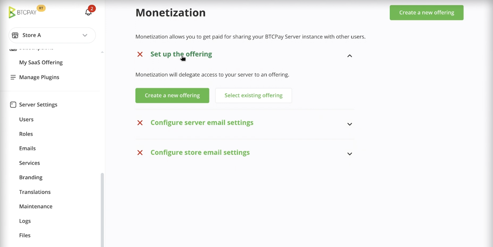
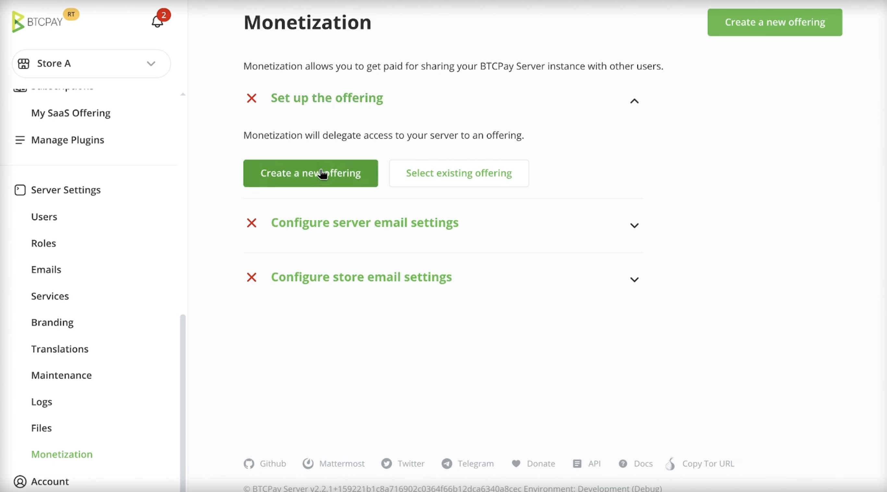
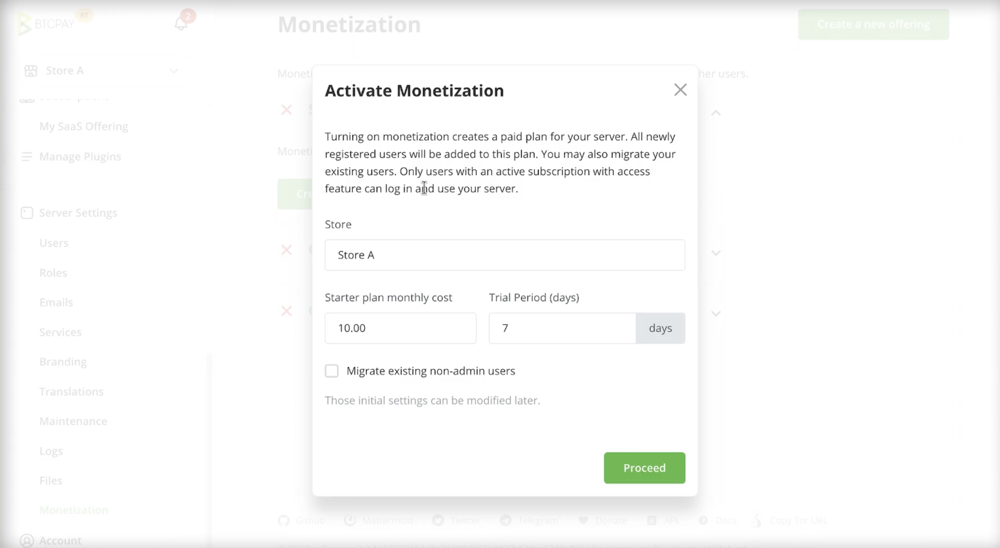
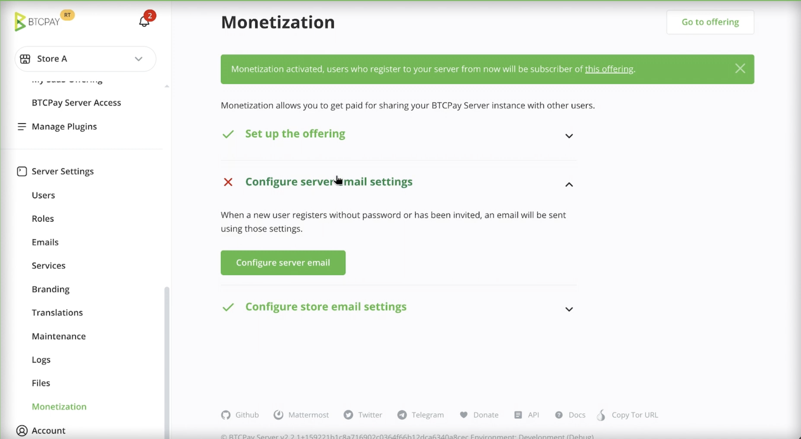
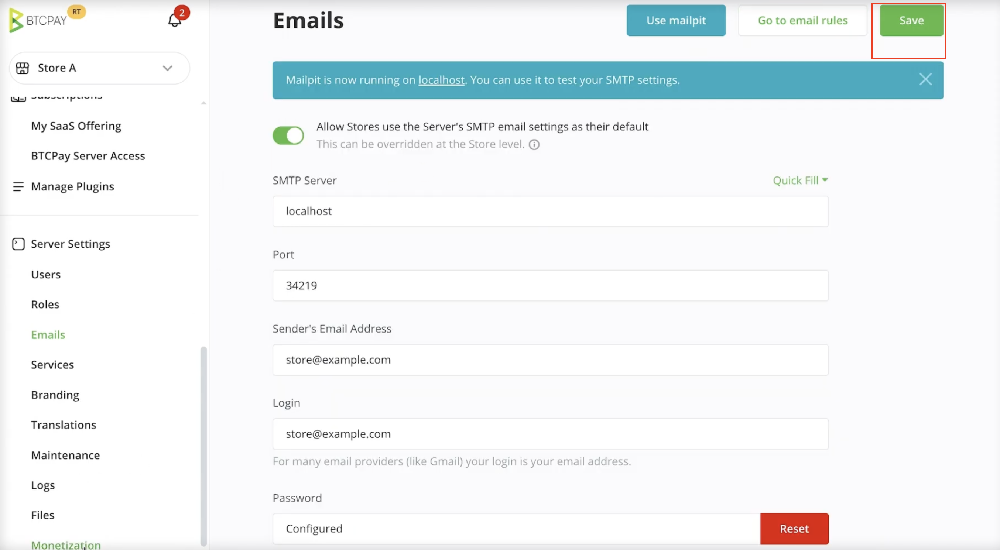
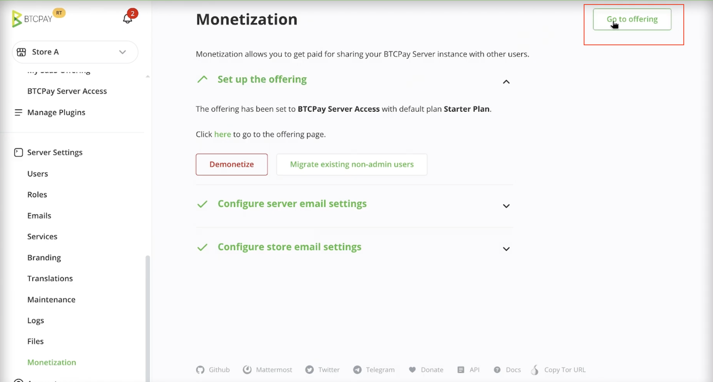
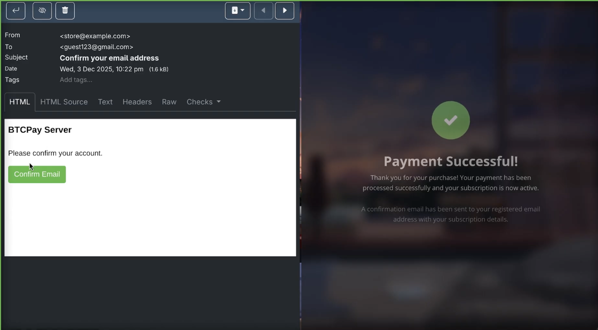
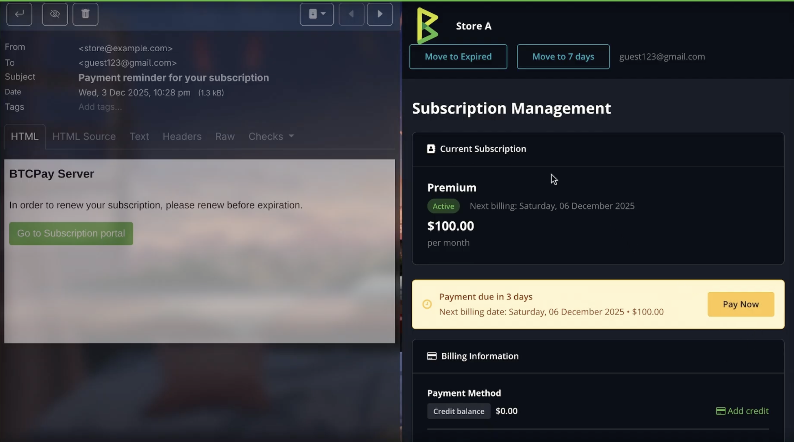
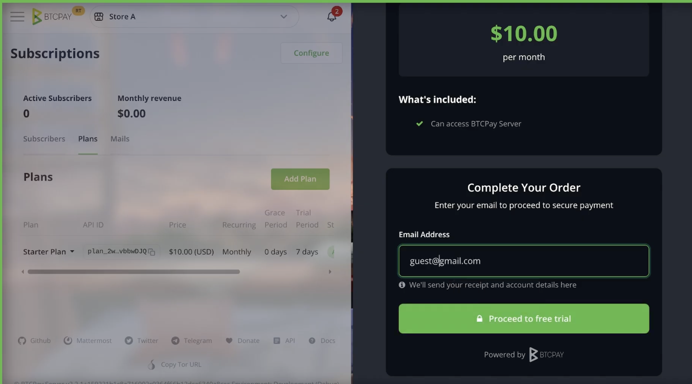
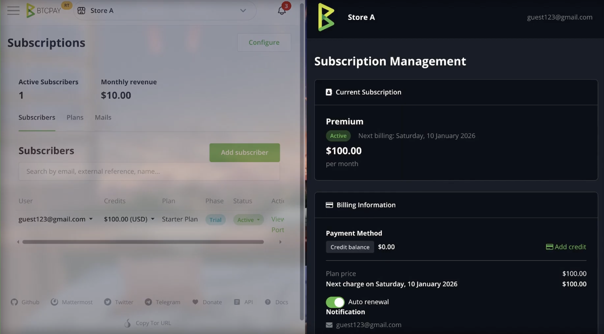

# Uchumaji Mapato

Uchumaji mapato unamwezesha msimamizi wa BTCPay Server kuwatoza watumiaji wa mfano wao wa BTCPay Server kwa kutumia mfumo wa [Usajili](/sw/Subscriptions) uliojengwa ndani. Unakusudiwa kwa waendeshaji wanaoweka BTCPay Server kwa wengine na wanataka kutoza kwa ufikiaji wa seva, matengenezo au usaidizi wa kiufundi.

Uchumaji mapato unapatikana kuanzia **BTCPay Server v2.3.0**.

## Kuwezesha uchumaji mapato

1. Nenda kwenye **Server Settings > Maintenance**  
2. Chagua **Monetization**  
3. Bofya **Create a new offering**  
4. Sanidi duka chaguo-msingi ambalo fedha zitaenda  
5. Sanidi bei na kipindi cha majaribio  
6. Kwa hiari, ikiwa una watumiaji kwenye seva yako, unaweza kuhamisha watumiaji wote wasio wasimamizi kwenda kwenye mfano wa usajili.  
7. Bofya **Proceed**.  
8. Ikiwa haujasanidi SMTP ya barua pepe, utaombwa kufanya hivyo. **Bofya Configure Server Email na ujaze maelezo yako ya SMTP.**  
9. Ikiwa unataka kubinafsisha mipango yako ya usajili wakati wowote, bofya kwenye **Go to Offering** kwenye kona ya juu kulia.

## Uchumaji mapato unafanyaje kazi?

Uchumaji mapato unapowezeshwa, BTCPay Server kiotomatiki:

* Inaunda toleo na mpango chaguo-msingi wa usajili (ambao unaweza kusanidiwa baadaye)  
* Inawezesha udhibiti wa ufikiaji unaotegemea usajili kwa akaunti za watumiaji  
* Inabadilisha mtiririko wa kawaida wa usajili na malipo ya usajili  
* Inasanidi mapema arifa za msingi za barua pepe (ikiwa SMTP ya Seva imesanidiwa)

Watumiaji wanaojiandikisha kwenye BTCPay Server yako, sasa watalazimika kwanza kupitia malipo ya usajili. Mtiririko ni kama ifuatavyo:

* Mtumiaji anajiandikisha kwenye BTCPay Server  
* Mtumiaji anaenda kwenye Malipo ya Usajili ambapo anaweza kuchagua mpango, na kuongeza barua pepe yao.  
* Watapokea maelezo ya usajili kwenye barua pepe yao

## Ufikiaji wa mtumiaji na bili

* Usajili amilifu unatoa ufikiaji wa akaunti ya BTCPay Server  
* Usajili uliomalizika au uliosimamishwa unazima ufikiaji  
* Watumiaji wanaweza daima kufikia tovuti ya bili kusasisha au kuongeza fedha, hata ikiwa ufikiaji wa akaunti yao umezimwa  
* Barua pepe za kiotomatiki zitatumwa kwa watumiaji kuwakumbusha kuhusu malipo ya mara kwa mara  
* Watumiaji wanasimamia bili kupitia ukurasa wa **Manage billing** katika akaunti yao au kiungo kilichopokelewa kupitia barua pepe ya kiotomatiki

Mtiririko mzima unaweza kubinafsishwa sana. Ikiwa unataka kufanya zaidi ya kile kilichosanidiwa mapema, angalia [nyaraka zetu za usajili](/sw/Subscriptions).

## Vidokezo na vikwazo

* Bili inayotegemea mapato bado haipatikani  
* Udhibiti wa hali ya juu wa ruhusa umepangwa kwa matoleo yajayo  
* Hiki ni kipengele cha beta na maoni yako yanakaribishwa sana katika kukiunda zaidi
