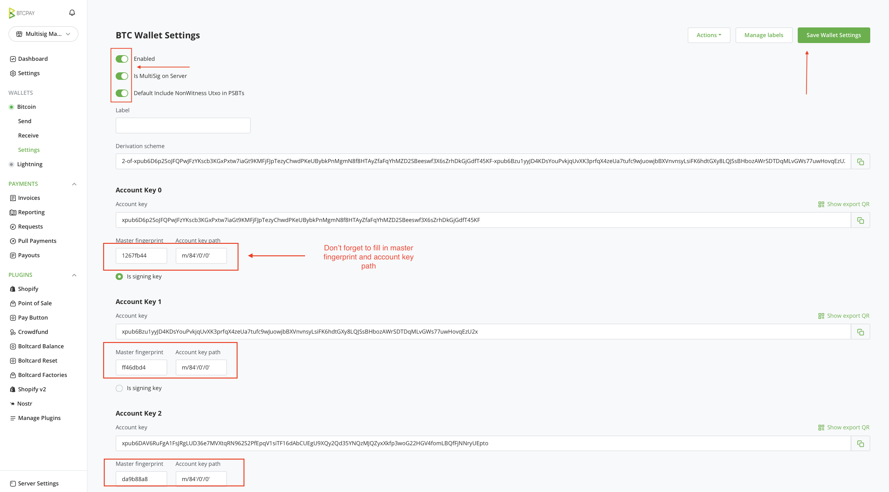
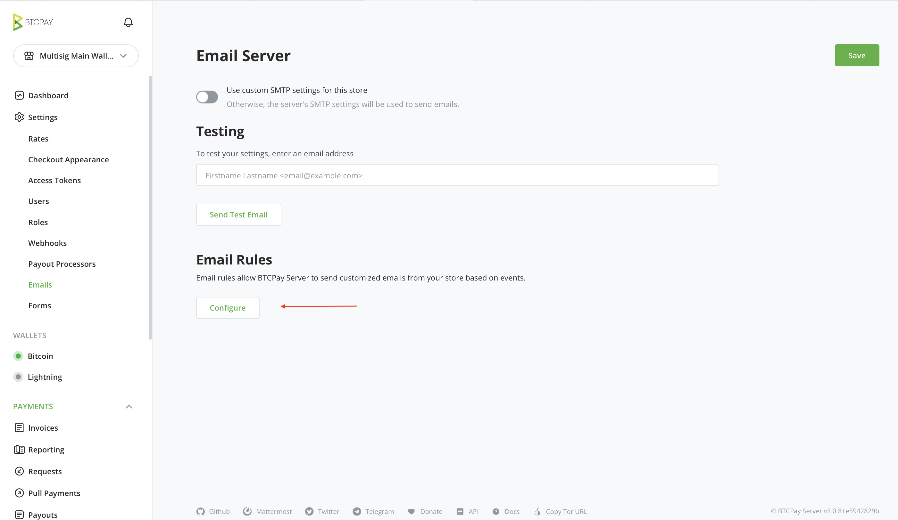
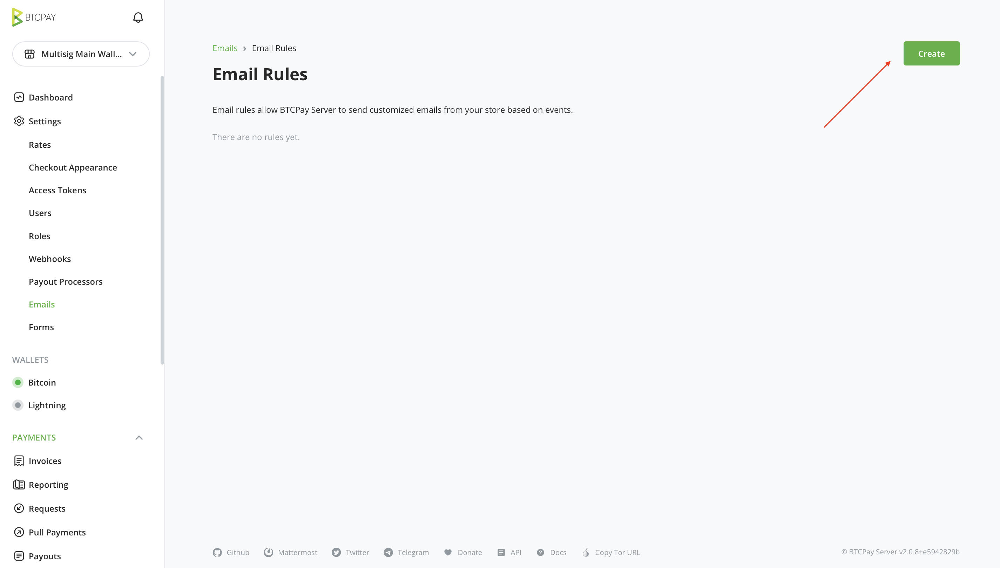
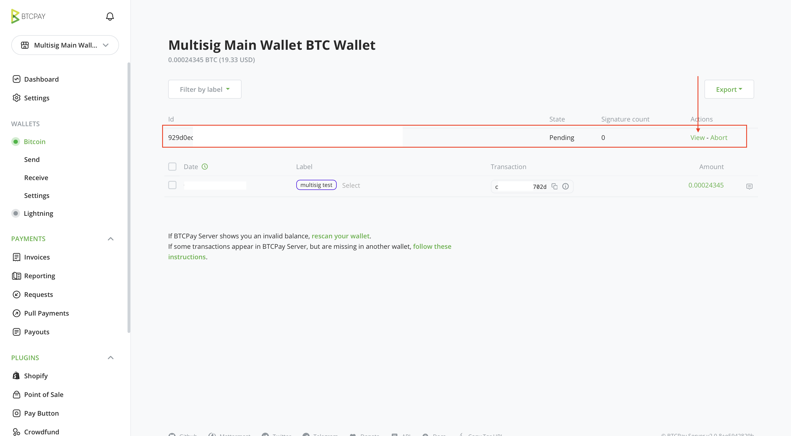
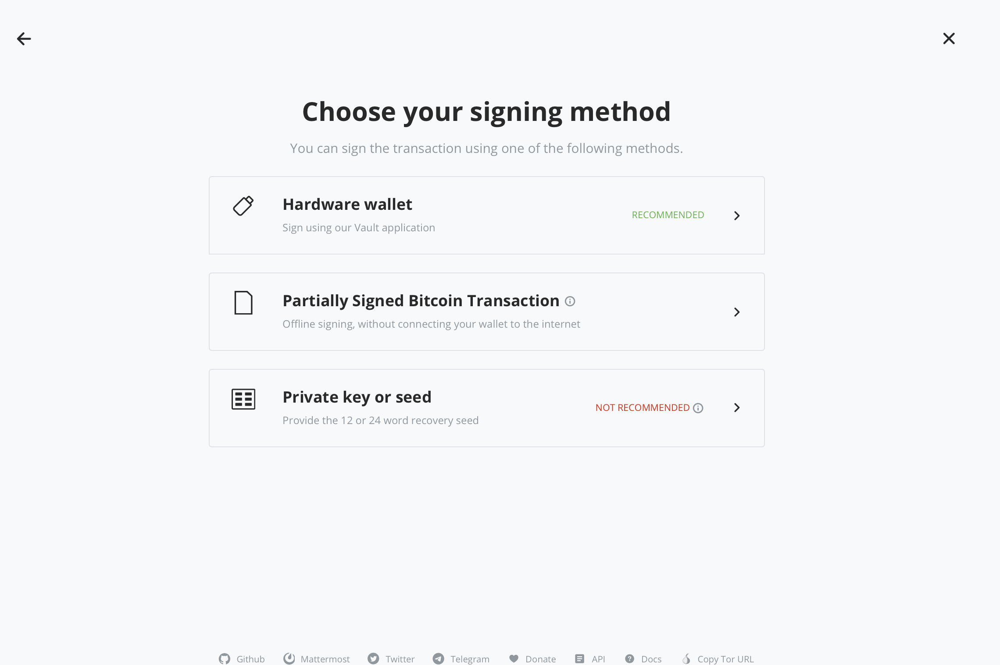
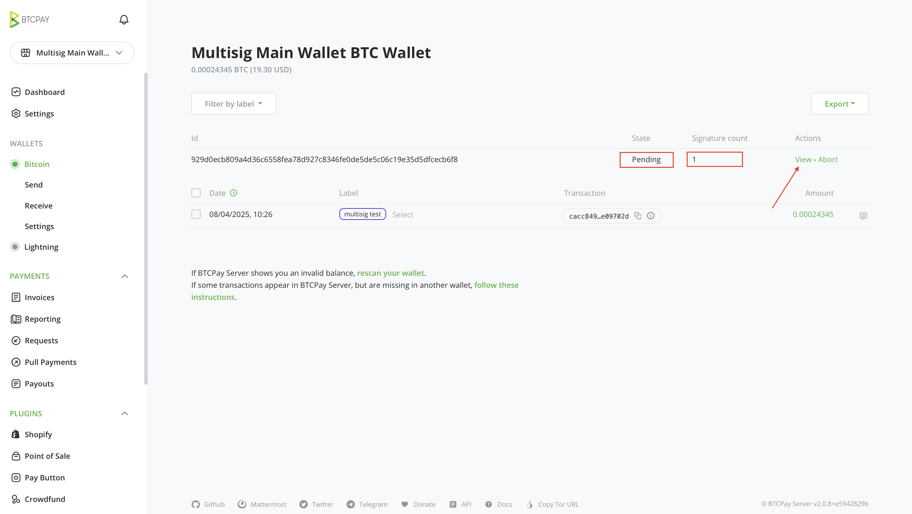
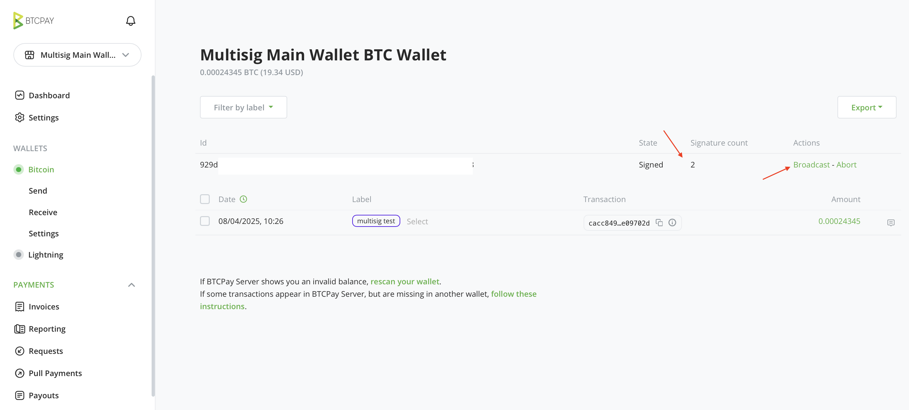
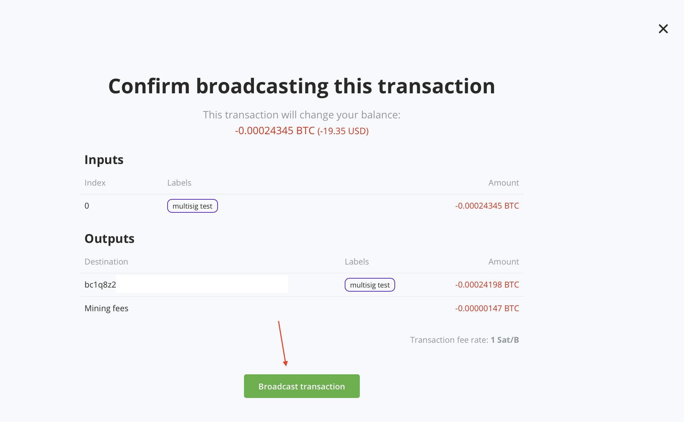

# Usaidizi wa MultiSig katika BTCPay Server

BTCPay Server v2.1.0 ilianzisha usaidizi ulioboreshwa wa pochi za sahihi nyingi (multisig) iliyoundwa kuwezesha usanidi wako kwa usalama wa ziada, ushirikiano, na unyumbufu.

Hati hii inatoa maelekezo ya hatua kwa hatua ya kusanidi na kutumia pochi za multisig ndani ya mfano wako wa BTCPay Server.

[](https://www.youtube.com/watch?v=V95pLvVTAqM)

## Muhtasari

Utendaji wa multisig katika BTCPay Server unawezesha:

- **Ulezi wa kushirikiana**: Unda pochi inayohitaji sahihi nyingi kuidhinisha kutangaza muamala.
- **Uratibu wa multisig unaojiendesha**: Udhibiti wa pamoja wa funguo za umma za kampuni na mtiririko wa kutia sahihi bila kutegemea mhusika wa tatu.
- **Usaidizi wa pochi ya maunzi**: Inafanya kazi vizuri na BTCPay Vault na inaoana na vifaa vingi vya kutia sahihi vya maunzi kukuwezesha kuidhinisha muamala kwa pochi ya maunzi.
- **Mfumo wa arifa**: Endelea kupata taarifa kwa arifa za barua pepe miamala inapoundwa, inaposubiri, (ikihitaji idadi ya kutosha ya sahihi), na inapotangazwa.
- **Uingizaji na programu-jalizi**: Inafanya kazi na Vendor Pay na vipengele vya baadaye, kuwezesha malipo yanayotegemea multisig. Inaungana na Xpub Extractor, kuruhusu washiriki wote wa multisig kupata muundo ufaao kwa urahisi

## Mahitaji ya awali

Hakikisha vipengele vifuatavyo vimesakinishwa na kusanidiwa:

- Mfano wa BTCPay Server (v2.1 au baadaye)
- [BTCPay Vault](https://github.com/btcpayserver/BTCPayServer.Vault)
- [Programu-jalizi ya XpubExtractor](https://github.com/btcpayserver/BTCPayServer.Plugins.XpubExtractor) (ikiwa unasanidi pochi ya maunzi)

## Hatua ya 1: Kusanya Funguo za Umma Zilizopanuliwa

Ifuatayo inaeleza jinsi ya kupata funguo ya umma inayohitajika kutoka kwenye [pochi ya maunzi](https://docs.btcpayserver.org/HardwareWalletIntegration/). Ikiwa unatumia pochi ya programu, unaweza kuendelea hadi hatua ya 2.

1. Nenda kwenye `Manage Plugins` na uthibitishe kuwa **XpubExtractor** imesakinishwa na kuchapishwa na *RockstarDev*.
2. Unganisha pochi ya maunzi na uzindue [BTCPay Vault](http://docs.btcpayserver.org/HardwareWalletIntegration/).
3. Tumia kazi ya `Fetch Xpub` kupata:
   - Funguo ya umma iliyopanuliwa (xpub)
   - Alama ya vidole ya mzizi
   - Njia ya utohozi
4. Hifadhi data kwa ajili ya pochi.

Mfano wa thamani:

```
xpub6CUGRUonZSQ4TWtTMmzXdrXDtypWKiKp5KUMRmD9YgoWDbEVpLFgje71pRAVBPX6DCmV9HNTLr8GHqKZANvNcFpSZe3kiKsH5Ej7ApG1NVDK
Root Fingerprint: abcdef21
Key Path: 48'/0'/0'/0'
```
### Kualika Watiaji Sahihi Wengine

1. Nenda kwenye `Settings` > `Users`.
2. Ongeza anwani ya barua pepe ya kila mshiriki na ushiriki kiungo cha mwaliko kilichozalishwa moja kwa moja nao. Ikiwa una SMTP ya Barua Pepe kwenye seva yako, watapokea barua pepe ya mwaliko.
3. Waelekeze washiriki:
   - Kukubali mwaliko
   - [Kuunda Duka la BTCPay Server](https://docs.btcpayserver.org/CreateStore/)
   - Kutumia [XpubExtractor](https://github.com/rockstardev/BTCPayServerPlugins.RockstarDev/tree/1235799827c24d33bfe1095db5169afd39e620f1/Plugins/BTCPayServer.RockstarDev.Plugins.XpubExtractor) kutoa taarifa zao za xpub
4. Wanapaswa kuhifadhi data za pochi zao na kushiriki nawe.

Tafadhali kumbuka kuwa, kwa sasa, lazima uwaalike watumiaji kama `Owners` wa Duka. Tunapanga kutekeleza majukumu na ruhusa za ziada katika siku zijazo ili kupunguza kipengele cha uaminifu kwa wale unaowaalika kwenye duka la multisig. Unaweza [kufuatilia hali ya utekelezaji huu kwenye GitHub](https://github.com/btcpayserver/btcpayserver/issues/6651).

## Hatua ya 2: Unda Pochi ya Sahihi Nyingi

Baada ya kukusanya funguo zote za umma zinazohitajika, (mf., usanidi wa 2-kati-ya-3), endelea kama ifuatavyo:

1. Nenda kwenye `Bitcoin Wallets`.
2. Chagua `Connect an existing wallet` > `Enter extended public key`.
3. Chagua `Show multisig examples` na uweke xpub zilizokusanywa katika muundo unaohitajika.
4. Bofya `Continue` ili kuthibitisha na kuchunguza anwani zilizotoholewa. Unaweza kuthibitisha muonekano wa awali kupitia pochi ya programu ya nje, au kwa urahisi kwa kujaribu katika hatua ya mwisho ya hati hii.

Mfano wa multisig yako unaweza kuonekana kama huu:

```
2-of-xpub6BosLW1vGZLkCW7NrgUQdREa7i3a7XJXnAMQzA3aJCEuEt8hXNRu2yG6Vxq2YvCCu8n2eUpZhVz5Zw3eQro2d5Wq8UdD2qhM1YG4ZcnC3kYd-xpub6FHVXph13QMR77fUMLREpN2L7D1fCqcVtzsGhM28jUy5CWTpYHDuN6gvN5Gi5rxJjL45AgXLhSzE27AHZkDwKZgTYaUmYc9rBoF2tuAgf6M-xpub6CJ61yVNhtEtcpS7pU8Jjpd1NHgAG6xWv1NG4b47SvhhVVqfzFrHdcDUpm96B2ftov3qd5uoy6b7bEVcdxQwK6R7T5ndJP8vTWTdS6RBn7Jr
```

Hii inamaanisha sahihi 2 kati ya 3 zilizoorodheshwa zinahitajika kuidhinisha muamala. Unaweza pia kuweka 3 kati ya 5, na kadhalika.

Ifuatayo, rekebisha mipangilio ya pochi ili kuhakikisha utangamano sahihi na miundo mbalimbali na kutia sahihi kwa urahisi zaidi.

1. Nenda kwenye `Wallet Settings`.
2. Wezesha chaguo la `Multisig on Server`.
3. Ingiza `root fingerprint` na `derivation path` kwa kila funguo.
4. Wezesha `Include non-witness UTXO in PSBTs` kwa utangamano ulioimarishwa.
5. `Save` mabadiliko.



### (Si lazima) Kujaribu usanidi wa kupokea fedha

1. Kutoka kwenye duka kuu la multisig, kwenye upau wa pembeni, bofya `Bitcoin > Receive`
2. Weka lebo kwenye anwani (mf. "Test")
3. Tuma kiasi kidogo cha Bitcoin kuthibitisha usanidi
4. Kwa hiari unaweza kuingiza multisig kwenye programu tofauti kuthibitisha upokeaji unafanya kazi.

## 3. Sanidi arifa za barua pepe

Hatua hii inahakikisha washiriki wote wanapokea barua pepe wakati muamala mpya unapoundwa, unapohitaji sahihi yao na hatimaye unapotangazwa kwa mafanikio.

Ili washiriki wapokee masasisho kuhusu shughuli za multisig, lazima usanidi [kanuni maalum za barua pepe](https://docs.btcpayserver.org/Notifications/#email-rules).





1. Nenda kwenye `Store Settings > Emails > Email Rules`
2. Bofya kwenye `Configure` kisha `Create`
3. Kutoka kwenye menyu kunjuzi ya `Trigger`, chagua `Pending Transaction Created` na ongeza anwani za barua pepe za washiriki wa multisig, zikitenganishwa kwa koma: `email1@test.com, email2@test.com, email3@test.com`
4. Jisikie huru kurekebisha Mwili na Maandishi chaguo-msingi kulingana na upendavyo.
5. Ukimaliza, bofya `Save`

Rudia hatua ya 3 hadi 5 kwa vichochezi viwili zaidi: `Signature Collected` na `Transaction Broadcasted`

## Hatua ya 4: Tuma muamala kutoka kwenye pochi ya multisig

1. Nenda kwenye pochi yako ya multisig
2. Ingiza anwani ya mpokeaji na kiasi
3. Bofya `Create Pending Transaction`
4. Washiriki sasa watapokea barua pepe ikiwa ulifuata Hatua ya 3, ikiwahimiza kutia sahihi muamala na pochi yao.


## Hatua ya 5. Kutia sahihi muamala wa multisig:

Sasa kwa kuwa muamala umeundwa, washiriki watalazimika kutia sahihi (kuidhinisha) na pochi yao ya maunzi.

1. Katika orodha ya miamala ya pochi ya duka kuu la sahihi nyingi, mshiriki ataona muamala unaosubiri.
2. Bofya kwenye `View`
3. Ikiwa unatia sahihi kwa pochi ya maunzi, unganisha pochi yako ya maunzi na hakikisha `BTCPay Vault` inaendeshwa
4. Bofya `Sign`
5. Fuata maagizo ya skrini na kifaa `kutia sahihi muamala`







Washiriki wengine wanapaswa kufuata hatua zile zile. Mara idadi inayohitajika ya sahihi itakapokusanywa, bofya Broadcast kutangaza muamala.





Hongera! Umetuma muamala wako wa kwanza wa multisig kwa kutumia BTCPay Server.
