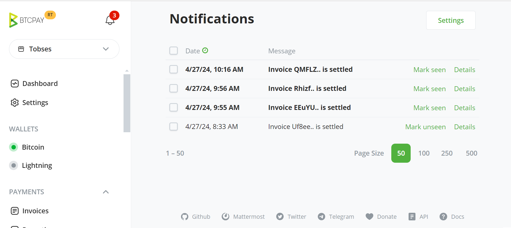
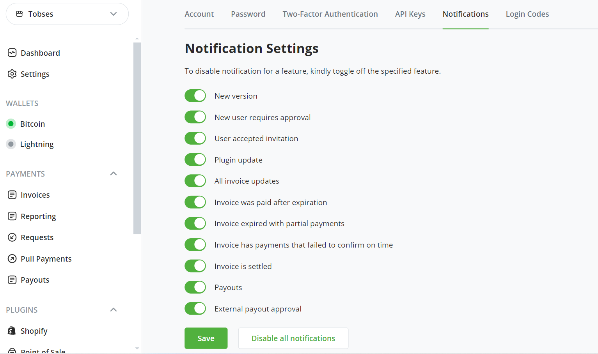
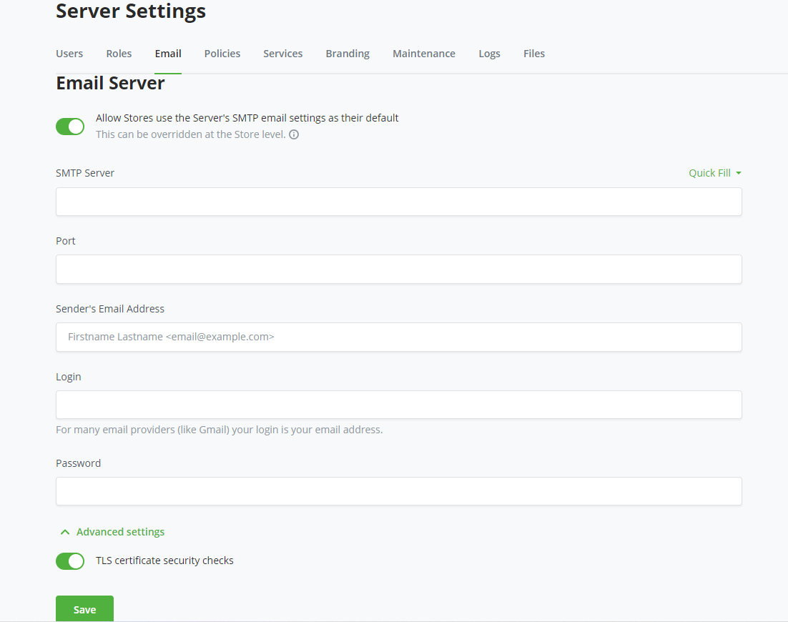
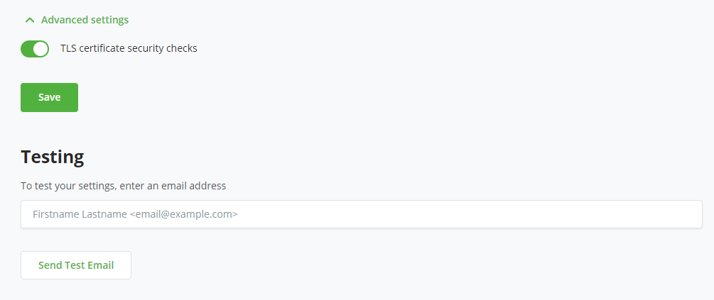
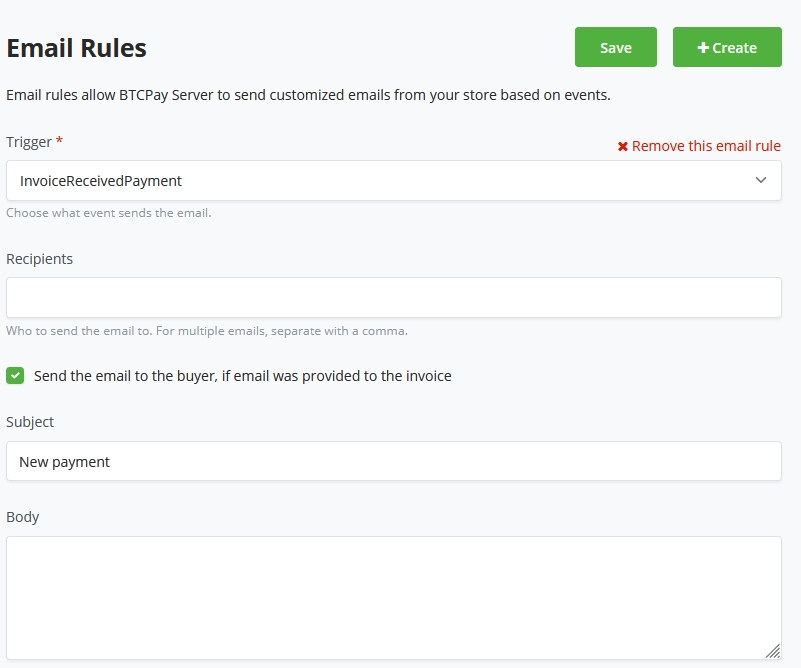

# Arifa

Arifa za kufuatilia matukio ya BTCPay Server zinaweza kusanidiwa kwa njia kadhaa tofauti.

- [Tahadhari za Arifa](#tahadhari-za-arifa)
- [SMTP ya Kiwango cha Seva (Barua Pepe)](#barua-pepe-za-seva)
- [SMTP ya Kiwango cha Duka (Barua Pepe)](#barua-pepe-za-duka)
- [Webhooks za Kiwango cha Duka](https://docs.btcpayserver.org/API/Greenfield/v1/#tag/Webhooks)

## Tahadhari za Arifa

Bonyeza ikoni ya arifa kwenye kichwa kikuu ili kuona arifa za sasa. Ukurasa wa arifa unaonyesha hali ya arifa zote za sasa kama vile matukio ya ankara, malipo, masasisho ya toleo, n.k. Arifa zinaweza kutiwa alama kama zimeonekana kutoka kwenye orodha kunjuzi ya arifa au ukurasa wa arifa.



Kila mtumiaji aliyesajiliwa kwenye seva anaweza kudhibiti arifa anazopokea.



## Barua Pepe za Seva

Barua pepe zinaweza kutumwa kutoka kiwango cha seva cha BTCPay. Hizi ni [barua pepe za mtumiaji](#barua-pepe-za-mtumiaji). Waadministrata wanaweza kusanidi SMTP ya seva katika:

Server Settings > Email server > [Usanidi](#usanidi-wa-barua-pepe-smtp)

## Barua Pepe za Duka

Barua pepe zinaweza kutumwa kutoka kiwango cha duka cha BTCPay. Barua pepe hizi ni za matukio yanayohusiana na duka kama vile ankara. Watumiaji wanaweza kusanidi SMTP ya duka katika:

Store Settings > General Settings > Services > Email > [Usanidi](#usanidi-wa-barua-pepe-smtp)

### Usanidi wa Barua Pepe SMTP

Tumia orodha kunjuzi ya mipangilio ya Quick fill kwa vigezo vya kawaida vya usanidi wa mteja wa barua pepe. Jitumie barua pepe ya majaribio kutoka ukurasa uleule ili kuthibitisha vigezo vyako vya usanidi vinafanya kazi vizuri.





Kila mteja wa barua pepe anaweza kuwa na mahitaji tofauti ya kusanidi SMTP. Kwa maelezo zaidi tazama [Maswali Yanayoulizwa Mara kwa Mara ya SMTP](./FAQ/ServerSettings.md#how-to-configure-smtp-settings-in-btcpay) au rejea nyaraka za mtoa huduma wako wa barua pepe.

# Barua Pepe za Mtumiaji

Kuna barua pepe mbalimbali za mtumiaji zilizojengwa ndani ya BTCPay Server yako kuwasiliana na watumiaji wako.

:::warning
Barua pepe za mtumiaji zitatumwa tu kama SMTP imewashwa kwa seva.
:::

- [Nenosiri Limesahauliwa](#barua-pepe-ya-nenosiri-limesahauliwa)
- [Uthibitishaji wa Mtumiaji Mpya](#barua-pepe-ya-uthibitishaji-wa-mtumiaji-mpya)
- [Mwaliko wa Mtumiaji Mpya](#barua-pepe-ya-mwaliko-wa-mtumiaji-mpya)
- [Barua Pepe Maalum](#barua-pepe-maalum)

## Barua Pepe ya Nenosiri Limesahauliwa

Barua pepe hii inaweza kutumwa kwa watumiaji ambao wamepoteza nenosiri lao. Kama SMTP haijawashwa kwenye seva, hakuna [njia rahisi](./FAQ/ServerSettings.md#forgot-btcpay-admin-password) ya kuweka upya nenosiri la mtumiaji yeyote ikijumuisha nenosiri la msimamizi wa seva. Hakikisha umehifadhi nenosiri lako mahali salama au sanidi barua pepe kwa seva yako.

## Barua Pepe ya Uthibitishaji wa Mtumiaji Mpya

Barua pepe hii inatumika kuthibitisha usajili wa akaunti mpya ya mtumiaji. Ili kupunguza usajili wa akaunti za spam, uthibitishaji wa barua pepe unaweza kuhitajika na msimamizi wa seva (uliowekwa katika sera za mipangilio ya seva). Watumiaji wapya wanaweza kubofya kiungo katika barua pepe hii kuthibitisha akaunti yao kukamilisha mchakato wao wa usajili.

## Barua Pepe ya Mwaliko wa Mtumiaji Mpya

Tuma barua pepe ya mwaliko [kumwalika mtumiaji mpya](./FAQ/ServerSettings.md#how-to-add-a-new-user-by-invite) kusajili akaunti kwenye seva yako. Hii inaweza kutumika kuweka usajili wa seva umefungwa kwa umma lakini bado ukimwalika watumiaji wapya.

## Kanuni za Barua Pepe

Kanuni za barua pepe zinaruhusu BTCPay Server kutuma barua pepe zilizobinafsishwa kutoka kwa duka lako kulingana na matukio.
Bonyeza kitufe cha `Configure` na `create` kanuni mpya ya Barua Pepe.

Weka kichochezi chako cha Barua Pepe kutoka kwa yafuatayo:

- Invoice created
- Invoice Received Payment
- Invoice Processing
- Invoice Expired
- Invoice Settled
- Invoice Invalid
- Invoice Payment Settled

Weka anwani ya barua pepe ya mpokeaji ambapo ungetaka kusasishwa kwa barua pepe kuhusu matukio ya duka, au weka tiki kwenye chaguo la `Send email to the buyer if an email was provided to the invoice`.
Jaza mada kwa barua pepe ya tukio, na unaweza kupamba mwili wa barua pepe mwishoni.

Vishikilia nafasi vinavyowezekana tunavyotoa kwa sasa ni kama ifuatavyo:

```
            {Invoice.Id}
            {Invoice.StoreId}
            {Invoice.Price}
            {Invoice.Currency}
            {Invoice.Status}
            {Invoice.OrderId}
```

Pata chanzo [hapa kwa masasisho yanayowezekana](https://github.com/btcpayserver/btcpayserver/blob/master/BTCPayServer/HostedServices/StoreEmailRuleProcessorSender.cs)


