# Pokea malipo ya Bitcoin katika OpenCart

[BTCPay Server](https://btcpayserver.org/) ni kichakataji malipo cha Bitcoin cha bure na cha chanzo-wazi. Inakuruhusu kupokea malipo moja kwa moja kwenye pochi yako bila ada, au wasuluhishi.

Ikiwa unaendesha duka la OpenCart, panua soko lako leo bila gharama yoyote ya ziada ya masoko kwa kuliunganisha na BTCPay Server ili kutoa Bitcoin kama chaguo la malipo.


## Faida za kutumia BTCPay kwa OpenCart

1. **Mfumo wa Kiotomatiki Kamili:** Acha BTCPay ikushughulikie kila kitu—malipo, usimamizi wa ankara, na marejesho—kiotomatiki.

2. **Ada Sufuri:** BTCPay Server ni bure. Ndiyo—hakuna ada za muamala, hakuna ada za kuchakata, kamwe.

3. **Msimbo wa QR wa Bitcoin Wakati wa Malipo:** Boresha uzoefu wa mteja wako kwa mchakato rahisi na salama wa malipo kwa kuonyesha msimbo wa QR wa Bitcoin kwa malipo wakati wa kulipa.

4. **Muunganisho wa Lightning Network:** Furahia malipo ya papo hapo na ya gharama ya chini.

5. **Usafirishaji rahisi wa data:** Simamia ripoti zako za kifedha kwa urahisi na chaguzi za usafirishaji wa CSV.

6. **Mfumo wa Programu-jalizi Mbalimbali:** Panua utendaji wa BTCPay kwa mfumo rahisi wa programu-jalizi unaolingana na mahitaji yako.

7. **Muunganisho wa Point-of-Sale:** Pokea Bitcoin katika maduka halisi kwa muunganisho wa POS.

8. **Tayari kwa Lugha Nyingi:** Hudumia hadhira yako ya kimataifa kwa lugha wanaoelewa

9. **Miundombinu ya Kujisimamia Mwenyewe:** Chagua kujisimamia mwenyewe kwa udhibiti kamili au mwenyeji wa tatu kwa urahisi. Zote mbili zinatoa uzoefu kamili wa BTCPay.

10. **Usaidizi Unaoendeshwa na Jumuiya:** Pata msaada na ushauri kutoka kwa jumuiya iliyojitolea ([Mattermost](http://chat.btcpayserver.org/) au [Telegram](https://t.me/btcpayserver)).


## Mahitaji

Hakikisha unakidhi mahitaji yafuatayo kabla ya kusakinisha kiendelezi hiki.

- Toleo la PHP >= 7.4 kwa OpenCart 3; PHP >= 8.1 kwa OpenCart 4
- Viendelezi vya PHP vya curl, gd, intl, json, na mbstring vinapatikana
- Duka la OpenCart 3/4 ([Maagizo ya kupakua na kusakinisha](https://www.opencart.com/index.php?route=cms/download))
- **MUHIMU:** Una BTCPay Server toleo la 1.3.0 au jipya zaidi, ama [inayojisimamia mwenyewe](/Deployment/README.md) au [inayoendeshwa na mhusika wa tatu](/Deployment/ThirdPartyHosting.md)
- [Una akaunti iliyosajiliwa kwenye mfano](./RegisterAccount.md)
- [Una duka la BTCPay kwenye mfano](./CreateStore.md)
- [Una pochi iliyounganishwa na duka lako](./WalletSetup.md)

:::tip
Maagizo yanategemea OpenCart 3, lakini UI na hatua zinakaribia kufanana na OpenCart 4. Kwa hivyo hatuna maagizo tofauti.
:::

## Mwongozo wa Hatua kwa Hatua wa Kusakinisha Kiendelezi cha BTCPay kwa OpenCart
### 1. Sakinisha kiendelezi cha BTCPay

Kuna njia tatu za **kupakua kiendelezi cha BTCPay for OpenCart**:

- Kupitia Dashibodi ya Msimamizi (inapendekezwa)
- [Soko la OpenCart](https://www.opencart.com/index.php?route=marketplace/extension/info&extension_id=44269)
- [Hazina ya GitHub](https://github.com/btcpayserver/opencart)

#### 1.1 Sakinisha kiendelezi kutoka dashibodi ya msimamizi wa OpenCart

Kumbuka: Kiendelezi kwa sasa kinapitia ukaguzi na kitapatikana hivi karibuni.

#### 1.2 Pakua na usakinishe kiendelezi kutoka Sokoni au GitHub

1. Pakua kiendelezi cha hivi karibuni cha BTCPay kutoka [Sokoni](https://www.opencart.com/index.php?route=marketplace/extension/info&extension_id=44269) au [Github](https://github.com/btcpayserver/opencart/releases)
2. Nenda kwenye Menyu: Extensions -> Install
3. Bofya kitufe cha [Upload] na upakie `btcpay.ocmod.zip` iliyopakuliwa
   Baada ya upakiaji kukamilika, unapaswa kuona arifa ikisema, "Success: You have modified extensions!"

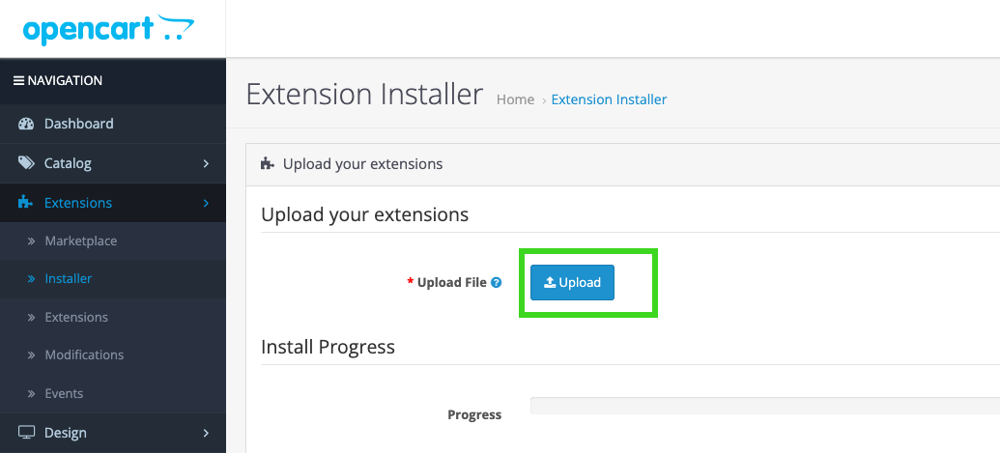

#### 1.3 Kamilisha Usakinishaji wa Kiendelezi

1. Nenda kwenye Menyu: Extensions -> Extensions
2. Katika menyu kunjuzi ya "Choose extension type", chagua Payment.
3. Tafuta kiendelezi cha BTCPay katika orodha na ubofye kitufe cha kijani cha Install katika safu ya "Action".
4. Utaona arifa ikisema: "Success: You have modified payments!"

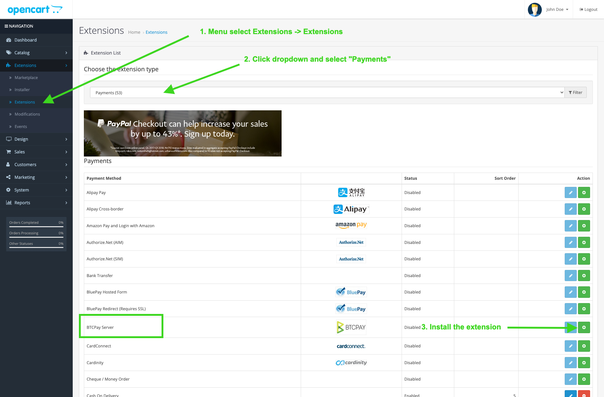

### 2. Kuunganisha OpenCart na BTCPay Server

Kabla ya kuendelea, hakikisha una mfano wa BTCPay Server uliosanidiwa kama ilivyoelezwa katika [sehemu ya mahitaji](#requirements).

Kiendelezi cha BTCPay for OpenCart hufanya kazi kama **daraja kati ya BTCPay Server yako (kichakataji malipo) na duka lako la e-commerce**. Iwe unatumia suluhisho la kujisimamia mwenyewe au la mhusika wa tatu, mchakato wa kuunganisha unabaki sawa.

#### 2.1 Sanidi kiendelezi cha BTCPay Server katika OpenCart

1. Katika paneli ya OpenCart, nenda kwenye Extensions -> Extensions.
2. Tafuta kiendelezi cha BTCPay katika orodha na ubofye kitufe cha bluu cha Edit.
   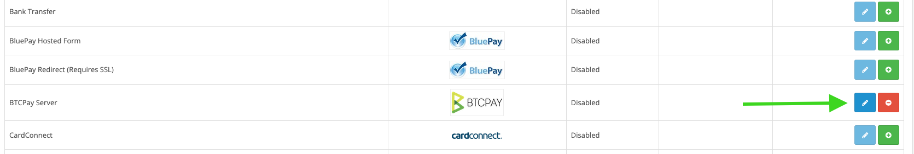
3. Sanidi kiendelezi cha BTCPay. 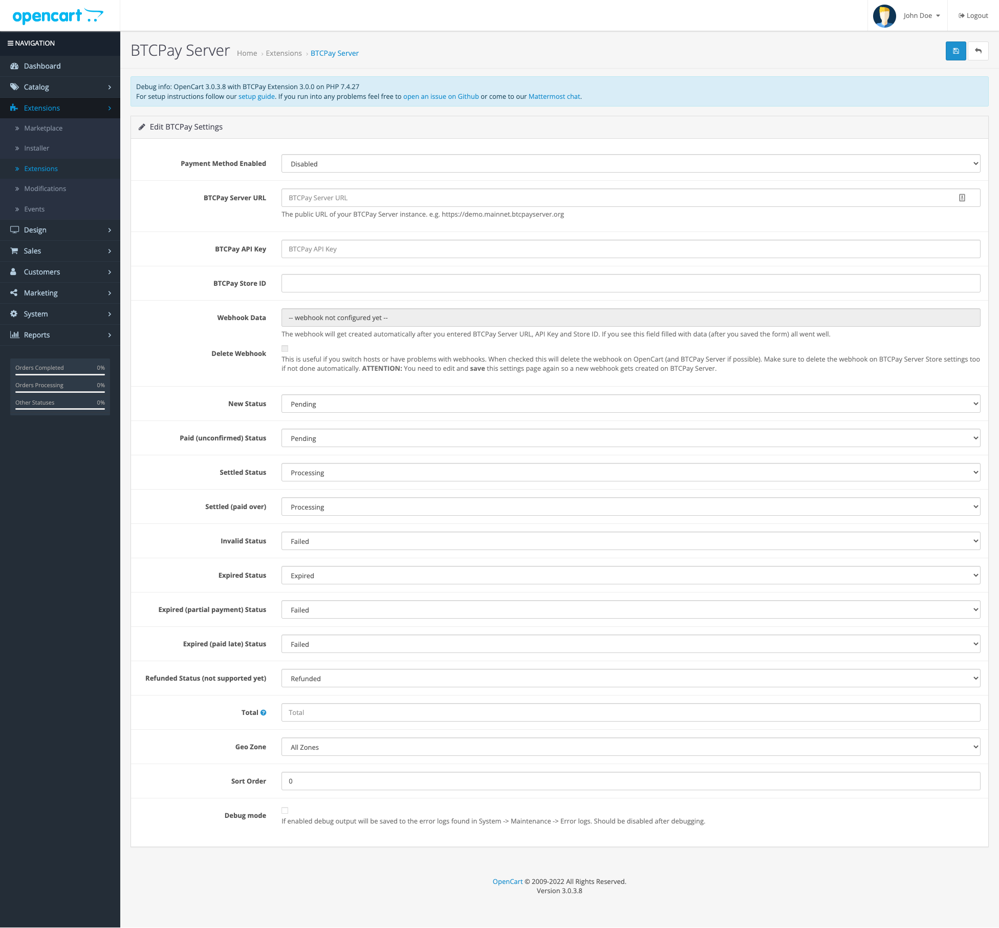
4. Weka sehemu ya "Payment Method Enabled" kuwa Enabled.
5. Katika sehemu ya "BTCPay Server URL", weka URL ambapo mfano wako wa BTCPay Server unapatikana, k.m., https://mainnet.demo.btcpayserver.org/. Maagizo ya kupeleka mfano wako wa BTCPay Server yanaweza kupatikana katika [sehemu ya mahitaji hapo juu](#requirements)

Kabla ya kuendelea, unahitaji kuunda ufunguo wa API kwa mtumiaji wako na duka, kama ilivyoelezwa katika sehemu inayofuata. Weka kichupo hiki cha kivinjari wazi, kwani tutarudi hivi karibuni.

#### 2.2 Unda ufunguo wa API na usanidi ruhusa

Kwenye mfano wako wa BTCPay Server:

1. Bofya _[Account]_
2. Bofya _[Manage Account]_
   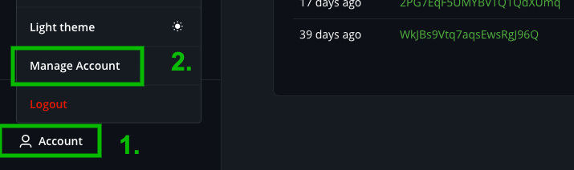
3. Nenda kwenye kichupo cha _"API Keys"_
4. Bofya _[Generate Key]_ ili kuchagua ruhusa.
   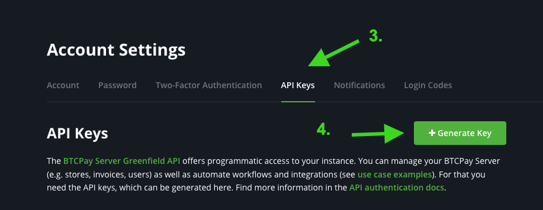
5. "Label": Ongeza lebo.
6. "Permissions": **Muhimu:** bofya kiungo cha _"Select specific stores"_ kwa ruhusa zifuatazo: `View invoices`, `Create invoice`, `Modify invoices`, `Modify stores webhooks`, `View your stores` na uchague duka ulilounda kwa tovuti yako ya OpenCart. Hii inahakikisha kuwa ufunguo wa API una ufikiaji tu kwa duka hilo maalum na hauwezi kutoa fedha yoyote hata kama ufunguo utapotea.
   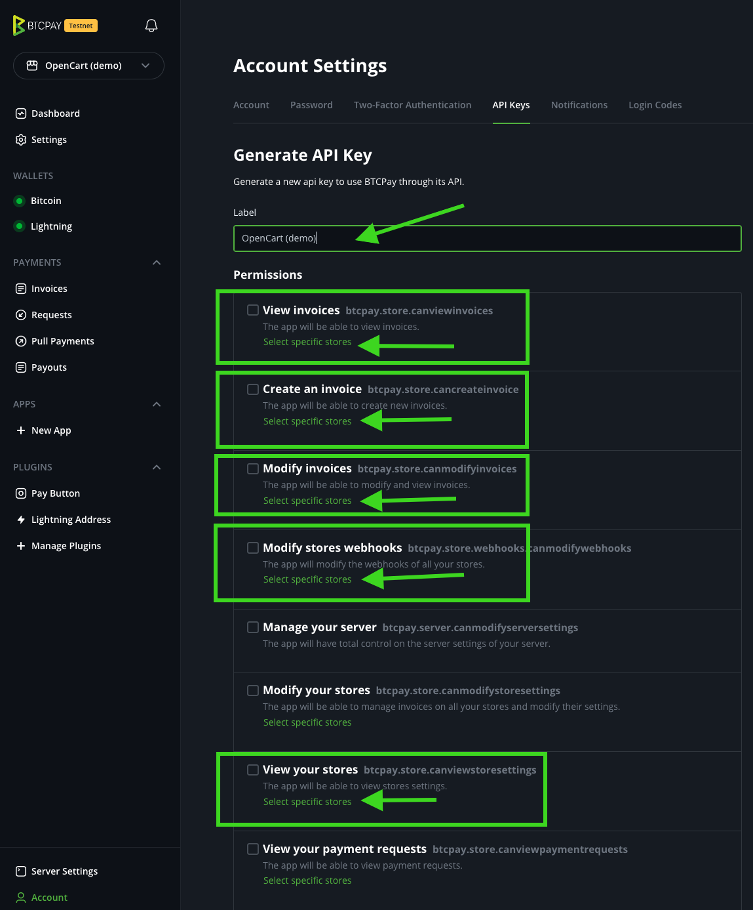
   Inapaswa kuonekana kama hivi:
   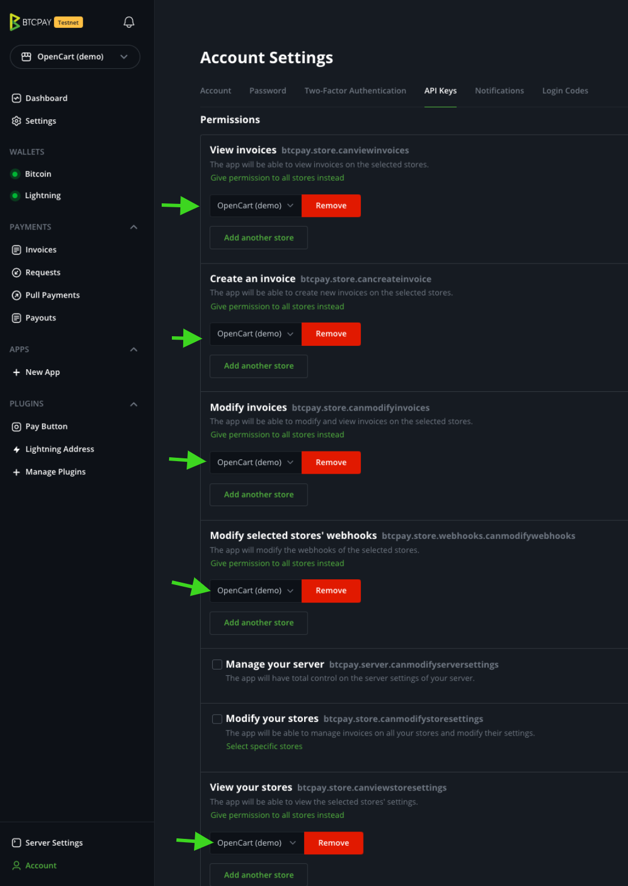
7. Bofya _[Generate API Key]_ chini
8. Nakili Ufunguo wa API uliozalishwa kwenye sehemu ya fomu ya _OpenCart BTCPay settings_ "BTCPay API Key"
   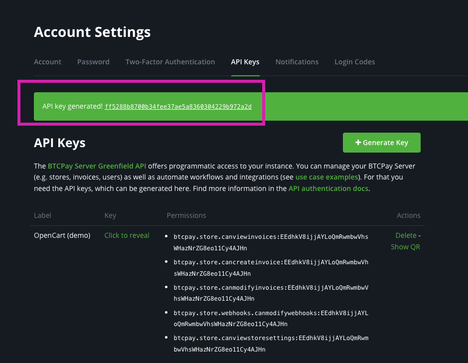
9. Rudi kwenye mfano wa BTCPay Server, nenda kwenye mipangilio ya duka lako na unakili kitambulisho cha duka kwenye fomu yako ya _OpenCart BTCPay Settings_
   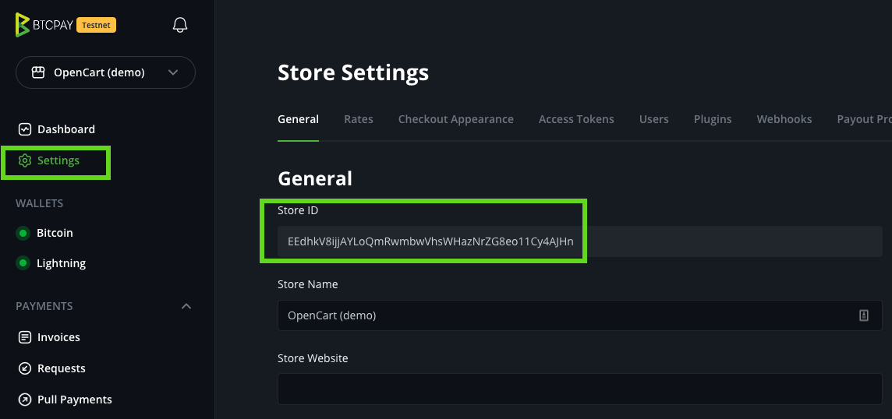
10. Rudi kwenye fomu ya _OpenCart BTCPay settings_ hakikisha **BTPCay Server URL**, **API Key** na **Store ID** zimewekwa na ubofye kitufe cha **[Save]** (juu kulia)
    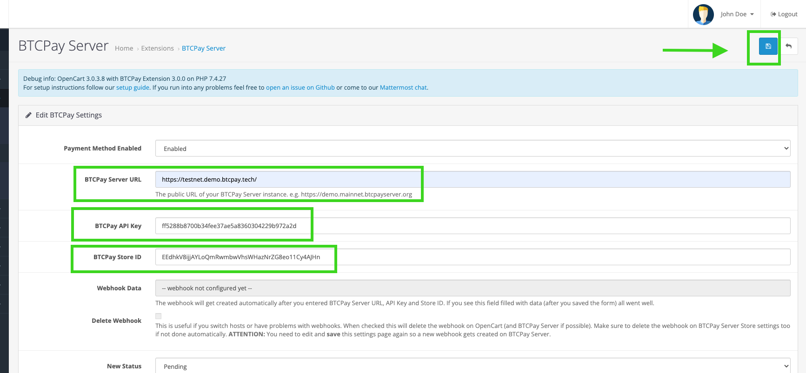


Rudi kwenye ukurasa wa muhtasari wa Extensions, unapaswa kuona arifa inayosema "BTCPay Server Payment details have been successfully updated.". Ikiwa sivyo, angalia tena kuwa URL yako, Ufunguo wa API, na Kitambulisho cha Duka vimeingizwa kwa usahihi.
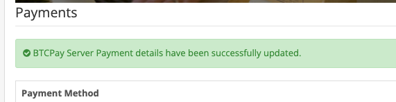

Baada ya kuhifadhi kwa mafanikio, kiendelezi cha BTCPay huunda kiotomatiki webhook kujulisha OpenCart wakati malipo yanakamilika au kushindwa. Ili kuhakiki mara mbili kuwa ilifanikiwa. Unaweza kufanya hivyo kwa kuhariri mipangilio ya kiendelezi cha BTCPay tena ikiwa utaona sehemu ya "Webhook Data" imejazwa kama hivi:
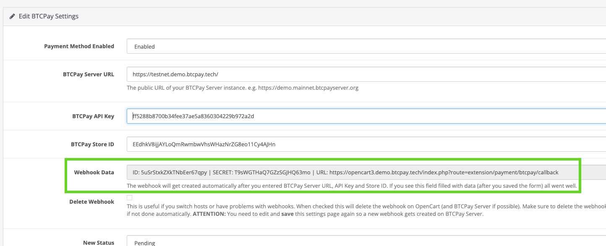

Kama unavyoweza kuona kwenye mipangilio ya kiendelezi cha BTCPay, unaweza kubinafsisha hali za agizo kulingana na [hali za ankara](https://docs.btcpayserver.org/Invoices/#invoice-statuses) na mipangilio mingine ya kawaida. Chaguo-msingi zinapaswa kuwa mahali pazuri pa kuanzia lakini jisikie huru kuzirekebisha kulingana na mahitaji yako maalum.


### 3. Jaribu malipo

Sasa kila kitu kimesanidiwa; ni wakati wa kufanya muamala wa jaribio:

Fanya Ununuzi wa Jaribio: Weka agizo dogo kupitia duka lako la OpenCart ili kuhakikisha mchakato wa malipo unafanya kazi inavyotarajiwa.
Thibitisha Hali ya Agizo: Angalia kuwa hali ya agizo katika OpenCart inasasishwa kulingana na hali ya ankara ya BTCPay inayolingana.
Kagua Matukio ya Webhook: Katika maelezo ya ankara ya BTCPay Server, thibitisha kuwa matukio ya webhook yalifanikiwa.

### Utatuzi wa matatizo

#### Wezesha hali ya utatuzi

Ikiwa una hitilafu wakati wa malipo, unaweza kuwezesha hali ya utatuzi kwenye mipangilio ya kiendelezi cha BTCPay. Menyu: Nenda kwenye "Extensions -> extensions" chagua "Payments" kwenye menyu kunjuzi ya "Choose Extension Type" na uhariri kiendelezi cha BTCPay Server.

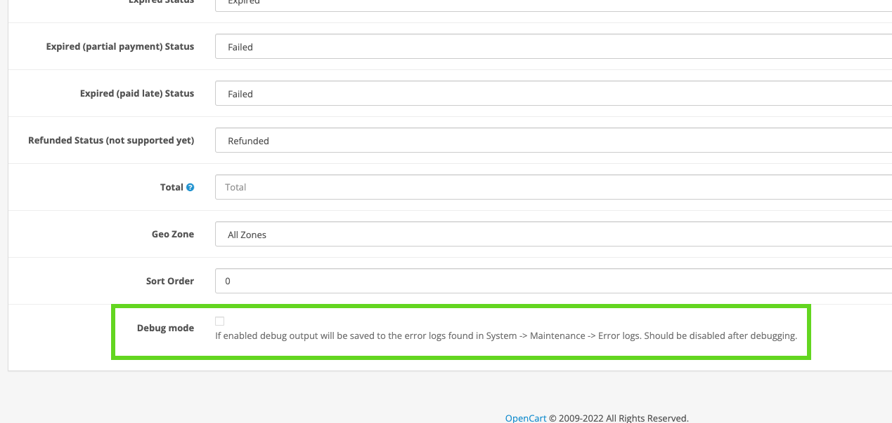

Sasa unaweza kupata matokeo ya utatuzi katika `error log` kwenye menyu "System -> Maintenence -> Error Logs".

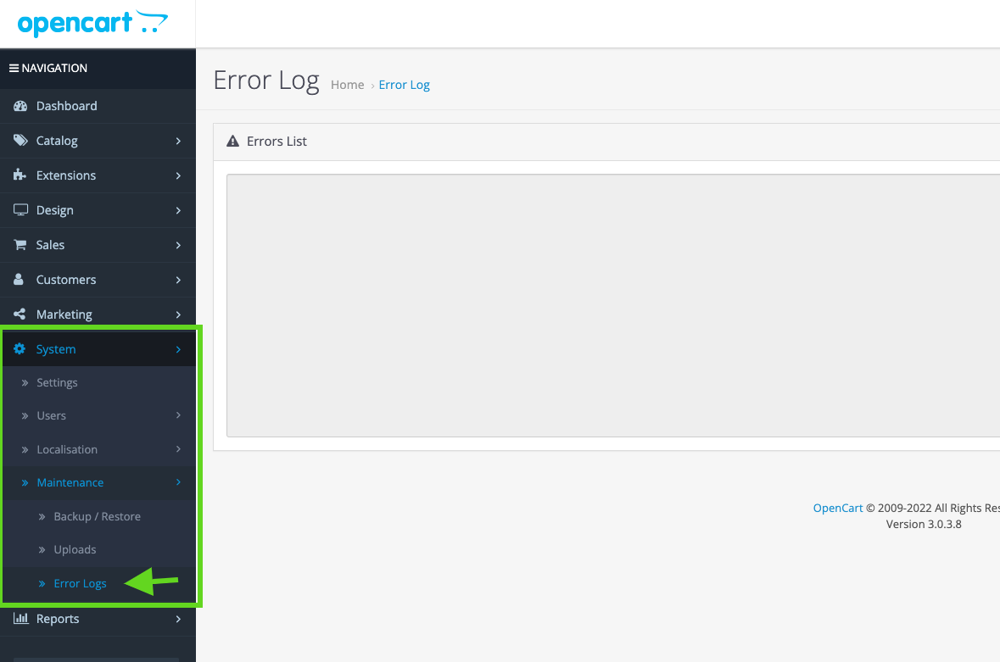

\*Tafadhali hakikisha umeizima baada ya utatuzi kukamilika; vinginevyo, itajaza kumbukumbu zako za makosa.\*\*

**Mfano wa Hitilafu**:

> 2022-05-24 21:10:50 ERROR Error during POST to https://btcpay.example.com/api/v1/stores/4kD5bvAF5j8DokHqAzxb6MFDV4ikabcdefghijklm/invoices. Got response (401): {&quot;code&quot;:&quot;unauthenticated&quot;,&quot;message&quot;:&quot;Authentication is required for accessing this endpoint&quot;}

- Hii inamaanisha kuna hitilafu ya uthibitishaji. Inawezekana ufunguo wako wa API hauna ruhusa ya kuunda ankara kwa duka hilo. Hakikisha unapa ufunguo wa API ruhusa sahihi, mpe duka sahihi, na uingize hiyo katika fomu ya usanidi wa malipo ya OpenCart.

- Sababu nyingine inaweza kuwa unatumia ufunguo wa API wa urithi. Funguo za API za urithi ziko katika mipangilio ya duka -> Access Tokens. Lakini unahitaji kuunda ufunguo wa API wa akaunti ulioko kwenye Account -> Manage Account -> kichupo cha "API Keys". Tazama sehemu ya [2.2 Unda ufunguo wa API na usanidi ruhusa](#22-unda-ufunguo-wa-api-na-usanidi-ruhusa).

### Hali za agizo hazisasishwi, ingawa ankara imelipwa.

Tafadhali angalia maelezo ya ankara yako kuona ikiwa kulikuwa na makosa yoyote katika kutuma ombi la webhook. Baadhi ya watoa huduma wa kupangisha, usanidi wa firewall, au viendelezi vya usalama vinaweza kuzuia maombi ya POST kwenye tovuti yako, jambo linalosababisha hali ya HTTP ya "403 forbidden".

Unaweza kuangalia na kuthibitisha mwenyewe ikiwa kuna kitu kinazuwia maombi kwenye tovuti yako kwa mojawapo ya njia hizi mbili:

**1. Nakili URL ya kurudisha webhook**
Nenda kwenye _mipangilio ya kiendelezi cha BTCPay ya OpenCart_ na unakili "URL" ya sehemu ya "Webhook Data". k.m., `https://YOURSTOREDOMAIN.TLD/index.php?route=extension/payment/btcpay/callback`


**2.1 Angalia kwa kutumia mstari wa amri (Linux au MacOS):**

```
curl -vX POST -H "Content-Type: application/json" \
    -d '{"data": "test"}' WEBHOOK_CALLBACK_URL
```

(badilisha `WEBHOOK_CALLBACK_URL` na ile iliyonakiliwa hapo juu)

Matokeo:

```
.... snip ....
* upload completely sent off: 16 out of 16 bytes
< HTTP/1.1 403 Forbidden
< access-control-allow-origin: *
< Content-Type: application/json; charset=UTF-8
< X-Cloud-Trace-Context: 4f07d5b2e5c2f05949d04421a8e2dd6a
< Date: Thu, 17 Feb 2022 10:06:50 GMT
< Server: Google Frontend
< Content-Length: 26
```

Ikiwa utaona mstari huo "HTTP/1.1 403 Forbidden" au "HTTP/2 403" kuna kitu kinazuwia data kutumwa kwenye tovuti yako ya OpenCart. Itakuwa bora kuuliza mtoa huduma wako wa kupangisha au kuhakikisha hakuna firewall au kiendelezi cha usalama kinachozuwia maombi.

**2.2 Angalia kwa kutumia huduma ya mtandaoni (ikiwa huna mstari wa amri:**

- Nenda kwa [https://reqbin.com/post-online](https://reqbin.com/post-online)
- 1. Weka url yako ya kurudisha (iliyonakiliwa kutoka hatua ya 1 hapo juu): `https://YOURSTOREDOMAIN.TLD/index.php?route=extension/payment/btcpay/callback`
     (badilisha URL hii na url ya kurudisha ya webhook kutoka hatua ya 1)
- Hakikisha "POST" imechaguliwa
- 2. Bofya [Send]

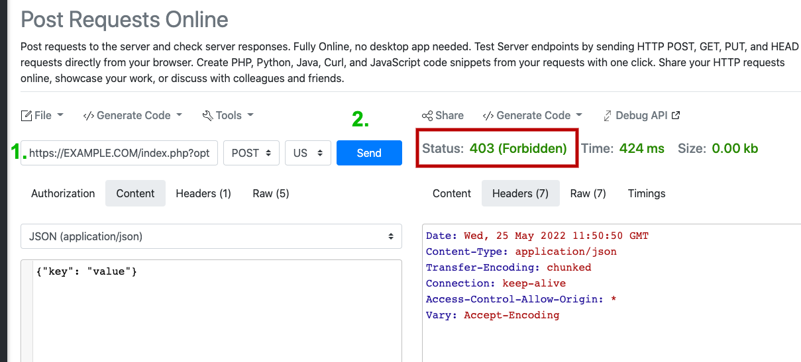

Ikiwa utaona "**Status 403 (Forbidden)**" basi maombi ya POST kwenye tovuti yako yamezuiwa kwa sababu fulani. Unapaswa kuuliza mtoa huduma wako wa kupangisha au kuhakikisha hakuna firewall au kiendelezi cha usalama kinachozuwia maombi. Ikiwa utaona msimbo wowote mwingine wa hali (200, 500, ...) tatizo la firewall linaonekana kutotumika. Pengine unahitaji kuchunguza zaidi.

## Nina shida kutumia kiendelezi au maswali mengine yanayohusiana.

Jisikie huru kujiunga na kituo chetu cha usaidizi kupitia [https://chat.btcpayserver.org/](https://chat.btcpayserver.org/) au [https://t.me/btcpayserver](https://t.me/btcpayserver) ikiwa unahitaji msaada au una maswali yoyote zaidi.